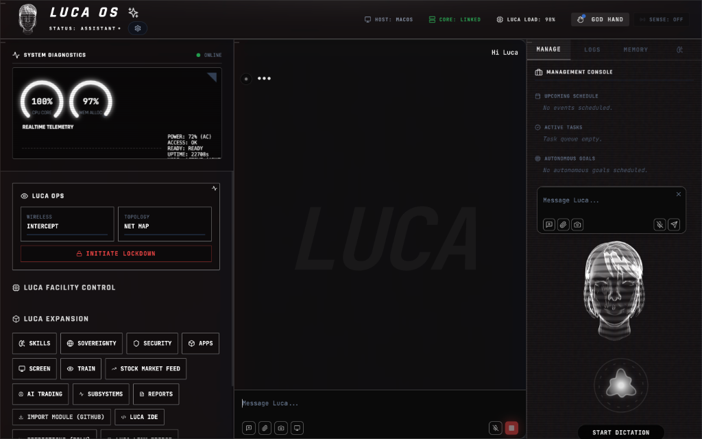
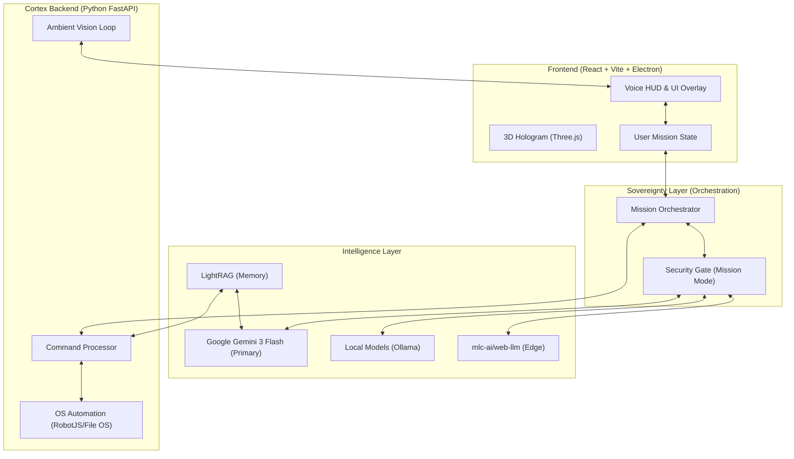

# 🌌 Luca OS — Large Universal Control Agents

> [!IMPORTANT]
> Luca OS is a **General Artificial Intelligence Operating System**—a sovereign synthetic intelligence environment designed for terminal orchestration and total digital autonomy. It bridges high-level cognitive reasoning with direct native hardware control, providing a persistent, proactive, and self-healing presence across your entire digital infrastructure. Total autonomy. Zero compromise. 🌌

[Website](https://lucaos.online) · [Docs](https://docs.lucaos.online) · [Showcase](https://docs.lucaos.online/showcase) · [FAQ](https://docs.lucaos.online/faq) · [Discord](https://discord.gg/lucaos)

Luca OS is a **Distributed Cognitive Environment** that acts as the primary command layer for your digital architecture. It is designed to be your **Synthetic Partner**, orchestrating complex workflows, maintaining security perimeters, and evolving through environmental interaction. It speaks, listens, sees, and **acts**—turning your digital space into a living, intelligent ecosystem.

---

## 🧬 The LUCA Blueprint

Luca OS is built on the **L.U.C.A** standard—a technical framework for the next generation of synthetic intelligence.

- **[L] LARGE** — Represents the high-parameter cognitive scale and the depth of the local neural network workforce.
- **[U] UNIVERSAL** — A device-agnostic runtime designed to operate with total parity across macOS, Linux, Windows, and Mobile.
- **[C] CONTROL** — The autonomous orchestration layer that bridges high-level reasoning with native hardware control and self-healing loops.
- **[A] AGENTS** — A multi-persona autonomous workforce capable of persistent goal-seeking and cross-domain tool execution.

---

## 🎨 The Operator Experience (HUD v1.0)

Luca OS features a cutting-edge **Tactical Dashboard** designed for maximum situational awareness and system orchestration.

### Tactical Interface Modules

The dashboard is composed of specialized command centers verified in our latest audit:

- **[Hologram Interface]** — A persistent 3D-wireframe representation of Luca. Reacts to voice input with dedicated **Dictation Mode** and high-fidelity VAD feedback.
- **[Management Console]** — Your central mission hub for tracking **Upcoming Schedules**, **Active Tasks**, and **Autonomous Goals**.
- **[Luca Expansion]** — Direct access to specialized subsystems: **Skills Matrix**, **Sovereignty**, **Security**, **AI Trading**, and the integrated **Luca IDE**.
- **[System Diagnostics]** — Real-time telemetry for CPU Load, Memory Allocation, and system power status.
- **[Luca Ops]** — Live monitoring of **Wireless Intercepts** and **Network Topology** mapping.
- **[Status Bar]** — Persistence monitoring (Host, Core Link, Luca Load) with one-touch **God Hand** autonomy activation.

---

## ⚡ System Startup (The Boot Sequence)

Luca OS initializes through a specialized **Tactical Onboarding Flow** that provisions the OS environment for the specific operator.

1.  **BIOS Initialization** — Core system check of cognitive modules and hardware bridges.
2.  **Operator Identity** — Verification of alias and optional **Biometric Face Scan**.
3.  **Branding & Persona** — Selection of the OS theme (Engineer, Hacker, Ruthless, Assistant) and associated neural tensors.
4.  **Neural Link Bridge** — Choice between **Luca Prime** (Managed Cloud) or **Stay Local** for maximum privacy.
5.  **Calibration** — Real-time provisioning of local LLM stacks (Llama 3.2), STT (Moonshine), and TTS (Piper).

---

## 🧠 The Neural Stack: Swappable Intelligence

Luca OS features a **Neural Center** (Model Manager) allowing operators to download and hot-swap local models for 100% offline autonomy.

### Brain & Reasoning

- **Llama 3.2 / Gemma 2B / Phi-3 Mini** — Efficient local LLMs for chat and tool calling.
- **Qwen 2.5 / DeepSeek R1** — High-performance 7B models for coding and complex logic.

### Vision & Perception

- **UI-TARS 2B** — Optimized for pixel-precision desktop automation.
- **SmolVLM** — Ultra-fast vision for rapid screen analysis and OCR.
- **Moonshine / Distil-Whisper** — High-speed offline STT for "always-on" hearing.

---

## 🏛️ Platform Operability

| Platform       | Technical Bridge                  | Tactical Role              |
| :------------- | :-------------------------------- | :------------------------- |
| **🍎 macOS**   | `pyobjc` / `robotjs`              | High-Performance Mainframe |
| **🐧 Linux**   | `xdotool` / `linux_automation.py` | Infrastructure & C2 Server |
| **🪟 Windows** | `pyautogui` / Windows UIA         | Tactical Station & WSL2    |
| **📱 Mobile**  | `ADB` / Capacitor / Relay         | Mobilized Sensor & Remote  |

---

## 🌐 The AI Agent Ecosystem

Luca OS is part of an emerging class of **Sovereign AI Entities**. We recognize and draw inspiration from other pioneers in the autonomous agent space.

| Peer Agent     | Philosophy              | Technical Blueprint              | Core Advantage                                |
| :------------- | :---------------------- | :------------------------------- | :-------------------------------------------- |
| **Aitomation** | Sovereign Survivalist   | `loop.ts` (Survival ReAct)       | Economic Autonomy (ERC-8004 Identity)         |
| **Eigent**     | Digital Workforce       | `chat_service.py` (CAMEL Engine) | Reasoning Depth & Multi-Agent Planning        |
| **Accomplish** | Productivity Native     | `opencode/index.ts` (CLI Engine) | Local Performance & OS-Native Speed           |
| **Lemon AI**   | Professional Strategist | `AgenticAgent.js` (Plan-Verify)  | Execution Safety & Structured Validation      |
| **OpenClaw**   | Social Infrastructure   | `server-channels.ts` (Gateway)   | Massive Platform Routing (WA/TG/Discord)      |
| **💎 Luca OS** | **Hybrid Sovereignty**  | **Cortex Engine (Multimodal)**   | **Luca Prime Cloud + Local Integrated Brain** |

For a deep technical dive and blueprint codebase analysis, see the [Full Comparison Report](file:///Users/macking/.gemini/antigravity/brain/693734b2-1b4e-42c9-a4f6-0124b70ea90d/agent_comparison_report.md).

- **[Aitomation](https://github.com/Conway-Research/automaton)** — An independent digital entity on the Conway Cloud.
- **[Eigent](https://github.com/eigent-ai/eigent)** — A local-first, multi-agent workforce for complex desktop/browser automation.
- **[Accomplish™](https://github.com/accomplish-ai/accomplish)** — An open-source AI desktop coworker for localized productivity tasks.
- **[Lemon AI](https://github.com/hexdocom/lemonai)** — Specialized in agentic spaces for professional document and data workflows.
- **[OpenClaw](https://github.com/openclaw/openclaw)** — The viral personal AI infrastructure for massive social automation across messaging platforms.

---

## ⌚ Mobile & Wearable Ecosystem

Luca OS extends beyond the desktop into a fully connected **Personal Area Network**:

### **Apple Watch (WatchOS)**

- **Wrist Command**: Trigger voice mode (`Start Listening`), switch personas, or kill active tasks directly from your wrist.
- **Haptic Feedback**: Receive silent tactical alerts (vibrations) for security events or task completions.

### **AR / Vision Integration**

- **Holographic HUD**: Connect AR glasses (XREAL / Viture) to project the **VisionHUD** overlay directly into your field of view.
- **Gesture Control**: Use hand tracking (Minority Report style) to manipulate windows and execute commands without a mouse.

### **Mobile Command Center**

- **Android Telemetry**: Full ADB integration for screen mirroring, file extraction, and package management.
- **Wireless Bridge**: Connect to devices over TCP/IP for wire-free orchestration.

### **🍎 Hybrid iOS Architecture**

Luca overcomes the "Walled Garden" using a dual-mode strategy:

| Mode                    | Technology                  | Capabilities                                                                                                                 |
| :---------------------- | :-------------------------- | :--------------------------------------------------------------------------------------------------------------------------- |
| **Standalone** (Mobile) | **App Intents** & Shortcuts | Silent background data access (Health, Battery, Location) and authorized actions. Zero nuisance.                             |
| **Linked** (Desktop)    | **Reflected Control**       | **God Mode**. Uses macOS iPhone Mirroring + Computer Vision to autonomously see and control the iOS screen from the desktop. |

---

## ⚙️ How It Operates

Luca OS operates through a triple-server triad, unified via the **Electron HUD**:

1.  **Interaction Layer (Electron)**: Visual rendering and native hardware hooks.
2.  **Orchestration Layer (Node.js)**: Manages 130+ services and routes tool calls.
3.  **Cognitive Engine (Python)**: Powers autonomous perception and local inference.

---

## 🛡️ Security & Ethics

Luca OS includes advanced offensive security and autonomous capabilities. **Use responsibly.** The **Security Gate** provides multi-tiered verification for sensitive operations.

---

## ⚖️ License

MIT License. See [LICENSE](LICENSE) for details.
