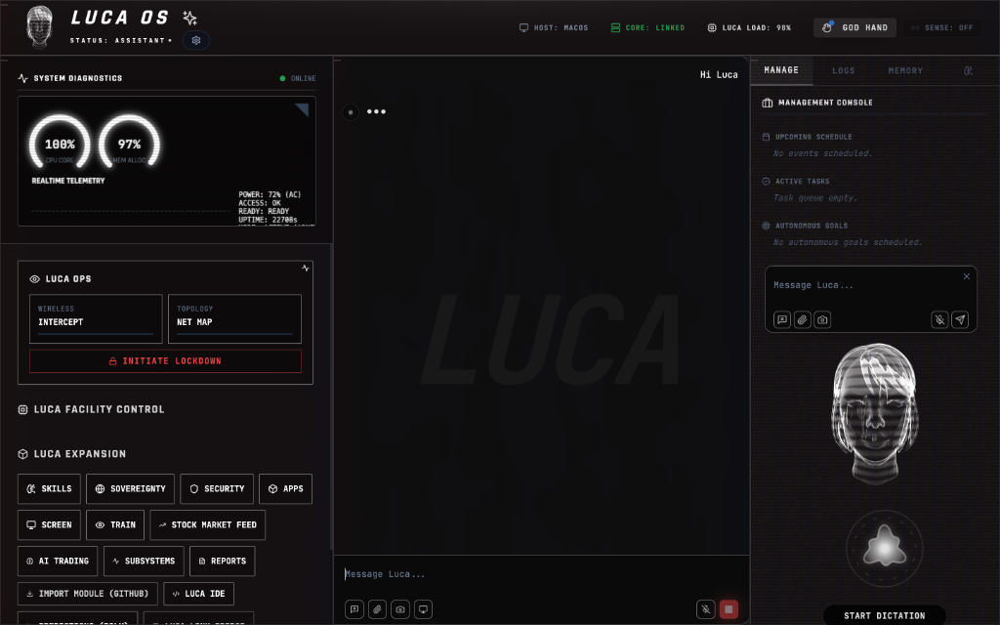
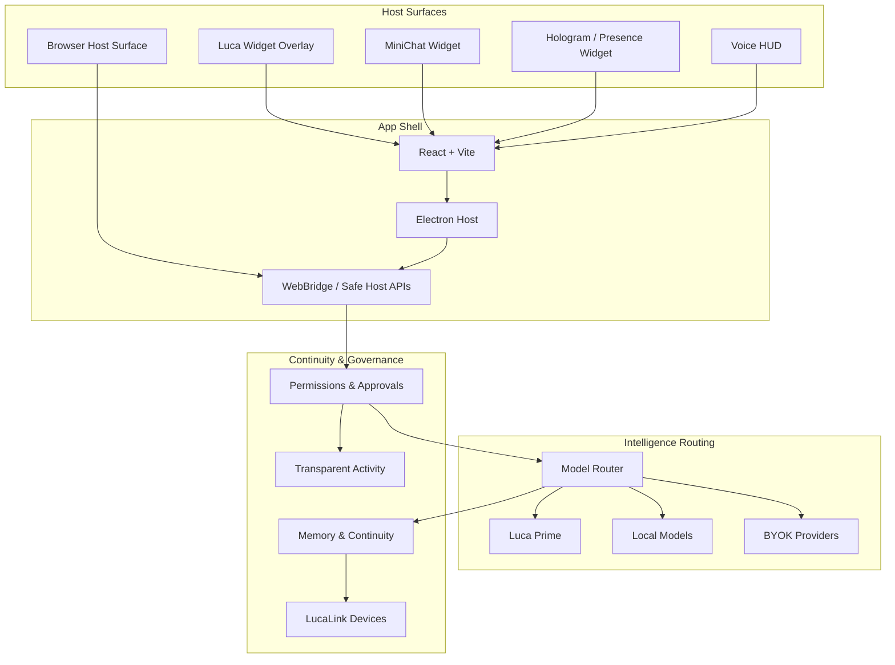

# LucaOS — Host-Native Personal AI OS

> [!IMPORTANT]
> LucaOS is a **host-native personal AI operating layer**: a calm, device-level intelligence that lives across your desktop, browser, mobile surfaces, and linked devices. It gives AI a practical body — voice, chat, presence, memory, and user-approved action — while keeping the experience approachable, transparent, and calm.

[Website](https://lucaos.online) · [Docs](https://docs.lucaos.online) · [Showcase](https://docs.lucaos.online/showcase) · [FAQ](https://docs.lucaos.online/faq) · [Discord](https://discord.gg/lucaos)

LucaOS is designed to feel premium, quiet, and native: more like an intelligent system layer than a separate app. It helps people move between conversation and action while keeping permissions explicit, activity visible, and control with the user.

---

## Product Direction

LucaOS is building toward **intelligence with a body**:

- **Host-native presence** — Luca appears as lightweight overlays, widgets, and voice surfaces that sit naturally on top of the devices you already use.
- **Practical personal AI** — chat, voice, memory, model routing, browser assistance, device context, and approved actions in one coherent layer.
- **Local-first where possible** — local models, local memory, and local device bridges are prioritized when they fit the task and user preference.
- **Governed control** — sensitive actions require user approval, transparent status, and clear permission boundaries.
- **Continuity across devices** — LucaLink connects desktop, mobile, browser, and future wearable surfaces into a shared personal context.

---

## Experience: Quiet Machine

The LucaOS interface is moving toward a **presence-first** experience: calm, glassy, refined, and useful without requiring users to think like operators.

### Host Surfaces

- **Luca Widget overlay** — the primary desktop presence for quick awareness, status, and action handoff.
- **MiniChat Widget** — a compact conversation surface for lightweight requests and follow-up.
- **Hologram / Presence Widget** — a visual identity layer for Luca that reacts to state, voice, and attention.
- **Voice HUD** — quick speech input, listening feedback, transcription, and response flow.
- **Browser-safe host surfaces** — WebBridge-enabled surfaces that expose only approved browser and host capabilities.
- **Desktop/mobile parity** — the same assistant identity and core workflow patterns across desktop and mobile surfaces.

The goal is not a dashboard full of controls. The goal is an ambient, understandable layer that helps users complete real work while staying out of the way.

---

## Current Implementation

The repository currently includes the foundations for a host-native AI layer:

- **React + Vite + Electron** frontend for desktop host surfaces, overlays, and app shell work.
- **Voice and chat UI surfaces** for interacting with Luca through speech and text.
- **Presence-oriented visual components** for a more embodied assistant experience.
- **WebBridge / browser-safe host patterns** for connecting web UI with native capabilities through controlled interfaces.
- **Model routing foundations** for Luca Prime, local models, and bring-your-own-key providers.
- **Memory and continuity foundations** for persistent context and user-specific state.
- **Governed action layer foundations** for separating assistant reasoning from user-approved host actions.
- **LucaLink direction** for pairing linked devices and sharing personal context across host surfaces.

---

## In Progress

Active product and engineering work is focused on making LucaOS feel more native, trustworthy, and useful:

- Refining the **Quiet Machine** visual system and premium glass-like interface language.
- Consolidating **Luca Widget**, **MiniChat**, **Presence Widget**, and **Voice HUD** into a coherent host experience.
- Improving **model routing** across Luca Prime, local models, and BYOK providers.
- Strengthening **permission prompts**, user confirmation flows, and transparent activity logs.
- Expanding **memory and continuity** so Luca can maintain context without becoming intrusive.
- Hardening **WebBridge** boundaries so browser-host interaction remains explicit and safe.

---

## Roadmap

Planned areas include:

- **Mobile companion surfaces** for iOS and Android.
- **LucaLink paired devices** for continuity between desktop, phone, browser, and future wearables.
- **Wearable and voice-first experiences** for fast, low-friction interaction.
- **Richer local model support** through Ollama and other local inference runtimes.
- **More granular permissions** for files, apps, browser actions, device context, and automations.
- **Developer extension points** for skills, workflows, and user-approved integrations.

Roadmap items are directional and should not be treated as finished features.

---

## Architecture

LucaOS combines a native desktop shell, browser-safe bridges, model routing, memory, and governed actions.

```mermaid
graph TD
    subgraph "Host Surfaces"
        Overlay["Luca Widget Overlay"]
        MiniChat["MiniChat Widget"]
        Presence["Hologram / Presence Widget"]
        Voice["Voice HUD"]
        Browser["Browser Host Surface"]
    end

    subgraph "App Shell"
        React["React + Vite"]
        Electron["Electron Host"]
        WebBridge["WebBridge / Safe Host APIs"]
    end

    subgraph "Intelligence Routing"
        Router["Model Router"]
        Prime["Luca Prime"]
        Local["Local Models"]
        BYOK["BYOK Providers"]
    end

    subgraph "Continuity & Governance"
        Memory["Memory & Continuity"]
        Permissions["Permissions & Approvals"]
        Activity["Transparent Activity"]
        LucaLink["LucaLink Devices"]
    end

    Overlay --> React
    MiniChat --> React
    Presence --> React
    Voice --> React
    Browser --> WebBridge
    React --> Electron
    Electron --> WebBridge
    WebBridge --> Permissions
    Permissions --> Router
    Router --> Prime
    Router --> Local
    Router --> BYOK
    Router --> Memory
    Memory --> LucaLink
    Permissions --> Activity
```

### Model Routing

LucaOS is designed to route work to the right intelligence layer:

- **Luca Prime** for managed cloud intelligence when enabled by the user.
- **Local models** for private, offline-capable, device-resident tasks where available.
- **BYOK providers** for users who want to connect their own model accounts and keys.

The routing goal is simple: choose the right model for the job while respecting user preference, privacy, latency, and cost.

### Governed Actions

LucaOS separates suggestion, reasoning, and execution. The assistant can prepare actions, explain intent, and request permission, but sensitive host actions should be visible and user-approved. This keeps Luca useful without hiding control from the person using the device.

### Memory & Continuity

Memory is meant to make Luca feel consistent across sessions and devices. The product direction favors clear controls, inspectable state, and user-managed continuity over invisible background accumulation.

---

## Calm Host Boot & Onboarding

Onboarding is being reframed as an **incarnation boot**: a calm setup flow that gives Luca identity, preferences, and safe operating boundaries.

Expected onboarding areas:

1. **Welcome and mode selection** — choose the kind of Luca experience you want: quiet companion, productivity layer, developer helper, or local-first assistant.
2. **Identity** — set user name, Luca name, tone, and relationship preferences.
3. **Visual preferences** — choose presence style, glass intensity, compactness, and accessibility settings.
4. **Model route** — select Luca Prime, local models, BYOK providers, or a hybrid route.
5. **Voice and chat setup** — configure voice input, response style, and MiniChat behavior.
6. **Permissions** — review what Luca may access, what requires confirmation, and what stays off by default.

---

## Platform Direction

| Surface | Role | Direction |
| :-- | :-- | :-- |
| **Desktop** | Primary host | Electron-based overlay, chat, voice, presence, and governed actions. |
| **Browser** | Web context | Browser-safe bridge for approved page, tab, and workflow assistance. |
| **Mobile** | Companion host | Continuity, voice/chat access, lightweight device context, and paired workflows. |
| **Linked devices** | Personal context | LucaLink pairing for approved cross-device presence and continuity. |
| **Wearables** | Roadmap | Low-friction voice, glanceable state, and subtle notifications. |

---

## Development Notes

- Desktop shell: **React + Vite + Electron**.
- Host bridge: **WebBridge** and controlled native APIs.
- Intelligence: model routing across **Luca Prime**, **local models**, and **BYOK** providers.
- Continuity: memory, user state, and future LucaLink paired-device context.
- Safety model: governed permissions, user-approved actions, and transparent activity.

---

## License

MIT License. See [LICENSE](LICENSE) for details.

## Cloud Agent Validation Notes

For cloud-agent install/test constraints and the recommended scoped validation sequence, see:

- `docs/cloud-agent-testing-environment.md`
- Optional helper: `ops/scripts/cloud-agent-validate-computer-use.sh`
