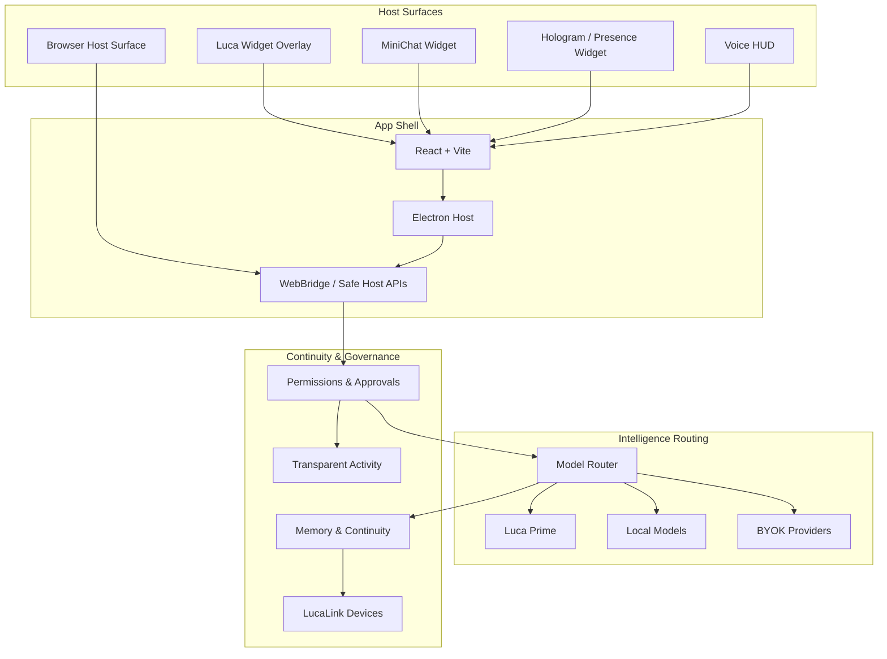

<div align="center">
  
</div>

<h1 align="center">LucaOS — Host-Native Personal AI OS</h1>

<p align="center">
  A device-level AI presence for desktop, browser, mobile, and linked devices.
</p>

<p align="center">
  
  
  
  
  
  <a href="https://lucaos.online"></a>
  <a href="https://docs.lucaos.online"></a>
  <a href="https://discord.gg/lucaos"></a>
</p>

<p align="center">
  <a href="https://lucaos.online">Website</a> ·
  <a href="https://docs.lucaos.online">Docs</a> ·
  <a href="https://docs.lucaos.online/showcase">Showcase</a> ·
  <a href="https://docs.lucaos.online/faq">FAQ</a> ·
  <a href="https://discord.gg/lucaos">Discord</a>
</p>

---

LucaOS is a **host-native personal AI operating layer**: a calm, device-level intelligence that lives across your desktop, browser, mobile surfaces, and linked devices. It gives AI a practical body — voice, chat, presence, memory, and user-approved action — while keeping the experience approachable, transparent, and user-controlled.

It is designed to feel premium, quiet, and native: more like an intelligent system layer than a separate app. LucaOS helps people move between conversation and action while keeping permissions explicit, activity visible, and control with the user.

## 🌐 Try / Learn More

- **Website:** [lucaos.online](https://lucaos.online)
- **Docs:** [docs.lucaos.online](https://docs.lucaos.online)
- **Showcase:** [docs.lucaos.online/showcase](https://docs.lucaos.online/showcase)
- **FAQ:** [docs.lucaos.online/faq](https://docs.lucaos.online/faq)
- **Discord:** [discord.gg/lucaos](https://discord.gg/lucaos)

Public links are provided for learning, documentation, and community context. Some product surfaces are foundations or directional work rather than finished public app experiences.

## ✨ Features

- **Host-native AI presence** — a calm intelligence layer designed to live naturally on the device.
- **Luca Widget overlay** — lightweight desktop presence for quick awareness, status, and action handoff.
- **MiniChat Widget** — compact conversation for lightweight requests and follow-up.
- **Hologram / Presence Widget** — visual identity that can reflect assistant state, voice, and attention.
- **Voice HUD** — speech input, listening feedback, transcription, and response flow.
- **Model routing** — Luca Prime, local models, and bring-your-own-key provider foundations.
- **Memory & continuity foundations** — persistent context and user-specific state with clear controls.
- **Governed permissions and transparent activity** — visible, user-approved action boundaries.
- **WebBridge / browser-safe host surfaces** — approved browser and host capabilities through controlled interfaces.
- **LucaLink direction for paired devices** — continuity across desktop, mobile, browser, and future linked surfaces.

## 🧭 Key Capabilities

| Capability | What it means |
| :-- | :-- |
| **Chat + Voice** | Interact with Luca through text and speech surfaces that are designed to feel native to the host. |
| **Presence Widget** | Give the assistant a subtle visual body through the Luca Widget, MiniChat, and Hologram / Presence surfaces. |
| **Model Routing** | Route work across Luca Prime, local models, and BYOK providers according to task fit and user preference. |
| **Local-first options** | Prefer local models, local memory, and local device bridges where they fit privacy, latency, and capability needs. |
| **Governed Actions** | Separate suggestion, reasoning, and execution so sensitive host actions remain visible and user-approved. |
| **WebBridge** | Connect web UI and host capabilities through explicit, browser-safe interfaces. |
| **Memory & Continuity** | Maintain useful context across sessions while favoring inspectable state and user-managed continuity. |
| **LucaLink** | Direction for paired devices that share approved personal context across desktop, mobile, browser, and future surfaces. |
| **Desktop/Mobile parity** | Keep assistant identity and core workflow patterns consistent across host surfaces. |

## 📺 Screenshots

<div align="center">
  
</div>

## 📍 Current Status

### Current Implementation

The repository currently includes foundations for a host-native AI layer:

- **React + Vite + Electron** frontend for desktop host surfaces, overlays, and app shell work.
- **Voice and chat UI surfaces** for interacting with Luca through speech and text.
- **Presence-oriented visual components** for a more embodied assistant experience.
- **WebBridge / browser-safe host patterns** for connecting web UI with native capabilities through controlled interfaces.
- **Model routing foundations** for Luca Prime, local models, and bring-your-own-key providers.
- **Memory and continuity foundations** for persistent context and user-specific state.
- **Governed action layer foundations** for separating assistant reasoning from user-approved host actions.
- **LucaLink direction** for pairing linked devices and sharing personal context across host surfaces.

### In Progress

Active product and engineering work is focused on making LucaOS feel more native, trustworthy, and useful:

- Refining the **Quiet Machine** visual system and premium glass-like interface language.
- Consolidating **Luca Widget**, **MiniChat**, **Presence Widget**, and **Voice HUD** into a coherent host experience.
- Improving **model routing** across Luca Prime, local models, and BYOK providers.
- Strengthening **permission prompts**, user confirmation flows, and transparent activity logs.
- Expanding **memory and continuity** so Luca can maintain context without becoming intrusive.
- Hardening **WebBridge** boundaries so browser-host interaction remains explicit and safe.

### Roadmap

Planned areas include:

- **Mobile companion surfaces** for iOS and Android.
- **LucaLink paired devices** for continuity between desktop, phone, browser, and future wearables.
- **Wearable and voice-first experiences** for fast, low-friction interaction.
- **Richer local model support** through Ollama and other local inference runtimes.
- **More granular permissions** for files, apps, browser actions, device context, and automations.
- **Developer extension points** for skills, workflows, and user-approved integrations.

Roadmap items are directional and should not be treated as finished features.

## 🏗️ Architecture

LucaOS combines host surfaces, a native app shell, browser-safe bridges, model routing, continuity, and governed permissions.


```mermaid
graph TD
    subgraph "Host Surfaces"
        Overlay["Luca Widget Overlay"]
        MiniChat["MiniChat Widget"]
        Presence["Hologram / Presence Widget"]
        Voice["Voice HUD"]
        Browser["Browser Host Surface"]
    end

    subgraph "App Shell"
        React["React + Vite"]
        Electron["Electron Host"]
        WebBridge["WebBridge / Safe Host APIs"]
    end

    subgraph "Intelligence Routing"
        Router["Model Router"]
        Prime["Luca Prime"]
        Local["Local Models"]
        BYOK["BYOK Providers"]
    end

    subgraph "Continuity & Governance"
        Memory["Memory & Continuity"]
        Permissions["Permissions & Approvals"]
        Activity["Transparent Activity"]
        LucaLink["LucaLink Devices"]
    end

    Overlay --> React
    MiniChat --> React
    Presence --> React
    Voice --> React
    Browser --> WebBridge
    React --> Electron
    Electron --> WebBridge
    WebBridge --> Permissions
    Permissions --> Router
    Router --> Prime
    Router --> Local
    Router --> BYOK
    Router --> Memory
    Memory --> LucaLink
    Permissions --> Activity
```

### Product Architecture Notes

- **Model routing:** LucaOS is designed to route work to Luca Prime, local models, or BYOK providers while respecting user preference, privacy, latency, and cost.
- **Governed actions:** Luca can prepare actions, explain intent, and request permission, while sensitive host actions remain visible and user-approved.
- **Memory & continuity:** Memory is intended to make Luca feel consistent across sessions and devices with clear controls, inspectable state, and user-managed continuity.
- **Platform direction:** Desktop is the primary host today, with browser, mobile, linked-device, and wearable directions kept aligned around the same assistant identity.

## 🚀 Quick Start

Install dependencies and run the Vite development server:

```bash
npm install
npm run dev
```

Run the Electron desktop host during development:

```bash
npm run electron:dev
```

Build the standard web bundle:

```bash
npm run build
```

Build with the web-release validation path:

```bash
npm run build:web
```

Native Electron/runtime dependencies may require local platform setup. The repository also includes mobile and native host scripts for platform-specific workflows.

## 📋 Prerequisites

- **Node.js and npm** for installing dependencies and running scripts.
- **Platform build tools** may be required for native Electron dependencies and `electron-rebuild` during install.
- **macOS, Windows, or Linux** for desktop development, with platform-specific requirements for packaging and native modules.
- **Optional mobile toolchains** are required only when using the Capacitor iOS or Android scripts.
- **Optional local model runtimes** are needed only when testing local-first model routes.

## 🛠️ Development Notes

- Desktop shell: **React + Vite + Electron**.
- Host bridge: **WebBridge** and controlled native APIs.
- Intelligence: model routing across **Luca Prime**, **local models**, and **BYOK** providers.
- Continuity: memory, user state, and future LucaLink paired-device context.
- Safety model: governed permissions, user-approved actions, and transparent activity.
- Cloud-agent validation docs: see `docs/cloud-agent-testing-environment.md` and optional helper `ops/scripts/cloud-agent-validate-computer-use.sh`.

## License

MIT License.
