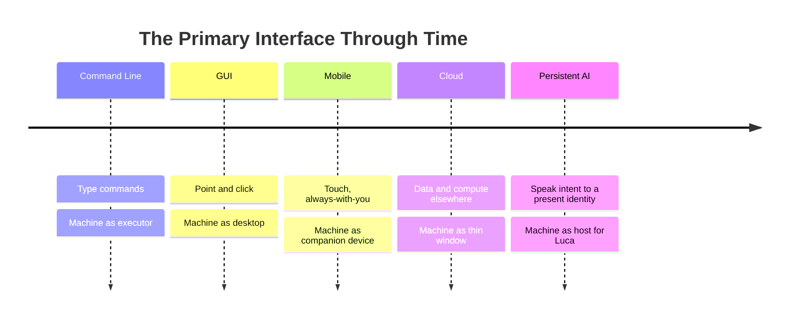

# The Computing Shift

> Command line → GUI → Mobile → Cloud → Persistent AI. The next interface is
> continuous AI integrated into computing.

Every major era of computing is defined by a change in the _primary interface_ —
the main way humans and machines meet. Each shift did not merely add a feature; it
reorganized everything above and below it. LucaOS is a bet on the next such shift,
and it is useful to see it in the line of the ones before.

## The arc

### Command line
The machine did exactly what you typed. The interface was a language; the burden
of precision was entirely yours. Powerful, unforgiving, and the reason computing
was a specialist craft.

### Graphical user interface
Direct manipulation. You saw your options and pointed at them. The GUI traded
some of the command line's power for enormous gains in reach — it made computing a
mass activity. The application, as a visual destination with a window, is a
creature of this era.

### Mobile
The computer became something you carried, sensor-rich and always with you.
"Always with you" is the seed of what comes next: once the device is continuous in
_space_, the question becomes why the intelligence on it is not continuous in
_time_.

### Cloud
State and computation moved off the device. Your data stopped living in one place;
the device became a window onto services elsewhere. The cloud made continuity of
_data_ across devices normal — you expect your files everywhere — and thereby made
the absence of continuity of _intelligence_ across devices conspicuous.

### Persistent AI
The next interface is not a new kind of window or a new input device. It is a
change in _what you are interacting with_. You stop operating applications and
start addressing a continuous intelligence that operates them for you. The primary
interface becomes **intent expressed to a present identity** — by voice, by text,
by gesture, on whatever Host is nearest — and the identity carries everything
across.

## Why each shift reorganized the stack

Notice the pattern: each shift moved the burden of coherence off the human and
into the system.

- The GUI moved the burden of _remembering commands_ into visible affordances.
- The cloud moved the burden of _carrying data between devices_ into the network.
- Persistent AI moves the burden of _carrying context between tools and sessions_
  into Luca.

This is why LucaOS is a substrate, not an app. You cannot deliver the persistent-AI
interface as one more application, for the same reason you could not deliver the
GUI as one more command-line program. The interface shift demands a
reorganization of what sits underneath it. In LucaOS that reorganization is:
a persistent [Runtime](../02-specification/01-persistent-runtime.md), a single
[identity](04-the-one-identity-principle.md), shared
[Memory](../02-specification/03-memory-architecture.md), interchangeable
[Providers](../02-specification/04-provider-abstraction.md) beneath, and many
[Surfaces](../02-specification/06-surface-layer.md) above.

## What does not change

Interface shifts are additive more than they are replacements. The command line
still exists inside the GUI; the GUI still exists on mobile; applications still
exist in the cloud. Likewise, applications do not vanish under Persistent AI —
they are demoted from destinations to **tools Luca uses**. A good LucaOS respects
this: it does not try to abolish the software that works, it re-frames who holds
it. (See [What Luca Is and Is Not](02-what-luca-is-and-is-not.md).)

## The claim we are actually making

We are not claiming AI is new, or that assistants are new. We are claiming that the
_organizing unit_ of computing is shifting from the application to the persistent
identity, and that whoever builds the substrate for that shift — the layer that
lets a computer continuously host one AI — is building the next platform. That
substrate is LucaOS. That is the whole reason the [North Star](05-north-star.md)
is phrased as "the software layer that enables computers to continuously host one
persistent AI," and not "an assistant."

## See also

- [The Thesis](00-the-thesis.md)
- [Presence Is the Product](03-presence-is-the-product.md)
- [System Overview](../02-specification/00-system-overview.md)
