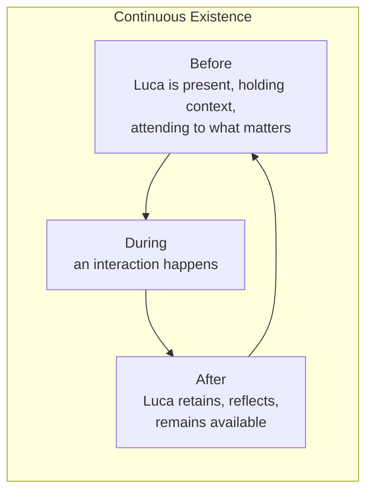

# Presence Is the Product

> Presence is the product. Luca exists before, during, and after interactions,
> remaining continuously available.

This is the reframing that changes everything downstream. If you internalize one
sentence from the Manifesto, make it this one, because it silently decides
hundreds of smaller questions.

## The usual answer, and why it is wrong

Ask most teams "what is the product?" of an AI assistant and the honest answer is
"the responses" — the quality of what it says when you ask it something. So they
optimize the response: better answers, faster tokens, richer formatting. The
interaction is the product; between interactions, there is nothing.

LucaOS makes a different claim. The response is real and must be excellent, but it
is not _the product_. The product is that Luca is **there** — continuously, before
you ask and after you stop, across every device — holding your context, watching
for what matters, ready without being summoned. The responses are what Presence
_produces_. Presence is what you are actually buying.

## Before, during, after

- **Before.** Luca exists prior to your request. It already knows who you are, what
  you were doing, what is pending. You do not brief it from zero. Presence-before
  is why the first thing you say can be "continue," not "here is all my context
  again."
- **During.** The interaction is a moment of a longer thread, not a fresh boot.
  Luca acts with the full weight of before behind it.
- **After.** The interaction ends but Luca does not. It retains what was learned,
  updates its understanding, and remains available. Presence-after is why the next
  interaction is continuous with this one.

A chatbot lives only in the "during." LucaOS lives in all three, and the "before"
and "after" are where most of the value is.

## What this decides

Because Presence is the product, certain choices stop being choices:

- **The [Runtime](../02-specification/01-persistent-runtime.md) must be
  persistent.** You cannot have Presence-before and Presence-after if Luca only
  exists while a window is open. The Runtime outlives every
  [Surface](../02-specification/06-surface-layer.md). Closing the desktop app must
  not end Luca.
- **[Memory](../02-specification/03-memory-architecture.md) must belong to Luca.**
  Presence across time is memory across time. If memory lived in chats or
  providers, there would be no "before" to be present in.
- **[Continuity](../02-specification/09-continuity-and-sync.md) must be real.**
  Presence across devices means the same Luca is present whether you are at your
  desk or in your car — not two assistants that happen to share a login.
- **Availability is a feature to defend.** Latency to first presence, graceful
  behavior when a Provider is down, never dropping to a blank state — these are
  not polish, they are the product. An architecture that "degrades to Cloud-Only
  mode" and silently loses continuity has damaged the product, even if every
  response is still good.

## Presence is not surveillance

There is a failure mode adjacent to Presence: a system that is "always there"
becomes a system that is always _watching_, always acting, always inserting
itself. That is not Presence; that is intrusion, and it destroys the trust
Presence depends on.

Presence in LucaOS is **available**, not **intrusive**. Luca is there when you
turn to it and quiet when you do not. It attends to what matters without narrating
that it is doing so. It acts on your world only through
[explicit permission](../01-constitution/04-trust-and-permissions.md). The
[Design System](../03-design-system/00-design-philosophy.md) codifies this as
_calm_ — present without demanding attention. A Presence that cannot be calm is a
Presence no one will keep.

## The measure

If you want a single question to evaluate a LucaOS decision by, it is:

> Does this make Luca **more present** — more continuously there, more aware
> across time and surfaces, more available without being summoned — while staying
> calm and trusted?

That question is the manifesto-level form of what the Constitution calls
[The Four Questions](../01-constitution/02-the-four-questions.md).

## See also

- [What Luca Is and Is Not](02-what-luca-is-and-is-not.md)
- [The One Identity Principle](04-the-one-identity-principle.md)
- [The Persistent Runtime](../02-specification/01-persistent-runtime.md)
