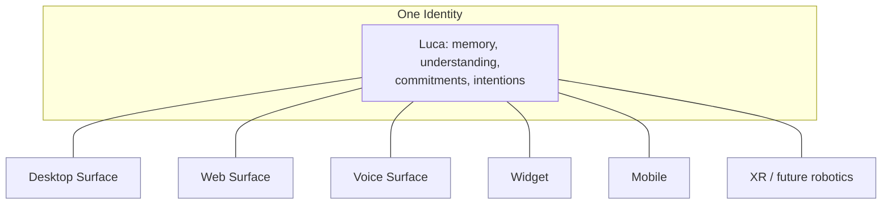

# The One Identity Principle

> There is exactly one Luca. Desktop, web, voice, widget, mobile, XR and future
> robotics are embodiments of the same identity.

This is the principle the entire architecture exists to protect. It is simple to
state and relentlessly difficult to preserve, because almost every convenient
engineering shortcut quietly violates it.

## The principle

There is one Luca. Not one per device, one per session, one per provider, or one
per surface. One. Every place you meet Luca is an **embodiment** — a body the one
identity temporarily inhabits — not a separate instance with its own self.

When you speak to Luca on your phone and later on your desktop, you are speaking
to the same Luca, with the same memory, the same understanding of you, the same
in-flight work. The phone and the desktop are
[Surfaces](../02-specification/06-surface-layer.md); they are windows onto one
presence, the way two windows can show the same running program.

## Why singularity is the whole game

Take singularity away and the thesis collapses. If there are many Lucas — one per
surface, say — then:

- Memory fragments, because each Luca remembers only its own interactions. The
  "before" that [Presence](03-presence-is-the-product.md) depends on shatters into
  per-surface partial views.
- Trust fragments, because you can no longer reason about "what Luca knows" or
  "what Luca is allowed to do" — there is no single subject to attribute knowledge
  or permission to.
- The user experience fragments back into the application era: you are once again
  managing several assistants and carrying context between them by hand — exactly
  the fragmentation the [Thesis](00-the-thesis.md) set out to end.

Singularity is not a nice-to-have property layered on top. It is the property that
makes the rest coherent. This is why it is [Invariant
1](../01-constitution/01-the-eight-invariants.md) and why
[CLAUDE.md](../CLAUDE.md) opens with it.

## How singularity is broken (the failure modes to watch)

The principle is rarely broken on purpose. It is broken by small, reasonable-looking
decisions. Learn the shapes so you can catch them in review:

- **Per-session state that should be shared.** A cache, a counter, a "current
  context" that lives per conversation and never merges back. Each one is a seam
  along which Luca can split.
- **Surface-local memory.** A Surface that stores something "just for its own UX"
  and never publishes it to the shared [Archive](GLOSSARY). Now that Surface knows
  something the others do not; there are two Lucas.
- **Provider-tied identity.** Letting a model's own persona, system prompt, or
  memory features become Luca's identity. Switch the model and Luca changes — which
  means Luca was never one thing. Identity must live above the
  [Provider](../02-specification/04-provider-abstraction.md) layer.
- **Spawned agents mistaken for Luca.** Luca may spawn transient
  [agents](GLOSSARY) to do work in parallel. Those are workers, not additional
  Lucas. The moment a spawned agent accumulates durable identity or memory of its
  own that does not fold back into the one Luca, singularity is violated.
- **Multi-instance runtimes.** Two [Runtime](../02-specification/01-persistent-runtime.md)
  processes both writing the one memory store, both believing they are Luca. This
  is not hypothetical; it is a real hazard when process management is careless, and
  it is why single-instance guarantees are an architectural concern, not an
  afterthought.

## Embodiment, not instantiation

The right mental model is **embodiment**. One identity; many bodies it can be
present through. A body (a Host + Surface) has local, ephemeral things — a screen,
a microphone, a rendering of state, a bit of view state that need not be shared.
But everything that constitutes _who Luca is_ — memory, understanding, commitments,
in-flight intentions — belongs to the one identity and is merely _expressed_
through the body.

The engineering rule that falls out of this: **local rendering and view state may
live on a Surface; identity, memory, and intention may not.** When you are unsure
whether some state belongs to the Surface or to Luca, ask whether losing it when
the Surface closes would change _who Luca is_. If yes, it belongs to the one
identity and must be durable and shared.

## The discipline

Preserving one identity is a discipline practiced in every PR, not a feature
shipped once. The [Constitution](../01-constitution/README.md) turns it into a
reviewable question ("Does this reinforce one identity?"), the
[Specification](../02-specification/02-identity-and-embodiment.md) turns it into a
concrete architecture, and [CLAUDE.md](../CLAUDE.md) turns it into the first
instruction to every agent. All three are guarding the same thing.

## See also

- [Presence Is the Product](03-presence-is-the-product.md)
- [Identity and Embodiment](../02-specification/02-identity-and-embodiment.md)
- [The Eight Invariants](../01-constitution/01-the-eight-invariants.md)
