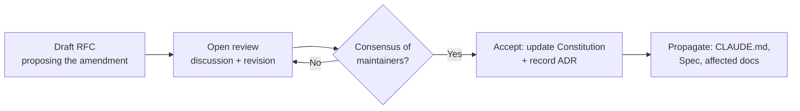

# Governance and Amendments

The Constitution is stable, not frozen. It may change — but only through a
deliberate, recorded process, so that the thing every contributor is bound by
cannot drift by accident or by any single actor's unilateral edit.

## What requires an amendment

A change is an **amendment** if it alters the meaning of:

- an [Invariant](01-the-eight-invariants.md),
- the [Four Questions](02-the-four-questions.md),
- the [Manifesto](../00-manifesto/README.md), or
- this governance process itself.

Everything else — clarifying prose, adding an [ADR](../05-adrs/README.md),
extending the [Specification](../02-specification/README.md), fixing an example — is
an ordinary reviewed change and does not need the amendment process. When in doubt,
ask whether a reasonable contributor's _obligations_ change. If yes, it is an
amendment.

## The amendment process

1. **Draft an [RFC](../04-rfcs/README.md)** that states the current rule, the
   proposed rule, the motivation, and the consequences for existing code and docs.
   An amendment RFC must explicitly list what it changes and what it leaves intact.
2. **Open review.** The proposal is discussed and revised in the open. Amendments
   are expected to take longer than ordinary changes; that friction is a feature.
3. **Acceptance** requires the considered consensus of the project's maintainers,
   not a single approval. The bar is deliberately high: these are the rules
   everything else depends on.
4. **On acceptance**, update the Constitution text, record an
   [ADR](../05-adrs/README.md) capturing the decision and its rationale, and
   **propagate** the change to every document that restates the rule — at minimum
   [CLAUDE.md](../CLAUDE.md), the affected [Specification](../02-specification/README.md)
   chapters, and the [Glossary](../GLOSSARY.md).

## Principles that constrain amendments

- **The Manifesto is the ceiling.** An amendment may not push the Constitution into
  conflict with the [Manifesto](../00-manifesto/README.md). If you believe the
  Manifesto itself is wrong, that is a far larger conversation and a far rarer one.
- **Invariants may be sharpened more easily than they may be removed.** Making an
  invariant more precise, or adding a ninth that strengthens the thesis, is a
  smaller step than weakening or deleting one of the eight. Removal of an invariant
  should be treated as an extraordinary act.
- **No silent reinterpretation.** The Constitution grows more precise through
  recorded amendment, never through unrecorded "we now read it to mean." If the
  text is ambiguous, the fix is an amendment that disambiguates it, not a habit that
  quietly resolves it.

## Versioning

The Foundation is versioned as a whole (this is **v1.0**). Amendments increment the
version and are listed in a changelog with links to their RFCs and ADRs, so any
contributor can reconstruct _what the rules were_ at the time a given piece of code
was written. This matters: an agent reading old code should be able to judge it
against the Constitution that governed it, not only today's.

## Emergency changes

There is no "emergency" exception that bypasses recording. If a security issue or a
grave defect demands an immediate change to a constitutional rule, the change is
made and the RFC/ADR is written _in the same change or immediately after_ — never
never-written. Speed may compress the process; it may not skip the record. The
record is the trust.

## Ordinary evolution is welcome

None of this is meant to make the Foundation rigid. The [Specification](../02-specification/README.md),
[Design System](../03-design-system/README.md), [RFCs](../04-rfcs/README.md),
[ADRs](../05-adrs/README.md), and [Roadmap](../06-roadmap/README.md) are expected to
evolve continuously through ordinary review. It is only the small constitutional
core — the invariants, the questions, the manifesto — that moves slowly and on the
record. That asymmetry is the point: a stable center and a living edge.

## See also

- [Preamble](00-preamble.md)
- [The Eight Invariants](01-the-eight-invariants.md)
- [RFC process](../04-rfcs/README.md)
- [ADR process](../05-adrs/README.md)
