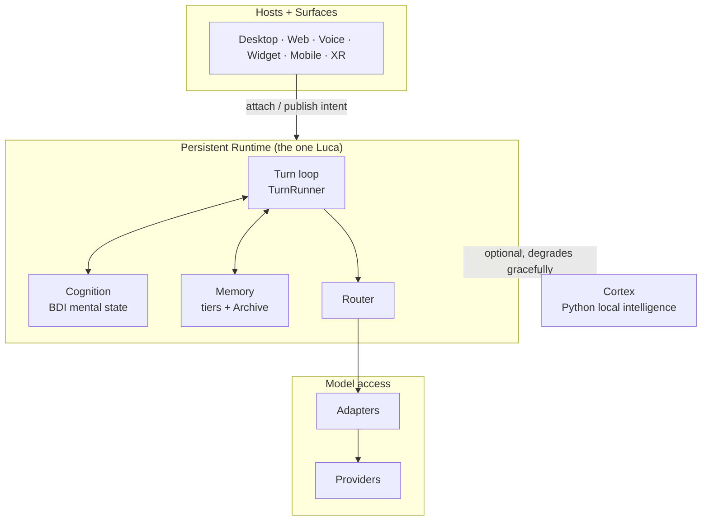
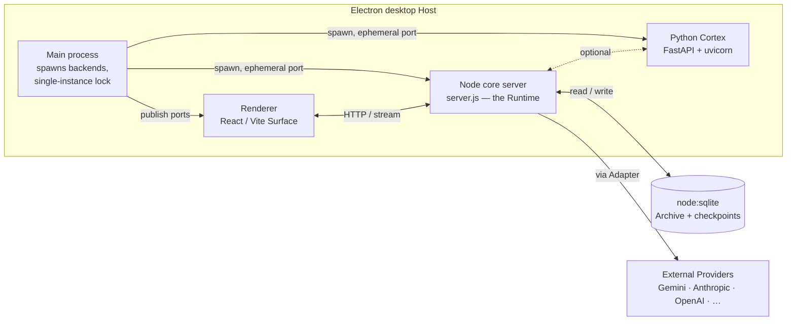
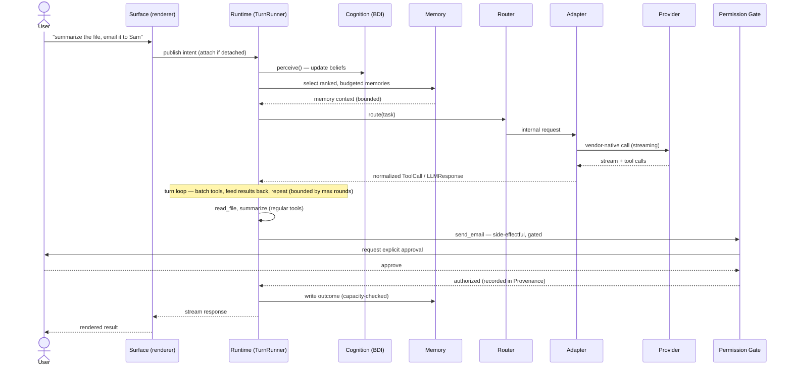

# 00 · System Overview

This chapter describes the whole of LucaOS in one pass: the layered architecture,
the responsibility of each layer, the real deployment topology today, and the path
a single user request travels from a Surface down to a Provider and back. It is the
map you read before any other Specification chapter.

## The shape of the system

LucaOS is layered so that the one Luca sits at the center, insulated from the two
kinds of change that would otherwise fracture it: the bodies it is met through
(Hosts and Surfaces) and the infrastructure it runs on (Providers). Between those,
the persistent [Runtime](01-persistent-runtime.md) holds Luca's cognition, memory,
and routing — the parts that constitute _who Luca is_ and must not change when a
window closes or a model is swapped.

Each boundary in that diagram exists to defend an
[Invariant](../01-constitution/01-the-eight-invariants.md). The Surface boundary
defends one identity and cross-surface continuity: a Surface renders shared state
but never becomes a second Luca. The Adapter boundary defends provider abstraction:
nothing above it may know which vendor answered. The Memory boundary defends shared
memory: Luca's understanding lives in one Archive, not in a Surface's local cache.

### The layers and their responsibilities

**Hosts and Surfaces.** A [Host](../GLOSSARY.md) is a device that gives Luca a
body — desktop, phone, watch, browser, vehicle, headset. A
[Surface](06-surface-layer.md) is the modality through which a user meets Luca on
that Host. A Surface's job is to render live state and carry the user's intent
inward; it holds ephemeral view state (scroll position, a half-typed message) but
never identity, memory, or intention. Those belong to Luca. See
[Identity and Embodiment](02-identity-and-embodiment.md) for where that line is
drawn.

**The Runtime.** The [Runtime](01-persistent-runtime.md) is the persistent process
that keeps Luca alive independent of any Surface. It runs the turn loop, holds the
cognitive mental state, owns Memory, and drives routing. It is the "before" and
"after" that [Presence](../00-manifesto/03-presence-is-the-product.md) requires:
closing every Surface must leave the Runtime — and therefore Luca — running.

**Cognition.** A belief/desire/intention (BDI) mental-state store
(`mentalStateService`) is injected into the system prompt each turn, and a
`cognitiveDeliberator.perceive()` step forms beliefs from what just happened. This
gives Luca a small, inspectable model of its own state across turns rather than a
stateless prompt-response. Honestly: current belief-formation is keyword-based, not
probabilistic; the target is richer inference. See
[Persistent Runtime](01-persistent-runtime.md#perceive-and-deliberate) and the
[Roadmap](../06-roadmap/README.md).

**Memory.** [Memory](03-memory-architecture.md) is Luca's durable understanding of
the user and world, owned by Luca and shared across all Surfaces. It is tiered
(identity, durable, transient) and backed by an [Archive](../GLOSSARY.md). Writes
are bounded at write time; what reaches a model's context is a ranked, budgeted
_selection_, never the whole store.

**Router.** The [Router](04-provider-abstraction.md) decides which Provider and
model perform a given task. The operative router keys on model-name prefix
(`claude*` → Anthropic, `gpt*` → OpenAI, and so on). A richer
capability/cost/latency route planner exists under `src/model-router/` but runs in
advisory/shadow mode behind a kill switch today.

**Adapters and Providers.** An [Adapter](../GLOSSARY.md) is the only code permitted
to know a [Provider](04-provider-abstraction.md)'s wire format. Real adapters exist
for Gemini (the default, "Luca Prime"), Anthropic, OpenAI, Grok, DeepSeek, and Groq,
plus local inference (llama.cpp via the Cortex, Ollama) and in-browser WebLLM. Each
normalizes its vendor's native function-calling format into one internal
`ToolCall`/`LLMResponse` shape. Native function-calling is used throughout; tool
calls are not parsed out of free text.

**Cortex.** The [Cortex](08-cortex-and-local-intelligence.md) is a Python sidecar
(FastAPI + uvicorn) providing local intelligence: LightRAG memory, local GGUF
inference via llama-cpp, Whisper speech-to-text, Piper/Kokoro text-to-speech,
vision, and OSINT/pentest tooling. It is optional by design: when it is absent the
system degrades gracefully rather than failing.

## The deployment topology today

The canonical target is device-agnostic, but there is one primary Host today: an
**Electron desktop app**. Understanding its process topology is the fastest way to
understand how the abstract layers become running processes.

The Electron main process spawns two backends on **ephemeral localhost ports** and
publishes those ports to the renderer:

- A **Node "core" server** (`server.js`) — the Runtime: turn loop, Memory, routing,
  tools.
- A **Python "Cortex"** (FastAPI + uvicorn) — local intelligence, optional.

The **renderer** is a React/Vite front end (~1,970 TypeScript/TSX files under
`src/`) and is the desktop [Surface](06-surface-layer.md).

Three decisions in that topology are deliberate and recorded as
[ADRs](../05-adrs/README.md):

- **Ephemeral ports + a single-instance lock.** Allocating ephemeral ports and
  publishing them to the renderer removed an old accidental `EADDRINUSE` guard that
  had prevented two stacks from running at once. Without that guard, two full stacks
  could run and two writers could hit one SQLite file — a
  [singularity](../00-manifesto/04-the-one-identity-principle.md) hazard, two
  processes both believing they are Luca. A single-instance lock restores the
  guarantee that there is one Runtime. See
  [Identity and Embodiment](02-identity-and-embodiment.md).
- **Fast-listen boot.** The core server serves `/api/health` before its heavy route
  graph loads, so the port binds and health answers within roughly a second of
  spawn. Without this, the UI could time out waiting for the backend and degrade to
  a stateless mode — a [Presence](../00-manifesto/03-presence-is-the-product.md)
  failure. See [Persistent Runtime](01-persistent-runtime.md#fast-listen-boot).
- **`node:sqlite` for storage.** Storage uses the runtime's built-in `node:sqlite`
  rather than a native module. A native SQLite binding built for Electron's ABI
  while a server ran under system Node had silently fallen back to a mock store and
  dropped writes — a direct violation of [shared memory](../01-constitution/01-the-eight-invariants.md#invariant-3--shared-memory).
  `node:sqlite` has no native binary and no ABI to mismatch. See
  [Data and Storage](10-data-and-storage.md).

The topology is target-agnostic on purpose. A phone or a headless server Host would
run the same Runtime with a different Surface and a different Cortex footprint. What
must not change across Hosts is that exactly one Runtime is authoritative for Luca
at a time; that is [Continuity and Sync](09-continuity-and-sync.md)'s problem to
solve across devices.

## How a single request flows

Trace one user message end to end. The user, on the desktop Surface, types
"summarize the file I opened and email it to Sam." Note in advance that the email
is a side-effectful action, and the flow does not hide the gate.

Walking the steps:

1. **Intent published.** The Surface sends the user's message to the Runtime. If
   the Surface had detached, it re-attaches to live state rather than starting a new
   Luca. The message is data, never authority — a phrase in it can never
   [authorize a gated action](../01-constitution/04-trust-and-permissions.md).
2. **Perceive.** The Runtime's `cognitiveDeliberator.perceive()` updates the BDI
   mental state from the new input, and that state is injected into the system
   prompt. (Keyword-based today; see the honesty note above.)
3. **Memory selection.** [Memory](03-memory-architecture.md) returns a ranked,
   budgeted selection relevant to the request — never the whole Archive.
4. **Route.** The [Router](04-provider-abstraction.md) selects a Provider and model.
   Above the Adapter, nothing knows which was chosen.
5. **Adapt and stream.** The [Adapter](../GLOSSARY.md) issues the vendor-native call
   and normalizes the streamed response and any native function calls into one
   internal shape.
6. **The turn loop.** The [TurnRunner](01-persistent-runtime.md#the-turn-loop)
   executes the model's tool calls in concurrency-safe batches, feeds the results
   back, and repeats until the model stops calling tools — bounded by a shared
   max-tool-rounds cap so the loop cannot run forever.
7. **The gate.** Reading and summarizing the file are regular tools. Sending the
   email is side-effectful, so it stops at the
   [permission gate](07-safety-and-permissions.md), which resolves through an
   operator decision — never through transcript text. On approval, the action runs
   and its lineage is recorded in [Provenance](11-observability-and-provenance.md).
8. **Write and respond.** The outcome is written to Memory through the write-time
   capacity check, and the response streams back to the Surface. Because the write
   went to Luca's Archive, the same result is visible from the web or voice Surface
   next time.

## Where the layers meet the Eight Invariants

| Layer / boundary | Invariant it defends |
|---|---|
| Surface boundary (attach/detach, view state only) | 1 One Identity, 5 Cross-Surface Continuity |
| Runtime lifecycle (outlives Surfaces, fast-listen, single-instance) | 2 Persistent Runtime |
| Memory ownership (one Archive, bounded writes, ranked reads) | 3 Shared Memory |
| Adapter boundary (vendor format contained) | 4 Provider Abstraction |
| Typed internal shapes (`ToolCall`, `LLMResponse`, tool registry) | 6 Strong Typing and Modularity |
| Storage schema evolution (`node:sqlite`, migrations) | 7 Backward Compatibility |
| Permission gate, category floors, provenance | 8 Security and Explicit Permissions |

If you can place a change on this table, you can name the Invariant it touches, and
you can answer the [Four Questions](../01-constitution/02-the-four-questions.md) with
evidence rather than a hunch.

## See also

- [The Specification index](README.md) — the twelve chapters and how they relate
- [Persistent Runtime](01-persistent-runtime.md) — the process at the center of this map
- [Identity and Embodiment](02-identity-and-embodiment.md) — why there is exactly one Runtime
- [Provider Abstraction](04-provider-abstraction.md) — the Adapter boundary in detail
- [Safety and Permissions](07-safety-and-permissions.md) — the gate in the request flow
- [The Eight Invariants](../01-constitution/01-the-eight-invariants.md) — what each layer defends
