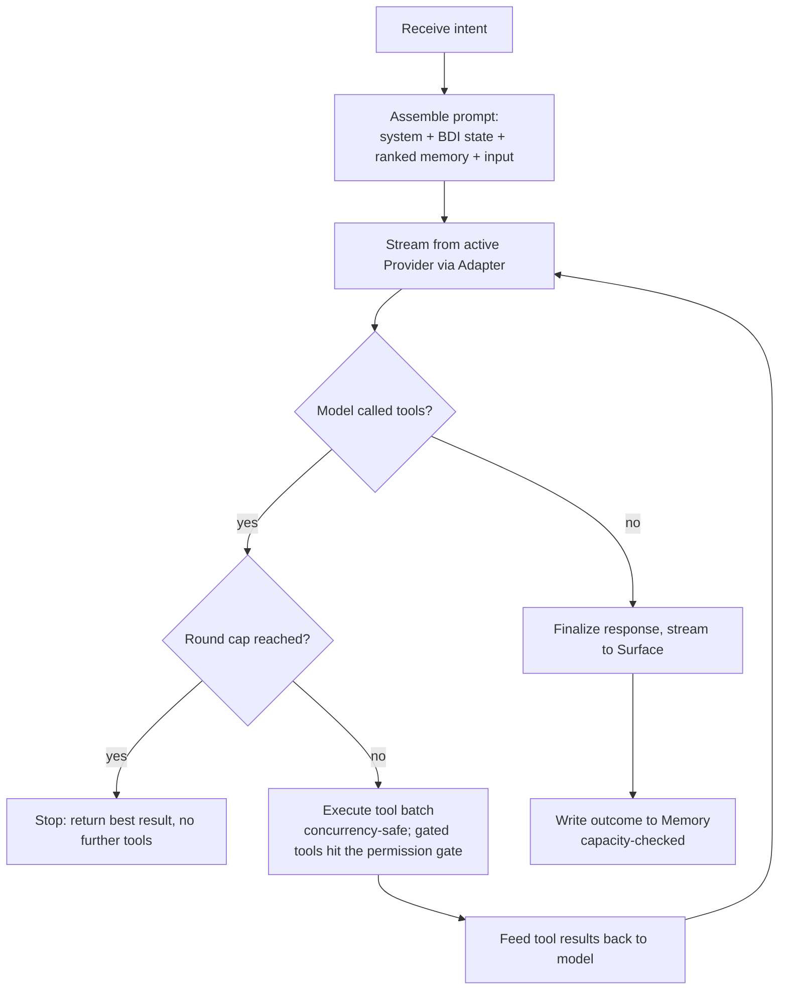
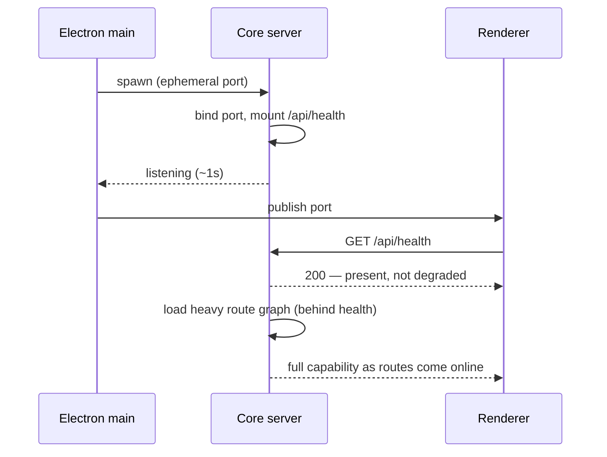

# 01 · Persistent Runtime

This chapter specifies the Runtime: the process that keeps Luca alive independent of
any Surface. It covers the Runtime's lifecycle, the turn loop that drives each
interaction, fast-listen boot and bounded time-to-presence, the single-instance
guarantee, and the perceive/deliberate step that gives Luca a small model of its own
state. The Runtime is the concrete form of
[Invariant 2 — Persistent Runtime](../01-constitution/01-the-eight-invariants.md#invariant-2--persistent-runtime).

## Why the Runtime exists

[Presence is the product](../00-manifesto/03-presence-is-the-product.md), and
Presence has a "before" and an "after." Those exist only if Luca keeps running when
no window is open. A chatbot lives entirely in the "during"; it is born when you
open it and dies when you close it. LucaOS refuses that shape. The Runtime is the
part of the system that is alive before you turn to Luca and still alive after you
turn away.

Concretely, the Runtime is the Node "core" server (`server.js`) that the Electron
main process spawns. It owns the turn loop, the cognitive mental state,
[Memory](03-memory-architecture.md), and routing. A [Surface](06-surface-layer.md)
attaches to it and detaches from it; the Runtime does not attach to a Surface. This
asymmetry is the whole point: **the Surface's lifecycle must never determine Luca's.**

## Lifecycle independent of any Surface

The Runtime has its own lifecycle, distinct from the lifecycle of any window,
connection, or session. Closing the desktop app, switching to the voice Surface, or
losing a network connection changes which body Luca is expressed through — it does
not change whether Luca exists.

```mermaid
stateDiagram-v2
  [*] --> Spawning
  Spawning --> Listening: bind port, serve /api/health
  Listening --> Ready: heavy route graph loaded
  Ready --> Serving: a Surface attaches
  Serving --> Ready: Surface detaches (Luca stays alive)
  Ready --> Serving: another Surface attaches
  Serving --> Serving: turns run; work continues
  Ready --> ShuttingDown: explicit stop / host shutdown
  Serving --> ShuttingDown: explicit stop / host shutdown
  ShuttingDown --> [*]: checkpoint durable state
```



The states that matter for the Invariant are `Serving → Ready → Serving`. When the
last Surface detaches, the Runtime returns to `Ready`, not to a terminated state. In
that state Luca is present with no window open: memory intact, in-flight intentions
held, ready for the next Surface to attach and continue rather than restart.

Two rules follow, and both are reviewable:

- **State that constitutes Luca lives in the Runtime, not a Surface.** Identity,
  Memory, and in-flight intention are the Runtime's. A renderer that held the only
  copy of some piece of Luca's understanding would die with the window and take that
  understanding with it — a continuity failure. See
  [Identity and Embodiment](02-identity-and-embodiment.md) for the exact line
  between Surface view state and Luca state.
- **Detach is not shutdown.** A Surface closing sends the Runtime back to `Ready`.
  There is no code path where the last Surface closing tears down the turn loop, the
  mental state, or the Archive connection.

## The turn loop

The turn loop is how a single interaction is carried out. It is implemented by the
**TurnRunner** (`src/services/turns/TurnRunner.ts`). Its structure is deliberately
simple and deliberately bounded: stream from the active Provider, execute any tool
calls the model makes in concurrency-safe batches, feed the results back to the
model, and repeat until the model stops calling tools.

> The turn loop is the mechanism for one interaction. The deterministic mission
> discipline that sits _above_ it — `plan → execute → verify → recover → record`,
> with verification gates and checkpoint/rollback — is the **Mission Engine** (planned
> spec chapter `12-mission-engine.md`), bridged in the [Crosswalk](../CROSSWALK.md).
> This chapter specifies the turn loop, not that orchestration tier.



Several properties of this loop are load-bearing:

- **Native function-calling, one internal shape.** The model's tool calls arrive in
  the Provider's native format and are normalized by the
  [Adapter](04-provider-abstraction.md) into one internal `ToolCall` shape before
  the loop sees them. The TurnRunner never branches on vendor. This is where
  [Invariant 4](../01-constitution/01-the-eight-invariants.md#invariant-4--provider-abstraction)
  lives inside the loop.
- **Concurrency-safe batches.** When a model requests several tools at once, they
  execute as a batch with concurrency control, not as an unguarded fan-out. Results
  are collected and fed back together so the model sees a coherent picture.
- **Gated tools stop at the gate.** A tool that touches the user's world does not
  execute silently inside the loop; it resolves through the
  [permission gate](07-safety-and-permissions.md). The loop honors a refusal by
  failing closed, never by performing the action anyway.
- **Streaming and non-streaming variants.** There is a streaming variant (tokens
  flow to the Surface as they arrive) and a non-streaming variant. Both share the
  same bound.

### The max-tool-rounds cap

The loop repeats "until the model stops calling tools." Left unbounded, a model that
kept calling tools would loop forever, burning Provider budget and possibly
executing an unbounded chain of actions. Both TurnRunner variants are therefore
bounded by a **shared max-tool-rounds cap**. When the cap is reached, the loop
stops requesting further tools and returns the best result it has.

The cap is a safety boundary, not a tuning knob to raise casually. It is the
difference between an agent that terminates and one that can spiral. An illustrative
sketch of the shape (not the exact code):

```typescript
// Illustrative — shows the bound, not the real signature.
async function runTurn(input: Intent, opts: { maxToolRounds: number }): Promise<Turn> {
  let round = 0;
  let response = await stream(assemblePrompt(input));
  while (response.toolCalls.length > 0) {
    if (round >= opts.maxToolRounds) break; // fail safe, do not loop forever
    const results = await executeToolBatch(response.toolCalls); // concurrency-safe; gated tools gate
    response = await stream(feedBack(results));
    round += 1;
  }
  return finalize(response);
}
```

## Fast-listen boot and bounded time-to-presence

[Invariant 2](../01-constitution/01-the-eight-invariants.md#invariant-2--persistent-runtime)
requires "fast, bounded time-to-presence on start; the user should not watch Luca
boot." A Runtime that took a long time to become reachable would push the Surface
into a timeout, and a Surface that times out on its backend degrades to a stateless
mode — losing the very continuity the Runtime exists to provide.

The mitigation is **fast-listen boot**: the core server serves `/api/health` before
its heavy route graph loads. The port binds and health answers within roughly a
second of spawn, well inside the window before the UI would give up. The heavy
routes finish loading behind that, moving the Runtime from `Listening` to `Ready`.



The design goal is that the user never sees Luca "booting." The
[Roadmap](../06-roadmap/README.md) tracks the measured boot budget; this chapter
does not assert a benchmark number, because the target is bounded time-to-presence,
not a specific millisecond count.

> **Current-state honesty.** "The user never sees Luca boot" describes the target,
> not the shipped surface. Today's boot _surface_ is a diagnostic terminal in the
> `LUCA BIOS` idiom — a `MOUNTING LOCAL_CORE`-style startup sequence rendered to the
> user — rather than the premium, calm time-to-presence the target calls for. The
> fast-listen mechanism above is real; what is not yet built is hiding it behind a
> quiet startup. Closing that gap is [Roadmap](../06-roadmap/README.md) work.

## The single-instance guarantee

There must be exactly one Runtime authoritative for Luca at a time. Two Runtimes
both acting as Luca over the same state is a direct violation of
[Invariant 1](../01-constitution/01-the-eight-invariants.md#invariant-1--one-luca-identity):
two processes both believing they are Luca, both writing the one Archive.

This is not hypothetical. When the core server and Cortex moved to **ephemeral
ports**, the change removed an accidental guard: previously, a fixed port meant a
second stack would fail to bind with `EADDRINUSE`, which happened to prevent two
Runtimes. Ephemeral ports removed that accident, so two full stacks — and two
writers into one SQLite file — became possible. A **single-instance lock** was added
to restore the guarantee deliberately rather than by side effect.

The lesson generalizes: a singularity guarantee that exists only as a side effect of
some unrelated mechanism is fragile. Single-instance is an architectural concern, and
the lock states it explicitly. See
[Identity and Embodiment](02-identity-and-embodiment.md) and
[Continuity and Sync](09-continuity-and-sync.md) for how singularity is maintained
across devices, where "one Runtime per machine" becomes "one authoritative Luca
across machines."

## Perceive and deliberate

The Runtime does more than relay messages between a Surface and a Provider. It
maintains a small, inspectable model of Luca's own state across turns: a
belief/desire/intention (BDI) store held by `mentalStateService` and injected into
the system prompt each turn. Before assembling the prompt, a
`cognitiveDeliberator.perceive()` step updates beliefs from what just happened, so
each turn is informed by an explicit representation of what Luca currently believes,
wants, and intends — rather than being a stateless prompt-response.

```mermaid
flowchart LR
  In[New input / tool results] --> P[perceive&#40;&#41;<br/>update beliefs]
  P --> BDI[(BDI mental state<br/>mentalStateService)]
  BDI --> Prompt[Inject into system prompt]
  Prompt --> Turn[Turn loop]
  Turn --> In
```



**An honest reality check.** The current belief-formation is **keyword-based**, not
probabilistic: `perceive()` derives beliefs by matching against known keywords rather
than by inference over uncertain evidence. The mechanism is real and wired into the
turn loop, but it is a first approximation of the target, which is richer belief
formation that reasons under uncertainty and revises beliefs as evidence changes.
Do not read the presence of a BDI store as a claim that Luca has a sophisticated
cognitive model today; it has the _seam_ for one, and a keyword-based filling of that
seam. The plan to deepen it is tracked in the [Roadmap](../06-roadmap/README.md).

This honesty matters for contributors: if you are tempted to build a feature on the
assumption that beliefs are reliable structured inferences, read the code in
`cognitiveDeliberator` first, and treat the gap as information to surface rather than
paper over — the discipline [CLAUDE.md](../CLAUDE.md) asks for when the vision and the
code disagree.

## What the Runtime must never do

- **Tie Luca's existence to an open UI.** No path where the last Surface closing
  ends the turn loop, the mental state, or the Archive connection.
- **Boot slowly enough to force degradation.** No startup that leaves the UI timing
  out and dropping to a stateless mode. Health must answer fast.
- **Permit a second authoritative Runtime.** No configuration where two stacks write
  one Archive as if each were Luca.
- **Loop without bound.** No turn that can call tools forever; the max-tool-rounds
  cap is not optional.
- **Perform a gated action to keep the loop moving.** A refused or unreachable gate
  fails closed; the loop does not "helpfully" complete the side effect.

## See also

- [System Overview](00-system-overview.md) — where the Runtime sits among the layers
- [Identity and Embodiment](02-identity-and-embodiment.md) — one Runtime, many attached Surfaces
- [Memory Architecture](03-memory-architecture.md) — the state the Runtime keeps durable
- [Provider Abstraction](04-provider-abstraction.md) — the Adapter the turn loop streams through
- [Safety and Permissions](07-safety-and-permissions.md) — the gate the turn loop honors
- [Invariant 2 — Persistent Runtime](../01-constitution/01-the-eight-invariants.md#invariant-2--persistent-runtime)
- [Presence Is the Product](../00-manifesto/03-presence-is-the-product.md)
