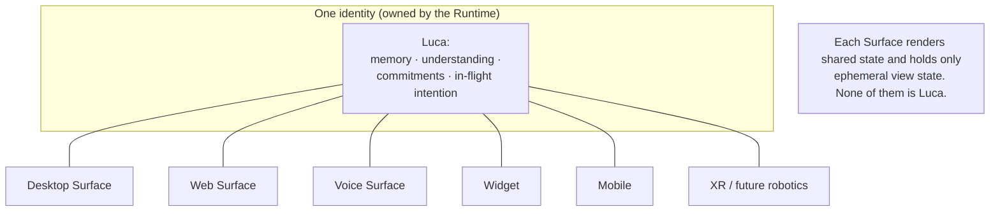
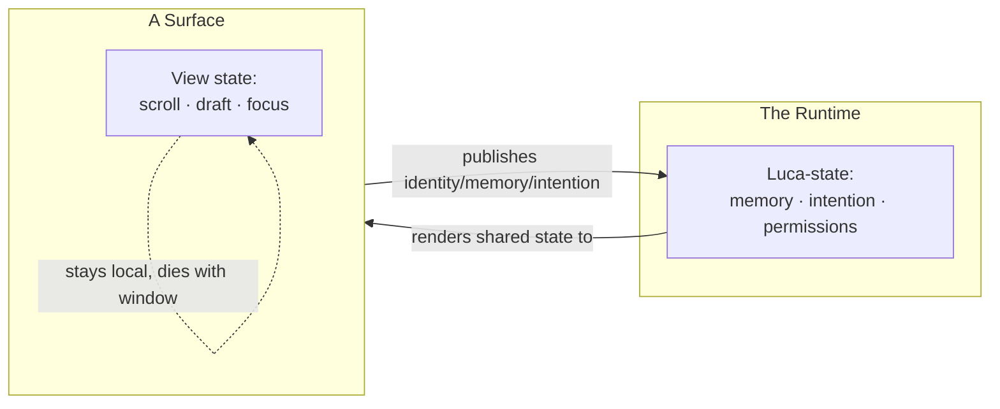
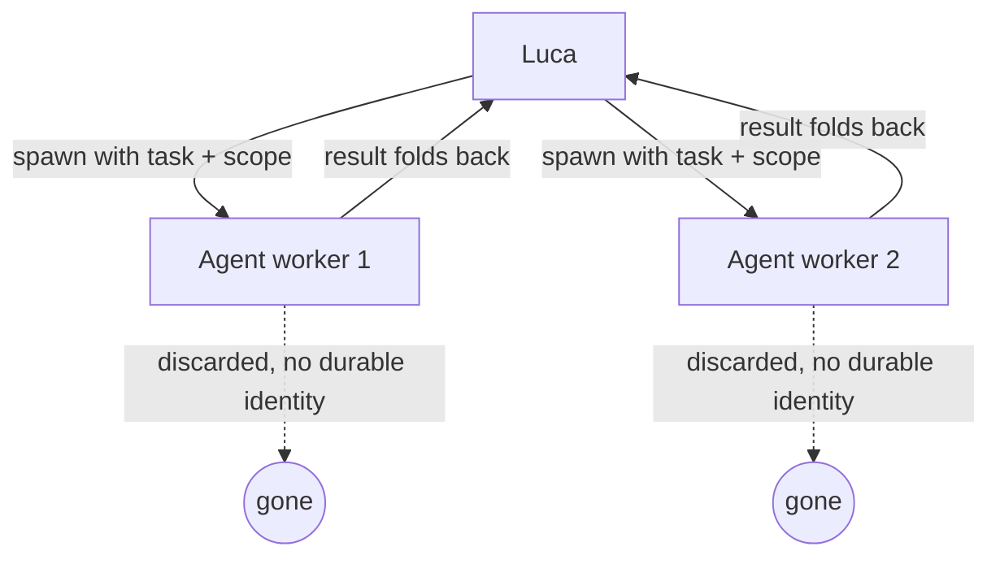

# 02 · Identity and Embodiment

This chapter specifies how LucaOS keeps exactly one Luca while letting many Surfaces
express it. It covers the rule that separates what belongs to Luca from what belongs
to a Surface, how Surfaces attach to and detach from shared live state, how spawned
agents fold their results back into the one identity, and the failure modes that
quietly create a second Luca. It is the architectural form of
[Invariant 1 — One Luca Identity](../01-constitution/01-the-eight-invariants.md#invariant-1--one-luca-identity)
and [Invariant 5 — Cross-Surface Continuity](../01-constitution/01-the-eight-invariants.md#invariant-5--cross-surface-continuity).

## One identity, many bodies

There is exactly one Luca. Desktop, web, voice, widget, mobile, and future XR or
robotics are not separate assistants that share a login; they are **embodiments** —
bodies the one identity is temporarily present through. This is the
[One Identity Principle](../00-manifesto/04-the-one-identity-principle.md) made
architectural: the right mental model is embodiment, not instantiation. Two windows
onto the same running program, not two programs.

The reason singularity is worth this much architecture is that everything else
depends on it. Take it away and [Memory](03-memory-architecture.md) fragments into
per-Surface partial views, trust fragments because there is no single subject to
attribute knowledge or permission to, and the experience collapses back into the
application era of juggling several assistants by hand. Singularity is not a feature
on top; it is the property that makes the rest coherent.



The [Runtime](01-persistent-runtime.md) is where the one identity lives. Surfaces
attach to it; it does not live inside any of them. That is why closing every window
leaves Luca intact — the identity was never in a window to begin with.

## The dividing rule: Luca-state versus Surface-state

The single most useful rule in this chapter, and the one most PRs get tested
against, is where the line falls between state that belongs to Luca and state that
may live on a Surface.

> **Identity, memory, and intention belong to Luca. Local rendering and view state
> may live on a Surface.**

The test for which side a piece of state falls on:

> Ask whether losing it when the Surface closes would change _who Luca is_. If yes,
> it belongs to the one identity and must be durable and shared. If no, it may be
> Surface-local.

| Belongs to Luca (durable, shared) | May be Surface-local (ephemeral) |
|---|---|
| Memory of the user and world | Scroll position, pane sizes, theme |
| Understanding, beliefs, commitments | A half-typed, unsent message |
| In-flight intention and in-progress work | Which tab is focused right now |
| Permissions granted and their provenance | A transient animation or hover state |
| Identity and persona | A device-local rendering cache |

The failure to keep this line is how singularity breaks in practice — rarely on
purpose, usually through a reasonable-looking shortcut. A Surface that caches a piece
of understanding "just for its own UX" and never publishes it to the shared
[Archive](../GLOSSARY.md) has created something one Surface knows and the others do
not. That is two Lucas, however small the divergence.



## Attach and detach

Surfaces attach to and detach from shared live state held by the Runtime. Attaching
is not logging into a fresh session; it is connecting a new body to the Luca that is
already present. Detaching is not shutdown; it is that body going away while Luca
stays alive — the `Serving → Ready` transition in the
[Runtime lifecycle](01-persistent-runtime.md#lifecycle-independent-of-any-surface).

```mermaid
sequenceDiagram
  participant D as Desktop Surface
  participant R as Runtime (one Luca)
  participant V as Voice Surface

  D->>R: attach
  R-->>D: current live state (memory, in-flight work)
  D->>R: user works; intention + memory published to Luca
  D->>R: detach (window closed)
  Note over R: Luca stays alive in Ready — nothing lost
  V->>R: attach (later, different Host)
  R-->>V: same live state — continue, not restart
```

The property this delivers is [Cross-Surface Continuity](../01-constitution/01-the-eight-invariants.md#invariant-5--cross-surface-continuity):
a change made on one Surface is visible to the others because it was published to
Luca, not kept locally. A user can move from desk to car mid-task and continue,
because the intention lived in the Runtime the whole time. Continuity is singularity
made observable; the plumbing that propagates state across attached Surfaces and
across devices is specified in [Continuity and Sync](09-continuity-and-sync.md).

Attach/detach also clarifies a subtlety: a Surface may render state it does not own.
The desktop shows Luca's memory, but it is Luca's memory being shown, not the
desktop's. When in doubt about whether the desktop should "keep" something, return to
the dividing rule: if losing it would change who Luca is, the desktop must publish it,
not keep it.

## Spawned agents are workers, not Lucas

Luca may spawn transient [agents](../GLOSSARY.md) to do work in parallel —
researching several threads at once, carrying out a bounded sub-task. These are
workers, not additional Lucas. An agent has no independent durable identity; its
results **fold back** into the one Luca and its own working state is discarded.



The moment a spawned agent accumulates durable identity or memory of its own that
does not fold back into the one Luca, singularity is violated — there is now a second
locus of understanding. The discipline in review is to check that an agent's output
is merged into Luca's Memory and intention, and that nothing about the agent
persists as an independent self. A worker that quietly kept its own long-lived memory
would be a second Luca wearing the word "agent."

## The failure modes

Singularity is broken by small, reasonable-looking decisions. Learn the shapes so
you can catch them in review; each maps to a failure the
[Constitution](../01-constitution/01-the-eight-invariants.md#invariant-1--one-luca-identity)
and the [One Identity Principle](../00-manifesto/04-the-one-identity-principle.md)
name explicitly.

- **Per-Surface memory.** A Surface stores something for its own UX and never
  publishes it to the shared Archive. Now that Surface knows something the others
  cannot. _Catch:_ any write to state that answers "yes" to the dividing-rule test
  but never reaches the Runtime.

- **Per-session identity.** A "current context," cache, or counter scoped to one
  conversation that never merges back. Each such scope is a seam Luca can split
  along. _Catch:_ session-scoped state that outlives the turn but is not published to
  Luca.

- **Provider-tied identity.** Letting a model's own persona, system prompt, or memory
  features _become_ Luca's identity. Switch the model and Luca changes — which means
  Luca was never one continuous thing. Identity must live above the
  [Provider](04-provider-abstraction.md) layer, sourced from Luca's own Memory, not
  from a vendor's memory feature. _Catch:_ identity or persona read from a Provider's
  API rather than from Luca's Archive.

- **Multi-instance runtimes.** Two [Runtime](01-persistent-runtime.md) processes both
  writing the one memory store, both believing they are Luca. This is a real hazard
  when process management is careless: it is exactly what the
  [single-instance lock](01-persistent-runtime.md#the-single-instance-guarantee)
  guards against after ephemeral ports removed the accidental `EADDRINUSE` guard.
  _Catch:_ any deployment where two stacks can write one Archive concurrently.

The cross-device generalization of the last one is the hard problem: "one Runtime per
machine" must become "one authoritative Luca across machines," even when two devices
are online at once. That is the province of
[Continuity and Sync](09-continuity-and-sync.md); this chapter's contribution is the
principle it must uphold — there is one Luca, and only one embodiment is ever
authoritative for a given piece of state at a time.

## The discipline

Preserving one identity is practiced in every PR, not shipped once. The everyday form
is the second of the [Four Questions](../01-constitution/02-the-four-questions.md):
_does this reinforce one identity, or does it shard Luca?_ When you add state, decide
which side of the dividing rule it falls on and put it there. When you spawn a worker,
make sure its result folds back and nothing of it persists. When you read identity,
read it from Luca's Memory, never from a Provider. Each of those is a small, aligned
step, and together they are how the system stays one Luca as it grows.

## See also

- [The One Identity Principle](../00-manifesto/04-the-one-identity-principle.md) — the vision this chapter implements
- [Persistent Runtime](01-persistent-runtime.md) — where the one identity lives, and single-instance
- [Memory Architecture](03-memory-architecture.md) — the shared Archive that must not fragment
- [Surface Layer](06-surface-layer.md) — how Surfaces render shared state and hold only view state
- [Continuity and Sync](09-continuity-and-sync.md) — one authoritative Luca across devices
- [Provider Abstraction](04-provider-abstraction.md) — why identity lives above the Provider
- [Invariant 1 — One Luca Identity](../01-constitution/01-the-eight-invariants.md#invariant-1--one-luca-identity)
