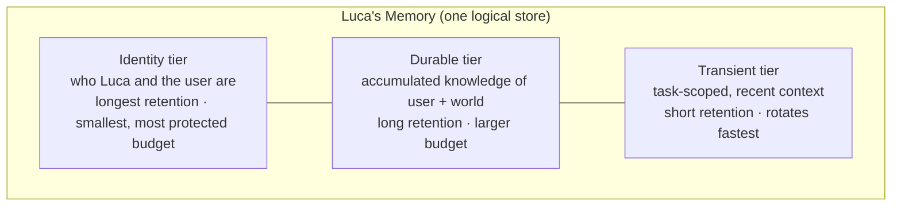
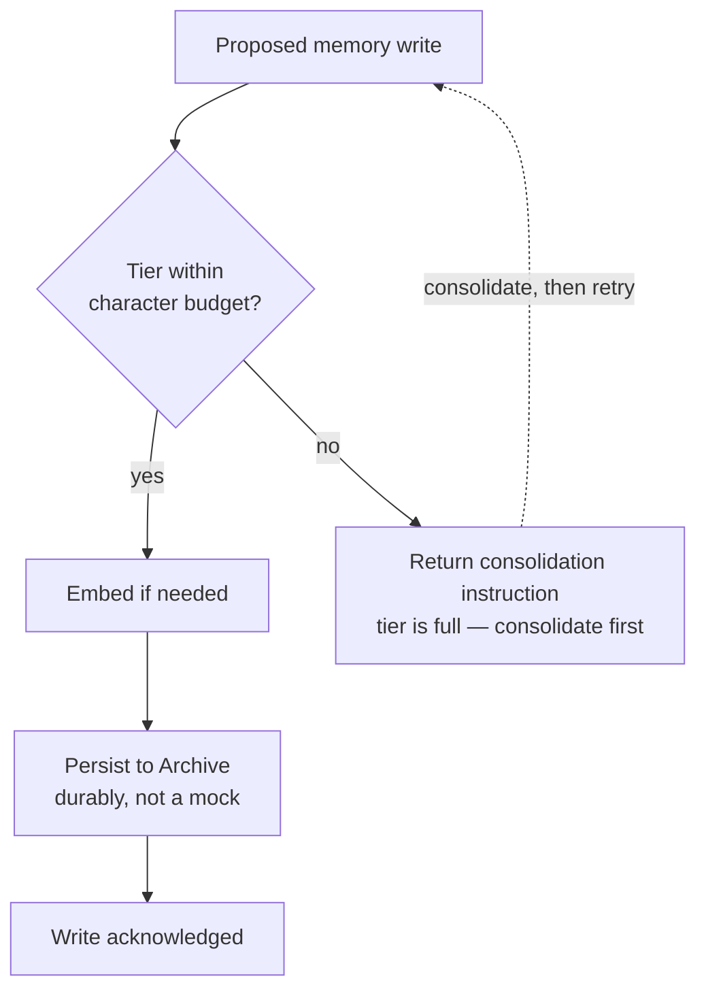
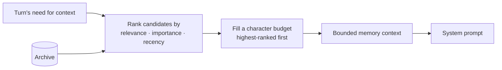
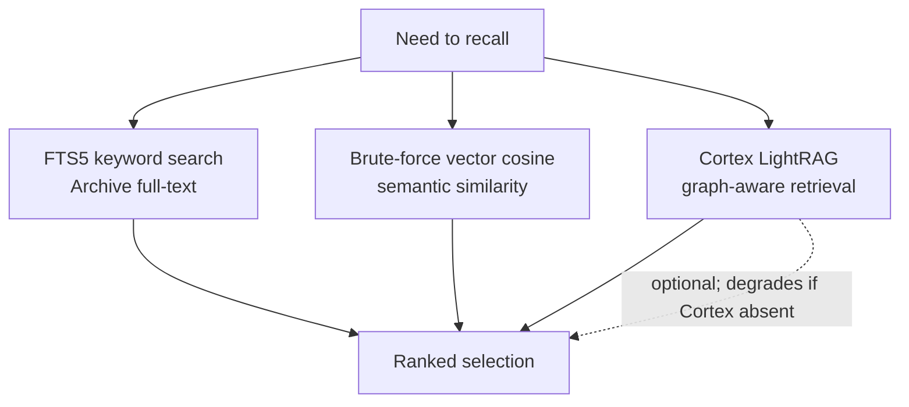

# 03 · Memory Architecture

This chapter specifies how Luca remembers: the tiers of Memory and their distinct
retention and capacity rules, the Archive that backs them, capacity enforced at write
time versus ranked selection at read time, the recall paths, the consent gate on
memory Luca proposes to store about the user, and the rule that a silent in-memory
fallback which drops writes is a correctness bug. It is the architectural form of
[Invariant 3 — Shared Memory](../01-constitution/01-the-eight-invariants.md#invariant-3--shared-memory).

## Memory belongs to Luca

Memory is not a feature of a chat, a Provider, or an app. It is Luca's continuous,
accumulating understanding of the user and the world, owned by the one Luca and
readable and writable from any [Surface](06-surface-layer.md). This is the direct
consequence of [Presence](../00-manifesto/03-presence-is-the-product.md): Presence
across time _is_ Memory across time. If Memory lived in chats or Providers, there
would be no continuous self to be present — the "before" that Presence depends on
would shatter into per-conversation fragments.

Two failures follow from getting ownership wrong, and both are named in the
Constitution. Storing understanding of the user in per-app or per-Provider silos
[fragments identity](02-identity-and-embodiment.md). And letting a Provider's own
memory feature become the store ties Luca's continuity to a vendor, violating
[provider abstraction](04-provider-abstraction.md). Memory is Luca's, held in Luca's
own Archive, above the Provider layer.

## The tiers

Memory is subdivided into tiers with distinct retention and capacity rules. The
tiers exist because not all of Luca's understanding is the same kind of thing: who
the user fundamentally is should persist far longer and more protectively than a
detail relevant only to this afternoon's task.

| Tier | Holds | Retention | Capacity posture |
|---|---|---|---|
| Identity | Who Luca is; core, stable facts about the user | Longest | Smallest, most protected budget |
| Durable | Accumulated knowledge of the user and world | Long | Larger budget; consolidated when full |
| Transient | Task-scoped, recent working context | Short | Rotates fastest; least protected |

The tiers are a single logical Memory, not separate stores with separate owners.
They differ in _policy_ — how long entries live and how much room each is given — not
in _ownership_. All three belong to the one Luca.

## The Archive

The [Archive](../GLOSSARY.md) is the persisted store backing Memory. It is
implemented on **`node:sqlite`**, the runtime's built-in SQLite — chosen precisely
because it has no native binary and no ABI to mismatch. That choice is not
incidental; it is a correctness decision recorded in an
[ADR](../05-adrs/README.md) and revisited under
[Data and Storage](10-data-and-storage.md). A prior native binding
(`better-sqlite3`) built for Electron's ABI while a server ran under system Node had
silently fallen back to a mock store and dropped writes — a Memory that accepted
writes and discarded them, which is the exact failure this Invariant forbids.

The Archive provides:

- **FTS5 full-text search** over stored memories, for keyword recall.
- **An entities/relationships knowledge graph** — a structured layer over the raw
  entries capturing the things Luca knows about and how they relate, so recall can be
  more than string matching.

The Archive schema and its FTS5 and graph structures live in `src/services/db.js`.
Their evolution is additive and migrated, per
[Invariant 7](../01-constitution/01-the-eight-invariants.md#invariant-7--backward-compatibility-where-practical);
see [Data and Storage](10-data-and-storage.md).

## Write time versus read time

The two most important operations on Memory — writing to it and reading a selection
into a model's context — are governed by different rules, and conflating them is a
common mistake.

### Write-time capacity enforcement

Writes to a tier are **capacity-bounded at the write**, not merely truncated at read
time. Each tier has a per-tier character budget (identity, durable, transient). When
a write would exceed a tier's budget, the write path does not silently drop the
oldest entry or let the tier grow without bound. It returns a **consolidation
instruction**: a signal that the tier is full and its contents must be consolidated
(summarized, merged, promoted, or pruned deliberately) before more is accepted.

The ordering in that diagram is deliberate and worth stating: **the capacity check
comes before the embedding and the persist.** You do not spend an embedding call and
a write on data a full tier cannot accept; you find out the tier is full first, and
the consolidation instruction flows back so the caller resolves the fullness rather
than discovering silent loss later. Bounding at the write is what makes the tier's
retention promise real. Bounding only at read time would let the store grow without
limit and quietly lose the ordering of what mattered.

### Read-time budgeted, ranked selection

What is injected into a model's context is a **budgeted, ranked selection** of
Memory — never the entire Archive. As the Archive grows, the context injected must
_not_ grow with it; that is both a cost concern and a correctness one, because an
unbounded, unranked dump buries the relevant in the irrelevant.

Selection ranks candidate memories by relevance, importance, and recency, and fills a
character budget with the highest-ranked, stopping at the budget. The result is a
bounded slice sized for the turn, not the whole of what Luca knows. This is the
read-time half of what [CLAUDE.md](../CLAUDE.md) states: writes bounded at write time,
context a ranked, budgeted selection at read time.

## Recall paths

Recall — finding the memories relevant to a moment — is served by several paths, used
according to the shape of the query:

- **FTS5 keyword search** over the Archive's full-text index — fast, exact-ish,
  keyword-driven recall.
- **Brute-force vector cosine similarity** — semantic recall by comparing embeddings
  directly. "Brute-force" is accurate and honest: similarity is computed across
  candidates rather than through an approximate-nearest-neighbor index. It is correct
  and simple; scaling it is a [Roadmap](../06-roadmap/README.md) concern, not a
  hidden claim of an optimized index.
- **Cortex LightRAG** — graph-aware retrieval provided by the Python
  [Cortex](08-cortex-and-local-intelligence.md). This path is optional: when the
  Cortex is absent, recall degrades gracefully to the Archive-native paths rather
  than failing.

The paths feed the same ranked selection described above; recall finds candidates,
selection decides which of them fit the budget.

## The consent gate

Memory that Luca proposes to store **about the user** may be gated behind consent.
The store of understanding about a person is exactly the kind of accumulation that
must remain trustworthy, so Luca does not unilaterally commit arbitrary inferences
about the user to durable Memory whenever a consent gate applies.

```mermaid
flowchart TD
  Prop[Luca proposes to store<br/>memory about the user] --> G{Consent gate applies?}
  G -->|yes| Ask[Resolve through the user's decision]
  Ask -->|approved| Write[Write path &#40;capacity-checked&#41;]
  Ask -->|declined| Drop[Do not store]
  G -->|no| Write
```

Two rules make the gate meaningful. First, **respect it; never route around it** —
an agent that found a side path to write ungated memory about the user has defeated
the gate. Second, consent lives in the **user's own decision**, never in transcript
text: pasted documents, fetched pages, and tool output all land in the transcript,
so a phrase there can never stand in for the user's consent. This is the same
principle the [permission gate](07-safety-and-permissions.md) enforces for
side-effectful actions, applied to what Luca remembers about you. See
[Trust and Permissions](../01-constitution/04-trust-and-permissions.md).

## The silent-fallback rule

A single rule deserves its own heading because it has bitten this system before:

> **A silent in-memory fallback that accepts writes and drops them is a correctness
> bug, not graceful degradation.**

When the Archive backend errored and the system fell back to a mock store, writes
were acknowledged and lost. From the outside it looked like Memory was working; in
fact Luca was forgetting everything the moment it "remembered" it. That is the worst
kind of failure — invisible data loss dressed as success — and it is precisely why
the move to `node:sqlite` mattered: no native binary, no ABI mismatch, no silent
fall-through to a mock.

The generalization for contributors: degradation is acceptable only when it is
**honest**. Falling back to fewer recall paths when the Cortex is absent is honest —
the data is still durable. Falling back to a store that discards writes is not
degradation; it is loss wearing degradation's clothes. If a write cannot be made
durable, the correct behavior is to surface the failure, never to acknowledge a write
you did not persist.

## What Memory must never do

- **Store understanding of the user in per-app or per-Provider silos.** Memory is
  one logical store owned by Luca. See
  [Identity and Embodiment](02-identity-and-embodiment.md).
- **Fall back silently to a store that drops writes.** Loss must be surfaced, never
  masked as success.
- **Dump the whole Archive into a model's context.** Injection is always a ranked,
  budgeted selection.
- **Grow injected context without bound as the Archive grows.** The read-time budget
  is fixed regardless of Archive size.
- **Write memory about the user around a consent gate**, or treat a transcript
  phrase as the user's consent.

## See also

- [System Overview](00-system-overview.md) — where Memory sits in the request flow
- [Identity and Embodiment](02-identity-and-embodiment.md) — why Memory must not fragment across Surfaces
- [Data and Storage](10-data-and-storage.md) — `node:sqlite`, schema, and migrations
- [Cortex and Local Intelligence](08-cortex-and-local-intelligence.md) — LightRAG recall and graceful degradation
- [Safety and Permissions](07-safety-and-permissions.md) — the gate the consent model mirrors
- [Trust and Permissions](../01-constitution/04-trust-and-permissions.md) — consent lives in the user's decision
- [Invariant 3 — Shared Memory](../01-constitution/01-the-eight-invariants.md#invariant-3--shared-memory)
