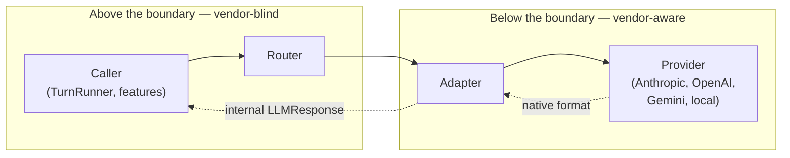
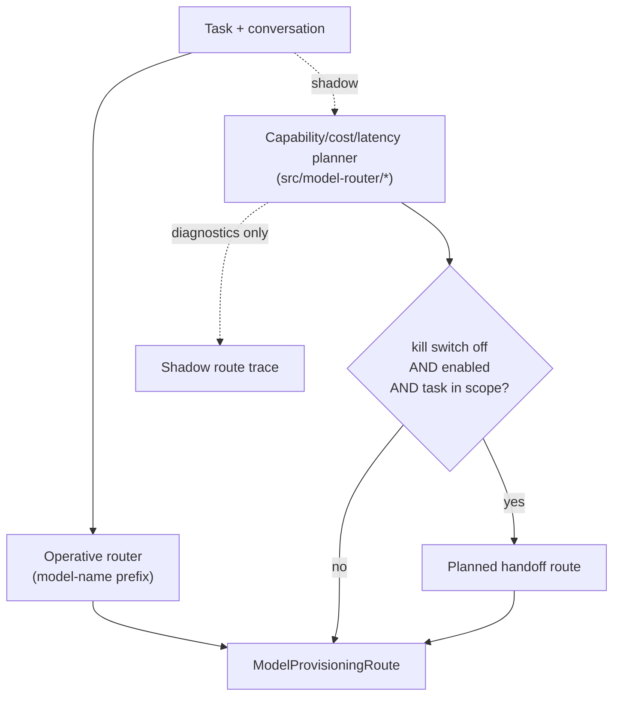

# Provider Abstraction

> How LucaOS keeps Luca's identity and behavior independent of which model
> answers a request. Providers are infrastructure; nothing above the Adapter may
> branch on a vendor.

This chapter specifies [Invariant 4 — Provider Abstraction](../01-constitution/01-the-eight-invariants.md#invariant-4--provider-abstraction).
It describes the single internal representation every model call is normalized
into, the Adapters that translate each vendor's native format into that shape,
the Router that chooses a model without the caller knowing which, and the three
provisioning tiers (managed, BYOK, local). It is honest about which parts of the
routing story are operative today and which run in shadow.

## Why the abstraction exists

Luca is [not a wrapper](../00-manifesto/02-what-luca-is-and-is-not.md). A wrapper
inherits one model's identity, limits, and lock-in; its identity _is_ the model.
Luca's identity is its own, and it must survive a model switch unchanged. That is
only possible if the rest of the system never learns which vendor it is talking
to. The moment a feature branches on `provider === "anthropic"`, Luca's behavior
has become a function of infrastructure, and switching models silently changes
Luca — which means Luca was never one continuous thing.

So the abstraction is not a convenience layer. It is the mechanism that makes
[the one Luca](../00-manifesto/04-the-one-identity-principle.md) possible across
interchangeable [Providers](../GLOSSARY.md). Everything in this chapter serves
that single guarantee: **above the Adapter, there is no vendor.**

## The abstraction boundary

There is exactly one line in the system where vendor knowledge is permitted, and
it is the Adapter. Below it, code speaks a specific Provider's wire format. Above
it, code speaks only LucaOS's internal representation.



A caller hands the Router a task and a conversation; it receives an `LLMResponse`
in the internal shape. It never sees an Anthropic `tool_use` block, an OpenAI
`function_call`, a Gemini `functionCall`, or a local model's raw JSON. Those
exist only inside the `below` region of the diagram. This boundary is the
concrete meaning of the invariant's prohibition on leaking "vendor-specific
tool-call shapes, streaming quirks, or persona above the Adapter."

## The internal representation

Every Provider is expressed through one TypeScript interface,
`LLMProvider` (`src/services/llm/LLMProvider.ts`). The whole system talks to a
model through these four surfaces and nothing else:

```typescript
// Illustrative — the real interface lives in src/services/llm/LLMProvider.ts
export interface LLMProvider {
  name: string;
  generateContent(prompt: string, images?: string[]): Promise<string>;
  chat(
    messages: ChatMessage[],
    images?: string[],
    systemInstruction?: string,
    tools?: unknown[],
  ): Promise<LLMResponse>;
  chatStream(
    messages: ChatMessage[],
    onChunk: (text: string) => void,
    images?: string[],
    systemInstruction?: string,
    tools?: unknown[],
    abortSignal?: AbortSignal,
  ): Promise<LLMResponse>;
  embed?(text: string): Promise<number[]>;
  validateKey(): Promise<{ valid: boolean; message: string }>;
}
```

The two shapes that cross the boundary are equally small:

```typescript
export interface ToolCall {
  name: string;
  args: unknown;
  id?: string; // carries OpenAI/Anthropic call IDs so results map back
}

export interface LLMResponse {
  text: string;
  thought?: string;           // model reasoning, when the vendor exposes it
  thought_signature?: string; // cryptographic signature for tool calls, when present
  toolCalls?: ToolCall[];
}
```

This is the entire vocabulary the system above the Adapter has for a model. A
turn is a list of `ChatMessage`s in, an `LLMResponse` out. A model's decision to
act is a `ToolCall[]` — a name, arguments, and an optional correlation id. The
optional `thought` and `thought_signature` fields exist precisely so that a
vendor that _does_ expose reasoning or signed tool calls can surface it through
the same struct that a vendor that does _not_ leaves empty. The shape does not
grow a vendor-specific branch; it grows an optional field that any Adapter may
populate.

The `id` field is worth dwelling on, because it is where a naive abstraction
leaks. Anthropic and OpenAI correlate a tool result back to its call by an id;
Gemini historically matched by position and name. Rather than expose two calling
conventions upward, the internal `ToolCall` always carries an optional `id`, and
each Adapter is responsible for populating it (or not) and for threading it back
when it formats the tool result for its Provider. The
[Tool layer](05-capability-and-tool-layer.md) that consumes `toolCalls` never
learns which convention was in play.

## Adapters: the only vendor-aware code

Real Adapters exist in `src/services/llm/` for the cloud Providers — Gemini
(the managed default), Anthropic, OpenAI, Grok (xAI), and DeepSeek — and for
local inference: `LocalLLMAdapter` (llama.cpp through the
[Cortex](08-cortex-and-local-intelligence.md), and Ollama) and `WebLLMAdapter`
(in-browser inference). Each Adapter does exactly one job that no other layer is
allowed to do: it translates.

An Adapter takes internal `ChatMessage`s and internal tool declarations, renders
them into its Provider's request format, calls the Provider using **native
function-calling** (never text parsing of a model's prose for a pseudo-tool
syntax), and normalizes whatever comes back — native tool-call objects, streamed
deltas, reasoning traces — into one `LLMResponse`. The `chatStream` variant does
the same while forwarding text chunks to an `onChunk` callback as they arrive, so
a Surface can render tokens live, and it honors an `abortSignal` so a turn can be
cancelled cleanly.

Two consequences follow from concentrating vendor knowledge here:

- **Adding a Provider is additive.** A new vendor means a new file in
  `src/services/llm/` implementing `LLMProvider`, plus a routing entry. No caller
  changes, because callers already speak only the internal representation. This
  is [Invariant 7](../01-constitution/01-the-eight-invariants.md#invariant-7--backward-compatibility-where-practical)
  in practice: the model roster evolves additively.
- **A vendor quirk is contained.** When a Provider changes its streaming format
  or tool-call encoding, the change stops at that Adapter. Nothing above it
  recompiles or re-reasons.

### The rule, stated precisely

> `if (provider === "x")` anywhere above the provider layer is a violation of
> [Invariant 4](../01-constitution/01-the-eight-invariants.md#invariant-4--provider-abstraction).

If you find yourself reading a vendor's field name, catching a vendor's error
type, or shaping a prompt that only one model understands, in any file outside
`src/services/llm/`, you have leaked the boundary. The fix is never a second
branch; it is to move the knowledge down into the Adapter and widen the internal
representation with an optional, vendor-neutral field if genuinely necessary.
Model routing — _which_ model, not _how_ to talk to it — is the Router's job and
lives in the Router, not scattered through feature code.

## The Router

The [Router](../GLOSSARY.md) decides which Provider and model perform a given
task. In LucaOS today it has two layers, and honesty about the split matters.

### The operative router: model-name-prefix routing

The router that actually chooses a Provider at runtime keys on the model name's
prefix. In `ProviderFactory.ts` the resolution is direct:

```typescript
// Illustrative of the operative logic in src/services/llm/ProviderFactory.ts
if (model.startsWith("claude")) return "anthropic";
if (model.startsWith("gpt") || model.startsWith("o1")) return "openai";
if (model.startsWith("grok")) return "xai";
if (model.startsWith("deepseek")) return "deepseek";
if (model.startsWith("llama") || model.startsWith("mixtral")) return "groq";
// model.startsWith("local/") → local runtime (Ollama or internal GGUF)
```

This is deliberately simple and predictable: the selected model name determines
the Adapter, the caller stays vendor-blind, and there is no hidden inference in
the hot path. It satisfies the invariant — the caller asked for a capability and
got an `LLMProvider`, never a vendor — while keeping the operative decision easy
to reason about and test.

### The advisory planner: capability/cost/latency routing in shadow

A richer Router exists in `src/model-router/` (the `providerHub*` modules): a
route planner that scores candidate Providers by capability, cost, latency, and
availability, and can plan a handoff from one route to another. It is real code
with real tests, but it is deliberately **not** wired into the live execution
path by default. It runs in **advisory / shadow mode behind a kill switch.**

The `ProviderFactory` route-decision type records this explicitly. Its diagnostic
fields assert that shadow selection touches no Provider —
`providerApiCalledDuringSelection: false` and
`providerAdapterInstantiatedByHandoffMapper: false` — and its activation is
gated:

- `runtimeRouteSelectionEnabled` must be on **and**
  `runtimeRouteKillSwitchEnabled` must be off for the planner to influence a
  route at all.
- Even then, the default task scope is `chat_only`; other task types
  (`fast_reply`, `long_context`, `code`) still receive shadow diagnostics only
  unless the scope is widened to `all`.

The reason to describe this honestly rather than as a finished feature: the
planner represents the target — routing by capability and cost, not by a naming
convention — while the prefix router represents what safely runs today. This is
exactly the vision/implementation gap the
[README's honesty clause](../README.md#status-and-versioning) requires us to
name. The planner's promotion from shadow to operative is a
[Roadmap](../06-roadmap/README.md) item, guarded by the kill switch until its
shadow traces demonstrate it chooses at least as well as the prefix router.



## Provisioning tiers

Independent of _which_ model is chosen, a route also carries _how_ that model is
provisioned. The `ModelProvisioningRoute` type in `ProviderFactory.ts` names
three tiers:

| Tier | Route kind | What it means |
|---|---|---|
| **Managed (default)** | `LUCA_PRIME` | LucaOS provisions the model on the user's behalf. The default is Gemini, branded **"Luca Prime"** — the model a user gets without configuring anything. |
| **BYOK** | `BYOK` | Bring-your-own-key. The user supplies a Provider API key (`apiKeySource: "user_settings"`), and LucaOS routes through that vendor's Adapter with the user's credentials. |
| **Local** | `LOCAL` | Inference runs on the user's own hardware — `runtime: "ollama"` or `"internal"` (a GGUF model through the Cortex). No request leaves the device. |

The tiers matter to trust as much as to cost. The local tier is what lets a
privacy-sensitive task run without any network egress; the managed tier is what
lets Luca be present for a user who has configured nothing. Crucially, all three
tiers reach the caller through the **same** `LLMProvider` interface. A feature
cannot tell — and must not try to tell — whether the model answering it is Luca
Prime in the cloud or a quantized model on the user's laptop. That
indistinguishability is the invariant doing its job.

## What this buys, and what it costs

The abstraction is not free. One internal representation means the lowest common
denominator is a real constraint: a capability only one vendor exposes has to be
expressed as an optional field that others ignore (as `thought_signature` is), or
it does not cross the boundary at all. That is the correct trade. The alternative
— letting one vendor's unique feature bend the interface into a vendor-shaped
API — reintroduces exactly the branch the invariant forbids and fractures Luca's
continuity across models.

When a genuinely new kind of capability must cross the boundary, the move is to
widen the internal representation deliberately and neutrally, document it, and
teach every Adapter to translate to it — not to special-case the one vendor that
has it today.

## See also

- [Invariant 4 — Provider Abstraction](../01-constitution/01-the-eight-invariants.md#invariant-4--provider-abstraction)
- [What Luca Is and Is Not — Not a wrapper](../00-manifesto/02-what-luca-is-and-is-not.md)
- [Capability and Tool Layer](05-capability-and-tool-layer.md) — the consumer of `toolCalls`
- [Persistent Runtime](01-persistent-runtime.md) — where the turn loop that calls the Router lives
- [Cortex and Local Intelligence](08-cortex-and-local-intelligence.md) — the local provisioning tier
- [Roadmap](../06-roadmap/README.md) — promoting the capability planner from shadow to operative
