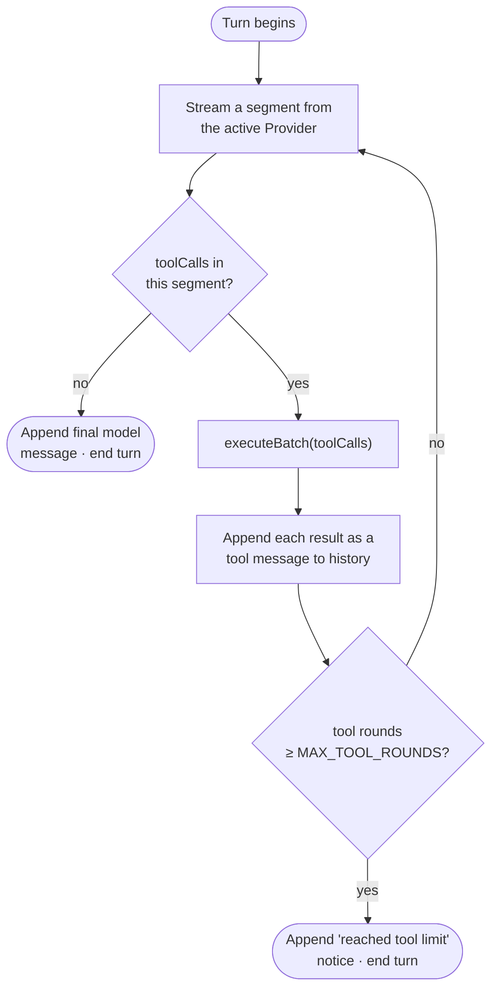
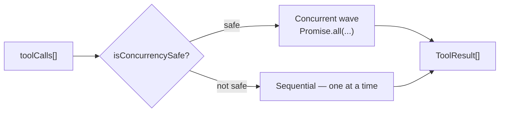

# Capability and Tool Layer

> How Luca acts on and observes the world through Tools, how those Tools are
> declared, dispatched, and secured, and how higher-level Skills sit above them.
> Tools are tools, not destinations.

This chapter specifies the capability layer: the central Tool registry, the
function-call dispatch loop that executes model-requested Tools during a turn,
the distinction between primitive [Tools](../GLOSSARY.md) and learned
[Skills](../GLOSSARY.md), MCP client integration, and where Computer-Use fits. It
depends on [Provider Abstraction](04-provider-abstraction.md) upstream (Tool
calls arrive as internal `ToolCall`s) and feeds
[Safety and Permissions](07-safety-and-permissions.md) downstream (every gated
Tool passes the permission gate before it runs). It is honest about the gap
between how many Tools are _declared_ and how many are actually _live_.

## Tools are tools, not destinations

The manifesto's organizing claim is that
[applications are tools, not destinations](../00-manifesto/02-what-luca-is-and-is-not.md):
the user interacts with Luca, and Luca reaches for an application when a task
needs it. The capability layer is where that claim becomes architecture. A Tool
is a capability Luca can invoke — web search, file I/O, a shell command, browser
control, a message send, a Provider's function. The user does not "open" a Tool.
Luca calls it on the user's behalf, under the permissions the
[Constitution](../01-constitution/04-trust-and-permissions.md) demands, and folds
the result back into a single continuous turn.

This framing has a direct consequence for design: no Tool is allowed to become a
place the user lives. Computer-Use, discussed below, is the sharpest test of that
rule.

## The Tool registry

LucaOS declares roughly **302 Tools** as Google GenAI `FunctionDeclaration`
schemas, organized by category under `src/tools/definitions/` — files such as
`crypto.tools.ts`, `hacking.tools.ts`, `trading.tools.ts`, `communication.tools.ts`,
`network.tools.ts`, `system.tools.ts`, `vision.tools.ts`, and more. A
`FunctionDeclaration` is the vendor-neutral schema — a name, a description, and a
typed parameter shape — that the [Adapter](04-provider-abstraction.md) renders
into each Provider's native function-calling format. Declaring Tools in this one
schema is what keeps the Tool layer above the provider boundary: a Tool is
described once and works through every Adapter.

All declarations register through a central `toolRegistry`
(`src/services/toolRegistry.ts`). Each registered entry is a `ToolEntry`:

```typescript
// Illustrative — the real type lives in src/services/toolRegistry.ts
export interface ToolEntry {
  category: ToolCategory;          // CORE, FILES, NETWORK, HACKING, CRYPTO, ...
  tool: FunctionDeclaration;       // the vendor-neutral schema
  keywords: string[];              // for capability search / JIT selection
  securityLevel: SecurityLevel;    // 0 none → 3 dual  (see chapter 07)
  missionScope: MissionScope;      // FILE / FINANCE / SOCIAL / SYSTEM / ...
  isConcurrencySafe: boolean;      // may this run in a parallel wave?
  skillSets?: string[];            // capability bundles this Tool belongs to
  handler?: (args: unknown, context: unknown) => Promise<string>;
}
```

The registry is the single place that knows a Tool's schema, its security
posture, whether it can run concurrently, and — if one exists — the handler that
actually performs it. Registration also derives a `securityLevel` and
`missionScope` for every Tool by a fixed precedence: an explicit per-Tool config
wins; otherwise a **category security floor** applies; otherwise the Tool
defaults to the lowest level. That precedence is the subject of
[Safety and Permissions](07-safety-and-permissions.md#category-security-floors)
and is only summarized here.

### The honest reality: declared is not live

The `handler` field is optional, and that optionality is load-bearing honesty. A
large number of the ~302 declared Tools are **schemas without live handlers** —
Luca can describe the capability to a model, but no code yet performs it end to
end. This is the [two-generation](../06-roadmap/README.md) shape the
[CLAUDE.md operating instructions](../CLAUDE.md) warn about: never infer that a
capability works from the fact that it is declared, or that a module works from
the fact that it is well-tested. Before trusting a Tool, confirm it has a handler
and that a live path invokes it.

The Foundation states the target — a Tool declared is a Tool that works, gated
and provenanced — while the codebase is honest that many declarations are ahead
of their handlers. Closing that gap, category by category, is roadmap work, not a
thing to paper over in prose.

## The function-call dispatch loop

A turn is driven by the [Runtime's](01-persistent-runtime.md) turn loop
(`src/services/turns/TurnRunner.ts`), which exists in a streaming and a
non-streaming variant. Both follow the same shape: stream from the active
Provider, collect any Tool calls the model emits during the segment, execute them
after the segment in concurrency-safe batches, feed the results back into the
conversation, and repeat until the model stops calling Tools — bounded by a
shared cap.



Two properties of this loop matter.

**It is bounded.** Both variants share a `MAX_TOOL_ROUNDS` cap (10). When the cap
is reached, the turn does not loop forever chewing through Tool calls; it appends
an explicit notice ("reached the tool limit for a single turn") and closes the
turn with a model message so history never ends on a dangling tool result that
the next turn would resume mid-exchange. An uncapped agentic loop is a known
failure class — a model that keeps calling Tools indefinitely — and the cap is
the backstop against it.

**Execution is concurrency-safe by construction.** The executor
(`streamingToolExecutor.ts`) does not simply fire every Tool call in parallel. It
groups the batch into waves using each Tool's `isConcurrencySafe` flag:

- Tools marked concurrency-safe run together in a concurrent wave
  (`Promise.all`).
- A Tool that is _not_ concurrency-safe runs alone, sequentially, so it cannot
  interleave with another side-effecting operation.



This is what "execute in concurrency-safe batches" means concretely: read-only
searches can fan out and finish fast, while a write to the filesystem or a shell
command is serialized so two side effects never race. The default when a Tool is
not explicitly marked is _not_ safe — omission fails toward serialization, the
conservative direction.

## Tools versus Skills

The Glossary draws the line: **Tools are primitive verbs; Skills are learned
competencies.** A Tool does one bounded thing — read a file, send a message,
fetch a URL. A [Skill](../GLOSSARY.md) is a higher-level, reusable procedure Luca
can acquire, improve, and invoke — a competence composed from Tools and judgment,
not a single call.

In the current implementation the seam between the two appears as **skill sets**:
registration tags each Tool into capability bundles (`skillSets` on `ToolEntry`,
derived by an `inferSkillSets` step) such as `FINANCE`, `CORE_FILES`,
`SYSTEM_ADMIN`, `COMMUNICATION`, and `AGENCY_EVOLUTION`. These bundles are how
Luca selects a relevant slice of the ~302 Tools for a given task rather than
presenting all of them to the model at once — just-in-time capability selection.
The bundles are the scaffolding on which richer, learned Skills are meant to sit;
the full Skill lifecycle (acquire, evaluate, improve) is a target the
[Roadmap](../06-roadmap/README.md) carries, and the Foundation should not
describe it as finished. What is real today is the registry, the categories, and
the skill-set tagging that groups Tools into competencies.

### Two senses of "Skill" — disambiguated

The word **Skill** carries two distinct meanings across LucaOS, and conflating
them causes real confusion (see the [Crosswalk](../CROSSWALK.md#term-collision-resolutions)).
This chapter uses the first sense as primary and names the second where it applies:

| Sense | Meaning | Where it lives |
|---|---|---|
| **Skill** (learned competency) | An emergent, higher-level competence Luca acquires and improves — the Glossary sense above, contrasted with a primitive Tool. | This chapter; the `skillSets` bundles. |
| **Skill** (contracted unit) | An installable/imported unit with a **contract + sandbox** — a packaged capability with declared permissions, tools, prompts, and a risk level, governed by the [Skills Runtime](../CROSSWALK.md#subsystem-crosswalk). | `docs/skills/SKILLS_RUNTIME_SPEC.md`; code `src/services/skills/`. |

The rest of this section is about the second sense: the runtime that governs how a
packaged, contracted Skill is imported, sandboxed, and gated.

## The Skills Runtime

The generic "capability / tool layer" this chapter describes maps, in the product
and code, to the **Skills Runtime** (crosswalk: generic Tool/capability layer ↔
[Skills Runtime](../CROSSWALK.md#subsystem-crosswalk), code `toolRegistry` +
`src/services/skills/`). Its job is to give Luca-native skills, MCP tools,
plugins, and imported third-party skill formats **one execution and policy
substrate** rather than a separate trust story per source. Everything an external
source contributes normalizes into the same contract and passes the same gates.

### The normalized Skill Contract

Whatever the source — a native skill, an MCP server, an imported plugin — the
Skills Runtime normalizes it to a single **Skill Contract** so the registry, the
dispatch loop, and [Luca Guard](07-safety-and-permissions.md#the-subsystem-luca-guard)
can reason about all skills uniformly:

```typescript
// Illustrative — the normalized shape; see docs/skills/SKILLS_RUNTIME_SPEC.md
interface SkillContract {
  id: string;                 // stable identifier
  source: SkillSource;        // native | mcp | plugin | imported
  permissions: string[];      // the permission scopes it requests
  tools: string[];            // the Tools it may invoke
  prompts?: string[];         // prompt fragments it contributes
  memory_policy: MemoryPolicy;// how it may read/write Memory
  risk_level: RiskClass;      // safe | sensitive | dangerous (see chapter 07)
  sandbox: SandboxPolicy;     // where and how tightly it executes
  version: string;            // versioned; updates support rollback
}
```

The contract is what makes an imported capability governable: it declares, up
front and in one shape, what the skill wants (`permissions`, `tools`), how risky
it is (`risk_level`), and where it is allowed to run (`sandbox`). A source that
declines to declare does not thereby escape the model — an undeclared or
untrusted skill falls to the most constrained defaults, not the least.

### Sandboxing and trust-tier gating for third-party skills and MCP

Imported skills and plugins are **untrusted by default**. The Skills Runtime's
rules follow directly from that stance and tie into
[Luca Guard](07-safety-and-permissions.md#the-subsystem-luca-guard):

- **All skill execution is permission-scoped.** A skill runs with exactly the
  scopes its contract declares and Luca Guard grants — least privilege, not
  ambient authority.
- **Sensitive and untrusted skills run sandboxed.** A skill whose `risk_level` is
  sensitive or dangerous, or whose asset trust tier is Untrusted, executes inside
  a sandbox boundary rather than against the live Host.
- **Signature and trust-tier gating decides what a skill is allowed before it
  runs.** Third-party skills and MCP servers are checked against Luca Guard's
  **signature/trust verification** and placed in an
  [asset trust tier](07-safety-and-permissions.md#risk-classes-and-asset-trust-tiers)
  (Trusted / Verified / Untrusted). A signed, policy-compliant external asset can
  reach Verified; an unsigned or unknown one stays Untrusted and sandbox-only.
- **Invocations are logged.** Skill invocations are recorded into the mission/audit
  channels (see [Observability and Provenance](11-observability-and-provenance.md)),
  so a third-party skill's actions are as auditable as a built-in Tool's.
- **Updates are versioned and rollback-capable.** The contract's `version` lets a
  skill update be rolled back rather than trusted blindly.

This is the same principle the [MCP client integration](#mcp-client-integration)
section states — an external source cannot smuggle in an ungated capability —
made explicit as a trust model: gating is applied by contract, signature, and
trust tier at registration, never by trusting the source. Refinements to a
skill's own behavior, where they touch Luca's code, are further bounded by the
guarded-evolution boundary (Origin-only, sandboxed, rollback-required), which the
Skills Runtime spec and Luca Guard share.

## MCP client integration

LucaOS is a functional **Model Context Protocol client**
(`src/services/mcpClientManager.js`), which means external MCP servers can expose
their own Tools into Luca's registry. Two transports are supported, matching the
MCP SDK:

- **stdio** — a local server launched as a subprocess, spoken to over standard
  in/out. Used for tools that run on the same machine.
- **SSE** — a server reached over HTTP with server-sent events. Used for remote
  or networked MCP servers; an `http://` or `https://` identifier is treated as
  SSE.

An MCP-provided Tool is not a privileged special case. Once discovered, it flows
through the same registry, the same dispatch loop, and — critically — the same
security model as a built-in Tool. An external server cannot smuggle in an
ungated capability, because gating is applied at registration by category floor
and per-Tool config, not by trusting the source.

## Computer-Use is one Tool among many

[Computer-Use](../GLOSSARY.md) — operating a graphical computer as a human would,
through screen, mouse, and keyboard — is present in LucaOS (via the computer and
native-control services) as **one interchangeable Tool among many, not the
product.** This is a deliberate stance. It would be easy to let a capability this
visible become the thing Luca _is_ — a screen-driving robot the user watches. The
manifesto's test forbids it: anything that turns Luca into a destination the user
opens is drifting away from Presence.

So Computer-Use registers like any other Tool, carries a security level and
mission scope like any other Tool, and is dispatched through the same loop like
any other Tool. Luca reaches for it when a task genuinely requires driving a GUI,
and reaches for a narrower, safer Tool when one exists. It is a verb in Luca's
vocabulary, not Luca's identity.

## The security model, in brief

Every Tool carries a `SecurityLevel` (0 none → 3 dual) and a `MissionScope`, and
dangerous categories carry a **security floor** so that a Tool cannot register
ungated merely because someone forgot a config entry. That floor-plus-scope model
is the whole subject of [Safety and Permissions](07-safety-and-permissions.md);
here it is enough to state the boundary: the Tool layer _declares and dispatches_
capabilities, and the safety layer _decides whether each dispatch is allowed to
proceed_. The dispatch loop does not run a gated Tool until the gate resolves,
and the gate resolves on an operator decision, never on anything in the
transcript.

## See also

- [Safety and Permissions](07-safety-and-permissions.md) — Luca Guard: the gate, risk classes, asset trust tiers, and signature verification every Skill and Tool passes
- [Crosswalk — Skills Runtime](../CROSSWALK.md#subsystem-crosswalk) — the generic capability layer ↔ Skills Runtime mapping, and the two senses of "Skill"
- [Provider Abstraction](04-provider-abstraction.md) — where `ToolCall`s come from and go back
- [Persistent Runtime](01-persistent-runtime.md) — the turn loop that hosts the dispatch loop
- [What Luca Is and Is Not](../00-manifesto/02-what-luca-is-and-is-not.md) — tools, not destinations
- [Invariant 6 — Strong Typing and Modularity](../01-constitution/01-the-eight-invariants.md#invariant-6--strong-typing-and-modularity) — why the dispatch loop must not become a god-module
- [Roadmap](../06-roadmap/README.md) — closing the declared-vs-live Tool gap and the Skill lifecycle
