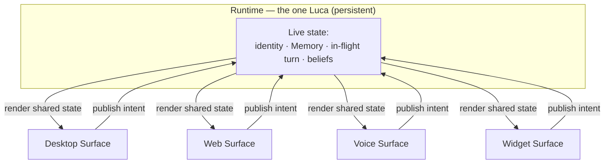
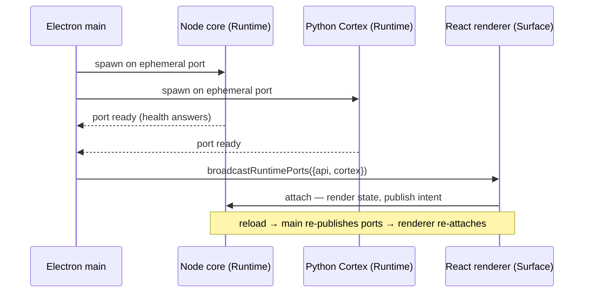

# Surface Layer

> How Luca meets the user across desktop, web, voice, widget, mobile, and
> eventually XR and robotics — as embodiments of one identity, never separate
> apps. A Surface renders shared live state and publishes intent; it never owns
> identity or Memory.

This chapter specifies [Invariant 5 — Cross-Surface Continuity](../01-constitution/01-the-eight-invariants.md#invariant-5--cross-surface-continuity)
and the [Surface](../GLOSSARY.md) half of
[Invariant 1 — One Luca Identity](../01-constitution/01-the-eight-invariants.md#invariant-1--one-luca-identity).
It defines what a Surface is, the attach/detach model that binds a Surface to the
[Runtime](01-persistent-runtime.md), the sharp line between what a Surface may
legitimately own and what it must never own, the renderer↔runtime boundary as it
exists in the Electron host today, and voice as a first-class Surface.

## A Surface is an embodiment, not an app

A [Host](../GLOSSARY.md) is a device that gives Luca a body: desktop, phone,
watch, browser, vehicle, headset, robot. A **Surface** is the interaction
modality through which a user meets Luca on that Host — the desktop app, the web
app, the voice interface, the widget, the mobile app, an XR view. The manifesto's
[One Identity Principle](../00-manifesto/04-the-one-identity-principle.md) is
categorical about what that means: these are **embodiments of the same Luca**, not
separate applications that happen to share a brand.

The distinction is not cosmetic. A separate application has its own source of
truth — its own session, its own memory, its own notion of "the current
context." The moment a Surface acquires those, there are two Lucas, and the
[whole edifice fragments back into the application era](../00-manifesto/02-what-luca-is-and-is-not.md).
So the defining property of a Surface is subtractive: it is what remains of an
app after you remove its identity and its memory and hand both to the Runtime.

## The attach/detach model

A Surface relates to Luca through two verbs: it **attaches** to the Runtime to
render Luca's live state, and it **detaches** when it closes — leaving Luca
running. Between attach and detach it does two things and only two things:

1. **Renders shared live state.** Whatever Luca currently is — the conversation
   in flight, the Memory context, the beliefs and intentions, the pending
   permission request — the Surface displays. It is a view onto state it does not
   own.
2. **Publishes user intent.** A keystroke, an utterance, a button press becomes an
   intent published _to_ the Runtime. The Surface does not resolve the intent
   itself; it hands it to the one Luca and renders whatever comes back.

The lifecycle asymmetry is the point. Killing a Surface must not kill Luca; that
is the [Runtime's job](01-persistent-runtime.md), and it is what makes
[Presence](../00-manifesto/03-presence-is-the-product.md) — a "before" and an
"after" — possible. Closing the desktop window detaches a Surface; Luca keeps
running, keeps its Memory, keeps any in-flight work, and is there, unchanged, when
the user attaches again from the same Host or a different one. Continuity is
[singularity made observable](../01-constitution/01-the-eight-invariants.md#invariant-5--cross-surface-continuity):
one identity across devices is only _experienced_ if the state actually flows,
and it flows because every Surface reads and writes the same live state rather
than a local copy.

## What is legitimately Surface-local, and what is not

Not everything is shared. A Surface is a real piece of software with real local
concerns, and pretending otherwise produces a slow, chatty system that round-trips
the Runtime for a scroll position. The line is drawn by a single question: **if
the user moved to another Host mid-task, would they expect this to come with
them?**

| Legitimately Surface-local | Must be shared (owned by Luca) |
|---|---|
| View state — scroll position, which panel is open, theme | Identity — who Luca is, across every Surface |
| Input focus and cursor | [Memory](03-memory-architecture.md) and its Archive |
| Rendering, layout, animation timing | In-flight intention and turn state |
| Draft text not yet published as intent | Beliefs/desires/intentions the cognition layer forms |
| Device-specific input handling (mic gain, touch) | Pending permission requests and their resolution |

The failure mode to catch in review is a piece of state that _looks_ local but is
actually Luca's — a "current conversation" cached in a renderer, a memory read
kept "just for this Surface," a decision made and stored on one Surface that
another can never see. Invariant 5 names these directly: state changes on one
Surface that another can never observe, or ambiguity about whether a piece of
state is "the Surface's" or "Luca's." When in doubt, it is Luca's, and it belongs
in the Runtime.

## The renderer↔runtime boundary today

The canonical target is many Surfaces attaching to one Runtime over a shared
protocol. The primary Host today is an **Electron desktop app**, and it already
embodies the attach/detach shape, if in a single-Host form.

The Electron main process (`platforms/electron/main.cjs`) spawns the two backends
that together constitute the Runtime: a Node **core server** and the Python
**[Cortex](08-cortex-and-local-intelligence.md)**. Both bind **ephemeral
localhost ports** rather than fixed ones. The main process then **publishes those
ports to the renderer** (`broadcastRuntimePorts`, sending `{ api, cortex }`), and
re-publishes them on every load and reload — so the renderer, which is the
Surface, always knows where to attach even across a refresh.

The renderer itself is a React/Vite application (~1,970 TypeScript/TSX files under
`src/`). It is large, but its role in the architecture is the modest one every
Surface has: render the Runtime's state and publish intent to it. The identity,
the Memory, the turn loop, and the cognition all live in the spawned Runtime, not
the renderer. When the window closes, the renderer dies; the core and Cortex keep
running as the persistent Luca.

Two decisions on this boundary are worth naming because they protect the
invariant:

- **Ephemeral ports plus a single-instance lock.** Ephemeral ports removed an
  accidental guard (a fixed port would refuse a second bind), so two full stacks
  could otherwise run — two Runtimes, two writers on one SQLite Archive, two
  Lucas. A single-instance lock restores the guarantee that one Host runs one
  Runtime. This is [Invariant 1](../01-constitution/01-the-eight-invariants.md#invariant-1--one-luca-identity)
  defended at the process level and is recorded in an [ADR](../05-adrs/README.md).
- **Fast-listen boot.** The core answers `/api/health` before its heavy route
  graph finishes loading, so the port binds and the Surface can attach within
  about a second of spawn — rather than the Surface timing out and degrading to a
  stateless mode, which would silently break continuity. Time-to-Presence is a
  first-class concern of the [Runtime](01-persistent-runtime.md).

The web, mobile, and XR Surfaces are the same shape generalized: a renderer that
attaches to the Runtime over a published, versioned protocol rather than an
in-process one. Extending the attach model from one Host to many devices — so a
user can attach from a phone to the same live Luca and continue mid-task — is the
work of [Continuity and Sync](09-continuity-and-sync.md) ("Luca Link") and is
carried on the [Roadmap](../06-roadmap/README.md). The desktop Host is the proof
of the model; the cross-device generalization is in progress, and the Foundation
says so plainly.

## Voice is a first-class Surface

Voice is not a feature bolted onto the desktop app; it is a Surface in its own
right, with the same standing as the screen. The desktop Host presents a voice
Surface (the voice HUD and its runtime), and the [Cortex](08-cortex-and-local-intelligence.md)
supplies the modality's pieces — Whisper speech-to-text, Piper/Kokoro
text-to-speech — so that a spoken utterance becomes published intent and Luca's
response becomes rendered speech, through the very same Runtime state the screen
renders.

Treating voice as first-class has a design consequence the
[Design System](../03-design-system/README.md) carries: an utterance and a
keystroke are both just intent published to the one Luca, and a spoken answer and
a rendered message are both just Luca's state made perceivable. The user can
speak on one Surface and read the continuation on another, because neither Surface
owns the conversation — Luca does. Voice is also where the "available without
being summoned" quality of [Presence](../00-manifesto/03-presence-is-the-product.md)
is most tangible: a Surface that listens is a Surface that can let Luca be present
before it is opened.

## Adding a Surface

Because a Surface owns no identity and no Memory, adding one is bounded work: it
attaches to the Runtime, renders the shared state it needs, and publishes intent.
The checklist that keeps a new Surface honest is the inverse of the failure modes
above:

- It reads Luca's state from the Runtime; it does not cache identity or Memory
  locally as a source of truth.
- Its local state is confined to the left column of the table — view, focus,
  rendering — and nothing in the right column leaks into it.
- A change it makes to shared state is visible to every other attached Surface,
  with no manual "sync" step.
- Detaching it leaves Luca alive and its state intact.

A Surface that can answer all four is an embodiment of the one Luca. A Surface
that cannot is a second app wearing Luca's name, and it fails the invariant.

## See also

- [Invariant 5 — Cross-Surface Continuity](../01-constitution/01-the-eight-invariants.md#invariant-5--cross-surface-continuity)
- [Invariant 1 — One Luca Identity](../01-constitution/01-the-eight-invariants.md#invariant-1--one-luca-identity)
- [Persistent Runtime](01-persistent-runtime.md) — the state Surfaces attach to
- [Continuity and Sync](09-continuity-and-sync.md) — extending attach across devices ("Luca Link")
- [Cortex and Local Intelligence](08-cortex-and-local-intelligence.md) — the voice modality's engine
- [Presence Is the Product](../00-manifesto/03-presence-is-the-product.md) — why detaching must not end Luca
- [Design System — Surface Guidelines](../03-design-system/05-surface-guidelines.md)
