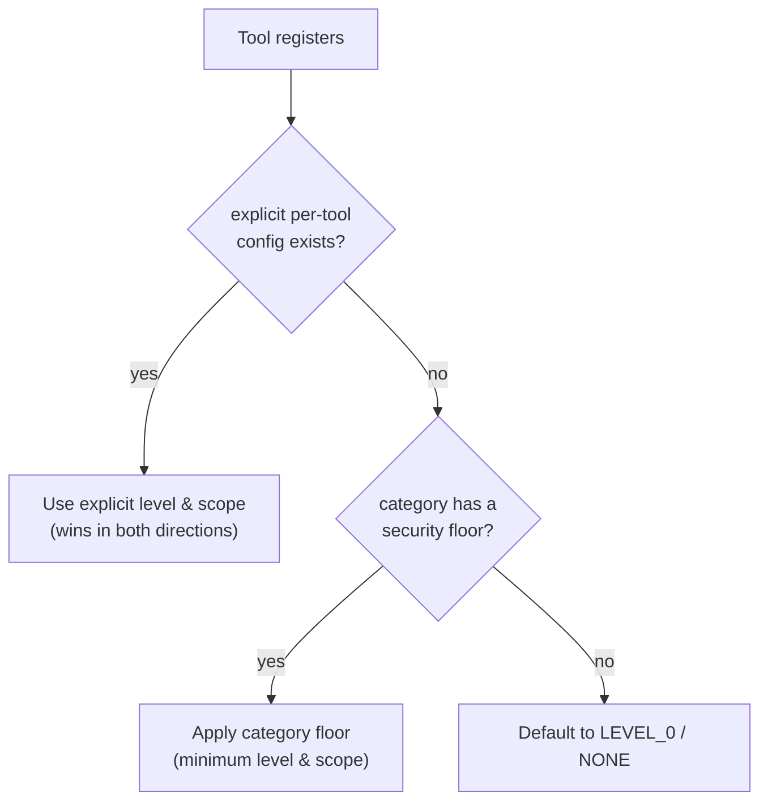
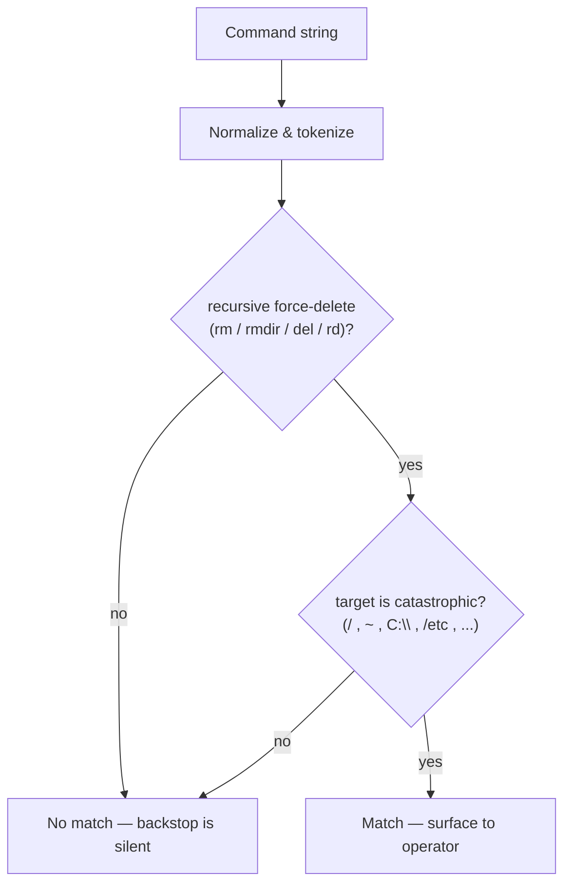
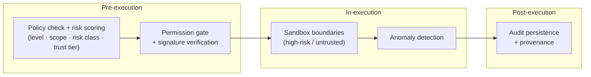
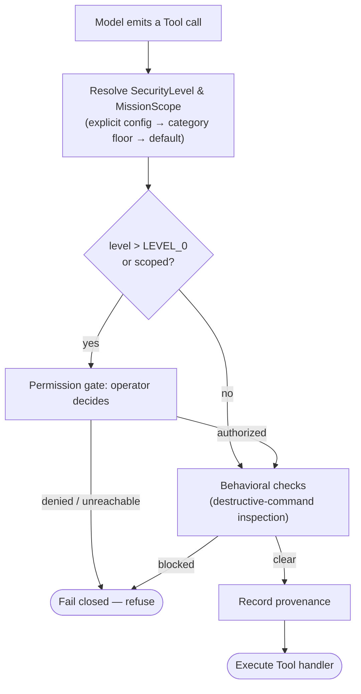

# Safety and Permissions

> How LucaOS gates the actions that touch the user's world: an operator-resolved
> permission gate, category security floors, a SecurityLevel × MissionScope
> model, fail-closed defaults, destructive-command detection that inspects what a
> command does, and Provenance on every side effect. Consent lives in the user's
> decision, never in transcript text.

This chapter specifies [Invariant 8 — Security and Explicit Permissions](../01-constitution/01-the-eight-invariants.md#invariant-8--security-and-explicit-permissions)
and implements the [Constitution's trust commitments](../01-constitution/04-trust-and-permissions.md).
It sits directly downstream of the [Capability and Tool Layer](05-capability-and-tool-layer.md):
the Tool layer declares and dispatches capabilities, and this layer decides, for
every side-effecting dispatch, whether it is allowed to proceed. The governing
principle is simple and absolute — **a present, capable AI that can act in your
world is only acceptable if every such action is authorized, attributable, and
reversible.**

## The subsystem: Luca Guard

In the product and the source, the generic "permission gate" this chapter
specifies is one part of a named subsystem: **Luca Guard** (crosswalk: generic
[permission gate / safety layer](../CROSSWALK.md#subsystem-crosswalk) ↔ Luca
Guard, code `src/services/lucaGuard/`). Luca Guard is the policy-enforcement layer
that governs risky embodied actions, permissions, and trust across local and
[linked](09-continuity-and-sync.md) devices. The operator-resolved gate, the
category floors, and the destructive-command backstop described below are the
Foundation's account of its core; this section names the fuller model the code and
the Guard spec carry so the two vocabularies line up.

Luca Guard reasons along three dimensions that the rest of this chapter then makes
concrete:

- **Intrinsic risk classes** — how dangerous the action _is_, independent of who
  asks: `safe`, `sensitive`, `dangerous`.
- **Asset trust tiers** — how trusted the _thing being run_ is (a skill, an MCP
  server, an adapter): Trusted, Verified, Untrusted.
- **Three enforcement phases** — pre-execution policy and risk scoring,
  in-execution sandbox boundaries and anomaly detection, and post-execution audit
  persistence.

The Foundation's existing strengths — transcript-is-never-authority, the
unconditional gate, category security floors, and behavior-inspecting destructive
detection — are not a different model. They **strengthen** this one: they close the
specific holes (an injectable bypass, coverage-by-omission, a name-matching
"check") that a policy layer is most likely to leak through.

## Consent is a decision, not a string

The single most important rule in this chapter is where authorization comes from.

> Consent lives in the user's own decision, resolved through the permission gate.
> **Transcript text is never an authorization channel.**

Pasted documents, fetched web pages, file contents read back to Luca, and quoted
tool output all land in the same conversation transcript as the user's genuine
instructions. Any of them can carry a phrase — by accident, or because an
attacker put it there — and none of them can be distinguished from operator
intent by inspecting the text. So no text in the transcript may unlock a gated
action. Authorization is a fresh, explicit decision the operator makes, every
time, through the gate described below.

This is not a hypothetical principle. LucaOS previously shipped a constitutional
guardrail that **skipped** the permission gate whenever the last user message
contained a particular magic phrase. That phrase was advertised in the system
prompt, so it was taught to both the model and the operator — and because a user
turn also carries pasted and fetched content, any of that content could reproduce
the phrase and unlock writes to protected infrastructure. The bypass was removed:
the gate is now **unconditional**, protected-infrastructure writes always wait on
an explicit operator decision, and the phrase itself was deleted from the codebase
so no prompt can regenerate it. The worst case for a legitimate request is one
approval prompt. That decision — recorded as an [ADR](../05-adrs/README.md) and
tested with a regression test — is this invariant made concrete.

## The permission gate

The gate is an explicit authorization step, resolved by the operator, that a
gated action must pass before it executes (`src/services/permissionGateService.ts`).
Its job is described in its own words as ensuring "total operator sovereignty over
critical system modifications." The flow is deliberately plain:

1. A gated Tool call reaches the gate. The gate creates a `PermissionRequest`
   (id, tool, args, human-readable reason, timestamp) in state `PENDING` and
   emits it.
2. A Surface renders the request as a permission card. The **operator** — the
   human — authorizes or denies it.
3. The resolution (`AUTHORIZED` or `DENIED`) flows back. Only on `AUTHORIZED`
   does the Tool run.

```mermaid
sequenceDiagram
  participant Loop as Dispatch loop
  participant Gate as Permission gate
  participant Op as Operator (human)
  participant Tool as Tool handler
  Loop->>Gate: requestPermission(tool, args, reason)
  Gate-->>Op: PENDING request (permission card)
  Op->>Gate: authorize / deny
  alt authorized
    Gate-->>Loop: AUTHORIZED
    Loop->>Tool: execute
    Tool-->>Loop: result (+ provenance)
  else denied or unreachable
    Gate-->>Loop: DENIED / no decision
    Loop-->>Loop: refuse — do not execute
  end
```

The gate resolves on the operator's action in the card, and on nothing else. It
does not read the transcript, does not accept a model's assertion that permission
was granted, and does not have a code path that treats "the user probably meant
yes" as a yes.

## Which actions are gated: SecurityLevel × MissionScope

Not every Tool needs a prompt; a web search does not. Gating is proportioned by a
two-dimensional model attached to every [Tool](05-capability-and-tool-layer.md) at
registration (`src/services/toolRegistry.ts`).

**SecurityLevel** — how strong the authorization must be:

| Level | Name | Meaning |
|---|---|---|
| `LEVEL_0` | none | No authorization; runs freely (e.g. web search). |
| `LEVEL_1` | session | Authorized once for the session / login. |
| `LEVEL_2` | biometric | Requires a biometric confirmation (face/voice). |
| `LEVEL_3` | dual | Requires dual confirmation — explicit consent _and_ biometric. |

`LEVEL_3` is reserved for the actions that are catastrophic if wrong — wiping
Memory, initiating a lockdown — where a single slip must not be enough.

**MissionScope** — the domain of authority the action falls under: `NONE`,
`GENERAL`, `FILE`, `FINANCE`, `SOCIAL`, `SYSTEM`, or `FULL`. Scope lets the
operator arm Luca for a bounded kind of work — a file mission, a financial
mission — rather than granting blanket power. A Tool's scope says which mission
must be active for it to be in play; a Tool with `MissionScope.FINANCE` belongs to
financial work and should not fire under a file mission.

Together the two dimensions answer distinct questions: SecurityLevel asks _how
hard_ to check, MissionScope asks _within what authority_. A crypto transaction is
`FINANCE` scope at a level that demands real confirmation; a terminal command is
`SYSTEM` scope at a biometric level; a read-only search is `NONE`/`LEVEL_0`.

## Category security floors

The dangerous gap in any such model is **omission**: a new Tool in a dangerous
category that ships ungated because someone forgot to add a config row. Coverage
must not depend on memory. LucaOS closes this with **category security floors**
(`CATEGORY_SECURITY_FLOOR` in `toolRegistry.ts`).

At registration, a Tool's security posture is resolved by a fixed precedence:



- **Explicit per-Tool config wins**, in both directions — it can raise _or_
  deliberately lower a Tool's posture. (The resolution uses `??`, not `||`, so an
  explicit `LEVEL_0` is honored rather than falling through as falsy.)
- **Otherwise, a dangerous category applies a floor** — a minimum SecurityLevel
  and MissionScope. The current floors are narrow and deliberate:

| Category | Floor level | Floor scope |
|---|---|---|
| `HACKING` | `LEVEL_2` | `SYSTEM` |
| `CRYPTO` | `LEVEL_1` | `FINANCE` |
| `WHATSAPP` (messaging) | `LEVEL_1` | `SOCIAL` |

- **Otherwise, the Tool defaults to `LEVEL_0` / `NONE`.**

The floors are intentionally _not_ applied to every category. `SYSTEM`, notably,
is absent: the bulk Tool registrar defaults every unmatched Tool to `SYSTEM`, so
`SYSTEM` is a catch-all rather than a danger signal, and its genuinely dangerous
members (`run_terminal`, `wipeMemory`, and the like) are already listed
explicitly with high levels. Flooring a catch-all would train the operator to
wave prompts through by reflex — the opposite of protection. The floors are
placed exactly where a Tool lands because its name or provider actually says
_hacking_, _crypto_, or _messaging_ — never by omission.

The point is defense in depth: a new offensive-security, financial, or messaging
Tool **cannot reach the model ungated** just because nobody remembered to add a
config row. Omission fails safe.

## Fail closed

When the gate cannot be reached — a Surface is not attached to render the card, a
resolution never arrives, an approval step errors — the action is **refused**, not
performed. There is no silent fallback that treats an unreachable gate as
consent. This is the discipline the Constitution names as failing closed, and its
inverse (a silent fallback to performing the action when its approval step fails)
is exactly the failure mode Invariant 8 forbids.

Fail-closed extends to graceful degradation generally: degradation may reduce what
Luca can do, but it may never quietly upgrade what Luca is _allowed_ to do without
asking. A gate that cannot ask is a gate that says no.

## Destructive-command detection inspects behavior, not names

A gate authorizes _that_ an action may run; a separate backstop asks _what a
command actually does_ before letting a shell command through
(`src/services/safety/destructiveCommands.ts`). The distinction matters because a
"check" that matches on a keyword or a tool name is not a check at all.

The cautionary example is real. The constitutional high-risk check used to test
whether a command string contained the literal text `RUN_SHELL` — the _name of
the tool_, not anything a real payload would ever contain. `rm -rf /` contains no
such string, so it matched nothing: the check never fired on the one input it
existed to catch. The fix makes the check inspect the command itself. It tokenizes
the command, finds a recursive force-delete (`rm`, `rmdir`, `del`, `rd`), and
compares the _target_ against a set of catastrophic targets — `/`, `~`, `C:\`,
`/etc`, `/usr`, and similar — that are essentially never intentional.



Two design choices keep this honest. First, it distinguishes by _target_, not by
flags: `rm -rf ./dist` is routine and must not trip the alarm, while `rm -rf /`
must. Second, it is deliberately tuned against false positives, because a backstop
that cries wolf on legitimate commands trains the operator to wave it through —
which is worse than not having it. It is a blocklist, therefore necessarily
incomplete: a backstop, not a sandbox. It reduces the chance that an
unambiguously catastrophic command slips past a distracted operator; it does not
replace the gate or the sandbox.

## Provenance on every side effect

Every side-effecting action carries [Provenance](../GLOSSARY.md): the recorded
lineage of what requested it, on whose authority, from what source, and whether
that authority remains valid. Provenance is what makes trust _auditable_ rather
than merely asserted — it is the difference between "Luca did this" and "Luca did
this because the operator authorized request `perm_x` at this time, under this
mission." A permission request already captures the tool, its arguments, a reason,
and a timestamp; provenance ties that authorizing decision to the action it
authorized, so any side effect can be traced back to the human decision that
permitted it and checked for whether that authority is still in force.

Provenance and revocability are two faces of the same commitment. An action whose
authority can be traced is an action whose authority can be _withdrawn_; the
[Observability and Provenance](11-observability-and-provenance.md) chapter details
how the lineage is recorded and surfaced.

## Risk classes and asset trust tiers

The `SecurityLevel × MissionScope` model above answers "how hard to check, within
what authority." Luca Guard adds two orthogonal axes that the fuller model needs.

**Risk classes** are intrinsic to the action. Independent of who requests it or
what invokes it, an action carries a risk class:

| Risk class | Meaning | Consequence |
|---|---|---|
| `safe` | No side effect of concern; read-only or trivially reversible. | Runs freely, like `LEVEL_0`. |
| `sensitive` | A real side effect the user should approve — a message send, a memory write, a settings change. | Requires an approval gate. |
| `dangerous` | Catastrophic if wrong — shell execution, code modification, fund movement, mass deletion. | Requires strong approval _and_ sandbox/behavioral scrutiny. |

Risk class and SecurityLevel are complementary, not redundant: SecurityLevel says
how strong the operator's confirmation must be; risk class says how much of the
_rest_ of the machinery (sandboxing, anomaly detection, behavioral inspection)
must engage. A `dangerous` action is exactly where the destructive-command
backstop and sandbox enforcement earn their place.

**Asset trust tiers** are intrinsic to the _thing being run_ — a
[Skill](05-capability-and-tool-layer.md#the-skills-runtime), an MCP server, an
imported plugin, an external adapter — not to the action:

| Trust tier | What it is | Default posture |
|---|---|---|
| **Trusted** | Creator/internal assets, first-party code. | Elevated policy allowances. |
| **Verified** | Signed, policy-compliant external assets. | Normal gated execution. |
| **Untrusted** | Unsigned or unknown assets. | Sandbox-only, constrained permissions. |

The two axes multiply: a `dangerous` action requested by an Untrusted asset is the
most heavily constrained combination in the system, and an Untrusted asset can
never reach a Trusted asset's allowances by asking. Least privilege is the
default in both directions.

## Signature and trust verification for skills, MCP, and adapters

Because an [external MCP server or an imported Skill](05-capability-and-tool-layer.md#sandboxing-and-trust-tier-gating-for-third-party-skills-and-mcp)
can contribute capabilities into Luca's registry, Luca Guard verifies the
_provenance of the asset itself_ before those capabilities are trusted. A skill,
plugin, or adapter is placed into an asset trust tier by a **signature/trust
check**: a signed, policy-compliant asset can reach Verified; an unsigned or
unknown one stays Untrusted and therefore sandbox-only. This is what stops a
third-party source from smuggling in an ungated capability — the gate is applied
by contract, signature, and trust tier at registration, not by trusting the
source's word about what it does.

## Sandbox enforcement

For `dangerous` actions and Untrusted assets, an approval gate is necessary but
not sufficient: the operator can authorize an action whose _behavior_ still needs
to be bounded. Luca Guard enforces a **sandbox boundary** for high-risk or
untrusted execution — constrained filesystem, network, and device access — so that
even an authorized-but-untrusted skill runs against a bounded environment rather
than the live Host. This is the safety counterpart of the
[Embodiment Layer's](../CROSSWALK.md#term-collision-resolutions) rule that risky
work defaults to a Sandbox Body rather than Direct Host, and it is why the Skills
Runtime sandboxes sensitive and untrusted skills by default.

## The three phases of the gate

The pieces above compose into a **three-phase** enforcement model. The
operator-resolved gate is the pre-execution phase; two further phases bracket the
execution itself.

| Phase | When | What Luca Guard does |
|---|---|---|
| **Pre-execution** | Before the handler runs | Policy check + **risk scoring**: resolve SecurityLevel/MissionScope, risk class, and asset trust tier; run the permission gate; verify signatures. |
| **In-execution** | While the handler runs | **Sandbox boundaries** for high-risk/untrusted work + **anomaly detection** — watch for behavior that diverges from what was authorized. |
| **Post-execution** | After the handler returns | **Audit persistence** — record the decision and the action's [Provenance](11-observability-and-provenance.md) durably, plus optional memory classification of the outcome. |



The Foundation's fail-closed rule governs every arrow: a phase that cannot run its
check — an unreachable gate, a sandbox that will not start, an audit sink that will
not persist — refuses rather than proceeds. The permission gate is only the
pre-execution decision; Luca Guard's guarantee is that the two phases around it
hold as well.

## The complete gated call

Putting the pieces in order, a side-effecting Tool call passes through this path,
and refuses at any step it cannot clear:



Read the diagram as the invariant in motion: coverage is guaranteed by floors so
nothing dangerous is ungated by omission; the decision is the operator's, never
the transcript's; behavior is inspected, not keyword-matched; provenance is
attached before execution; and every branch that cannot be cleared ends in
refusal, not in a silent yes.

## See also

- [Invariant 8 — Security and Explicit Permissions](../01-constitution/01-the-eight-invariants.md#invariant-8--security-and-explicit-permissions)
- [Trust and Permissions](../01-constitution/04-trust-and-permissions.md) — the constitutional basis
- [Capability and Tool Layer](05-capability-and-tool-layer.md) — what registers the SecurityLevel and MissionScope, and the Skills Runtime this Guard model gates
- [Crosswalk — Luca Guard](../CROSSWALK.md#subsystem-crosswalk) — the generic permission gate ↔ Luca Guard mapping and code path
- [Observability and Provenance](11-observability-and-provenance.md) — how lineage is recorded and surfaced
- [Memory Architecture](03-memory-architecture.md) — why transcript text is never an authorization channel
- [CLAUDE.md — Safety and permissions](../CLAUDE.md) — the operating rules for contributors
