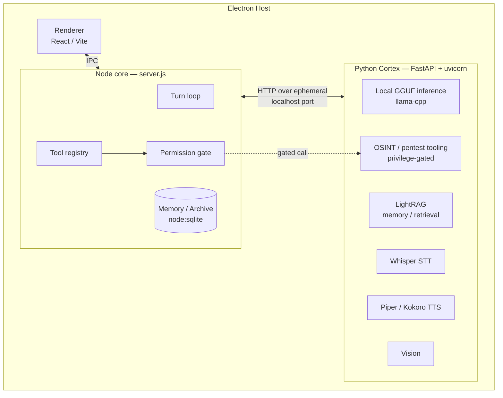
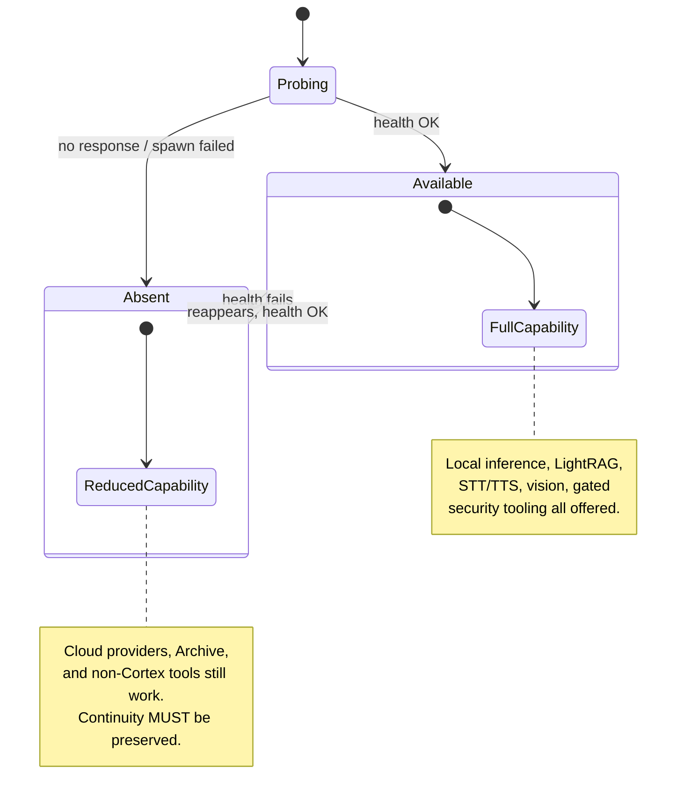

# The Cortex and Local Intelligence

This chapter describes the Cortex: the Python local-intelligence backend that the
[Host](../GLOSSARY.md) spawns alongside the Node core, and the HTTP boundary
between them. It covers what the Cortex provides — local inference, retrieval,
speech, vision, and privileged tooling — and how Luca degrades when the Cortex is
absent without silently losing [Continuity](../GLOSSARY.md).

## Why a second backend exists

Luca's [Runtime](01-persistent-runtime.md) is organized as a small set of
coordinated processes rather than one monolith. On the desktop [Host](../GLOSSARY.md)
today, an Electron application is the primary host process; it spawns a Node
**core** server (`server.js`) and a Python **Cortex** (FastAPI served by uvicorn).
The renderer is React/Vite. The core owns the [turn loop](01-persistent-runtime.md),
[Memory](03-memory-architecture.md), the [Tool](05-capability-and-tool-layer.md)
registry, and the [safety gate](07-safety-and-permissions.md). The Cortex owns the
capabilities that are most naturally expressed in Python and that benefit from
running **on the user's own machine**: local model inference, retrieval-augmented
memory, speech, vision, and a set of privileged security tools.

The split is not arbitrary. Two forces pull these capabilities into their own
process:

- **Ecosystem.** The mature libraries for local GGUF inference, speech-to-text,
  text-to-speech, retrieval graphs, and offensive-security tooling are Python. A
  Node core that tried to bind all of them would inherit their native build
  complexity and their process-crash blast radius.
- **Isolation.** Local inference and vision are memory- and CPU-heavy, and the
  privileged tooling is exactly the code you least want sharing an address space
  with the request-handling core. A separate process gives the Cortex its own
  lifecycle, its own failure domain, and a clean privilege boundary.

The Cortex serves the same one Luca. It is not a second identity or a second brain;
it is a set of capabilities the one Luca reaches for. Nothing in the Cortex holds
Luca's identity or owns the [Archive](../GLOSSARY.md) — those belong to the core, in
line with [Invariant 1](../01-constitution/01-the-eight-invariants.md#invariant-1--one-luca-identity)
and [Invariant 3](../01-constitution/01-the-eight-invariants.md#invariant-3--shared-memory).

## The core ↔ Cortex boundary



The Host allocates an **ephemeral localhost port** for the Cortex at spawn time and
publishes it to the core (and the renderer) rather than hard-coding a well-known
port. This is the same discipline the core server uses for its own port; see the
[ADR on ephemeral ports and the single-instance lock](../05-adrs/README.md).
Ephemeral ports avoid collisions between multiple installs and between LucaOS and
unrelated local services, at the cost of a discovery step: the child prints or
reports its bound address, and the parent records it. Because the accidental
`EADDRINUSE` guard that a fixed port once provided is gone, the Host also holds a
**single-instance lock** so that two full stacks cannot run at once and two writers
cannot contend for one [Archive](10-data-and-storage.md).

The boundary is **HTTP over loopback**, not a shared library and not a shared
memory region. That choice keeps the seam explicit and typed
([Invariant 6](../01-constitution/01-the-eight-invariants.md#invariant-6--strong-typing-and-modularity)):
the core speaks to the Cortex through a small set of request/response shapes, the
Cortex never reaches into the core's memory, and either process can be restarted
without corrupting the other. It also means the boundary is observable — every
call across it can be traced and, where the call is side-effectful, gated and
[provenanced](11-observability-and-provenance.md).

An illustrative sketch of the client the core holds for the Cortex:

```typescript
// Illustrative — shape and intent, not the exact signature.
interface CortexClient {
  readonly baseUrl: string;        // http://127.0.0.1:<ephemeral>
  readonly available: boolean;     // last-known reachability

  health(): Promise<CortexHealth>; // fast, cheap, called on a cadence
  infer(req: LocalInferenceRequest): AsyncIterable<Token>;
  retrieve(req: RetrievalRequest): Promise<RetrievalResult>;
  transcribe(audio: AudioChunk): Promise<Transcript>;
  synthesize(text: string, voice: VoiceId): Promise<AudioStream>;
  // Privileged surfaces are reached only through the Tool layer,
  // never called directly from feature code.
}
```

Feature code never calls the Cortex directly for a model completion. Local
inference is a [Provider](04-provider-abstraction.md) like any other: the
llama.cpp-backed Cortex model and Ollama both appear behind the provider
abstraction, and the [Router](04-provider-abstraction.md) selects them by
capability, cost, latency, privacy, and availability. Nothing above the
[Adapter](../GLOSSARY.md) learns that a given answer came from a local GGUF model
rather than a cloud one. That is what lets Luca move a task on- or off-device
without changing who Luca is.

## What the Cortex provides

### Local model inference (llama-cpp, GGUF)

The Cortex can run a local GGUF model through llama-cpp and expose it as a
[Provider](04-provider-abstraction.md) endpoint. Local inference matters for two
constitutional reasons. First, **privacy**: a task that must not leave the device
can be routed to a local model, and the Router can be told to prefer local for
sensitive content. Second, **availability**: when the network is down or a cloud
Provider is unreachable, a local model keeps Luca able to think. That is Presence
defended at the level of infrastructure — Luca is
[present](../00-manifesto/03-presence-is-the-product.md) even offline.

Local models are generally smaller and slower than frontier cloud models, so the
Router treats them as one option among several, not the default for every task. The
capability-aware route planner (`src/model-router/`) is the piece that would weigh
"route this privately/offline" against "route this to the strongest model"; it
exists today but runs in advisory/shadow mode behind a kill switch, so the operative
routing is still the simpler name-prefix router. See the
[Roadmap](../06-roadmap/README.md) for the promotion of the planner from shadow to
live.

### LightRAG memory and retrieval

The Cortex hosts a LightRAG-based retrieval layer: a graph-plus-vector index over
documents and notes that answers retrieval queries the core issues. This
complements, and does not replace, the core's own [Memory](03-memory-architecture.md).
The distinction matters and must stay honest:

- The **Archive** — Luca's durable memory of the user and the world — lives in the
  core, in [`node:sqlite`](10-data-and-storage.md) with FTS5 and an
  entities/relationships graph. It is the source of truth, owned by the one Luca.
- The Cortex's **LightRAG** is a retrieval engine over corpora, useful for
  document-heavy recall and richer graph traversal than brute-force vector cosine.

Because the Archive is authoritative, a retrieval result from the Cortex is an input
to Luca's reasoning, not a second memory that could diverge from the first. Keeping
one owner for durable memory is what
[Invariant 3](../01-constitution/01-the-eight-invariants.md#invariant-3--shared-memory)
requires; a retrieval index that quietly became a competing store would fracture it.

### Speech: Whisper STT and Piper/Kokoro TTS

The Cortex provides speech-to-text via Whisper and text-to-speech via Piper and
Kokoro. Running speech locally serves the voice [Surface](06-surface-layer.md)
directly: the user can talk to Luca and hear Luca without audio leaving the device,
which is both a privacy property and a latency one. Voice is an embodiment of the
one Luca, not a separate assistant; the STT transcript enters the same turn loop and
the same Memory as typed input, and the TTS voice is Luca's voice as defined in the
[Design System](../03-design-system/04-voice-and-tone.md).

### Vision

The Cortex exposes vision capabilities used for understanding images and screen
content. Where vision feeds [Computer-Use](../GLOSSARY.md) — interpreting a
screenshot to operate a graphical application — it sits behind the same
[permission model](07-safety-and-permissions.md) as any other capability that
observes or acts on the user's world. Seeing the screen is not a free action; it is
a Tool, orchestrated under explicit permission.

### OSINT and pentest tooling, gated behind privilege

The Cortex carries a set of OSINT and penetration-testing tools. These are exactly
the capabilities that must never be reachable by omission. They register in the
[Tool](05-capability-and-tool-layer.md) layer under the security model described in
[Safety and Permissions](07-safety-and-permissions.md): a `SecurityLevel`
(0 none → 3 dual) crossed with a `MissionScope`, and — critically — a **category
floor**. Tools in dangerous categories such as HACKING inherit a minimum security
level even if a config row is missing, so a new offensive tool cannot ship ungated
because someone forgot to list it. Explicit per-tool configuration can raise the
gate but not silently remove it.

The Cortex reinforces this at its own boundary: the privileged routers are mounted
behind a `require_privileged` dependency (`osint_endpoints.py`, `hacking_endpoints.py`
and related routers are included with `dependencies=[Depends(require_privileged)]`),
so the HTTP surface itself refuses an unprivileged caller. That is defense in depth,
not a substitute for the core's gate. The authoritative authorization decision stays
in the core's Tool registry and permission gate, which resolve authorization through
an operator decision, never through transcript text
([Invariant 8](../01-constitution/01-the-eight-invariants.md#invariant-8--security-and-explicit-permissions)).

## Graceful degradation — and its hard limit

The Cortex can be absent: not installed, not yet started, crashed, or intentionally
disabled on a Host without the resources to run local models. When it is absent,
Luca must keep working. Cloud [Providers](04-provider-abstraction.md) still answer,
the core's Memory still persists, typed input still flows through the turn loop, and
Tools that do not depend on the Cortex still run. The core treats the Cortex as an
**optional, discovered capability**: it probes `/health` on a cadence, records
reachability, and the Router simply does not offer local-inference or Cortex-hosted
routes while the Cortex is down.



This is graceful degradation done correctly: capability narrows, but identity,
memory, and in-flight work do not. There is a boundary here that the Constitution
draws sharply, and it is the reason this chapter exists. **A degradation that
silently loses continuity is not acceptable.** If the Cortex hosted the only copy of
some in-flight state, or if losing local inference dropped the user into a fresh,
context-free session, that would violate
[Invariant 2](../01-constitution/01-the-eight-invariants.md#invariant-2--persistent-runtime)
(the Runtime and its state outlive any single component) and
[Invariant 3](../01-constitution/01-the-eight-invariants.md#invariant-3--shared-memory)
(memory belongs to the one Luca, durably). The Manifesto states the same limit in
product terms: an architecture that "degrades to Cloud-Only mode" and quietly loses
continuity has
[damaged the product](../00-manifesto/03-presence-is-the-product.md), even if every
response is still good.

So the design rules for the boundary are:

- **The Archive never lives in the Cortex.** Durable memory is the core's, in
  `node:sqlite`. Losing the Cortex loses a retrieval accelerator, not Luca's memory.
- **Degrade loudly to the system, quietly to the user.** The Router and telemetry
  record that local capability is unavailable — the state is
  [observable](11-observability-and-provenance.md) — but the user is not dropped into
  a blank Luca. Availability is a feature to defend, calmly.
- **Fail closed on privilege, open on capability.** If the Cortex is gone, the
  privileged security tools are simply unavailable (fail closed). But ordinary
  reasoning routes to whatever Provider remains (fail open on capability), because
  keeping Luca able to think is the availability guarantee.

The honest gaps here are two. First, there are currently **two spawn-and-supervise
paths** for the Cortex — the Electron host's `startCortex` in `platforms/electron/main.cjs`
and a separate `cortexService.js` with its own restart watchdog — and they do not
share supervision behavior. Consolidating on one supervisor is the kind of small,
aligned step the [contribution model](../CLAUDE.md) calls for. Second, full, seamless
behavior across a mid-task Cortex loss — for example resuming a partially spoken
response on the cloud path — depends on the
[checkpointing](09-continuity-and-sync.md) that the continuity services provide, and
those are partially realized today. Where the target is seamless and the
implementation is not yet, the [Roadmap](../06-roadmap/README.md) says so; the
contract this chapter fixes is the invariant, not the polish: **capability may
narrow; continuity may not silently break.**

## Boundaries the Cortex must respect

- It does not own identity or the [Archive](../GLOSSARY.md). One Luca; one owner of
  durable memory.
- It is reached for inference only through the
  [provider abstraction](04-provider-abstraction.md), never by feature code
  branching on "is this local?"
- Its side-effectful and privileged capabilities are gated in the core's
  [permission model](07-safety-and-permissions.md), with category floors, and carry
  [provenance](11-observability-and-provenance.md).
- Its presence is a discovered, optional capability; its absence narrows capability
  without breaking [Continuity](../GLOSSARY.md).

## See also

- [The Persistent Runtime](01-persistent-runtime.md)
- [Provider Abstraction](04-provider-abstraction.md)
- [The Capability and Tool Layer](05-capability-and-tool-layer.md)
- [Safety and Permissions](07-safety-and-permissions.md)
- [Continuity and Sync](09-continuity-and-sync.md)
- [Data and Storage](10-data-and-storage.md)
- [Presence Is the Product](../00-manifesto/03-presence-is-the-product.md)
