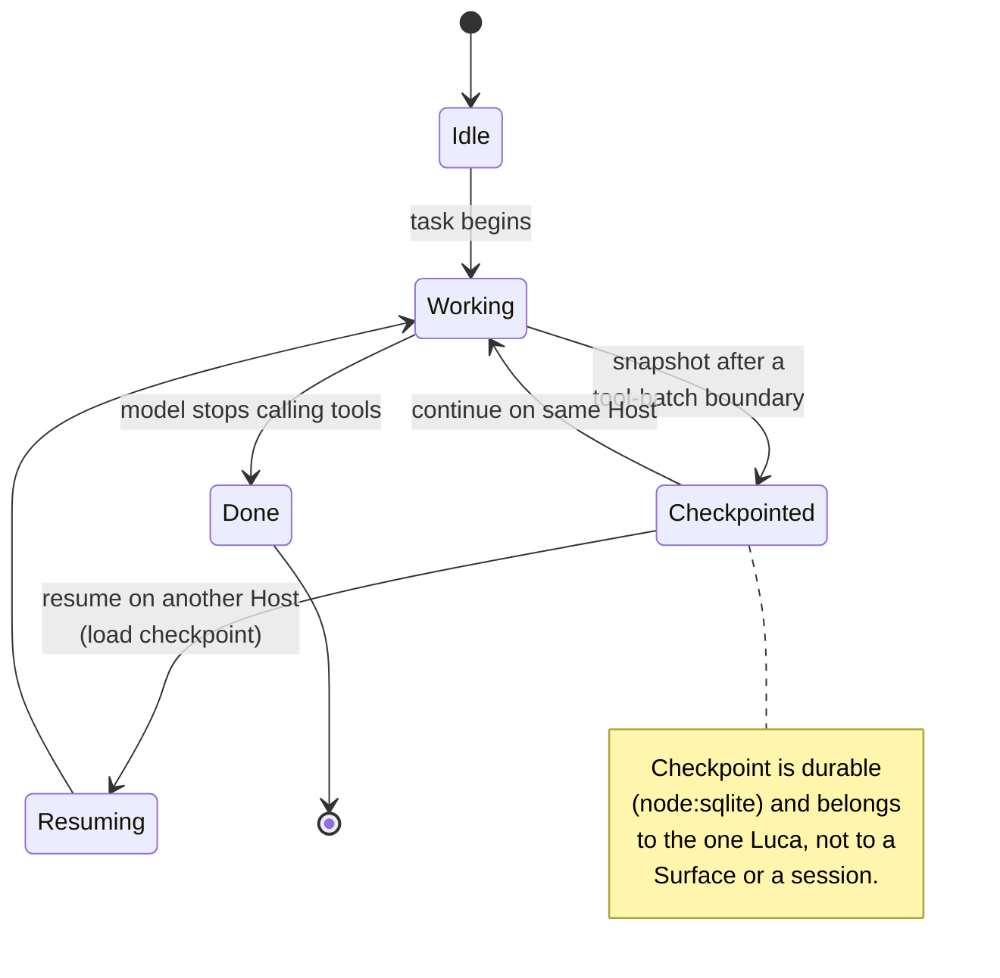
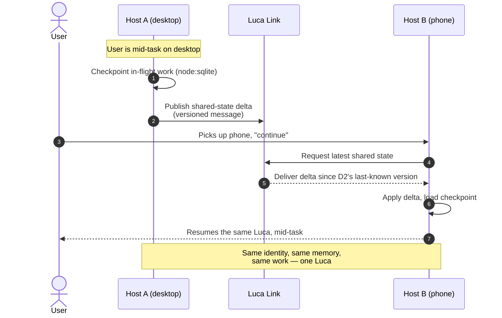
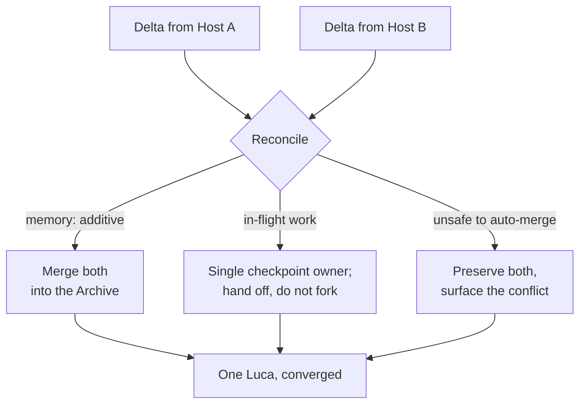
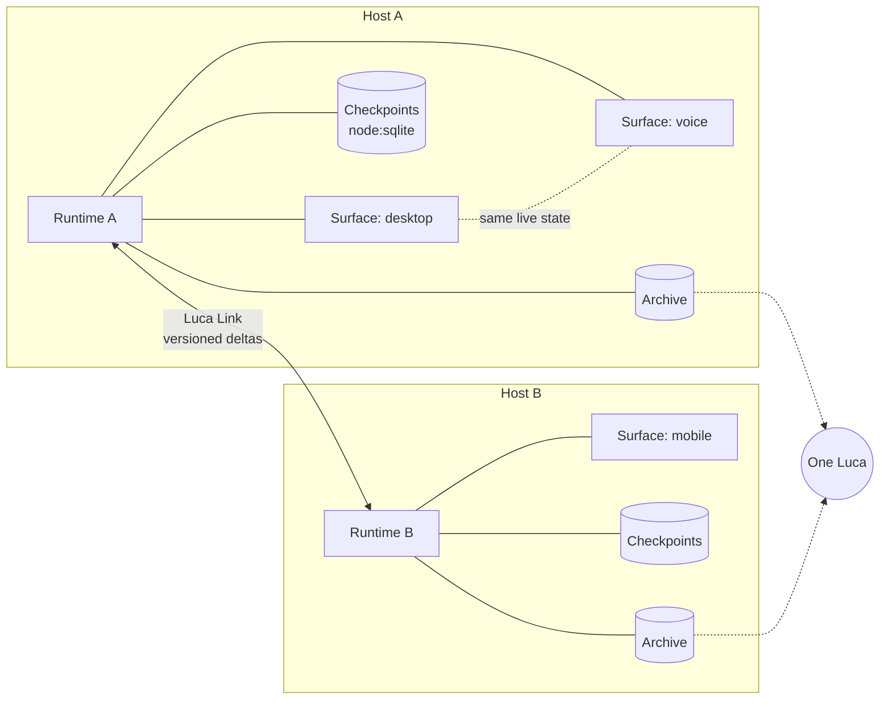

# Continuity and Sync

This chapter describes how the same Luca continues across a [Surface](../GLOSSARY.md)
switch and a device switch: how in-flight work is checkpointed and resumed, how the
cross-device sync ("Luca Link") propagates shared state, how divergence between two
[Hosts](../GLOSSARY.md) is reconciled, and how versioned protocol messages keep a
mixed-version rollout coherent. It is the mechanism behind
[Invariant 5](../01-constitution/01-the-eight-invariants.md#invariant-5--cross-surface-continuity)
and part of [Invariant 7](../01-constitution/01-the-eight-invariants.md#invariant-7--backward-compatibility-where-practical).

## What Continuity means here

[Continuity](../GLOSSARY.md) is the property that Luca's identity, memory, and
in-flight work survive across Surface switches, device switches, model switches, and
restarts. It is [Invariant 1](../01-constitution/01-the-eight-invariants.md#invariant-1--one-luca-identity)
(one Luca) made observable: singularity you can only claim in the architecture
becomes singularity the user actually _experiences_ when they close the laptop, pick
up the phone, and say "continue."

Two continuities compose:

- **Cross-Surface continuity** — a change on one Surface of one Host is visible to
  the other Surfaces attached to the same [Runtime](01-persistent-runtime.md). This
  is mostly a property of the Runtime: Surfaces attach to and detach from a single
  live state, so there is nothing to "sync" between them — they render the same
  thing. See [The Surface Layer](06-surface-layer.md).
- **Cross-device continuity** — the same Luca continues when the user moves to a
  _different_ Host with its own Runtime. This is where genuine synchronization is
  required, because now there are two processes and two local stores that must
  converge on one Luca. This is the job of Luca Link.

The rest of this chapter is mostly about the second, harder case.

## Checkpointing in-flight work

Presence has a "during" as well as a before and after. If the user is mid-task —
a multi-step [tool](05-capability-and-tool-layer.md) run, a long generation, a plan
being executed — continuity is not just "my memory came along"; it is "the work I
was in the middle of came along." That requires **checkpoints**: durable snapshots
of in-flight state that a different Surface or a different Host can resume from.

LucaOS has continuity and checkpoint services in the Runtime today. The cognitive
`CheckpointManager` is backed by a [`node:sqlite`](10-data-and-storage.md) checkpoint
store; other continuity snapshots (for example `RuntimeContinuityService`) currently
persist to renderer `localStorage`, and some mission-level checkpoints are in-memory
only. Unifying resumable state on the durable substrate is a target, not a finished
fact — a split like this is exactly the kind of gap the honesty clause asks us to
name rather than paper over. A checkpoint captures the resumable state of a unit of
work — enough to pick it up rather than restart it. The
turn loop (`src/services/turns/TurnRunner.ts`) is the natural checkpoint boundary:
it streams from the active [Provider](04-provider-abstraction.md), executes tool
calls in concurrency-safe batches, folds results back, and repeats until the model
stops calling tools. Between those rounds there are consistent points at which the
work can be snapshotted — after a tool batch has resolved, before the next round
begins.



A checkpoint belongs to Luca, not to the Surface that happened to create it. That is
the difference between "resume where I left off, on any device" and "this window
remembers what it was doing." The former is Continuity; the latter is Surface-local
state that dies with the window, which
[Invariant 2](../01-constitution/01-the-eight-invariants.md#invariant-2--persistent-runtime)
forbids.

The honest gap: checkpoint/resume across devices is **partially realized**. The
services and the store exist; the target — a task interrupted mid-execution on one
Host resuming seamlessly on another, tool state and all — is not fully delivered. The
[Roadmap](../06-roadmap/README.md) tracks the path from "continuity services exist"
to "seamless cross-device resume." This chapter states the target and the invariant;
it does not claim the seam is finished.

## Luca Link: cross-device sync

Luca Link is the cross-device sync that carries the one Luca's shared state between
Hosts. Its job is to make two Hosts converge on the same identity, memory, and
in-flight work, so that the user meets one Luca regardless of which device is in
their hand.



What Luca Link carries is the state that _constitutes the one Luca_: durable
[Memory](03-memory-architecture.md) and checkpoints of in-flight work. What it does
**not** carry is Surface-local view state — scroll position, which panel is open,
transient UI on one Host. Keeping that line sharp is a design requirement of
[Invariant 5](../01-constitution/01-the-eight-invariants.md#invariant-5--cross-surface-continuity):
shared identity/memory state propagates; a Surface's private view does not pretend to
be Luca's.

Luca Link is subject to the same trust rules as everything else. It is a channel for
Luca's own state between the user's own devices, authenticated as such; it is not an
authorization channel, and nothing arriving over it can unlock a gated action. A
delta is data to apply, not a command to obey — the same discipline the Constitution
applies to transcript text
([Invariant 8](../01-constitution/01-the-eight-invariants.md#invariant-8--security-and-explicit-permissions)).

## The LucaLink mesh model

"Luca Link" as sketched above — two Hosts, one delta stream — is the minimal case.
The fuller product and target model is **LucaLink** (crosswalk: generic
[continuity and sync](../CROSSWALK.md#subsystem-crosswalk) ↔ LucaLink), a secure
multi-host mesh for one Luca distributed across many trusted host bodies. This
section names the model's structure; the honest current-state caveats follow it and
in [The honest status](#the-honest-status). Much of the mesh model is a **target**:
the trust ladder, per-device permissions, host roles, and routing engine are
defined statically (in `lucaLink/lucaLinkArchitectureMap.ts`) but are **not wired
into runtime** yet.

### Primary Host vs Origin

Two authorities are easy to conflate and must be kept distinct:

- **Origin** is reserved for LucaOS Creator / source-code authority and root system
  blueprint control — the authority that gates
  [guarded self-evolution](../CROSSWALK.md#subsystem-crosswalk) and mesh ownership.
- **Primary Host** is the user's main trusted device inside the mesh. It can
  approve mesh and device actions — pairing, grants, revocation — but it is **not**
  Creator/Origin authority.

Approving a new device on your phone is a Primary Host action; changing what Luca
_is_ is an Origin one. The mesh never lets the former escalate into the latter.

### The trust ladder

Each host holds a trust level on an ascending ladder; authority increases with
rank, and high-risk capability requires the upper rungs:

| Level | Rank | Meaning |
|---|---|---|
| `guest` | 0 | Temporary, least-privilege, time-limited. No memory write, no tools. |
| `paired` | 1 | Completed pairing; basic chat/presence only. |
| `trusted` | 2 | Primary-Host-approved for memory read, settings sync, sensor input. |
| `admin` | 3 | Explicitly granted high-risk capabilities (tool/code/shell) under policy. |
| `owner` | 4 | Owner-level mesh authority; approves/revokes hosts — but not Creator/Origin. |

### Permission categories

Trust is not a single scalar in the target model; a host's trust level maps to a set
of roughly **twenty permission categories**, each with a risk band, so a grant is
capability-scoped rather than all-or-nothing:

`chat.send`, `chat.receive`, `voice.capture`, `voice.playback`, `camera.capture`,
`screen.capture`, `location.read`, `notification.send`, `memory.read`,
`memory.write`, `settings.sync`, `files.read`, `files.write`, `browser.control`,
`shell.execute`, `code.modify`, `git.create_pr`, `smart_home.control`,
`robotics.motion`, `payment.spend`.

The five high-risk categories — `shell.execute`, `code.modify`, `git.create_pr`,
`robotics.motion`, `payment.spend` — are classified `critical` and require
`admin`/`owner` trust plus an explicit grant. This is the mesh-side counterpart of
[Luca Guard's](07-safety-and-permissions.md) risk classes and asset trust tiers:
the same "a present AI that can act in your world needs per-capability, revocable
authority" principle, applied across devices.

### Sync lanes and per-lane conflict policy

LucaLink does not carry all traffic over one undifferentiated channel. The target
protocol models **twelve typed, permissioned sync lanes**, each with required
permissions, an encryption requirement, and — the point for conflict handling — its
**own conflict policy**:

| Lane | Purpose | Conflict policy |
|---|---|---|
| `identity` | Host manifests, public keys, role/trust grants, revocation | primary-host-wins |
| `presence` | Online/away, battery/network status | last-write-wins |
| `conversation` | Hand off chat/voice turns, thread state | append-only |
| `memory` | Replicate Memory + sovereign facts | merge |
| `settings` | Sync settings/appearance/runtime | primary-host-wins |
| `mission` | Mission/state hydration and handoff | primary-host-wins |
| `sensor` | Perception pulses (camera/mic/location/motion) | append-only |
| `tool` | Tool invoke/result routing | no-conflict |
| `artifact` | File/blob/build-artifact transfer | last-write-wins |
| `notification` | Fan-out notifications, approval prompts | append-only |
| `model` | Local-model advertise/route availability | no-conflict |
| `safety` | Revocation, kill-switch, key rotation, alerts | primary-host-wins |

The five conflict policies — primary-host-wins, last-write-wins, append-only,
merge, no-conflict — are chosen per lane to fit the data: identity and safety defer
to the Primary Host; presence and artifacts take the latest; conversation, sensor,
and notification only ever accumulate; Memory merges; tool and model routing are
request/response with nothing to reconcile. This is why the
[conflict-handling](#conflict-handling-when-two-hosts-diverge) section below insists
that "additive merge" describes the memory lane, not the whole protocol.

### Host roles and routing

Hosts also carry a **role** — `primary`, `companion`, `execution`, `sensor`,
`display`, `guest`, `embodied` — describing what part they play in the mesh, and a
**host router** answers the placement question: _should Luca route this task through
this host?_ The routing model (design-only today, seeded by
`deviceRegistry.selectBestDevice()`) scores candidate hosts on capability match and
trust level as hard gates, then on privacy fit, latency, compute, battery, and which
host the user is actively on — biasing high-risk work toward `execution`/`primary`
hosts. It is the cross-device analog of just-in-time
[capability selection](05-capability-and-tool-layer.md): pick the host best suited to
the task, under the trust the task's risk band demands.

## Conflict handling when two Hosts diverge

Cross-device sync must assume divergence. Two Hosts can be edited while offline, a
delta can arrive late, or two Surfaces on two devices can act "at the same time." A
system that pretends this never happens will silently lose one side's work — which,
for durable Memory, is a correctness bug, not a cosmetic one.

The reconciliation stance follows from the invariants rather than from convenience.
One clarification first, because it is easy to over-generalize: **additive merge is
the _memory_ lane's conflict policy, not a universal one.** LucaLink assigns a
conflict policy **per sync lane** (detailed in
[The LucaLink mesh model](#the-lucalink-mesh-model) above) — presence is
last-write-wins, conversation and sensor are append-only, identity and settings are
primary-host-wins, memory is merge. The bullets here describe the memory and
in-flight-work cases specifically; they are not the whole protocol's model.

- **Memory merges; it does not overwrite.** Durable Memory and the
  [Archive](../GLOSSARY.md) evolve by accumulation, so the memory lane's policy is
  `merge`: when two Hosts both wrote, the target is to merge both contributions,
  not to let a last-writer-wins clock discard one. Additive evolution is also what
  [Invariant 7](../01-constitution/01-the-eight-invariants.md#invariant-7--backward-compatibility-where-practical)
  asks of persisted shapes; the same instinct — never silently drop the user's data
  — governs conflict handling. Other lanes carry other policies; what does _not_
  vary is the refusal to silently discard the user's durable data.
- **In-flight work resumes from one checkpoint at a time.** A unit of work should be
  active on one Host at a time; the checkpoint is the handoff token. If two Hosts
  both believe they hold a task, that is the same _singularity hazard_ as two writers
  on one store, and the resolution is the same in spirit as the
  [single-instance lock](../05-adrs/README.md): one live owner, not two.
- **Conflicts surface; they do not silently resolve against the user.** Where an
  automatic merge is not safe, the honest behavior is to preserve both versions and
  make the divergence visible (via [provenance](11-observability-and-provenance.md)
  and the user-facing surface), not to pick one and delete the other quietly. Least
  surprise is a [trust commitment](../01-constitution/04-trust-and-permissions.md),
  and quietly losing a device's work is a large surprise.



The current implementation's conflict handling is part of what is partially realized:
the continuity and checkpoint services and the sync path exist, but full,
battle-tested convergence across arbitrary offline divergence is a target. As
elsewhere, the invariant is fixed and the polish is on the [Roadmap](../06-roadmap/README.md):
**convergence must never be achieved by silently discarding one Host's durable
contribution.**

## Versioned protocol messages

Continuity across devices is also continuity across _versions_. During any rollout,
a newer Host and an older Host will be online at the same time and must still be able
to exchange state and converge on one Luca. If the cross-device protocol were
unversioned, a mid-rollout mix of Hosts could become mutually incomprehensible, and
the coherence of the one Luca would depend on every device updating in lockstep —
which never happens.

So cross-Surface and cross-device protocol messages are **versioned, typed shapes**,
per [Invariant 7](../01-constitution/01-the-eight-invariants.md#invariant-7--backward-compatibility-where-practical)
and [Invariant 6](../01-constitution/01-the-eight-invariants.md#invariant-6--strong-typing-and-modularity).
A message carries its version; a receiver interprets it against the version it
understands; the protocol evolves additively so that an older receiver can still act
on the parts it recognizes and a newer receiver can fill in defaults for fields an
older sender omitted. The versioned envelope exists in the code today:
`lucaLinkSyncProtocol.ts` defines a `luca-link/v1` envelope with typed, per-lane
payloads.

Here the vision and the implementation diverge, and the honest statement matters. The
`luca-link/v1` module is at present a **pure, typed model that is deliberately not yet
wired into the live transport** — its own header records that it does not connect to
the live relay, guest, WebRTC, session, or mission runtime paths. The operative
cross-device path today runs through the live relay singleton in
`lucaLinkService.ts` — a Socket.IO client to a relay server, with QR pairing,
mDNS rediscovery, WebRTC guest audio, and mission sync. A second, more structured
stack (`lucaLink/manager.ts`, built on a `SecureSocket` X25519/AES-GCM handshake,
device registry, and session manager) coexists but is _not_ the operative relay;
the two do not share a transport, registry, or trust model today. So the _shape_ of
a versioned, additively-evolvable protocol is defined and typed; making it the live
wire format is a follow-up step tracked on the [Roadmap](../06-roadmap/README.md).
Documenting the target here is not a claim that the target is met; it is the
contract the follow-up adapter must satisfy.

```typescript
// Illustrative — a versioned envelope for cross-device state.
interface SyncEnvelope<T> {
  protocolVersion: number;   // receiver dispatches on this
  kind: "memory-delta" | "checkpoint" | "presence";
  since: VersionVector;      // what the sender believes the receiver has
  payload: T;                // additively-evolved, typed shape
}
```

The rules that keep a mixed-version fleet coherent:

- **Never repurpose a field in place.** Add a new field; migrate explicitly; keep old
  readers valid. This mirrors the persisted-shape migration discipline in
  [Data and Storage](10-data-and-storage.md).
- **Unknown newer fields are ignored, not fatal.** An older Host applies what it
  understands and does not reject the whole message.
- **"Where practical" is real.** A breaking protocol change is permitted when it is
  documented and migrated; a _silent_ one that makes a rollout incoherent is not.

## How the pieces compose



Within a Host, Surfaces share one Runtime and one live state — cross-Surface
continuity is nearly free because there is nothing to reconcile. Across Hosts, Luca
Link carries versioned deltas of durable Memory and checkpoints, reconciles
divergence additively, and hands off in-flight work through a single checkpoint owner
so that no two Hosts fork the one Luca.

## The honest status

To state the gap plainly, as the Constitution's honesty clause requires:

- **Exists today:** continuity/checkpoint services, a `node:sqlite`-backed cognitive
  checkpoint store, a cross-device sync subsystem (LucaLink) with pairing, a live
  relay path, guest sessions with PIN gating, and per-packet encryption primitives
  (X25519 + AES-256-GCM in the structured stack), and a typed `luca-link/v1`
  versioned envelope.
- **Partially realized / target:** the mesh's device-trust _governance_ is not yet
  the "extensive" layer an earlier draft implied. The trust ladder
  (`guest`…`owner`), per-device permission categories, sync-lane gating, host roles,
  and the routing engine are **defined statically but not wired into runtime**; the
  PR #182 audit lists **device revocation, per-device permissions, and key rotation
  as missing or type-level only** (there is a hardcoded session master key, no
  runtime rotation loop, and no way to revoke a paired device). Also partial: a
  single durable home for all resumable state (some lives in `localStorage` or memory
  today); the `luca-link/v1` envelope as the _live_ wire format (it is a typed model;
  the live path is still the `lucaLinkService.ts` relay singleton); seamless mid-task
  resume across devices; and fully general conflict convergence across arbitrary
  offline divergence.
- **The invariant that does not move:** capability and polish may lag, but continuity
  is never satisfied by silently dropping a Surface's or a Host's durable state. A
  device switch that starts a fresh context, or a merge that quietly deletes one
  side's work, is a continuity failure, not an acceptable degradation.

The path from partial to seamless is tracked in the [Roadmap](../06-roadmap/README.md).

## See also

- [The Persistent Runtime](01-persistent-runtime.md)
- [Identity and Embodiment](02-identity-and-embodiment.md)
- [Memory Architecture](03-memory-architecture.md)
- [The Surface Layer](06-surface-layer.md)
- [Data and Storage](10-data-and-storage.md)
- [Observability and Provenance](11-observability-and-provenance.md)
- [Invariant 5 — Cross-Surface Continuity](../01-constitution/01-the-eight-invariants.md#invariant-5--cross-surface-continuity)
- [Invariant 7 — Backward Compatibility Where Practical](../01-constitution/01-the-eight-invariants.md#invariant-7--backward-compatibility-where-practical)
- [Safety and Permissions](07-safety-and-permissions.md) — Luca Guard, whose trust tiers the mesh trust ladder mirrors
- [Crosswalk — LucaLink](../CROSSWALK.md#subsystem-crosswalk) — the generic continuity/sync ↔ LucaLink mapping and code path
