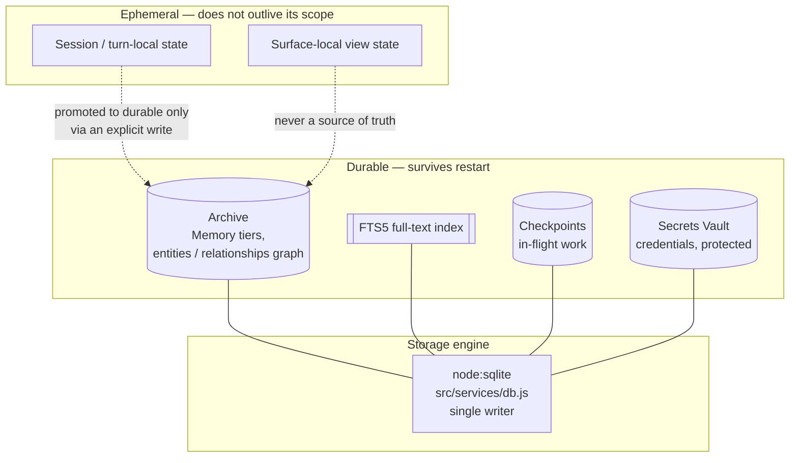
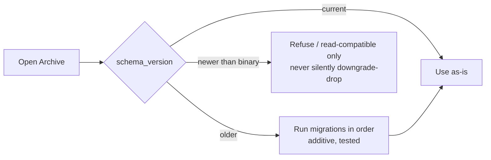

# Data and Storage

This chapter describes the storage substrate beneath Luca: the `node:sqlite`
database and its full-text index, the additive-migration discipline that lets
persisted shapes evolve, the secrets Vault, the durability guarantees, and the
distinction between the durable [Archive](../GLOSSARY.md) and ephemeral session
state. It is the foundation under
[Invariant 3](../01-constitution/01-the-eight-invariants.md#invariant-3--shared-memory)
(shared memory) and
[Invariant 7](../01-constitution/01-the-eight-invariants.md#invariant-7--backward-compatibility-where-practical)
(backward compatibility).

## Storage is where continuity is kept honest

Everything the Constitution says about [Presence](../00-manifesto/03-presence-is-the-product.md)
and [Memory](03-memory-architecture.md) reduces, at the bottom, to a promise about
bytes: what the user expects to survive a restart actually survives. Storage is where
that promise is kept or quietly broken. A memory architecture can be elegant and a
sync protocol can be versioned, but if the write never reaches durable disk — or
reaches a store that accepts it and drops it — then there is no continuous Luca to be
present, only the appearance of one. This chapter is deliberately concrete because the
failure modes here are silent, and silent data loss is the most expensive kind.

## `node:sqlite`: the runtime built-in

Luca's durable store is SQLite, accessed through the runtime's **built-in
`node:sqlite`** module — not a third-party native binding. The core's database
service (`src/services/db.js`) is the single owner of this store. It provides FTS5
full-text search and an entities/relationships knowledge graph over the
[Archive](../GLOSSARY.md); recall supports both FTS5 keyword search and brute-force
vector cosine.

The choice of `node:sqlite` over a native binding is a real decision with a real
scar behind it, recorded in [ADR-0004](../05-adrs/README.md). The short version:

- The store previously used `better-sqlite3`, a native module compiled against a
  specific Node ABI. In the Electron [Host](../GLOSSARY.md), the native module was
  built for Electron's ABI while a server process ran under system Node — a
  **different ABI**. Loading the mismatched binary failed, and the database layer
  **silently fell back to a mock store that accepted writes and discarded them.**
  Luca appeared to remember; the bytes never landed.
- `node:sqlite` has **no native binary** to compile, no `electron-rebuild` step, and
  **no ABI to mismatch**. The same module works under Electron and under system Node.
  The **common trigger** for "built for the wrong ABI, silently degrade to a mock" is
  removed at the root: there is no longer an ABI to be wrong.

This is the paradigm case of the Constitution's rule that a silent in-memory fallback
that accepts and drops writes is a **correctness bug, not graceful degradation**
([Invariant 3](../01-constitution/01-the-eight-invariants.md#invariant-3--shared-memory)).
Two honest qualifications keep this accurate. First, the mock is _reduced in reach,
not removed from the code_: `db.js` still falls back to a no-op mock store (its
`prepare()` returns `{ run: () => ({ changes: 0 }), get: () => null, all: () => [] }`)
if `node:sqlite` initialization throws, and web builds use mock shims by design. What
`node:sqlite` eliminated is the routine boot-time ABI failure that used to make that
mock reachable on essentially every launch. The mock still exists for the error and
web-only cases. Second — and this is the standing obligation — that fallback must
never sit on the **durable** path for a Host that is supposed to persist. The fix was
to remove the failure mode that made the mock reachable in normal operation; the
remaining work, tracked on the [Roadmap](../06-roadmap/README.md), is to make the
degraded case fail loudly rather than quietly on a durable Host. See the durability
section below for the rule this leaves behind.

### One writer, one file

SQLite is a single-file, single-writer store, which makes the **who is allowed to
write** question load-bearing. LucaOS allocates ephemeral localhost ports for the
core and the [Cortex](08-cortex-and-local-intelligence.md) and publishes them to the
renderer; removing the old fixed port also removed the accidental `EADDRINUSE` guard
that had prevented two full stacks from running. Two stacks would mean two writers on
one SQLite file — a _singularity hazard_, two processes both acting as Luca over one
Archive, which
[Invariant 1](../01-constitution/01-the-eight-invariants.md#invariant-1--one-luca-identity)
forbids. The remedy is a **single-instance lock** on the Host so exactly one Runtime
owns the store; see the
[ADR on ephemeral ports and the single-instance lock](../05-adrs/README.md). The
storage layer and the
process model are therefore coupled by design: one Luca implies one writer implies
one live Runtime.

## The storage layers

The layers divide by **who owns the data and how long it must live**, not by which
Surface produced it.

- The **Archive** is Luca's durable Memory: the tiered store of identity, durable,
  and transient memory, plus the entities/relationships graph, indexed by FTS5. It is
  the source of truth for what the one Luca knows. See
  [Memory Architecture](03-memory-architecture.md) for the tiering and the
  write-time capacity rules.
- **Checkpoints** hold resumable in-flight work for
  [Continuity](09-continuity-and-sync.md). They are durable because a task the user
  was in the middle of must survive a restart and a device switch.
- The **secrets Vault** holds credentials and other secrets, protected as described
  below.
- **Ephemeral state** — session/turn-local working state and Surface-local view state
  — is deliberately _not_ durable. It exists for the life of a turn or a window and is
  not a source of truth. Turn-local state becomes durable only by an explicit write
  into the Archive; a Surface's view state never becomes durable at all.

The reason to draw this line explicitly is that most continuity bugs are a category
error in one direction or the other: state that _should_ be durable held only in a
renderer that dies with the window (violating
[Invariant 2](../01-constitution/01-the-eight-invariants.md#invariant-2--persistent-runtime)),
or ephemeral view state leaking into the Archive as though it were Luca's knowledge.
Neither is a small mistake; both fracture Presence.

## Schema and additive migration discipline

Persisted shapes change over time — new memory fields, new graph relations, new
checkpoint metadata. Because a user's accumulated Memory and in-flight work must
survive an upgrade, schema evolution is governed by
[Invariant 7](../01-constitution/01-the-eight-invariants.md#invariant-7--backward-compatibility-where-practical):

- **Additive by default.** New columns and tables are added; existing ones are not
  repurposed in place. An old field keeps its meaning.
- **Explicit, tested migrations when a shape must change.** A shape change ships with
  a migration that transforms existing data, and the migration is tested against real
  persisted data, not assumed.
- **Never "just reset the store."** Dropping user data on upgrade — even as an
  unstated side effect of a schema change with no migration — is a continuity
  failure, not a convenience. "Where practical" permits a _documented, migrated_
  breaking change; it does not permit a silent one.

The honest gap: this discipline is stated as the **requirement**, and the current
implementation only partly embodies it. Today `db.js` creates its schema idempotently
with `CREATE TABLE IF NOT EXISTS` in an `initSchema()` step; there is **no versioned
migration runner** — no `PRAGMA user_version`, no ordered migrations directory. The
one migration that exists is a single legacy JSON-to-SQLite import. Idempotent
`CREATE TABLE IF NOT EXISTS` handles additive growth of _new_ tables, but it does not
carry, transform, or version _existing_ data when a shape must change. Introducing a
schema-version stamp and an ordered, tested migration runner is a known step on the
[Roadmap](../06-roadmap/README.md); until it lands, the safe path is strictly additive
change, because there is no migration machinery to make a breaking one safe.

The target open-and-migrate flow:

This discipline is the storage-side twin of the versioned cross-device protocol in
[Continuity and Sync](09-continuity-and-sync.md): persisted shapes and wire shapes
both evolve additively so that continuity survives both restarts and rollouts.

## The secrets Vault

Credentials — API keys for [Providers](04-provider-abstraction.md), tokens for tools
that reach external services, and any other secret Luca must hold to act on the
user's behalf — live in a dedicated **Vault**, separated from ordinary Memory. The
Vault is where the storage layer meets
[Invariant 8](../01-constitution/01-the-eight-invariants.md#invariant-8--security-and-explicit-permissions),
and it carries obligations that ordinary data does not:

- **Secrets are not Memory.** A credential is not something Luca "remembers about the
  user" and injects into a model's context. It must never be selected into a prompt
  by the [budgeted, ranked memory injection](03-memory-architecture.md) that feeds
  reasoning. Keeping the Vault a distinct store, not a tier of the Archive, is what
  makes that separation structural rather than a matter of care.
- **Secrets are used, not exposed.** Luca uses a credential to make a call; the secret
  value itself is not surfaced to the model, to the user-facing transcript, or to the
  telemetry stream. This is the storage-side of the observability rule that secrets
  must never be logged, stated fully in
  [Observability and Provenance](11-observability-and-provenance.md).
- **Access is provenanced.** Reaching into the Vault to use a secret is an event with
  [provenance](11-observability-and-provenance.md): which action used which
  credential, on whose authority. The value is not recorded; the _use_ is.

Entering the credential in the first place is a user action gated by the
[permission model](07-safety-and-permissions.md); Luca does not manufacture or
harvest secrets. The Vault holds what the user has entrusted, protects it at rest,
and hands it only to the code path authorized to use it. In the current
implementation the Vault is reached through IPC handlers that proxy to the core's
`/api/credentials/*` endpoints — deliberately decoupled from the native database
layer — and the backend encrypts values at rest with AES-256 before storing them.

The honest gap: the key management around that encryption is not yet production-grade.
The backend derives its key from a master key that defaults to a hardcoded
placeholder unless an environment variable overrides it, and the on-disk cipher is not
yet aligned with the authenticated-encryption fields (`auth_tag`) the credentials
schema already reserves. Hardening this — removing the placeholder default, requiring a
real key source, and settling on an authenticated cipher end to end — is security work
tracked on the [Roadmap](../06-roadmap/README.md). Naming it here is the honest thing:
the Vault's _separation_ and _at-rest encryption_ are real, and its _key management_ is
not yet where [Invariant 8](../01-constitution/01-the-eight-invariants.md#invariant-8--security-and-explicit-permissions)
requires it to be.

## Durability guarantees, and the standing rule

The purpose of this whole substrate is one guarantee: **a write the user expects to
be durable reaches durable storage, or the failure is loud.** From that, several
standing rules follow that every contributor to the storage layer inherits:

- **No silent fallback store.** The `better-sqlite3`-to-mock incident is the reason
  this rule exists. If the real store cannot be opened, the system does not quietly
  substitute a store that accepts writes and drops them. It fails loudly — the
  correct behavior for a correctness-critical dependency. A mock store belongs in a
  test, never on the live durability path.
- **Confirm the write, don't assume it.** Because the historical failure was a write
  that _looked_ like it succeeded, the storage layer's contract is that a durable
  write is acknowledged only when it is actually persisted. "It returned without
  throwing" is not the same as "it is on disk."
- **Fail closed on durability, too.** The safety layer fails closed on permission;
  the storage layer fails closed on durability. When in doubt about whether a write
  landed, surface it rather than proceed as if it did. Losing the user's Memory is as
  serious as taking an ungated action — both break the trust that Presence depends on.

The current implementation removed the specific silent-fallback path by adopting
`node:sqlite`. The standing rule generalizes the fix: any new storage code that
reintroduces an "accept and drop on error" path is reintroducing the bug, regardless
of how the error is reached.

## Durable vs ephemeral: the practical test

When you are unsure whether a piece of state belongs in the durable substrate or in
ephemeral session state, apply this test, which is the storage-level form of the
[Four Questions](../01-constitution/02-the-four-questions.md):

> If the Host restarted right now, or the user switched to another device, would the
> user reasonably expect this to still be there?

- **Yes** → it is Archive, checkpoint, or Vault. It is the one Luca's, it is durable,
  and it evolves under migration discipline.
- **No** → it is session/turn-local or Surface-local view state. It must never be the
  source of truth for anything the user expects to persist, and it must never leak
  into the Archive as though it were.

Getting this test wrong in the "no when it should be yes" direction loses continuity;
getting it wrong in the "yes when it should be no" direction pollutes the Archive with
transient noise. Both are storage bugs with constitutional consequences.

## See also

- [Memory Architecture](03-memory-architecture.md)
- [Continuity and Sync](09-continuity-and-sync.md)
- [Safety and Permissions](07-safety-and-permissions.md)
- [Observability and Provenance](11-observability-and-provenance.md)
- [The Cortex and Local Intelligence](08-cortex-and-local-intelligence.md)
- [Invariant 3 — Shared Memory](../01-constitution/01-the-eight-invariants.md#invariant-3--shared-memory)
- [Invariant 7 — Backward Compatibility Where Practical](../01-constitution/01-the-eight-invariants.md#invariant-7--backward-compatibility-where-practical)
- [ADR-0004 — node:sqlite over a native binding](../05-adrs/README.md)
