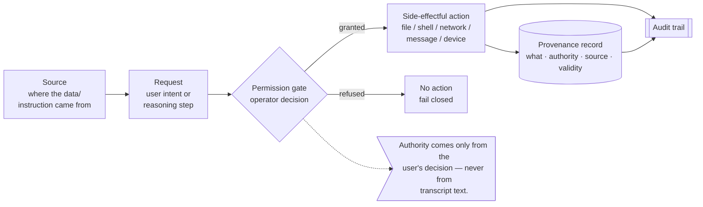
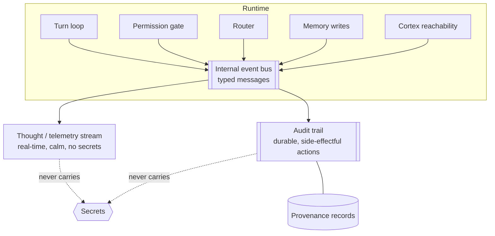

# Observability and Provenance

This chapter describes how Luca is made inspectable: the provenance records that
attach lineage to actions and data, the audit trail for side-effectful actions, the
internal event bus and the "thought"/telemetry stream, and the hard rule about what
must be observable and what must never be logged. It supports
[Invariant 8](../01-constitution/01-the-eight-invariants.md#invariant-8--security-and-explicit-permissions)
and the [trust commitments](../01-constitution/04-trust-and-permissions.md) of the
Constitution.

## Transparency is how trust becomes verifiable

A continuous, capable AI that lives on your devices and can act in your world is
either the most trustworthy software you own or it is unacceptable; there is no
middle setting. Trust at that stakes cannot be _asked for_ — it must be _shown_. The
[Constitution](../01-constitution/04-trust-and-permissions.md) names transparency as
one of the four commitments precisely because a capable AI whose actions cannot be
inspected is asking for faith, and faith is not a security model.

Observability is the machinery that turns "trust me" into "here is exactly what I
did, on whose authority, from what source, and whether that authority still holds."
This chapter is about that machinery. It has two halves that meet: **provenance**
(the recorded lineage of a specific action or datum) and **the streams**
(the event bus and telemetry that make Luca's ongoing activity visible in real time).

## Provenance: the lineage of an action

[Provenance](../GLOSSARY.md) is the recorded answer to four questions about anything
Luca did or knows:

1. **What requested it?** The action or the reasoning step that caused it.
2. **On whose authority?** The permission or grant under which it was allowed.
3. **From what source?** Where a piece of data or an instruction originated.
4. **Is that authority still valid?** Grants have scope and lifetime; a provenance
   record can go stale, and staleness is itself information.

Provenance is not a log line written after the fact for forensic comfort. It travels
_with_ the action. The Constitution's rule is blunt: if an action can affect the
world, it can say who asked and on what authority — and **if it cannot, it is not
ready to ship** ([Trust and Permissions](../01-constitution/04-trust-and-permissions.md)).
Provenance is a shipping requirement for side-effectful capability, not a nice-to-have.



Two constitutional constraints shape the chain above and must never be quietly
relaxed:

- **Authority never comes from the transcript.** Pasted documents, fetched web pages,
  file contents read back, and tool output all become transcript text, and none of it
  can authorize anything. The `authority` field of a provenance record is filled by
  the [permission gate](07-safety-and-permissions.md) from the user's own decision,
  not by a phrase found in observed content
  ([Invariant 8](../01-constitution/01-the-eight-invariants.md#invariant-8--security-and-explicit-permissions)).
  The gate resolves through an operator decision, never transcript text — provenance
  records _which_ decision.
- **The `source` field is what makes injection auditable.** Because untrusted content
  flows through Luca, recording where an instruction or datum originated is what lets
  a reviewer (or Luca itself) distinguish "the user asked" from "a fetched page said."
  Provenance is the structural memory of that distinction.

An illustrative shape:

```typescript
// Illustrative — the lineage carried with a side-effectful action.
interface Provenance {
  what: ActionRef;            // the action or reasoning step that caused this
  authority: GrantRef;        // the permission/grant it ran under (a user decision)
  source: OriginRef;          // where the driving data/instruction came from
  validAsOf: Timestamp;       // grants have scope and lifetime
  stillValid(): boolean;      // authority can expire or be revoked
}
```

## The audit trail

Where provenance is the lineage of _one_ action, the **audit trail** is the durable,
ordered record of the side-effectful actions Luca has taken. Every gated action — the
things that touch files, shell, network, money, messaging, or device control — lands
here with its provenance attached. The audit trail is what lets the user, after the
fact, see what Luca did and why, and it is what makes authority _revocable_ in
practice: you can only undo, or refuse to renew, a grant you can see was used.

The audit trail should be durable state, subject to the same guarantee as the rest of
Luca's durable data (see [Data and Storage](10-data-and-storage.md)) — a write the
user expects to be durable reaches durable storage or fails loudly — because an audit
trail that silently dropped entries would be worse than none: it would offer the
appearance of accountability without the substance.

The honest state today is that this record is **fragmented, not unified**. Provenance
records (`ProvenanceGateService`) and most audit stores — governed memory-write
approvals, the various Luca Link adapter and transport audits — persist to renderer
`localStorage` with per-store caps, rather than to the `node:sqlite` Archive that
holds memories and credentials. Several began as in-memory-only pilots that lost their
events on reload, and moving them onto durable storage was itself a fix. A single,
durable, queryable audit log in the core substrate — rather than a scatter of
capped `localStorage` stores — is the target; the [Roadmap](../06-roadmap/README.md)
tracks the consolidation. The contract this chapter fixes is what the record must
contain and guarantee; unifying where it lives is unfinished work, named plainly.

## What must be observable

The rule is coverage, not spot-checking: **every gated action must be observable.**
If an action is significant enough to require a [permission gate](07-safety-and-permissions.md),
it is significant enough to leave a trace. This is the observability counterpart to
the **category floor** in the safety layer: just as a new Tool in a dangerous
category inherits a minimum security level so it cannot ship ungated by omission, a
gated action inherits the obligation to be observable so it cannot execute
untraceably by omission. Observability that depends on each author remembering to add
a log line is theater; the guarantee has to be structural — coupled to the gate
itself, so that passing through the gate _is_ what produces the record.

Concretely, the following must be visible:

- Every side-effectful action, with its provenance.
- Every permission decision — granted or refused — so that a refusal (fail closed) is
  as visible as an action taken.
- Every use of a credential from the [Vault](10-data-and-storage.md): which action
  used which credential, on whose authority. The _use_ is recorded; the value is not.
- The state of degraded capability — for example, that the
  [Cortex](08-cortex-and-local-intelligence.md) is absent and local routes are
  unavailable — so that a narrowed capability is a visible fact, not a silent one.

## What must never be logged

Transparency has a boundary, and it is not a soft one: **secrets must never be
logged.** The values held in the [Vault](10-data-and-storage.md) — credentials,
tokens, keys — are _used_ by Luca, never _exposed_ by it. They must not appear in the
audit trail, in the telemetry stream, in the event bus, or in the user-facing
transcript. Observing that a credential was used (with provenance) is required;
observing its value is forbidden. The two rules are not in tension: the audit trail
records the _use_ and the _authority_, which is exactly what accountability needs,
and omits the _secret_, which accountability never needed.

More broadly, the observability layer must not become a second, ungoverned copy of
sensitive data. The telemetry and event streams describe _what Luca is doing_; they
are not a place to spill the contents of what it is doing over. When in doubt, log the
reference and the decision, not the payload.

## The internal event bus and the thought stream

Beyond the after-the-fact audit trail, Luca exposes its ongoing activity in real time
through an **internal event bus** and a **"thought"/telemetry stream**. The event bus
is the typed, in-process channel over which subsystems announce what is happening —
a turn beginning, a [tool](05-capability-and-tool-layer.md) batch resolving, a
permission decision, a [Provider](04-provider-abstraction.md) route being chosen, a
memory write bounded at capacity. Being typed matters: the bus is a subsystem seam,
and per
[Invariant 6](../01-constitution/01-the-eight-invariants.md#invariant-6--strong-typing-and-modularity)
its messages are typed shapes, not a stringly-typed bag that only the code reading it
understands.

The **thought stream** is the user- and developer-facing projection of that activity:
a transparent view of what Luca is attending to and doing, in flight. In the
implementation, `thoughtStreamService` emits typed entries (observation, reasoning,
action, plan, warning, error, security, synthesis) onto the event bus; it is a
real-time, in-memory projection (a bounded recent window), not a durable log — which
is appropriate, since durability of what Luca _did_ is the audit trail's job, and the
thought stream's job is live visibility. Its purpose is the same as everything else in
this chapter — to make trust _verifiable_ — but it serves it in real time rather than
in retrospect. It is also where the Constitution's
insistence on **calm** meets observability: the thought stream is _available_
transparency, not a demand for attention. Luca attends to what matters without
narrating that it is doing so; the stream is there to be looked at, not to perform.
A transparency channel that shouted would be its own kind of intrusion, and
[Presence is available, not intrusive](../00-manifesto/03-presence-is-the-product.md).



The event bus feeds two consumers with different lifetimes: the ephemeral thought
stream (real-time, for visibility) and the durable audit trail (for accountability).
The same event that lights up the thought stream as "calling this tool, under this
grant" is the event that, if the action is side-effectful, writes a provenance record
to the audit trail. One source of truth about what happened, projected to the horizon
each consumer needs.

## Honest status and cognition

Some of the reasoning Luca exposes is still developing. The cognition layer forms
beliefs each turn (a belief/desire/intention store injected into the system prompt,
with a perceive step at the start of each turn), and the thought stream can surface
that activity — but the current belief-formation is keyword-based rather than
probabilistic, and the target is richer.

A note on the boundary between local visibility and outbound telemetry, because it
bears on trust and privacy. The event bus and thought stream described above are
**local** — they make Luca inspectable on the user's own Host. Outbound telemetry (an
"evolutionary signal" sender to a remote endpoint) is a separate, narrower channel
that is **doubly gated**: it is compiled out of public builds behind a dev-mode flag
and, even when present, requires the user's telemetry-consent setting. In shipped
builds it is effectively dormant. Likewise the LLM-based tool-call risk auditor is
dev-mode oriented today. That is the correct default — transparency to the user is a
right; sending data off the device is a consented exception, not a background habit —
and it keeps the observability layer aligned with
[Presence is not surveillance](../00-manifesto/03-presence-is-the-product.md). Where the observability of Luca's _reasoning_
is concerned, this chapter describes the transparency contract (activity is visible,
calmly, without secrets); the depth of what there is to observe grows with the
cognition layer, and that trajectory is tracked in the
[Roadmap](../06-roadmap/README.md). The contract that does not move is the one this
chapter exists to fix: **every gated action is observable and provenanced; no secret
is ever logged.**

## See also

- [Safety and Permissions](07-safety-and-permissions.md)
- [Data and Storage](10-data-and-storage.md)
- [The Capability and Tool Layer](05-capability-and-tool-layer.md)
- [Continuity and Sync](09-continuity-and-sync.md)
- [Trust and Permissions](../01-constitution/04-trust-and-permissions.md)
- [Invariant 8 — Security and Explicit Permissions](../01-constitution/01-the-eight-invariants.md#invariant-8--security-and-explicit-permissions)
- [Presence Is the Product](../00-manifesto/03-presence-is-the-product.md)
