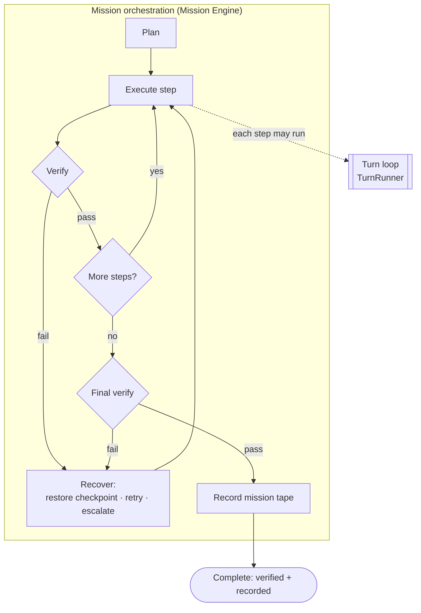
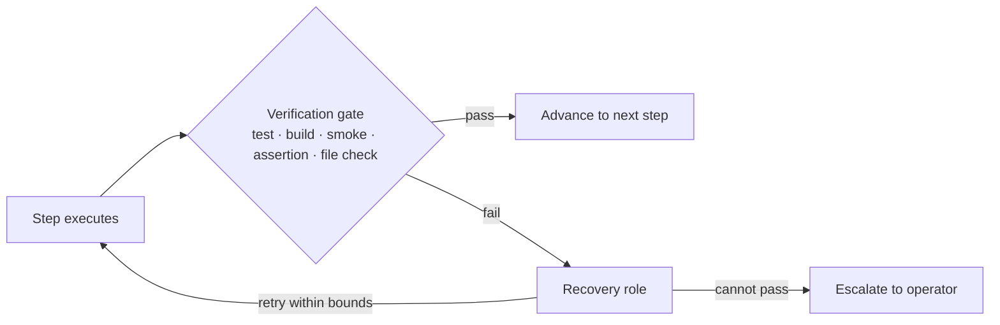
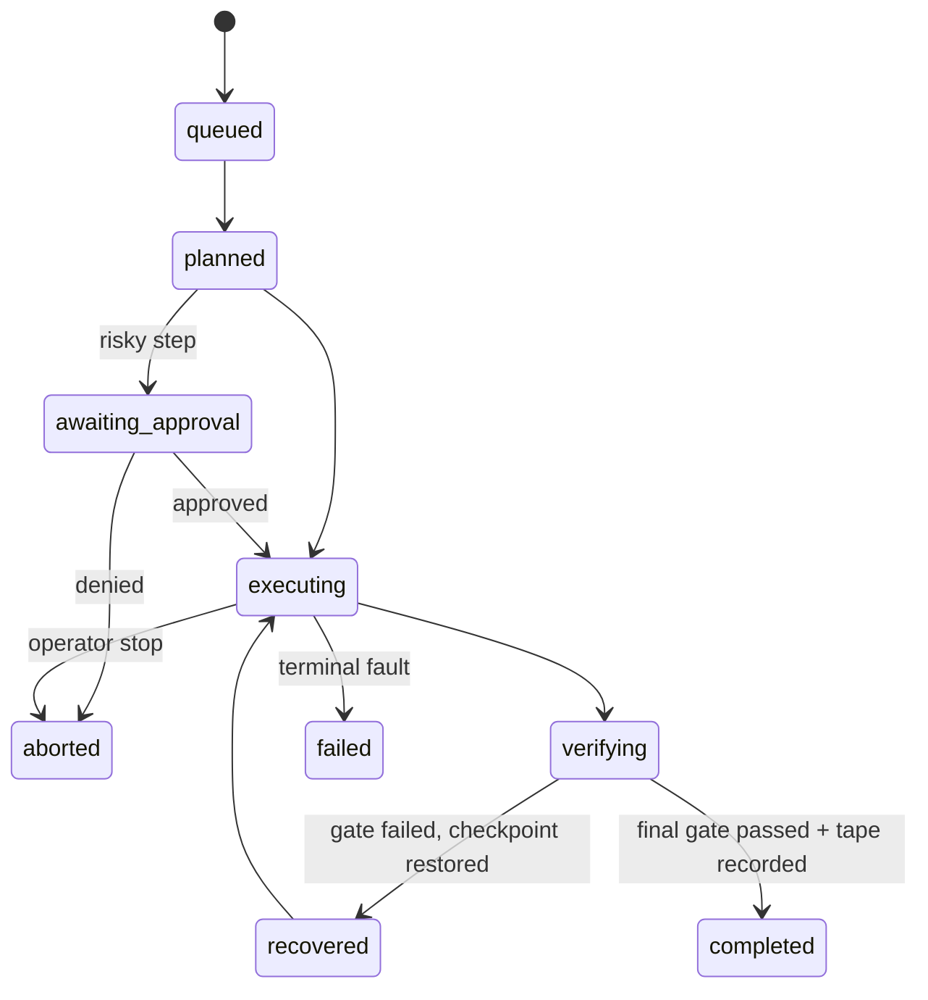

# 12 · The Mission Engine

> The deterministic discipline that carries a serious piece of work from intent to
> a recorded, verified outcome: plan, execute, verify, recover, record. Where the
> [turn loop](01-persistent-runtime.md) drives one exchange, mission orchestration
> — the [Mission Engine](../CROSSWALK.md#subsystem-crosswalk) in the code and the
> product — governs the multi-step work that sits above it.

This chapter specifies mission orchestration: the roles that plan and carry out a
mission, the Atomic Operation Contract each step must satisfy, the verification
gates that stand between "attempted" and "done," checkpoint and rollback, the
Deterministic Completion Rule, and the [audit trail](../CROSSWALK.md#subsystem-crosswalk)
— **Mission Tape** — that records what happened. It is the architectural home of
the Constitution's [Mission Doctrine](../01-constitution/README.md): *serious
missions follow plan → execute → verify → recover → record.* The generic name for
this tier is **mission orchestration**; the native subsystem is the **Mission
Engine** (`src/services/missionEngine/`), and its recorder is **Mission Tape**
(`src/services/missionTape/`).

## Why a tier above the turn loop

The [Persistent Runtime](01-persistent-runtime.md) already has a loop: the
TurnRunner streams from a Provider, executes any tool calls, feeds the results
back, and repeats until the model stops calling tools, bounded by a
max-tool-rounds cap. That loop is the right shape for a single interaction. It is
deliberately *not* the right shape for a mission.

The turn loop optimizes for one exchange finishing cleanly. It has no memory of a
plan, no notion of a step that must be verified before the next begins, no
checkpoint to fall back to when the fourth action fails, and no durable record of
why it did what it did. Ask it to "migrate the database, run the suite, and open a
PR" and it will improvise the whole arc inside one model context, with completion
meaning nothing more than "the model stopped emitting tool calls." That is a
plausible-looking outcome with no guarantee attached — the exact failure the
[honesty pillar](../STYLE-GUIDE.md) is meant to prevent.

Mission orchestration is the answer to a different question: *how do we carry a
multi-step, consequential piece of work to a verified end, and prove afterward
that it reached one?* It wraps the turn loop rather than replacing it. A mission
plans, then drives execution — often through several turns — checking each step
against an explicit contract, checkpointing as it goes, recovering when a step
fails, and refusing to call itself finished until verification passes and the
record is written.



Read the nesting deliberately: a mission step may *use* the turn loop to get its
work done, but the mission — not the loop — owns planning, verification,
recovery, and the completion decision.

## The five roles of the Mission Doctrine

The Mission Doctrine names five responsibilities. In the code these are separable
roles, not one monolith, which is what lets each be tested and reasoned about on
its own.

| Role | Responsibility |
|---|---|
| **Planner** | Converts an intent into an ordered set of atomic operations, each with an explicit verification contract. |
| **Executor** | Runs an approved operation through Tools, MCP, an [Embodiment](15-embodiment-layer.md) body, or host controls. |
| **Verifier** | Enforces deterministic checks — tests, build, smoke, assertions, file checks — on the result of each step. |
| **Recovery** | Restores a checkpoint, retries safely within bounds, or escalates when a step cannot be made to pass. |
| **Recorder** | Persists the Mission Tape: the steps, their evidence, the score, and the lessons. |

The canonical pipeline is the doctrine spelled out in full:

> intent → context scan → requirements extraction → plan → risk check →
> approval (if required) → execute atomic steps → verify each step →
> recover / retry if needed → final verify → record mission tape → report

Two of those stages are where mission orchestration meets the rest of the
Specification. The **risk check and approval** stage routes through
[Safety and Permissions](07-safety-and-permissions.md): a sensitive step waits on
the [permission gate](07-safety-and-permissions.md), a dangerous step waits on an
explicit operator decision, and an untrusted skill or browser flow defaults to a
[Sandbox Body](15-embodiment-layer.md). The **record** stage routes through
[Observability and Provenance](11-observability-and-provenance.md): the Mission
Tape is the mission-scoped face of the same accountability commitment that
provenance serves per action.

## The Atomic Operation Contract

The unit of a mission is not "a tool call" but an **atomic operation** with a
contract. The contract is what makes a step checkable rather than merely
attempted. Each step declares, before it runs:

```typescript
// Illustrative — the shape enforced by
// src/services/missionEngine/AtomicOperationUnit.ts
interface AtomicOperation {
  step_id: string;          // stable identifier for the step
  goal: string;             // what this step is meant to achieve
  tool_or_runtime: string;  // what will carry it out
  expected_output: string;  // what a success looks like
  verification: Check;      // the deterministic test that decides pass/fail
  rollback: Action;         // how to undo this step if the mission recovers
  risk_level: RiskLevel;    // feeds the guard / approval decision
}
```

The load-bearing fields are `verification` and `rollback`. A step without a
verification is a step that can only be *assumed* to have worked — precisely the
weakness the mission tier exists to remove. A step without a rollback is a step
the Recovery role cannot cleanly undo, which narrows recovery to retry-or-escalate
and forfeits checkpoint restoration for that step. The contract forces both to be
stated up front, so that "did it work?" and "how do we back this out?" are
answered at plan time, not improvised at failure time.

`risk_level` is the hook into the guard tier. A high-risk operation does not
silently execute; it pauses for a
[Luca Guard](07-safety-and-permissions.md) policy decision and, where the level
demands, an operator approval — the same fail-closed discipline the turn loop
already honors, applied at the granularity of a planned step.

## Verification gates

A **verification gate** is a deterministic check that stands between a step and
the step after it. "Deterministic" is the important word: the gate is a test, a
build result, a smoke check, an assertion, or a file check — something that
returns pass or fail on inspection of the world, not the model's own claim that
things went well. A model asserting success is not evidence; a passing test suite
is.



Gates appear in two places. A **pre-step** gate can verify that the world is in
the state a step assumes before the step runs
(`missionEngine/preStepVerificationGate.ts`), which is how a mission avoids acting
on a stale assumption. A **post-step** gate verifies the result. The final gate,
at the end of the mission, is the one the Deterministic Completion Rule turns on.

## Checkpoint and rollback

Long-running or risky missions checkpoint their state so that a failure late in
the mission does not force the whole arc to restart. A checkpoint
(`missionEngine/MissionCheckpointStore.ts`) captures enough to resume:

- the active plan index — which step the mission had reached;
- the tool and runtime context in force;
- the relevant file or state snapshots the next steps depend on;
- the model route in use;
- the latest successful verification;
- the recovery branch to take on the next failure.

When a step fails, the Recovery role's flow is fixed and boring by design:
*failure detected → classify the fault → restore from the last good checkpoint →
re-verify → continue or escalate.* Retries use bounded backoff with a terminal
failure state, so a mission cannot thrash forever on a step that will never pass —
the same principle as the turn loop's max-tool-rounds cap, expressed at the
mission scale. When retry within bounds cannot make a step's gate pass, the
mission escalates to the operator rather than declaring a false success or
looping.



## The Deterministic Completion Rule

The single rule that gives mission orchestration its value is about when a mission
is allowed to say it is done.

> **No mission is complete until its verification gates pass or an explicit
> operator override is recorded.**

A mission may be marked complete only when three things hold together: deterministic
verification passes (or an approved override exists and is recorded), the Mission
Tape is written, and the result is reported with its outcome and its evidence.
"The model said it finished" satisfies none of these. The completion decision is
gated in code (`missionTape/missionTapeCompletionGate.ts`,
`missionTape/missionCompletionReadiness.ts`), so completion is a checked state
transition rather than a narrative flourish.

This rule is the mission-tier analog of [failing closed](07-safety-and-permissions.md).
A gate that cannot be evaluated does not resolve to "probably fine"; it blocks
completion. An override is a legitimate escape hatch — an operator may decide a
gate is wrong or unnecessary — but the override is *recorded*, so the decision to
skip a check is itself auditable. The worst case for a legitimate mission is one
recorded override; the worst case the rule forbids is a mission that reports
success it never verified.

## Mission Tape: the auditable record

**Mission Tape** is the durable record of a mission: for each major step, what was
attempted, what verification decided, and the evidence behind that decision, plus
the mission's score and the lessons extracted from it
(`src/services/missionTape/`). Where [Provenance](11-observability-and-provenance.md)
records the lineage of a *single* side-effectful action — what requested it, on
whose authority, from what source — Mission Tape records the lineage of a whole
*mission*. The two are complementary halves of the same accountability commitment:
provenance makes one action auditable; Mission Tape makes a multi-step arc
auditable and, later, *learnable*.

That learnability is the second reason the tape exists. Because a completed
mission carries its trajectory, its verifications, and its outcome, the record is
the substrate later analysis reads to improve how missions are run — the input to
[guarded self-evolution](14-guarded-evolution.md), which analyzes Mission Tape to
propose bounded improvements. A tape is written once and read for two purposes:
accountability now, and improvement later.

Recording obeys the same durability contract as the rest of Luca's accountable
state ([Data and Storage](10-data-and-storage.md)): a tape the mission expects to
be durable reaches durable storage or fails loudly, because a record that silently
dropped entries would offer the appearance of accountability without its
substance. A recent correction consolidated recording onto a single shared
recorder (`missionTape/sharedMissionTapeRecorder.ts`) so that a recorded mission
is actually readable back, rather than scattered across per-caller instances.

## Honest status

Mission orchestration is the largest piece of doctrine the Foundation had not yet
absorbed, and it would be dishonest to present it as a finished, wired subsystem.
Today the Mission Engine is **largely scaffold pilots**, not a live orchestrator
sitting above every turn. `missionEngine/MissionEngineScaffold.ts` demonstrates
the intent → steps → verify → gated-complete arc; `AtomicOperationUnit.ts`
enforces the strict step contract; `MissionCheckpointStore.ts` implements
checkpoint and restore; `preStepVerificationGate.ts` represents verify-before-
execute; and on the recording side `missionTapeCompletionGate.ts`,
`attachMissionTapeReceipt.ts`, and `sharedMissionTapeRecorder.ts` are real. These
are genuine, tested building blocks — but they are pilots. The scaffold has no
non-test importers wiring it into the runtime's turn loop; the everyday path a
user's request travels is still the [turn loop](01-persistent-runtime.md), not a
governed mission.

Read that gap the way the [Specification README](README.md#reading-the-honesty-markers)
asks: the pieces are well-tested, and in this codebase well-tested has at times
been *inversely* correlated with being wired in. The contract this chapter fixes —
the five roles, the Atomic Operation Contract, the verification gates, the
Deterministic Completion Rule, and Mission Tape as the record — is the canonical
target. Wiring it above the turn loop, so that serious work actually runs as a
governed mission, is scheduled work; the [Roadmap](../06-roadmap/README.md) tracks
it. Naming the gap is the Specification doing its job, not a weakness in it.

## See also

- [Persistent Runtime](01-persistent-runtime.md) — the turn loop a mission step runs on and sits above
- [Safety and Permissions](07-safety-and-permissions.md) — the guard and approval the risk-check stage routes through
- [Observability and Provenance](11-observability-and-provenance.md) — per-action provenance, of which Mission Tape is the mission-scoped counterpart
- [Guarded Self-Evolution](14-guarded-evolution.md) — the analysis that reads Mission Tape to propose bounded improvements
- [Embodiment Layer](15-embodiment-layer.md) — the bodies a mission executes steps through, sandbox-by-default for risky work
- [Data and Storage](10-data-and-storage.md) — the durability contract Mission Tape recording must meet
- [Crosswalk](../CROSSWALK.md) — mission orchestration ↔ Mission Engine; audit trail ↔ Mission Tape
- [The Roadmap](../06-roadmap/README.md) — where the scaffold-to-wired gap closes
