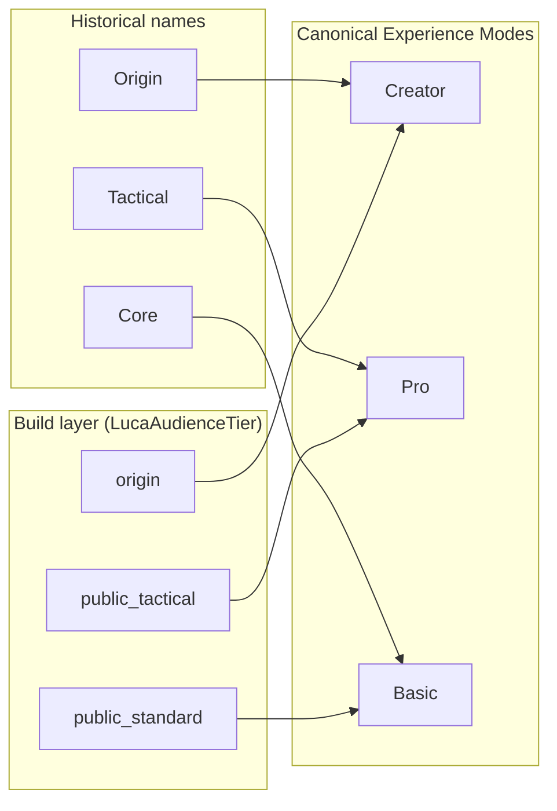
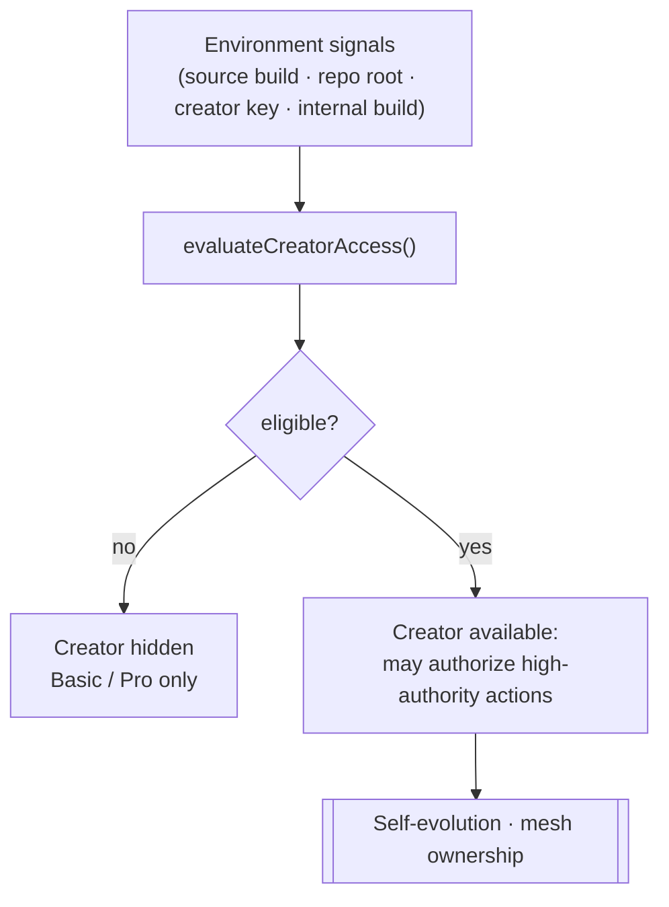

# 13 · Operating Modes

> The three Experience Modes — **Creator**, **Pro**, **Basic** — through which the
> one Luca meets different users. Modes change **density, disclosure, and
> authority**, not loudness. This chapter fixes the canonical naming, reconciles
> the three historical vocabularies, and connects the Creator tier's
> source-authority to the safety layer, so that the generic "operator" is
> understood as **tier-scoped**, not uniform.

This chapter specifies operating modes: what a mode is and is not, the canonical
Creator / Pro / Basic naming and how it maps onto the older names still present in
the code and docs, the source-authority tier that gates high-authority actions,
and the relationship between a mode and the [permission gate](07-safety-and-permissions.md).
The generic term is **operating modes** or **experience tiers**; the native,
code-backed source of truth is **Experience Modes**
(`src/experience/experienceMode.ts`), layered over the build vocabulary in
`src/config/layerBoundary.ts`.

## What a mode is — and what it is not

An Experience Mode is a coherent posture for how much of Luca's operational depth
is *disclosed*, how *densely* a Surface presents it, and — the part most easily
missed — how much *authority* the user at that Surface holds. It is the same one
Luca throughout. A mode does not fork identity, memory, or capability into
separate assistants; it decides how much of the single system is surfaced and what
that user is permitted to do with it.

The one thing a mode is emphatically *not* is a skin or a volume knob. LucaOS is
**calm by default in every mode**. There is no "tactical" mode that turns Luca into
a cyberpunk console, no mode that trades calm for spectacle. The
[design system](../03-design-system/README.md) makes this a hard rule: power is
revealed progressively through density and disclosure, never through louder
visuals. Cyber effects are available in exactly one mode and are **off by default
even there**.

> A mode changes what is *shown* and what is *permitted*, never how *loud* Luca is.

## The canonical naming, and the three vocabularies it reconciles

Three different names have referred to the same three tiers across the history of
LucaOS. This chapter states the canonical set and maps the others onto it, so the
Foundation, the older `docs/`, and the source all resolve to one vocabulary.

| Canonical (Experience Mode) | Constitution-era name | Build layer (`LucaAudienceTier`) | For whom |
|---|---|---|---|
| **Basic** | Core | `public_standard` | Everyday users — a calm, friendly personal AI. |
| **Pro** | Tactical | `public_tactical` | Builders, developers, analysts, power users — capable and clean. |
| **Creator** | Origin | `origin` | LucaOS builders and maintainers — full diagnostics and governance authority. |

**Creator / Pro / Basic is canonical.** The earlier Origin / Tactical / Core names
(used in the [Constitution's Operating Modes section](../01-constitution/README.md))
and the build-layer `origin` / `public_tactical` / `public_standard` values are
both retained as recognized synonyms, because they are live in code, but new prose
uses the canonical names. The canonical string form is lowercase —
`"basic" | "pro" | "creator"` (`LucaExperienceMode`). The mapping is not
aspirational: `mapLegacyTierToExperienceMode` in `experienceMode.ts` accepts both
the conceptual names and the `LucaAudienceTier` values and normalizes them, and
round-trip helpers (`experienceModeToAudienceTier` / `audienceTierToExperienceMode`)
keep the model and the build layer in sync. Unknown input falls back to the calm
default, `basic`.



## The three modes

### Basic

The calm default. Simple chat and voice; a friendly, human-readable view of
[Memory](03-memory-architecture.md) ("what Luca knows about you"); simple device
linking as approve-or-deny; minimal diagnostics; fewer tools in the panels; no
cyber, hacker, or tactical surfaces at all. Basic is what an everyday user meets,
and it is a complete, unembarrassed product on its own — not a crippled version of
something fuller.

### Pro

The advanced-user posture. Local, cloud, and BYOK model controls; developer tools;
browser, code, and workspace modes; advanced [LucaLink](09-continuity-and-sync.md)
controls; runtime health and diagnostics. More is *visible* than in Basic — but it
stays premium and clean, denser rather than louder. Pro is for people who want to
see and steer the machinery; it is still the same calm Luca.

### Creator

The source-authority posture, for the people who build and maintain LucaOS itself.
Creator exposes the full operational depth: runtime graph, model-router internals,
memory audit, [LucaLink](09-continuity-and-sync.md) mesh and trust matrix,
[Mission Engine](12-mission-engine.md) mission control and traces, and — where they
exist — [self-evolution](14-guarded-evolution.md) proposals. Crucially, Creator is
**not a manual admin override toggle**. Luca remains autonomous; Creator is the
tier at which a source-authority operator can inspect, approve, edit, reject, stop,
or override *high-authority* actions:

> Luca proposes → Creator approves / edits / rejects → Luca executes inside
> constraints → Creator can inspect, stop, or override high-authority actions.

## Modes are chosen, never imposed

The user is never forced into a mode. After install, Luca may run a
privacy-respecting local capability scan and *recommend* Basic or Pro — with a
plain-language reason ("Pro — Luca detected developer tools, local model
compatibility, and sufficient memory") — but the final choice is the user's. The
scan is local, explainable, and deliberately not overreaching; it never
auto-selects. Only Basic and Pro appear as onboarding cards
(`getOnboardingSelectableModes()` returns exactly those two). A user may switch
between Basic and Pro at any time from Settings; switching to Basic *hides*
advanced surfaces without deleting a single tool, setting, memory, or capability.

Creator is different in kind, and that difference is the subject of the next
section.

## The Creator source-authority tier gates authority, not just visibility

This is the part the Foundation's earlier safety chapters missed by treating every
human as one undifferentiated "operator." A mode does not only change what a
Surface *shows*; the Creator tier changes what its operator is *permitted to
authorize*. Some actions are **high-authority** — they are not merely gated,
they require an operator who holds source authority:

- **Guarded self-evolution.** Luca proposing and promoting changes to its own
  prompts, routing heuristics, or skill instructions is a Creator/Origin-only
  workflow ([Guarded Self-Evolution](14-guarded-evolution.md)). A Basic or Pro
  operator cannot authorize Luca to modify itself, no matter what a card offers.
- **Mesh ownership.** The `owner`/`admin` rungs of the
  [LucaLink](09-continuity-and-sync.md) trust ladder — the authority to change the
  device mesh's shape, not merely to use it — are high-authority.

Creator does **not** unlock on a user's say-so. It becomes available only when
LucaOS detects trusted source-authority signals, expressed as the
`CreatorAccessState` contract in `experienceMode.ts`:

```typescript
// Illustrative — the design contract in src/experience/experienceMode.ts
interface CreatorAccessState {
  eligible: boolean;            // the single field UI gates on
  sourceBuild: boolean;         // running from a source / dev (ORIGIN) build
  repoRootDetected: boolean;    // a developer checkout is present
  creatorConfigPresent: boolean;
  trustedCreatorKey: boolean;
  internalBuild: boolean;
  reason: string;               // human-readable explanation
}
```

`evaluateCreatorAccess(signals)` is pure: `eligible` is true only when some trusted
marker is present, and a normal Basic or Pro user has none. `canShowCreatorMode`
hides Creator entirely when not eligible. Creator is therefore not a setting a user
turns on — it is a property of the environment Luca is running in.



## The operator is tier-scoped: reconciling with the safety layer

[Safety and Permissions](07-safety-and-permissions.md) is written around "the
operator" — the human who resolves the [permission gate](07-safety-and-permissions.md).
That chapter's discipline is exactly right and does not change: consent is a fresh
operator decision, never transcript text; the gate is unconditional; a gate that
cannot be reached fails closed. Operating modes add one refinement to that model,
and it is important: **the operator is not uniform — the operator is tier-scoped.**

Read the two chapters together this way. The permission gate answers *did this
operator authorize this action?* The mode tier answers a prior question for
high-authority actions: *is this operator the kind who is permitted to authorize
this class of action at all?* A high-authority action requires both — an eligible
Creator tier and an explicit gate decision. A Basic operator clicking approve on a
prompt cannot promote a self-evolution, not because the click failed, but because
the action was never theirs to authorize. Authority is layered: the mode tier
establishes the ceiling of what an operator may authorize; the gate resolves each
specific authorization within that ceiling.

This closes a real gap. Without the tier distinction, "the operator approved it"
would read the same whether the operator was an everyday Basic user or a
source-authority Creator — and self-evolution or mesh-ownership changes would
appear authorizable by anyone who happened to be at the keyboard. The tier makes
the ceiling explicit, so the safety layer's single "operator" is understood as a
role with a scope, not a universal key.

## Honest status

The Experience Mode model is a **typed, tested source of truth, not yet a wired end-user experience**. `experienceMode.ts` provides the mode type, the legacy
mapping, the onboarding-selectable set, the `CreatorAccessState` contract, and the
per-mode visual defaults as pure, tested helpers. What is deliberately *deferred*
is the behavior those helpers are meant to drive: the first-run onboarding cards
and capability-scan service, the Settings mode switch, feeding the persisted mode
through to the Header (the `tier` prop still defaults to `BASIC` because no
persisted mode source is wired into `App` yet), the per-mode dashboard gating, and
— most security-sensitive — the Creator key and signed-profile infrastructure
(`trustedCreatorKey` exists as a contract field but populating it safely is not
implemented). Do not read this chapter as "modes are implemented." Read it as the
single canonical model that later work — onboarding, gating, the switch, and
Creator access — must implement consistently. The [Roadmap](../06-roadmap/README.md)
carries that work.

## See also

- [Safety and Permissions](07-safety-and-permissions.md) — the permission gate the tier scopes; the operator is tier-scoped, not uniform
- [Guarded Self-Evolution](14-guarded-evolution.md) — the Creator/Origin-only high-authority workflow the tier gates
- [Continuity and Sync](09-continuity-and-sync.md) — the LucaLink trust ladder whose ownership rungs are high-authority
- [The Constitution](../01-constitution/README.md) — the Operating Modes doctrine (Origin / Tactical / Core) this chapter renames
- [Design System](../03-design-system/README.md) — density and disclosure, not loudness; calm in every mode
- [Crosswalk](../CROSSWALK.md) — Experience Modes: Creator / Pro / Basic (was Origin / Tactical / Core; build layer origin / public_tactical / public_standard)
- [The Roadmap](../06-roadmap/README.md) — where mode selection, gating, and Creator access are wired
