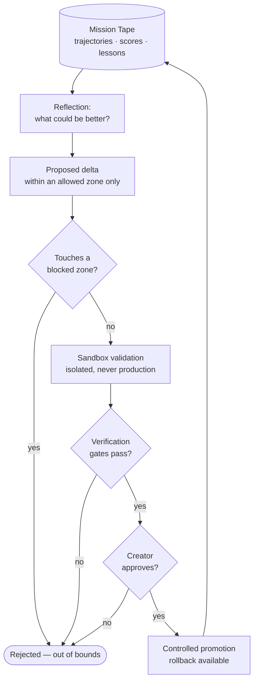

# 14 · Guarded Self-Evolution

> Luca may improve itself — but only inside a Creator/Origin workflow, only in a
> sandbox, only with verification passing, only with rollback available, and never
> as an autonomous public mutation. This chapter specifies that boundary: what
> Luca may tune, what it may never touch, and the gated loop between the two. The
> generic name is **guarded self-evolution**; the native subsystem is the
> **Evolution Core / Neural Self-Repair** (`src/services/evolution/`,
> `neuralSelfRepairService.ts`).

This chapter specifies the discipline of self-improvement: the constitutional
principle that bounds it, the allowed mutation zones and the blocked ones, the
sandbox-and-verification loop that stands between a proposal and a promotion, and
an honest account of how little of this is wired today. Guarded self-evolution is
the architectural form of the Constitution's eighth principle —
[guarded evolution only](../01-constitution/README.md) — and it depends on both
the [Mission Engine](12-mission-engine.md) (whose Mission Tape is the evidence it
reads) and [Operating Modes](13-operating-modes.md) (whose Creator tier is the
only place it may run).

## Why self-improvement must be bounded before it is built

A system that can act in the user's world and can also modify *itself* is a
categorically different risk than one that can only act. An unbounded
self-modifying agent could, in principle, tune away its own safety checks, weaken
its own permission model, or promote an untested change into the path every future
action travels. The point of this chapter is to make that class of outcome
*structurally* impossible before any capable self-improvement exists — to draw the
fence first and build inside it, rather than build the capability and hope to fence
it later.

The bound is not a reluctant limit on an otherwise desirable autonomy. It is the
condition that makes self-improvement acceptable at all. Luca is allowed to get
better at what it does; it is not allowed to change *what it is permitted to do* on
its own authority. Those are different things, and the whole design turns on
keeping them apart.

> Self-improvement refines competence within fixed limits. It never moves the
> limits.

## The hard boundary

The Constitution states the principle plainly: **self-improvement is restricted to
Origin workflows.** Rendered into the canonical [mode](13-operating-modes.md)
vocabulary and expanded into its full conditions, the boundary is:

Self-evolution is permitted **only** when *all* of the following hold —

1. it runs inside a **Creator/Origin** workflow (never Basic or Pro);
2. every proposed change is **sandboxed** and validated in isolation before it is
   considered;
3. **verification gates pass** on the change, deterministically;
4. **rollback is available** for the change, so a promotion can be cleanly undone;
5. a source-authority **Creator approves** the promotion.

— and it is **never** an autonomous public mutation. There is no path in which
Luca, running in front of an everyday user, silently rewrites part of itself and
ships the change into production. That sentence is the whole chapter; everything
else is how it is enforced.

## Allowed mutation zones, and blocked ones

The boundary is enforced first by *scope*: only certain kinds of change are even
eligible to be proposed. The allowed zones are the soft, tunable surfaces of
Luca's behavior — the places where "get better" means refining a heuristic, not
altering a guarantee.

| Allowed mutation zones | Blocked zones (no self-mutation) |
|---|---|
| Prompt and rule tuning | Security-bypass behavior |
| Recovery policies | Permission-model weakening |
| Tool descriptions | Unverified production self-mutation |
| Routing heuristics | |
| Skill instruction refinements | |

The two columns are chosen along one axis: whether a change could weaken a safety
guarantee. Refining how Luca describes a Tool, or which model it prefers for a
class of task, or how it phrases a recovery step, cannot by itself make an unsafe
action authorizable — those are competence tunings. Anything that touches the
[permission model](07-safety-and-permissions.md), disables a guard, or promotes an
unverified change into production *can*, and is therefore off the table for
self-evolution entirely — not gated more heavily, but excluded from the set of
things evolution may propose. The blocked zones are not "require extra approval";
they are "self-evolution does not get to touch these, and a change that reaches
into one is rejected regardless of who approves the surrounding proposal."

This is the same shape as the safety layer's
[category floors](07-safety-and-permissions.md#category-security-floors): coverage
that does not depend on anyone remembering to add a rule. A proposed delta that
reaches into a blocked zone is refused by construction, so evolution cannot weaken
safety by omission any more than a dangerous Tool can ship ungated by omission.

## The evolution loop

Within the allowed zones, self-improvement proceeds as a gated loop that reads the
[Mission Engine's](12-mission-engine.md) Mission Tape and ends — if it ends at all
— in a controlled promotion. Every stage is a checkpoint that can stop the change.

Read the loop as a sequence of *veto points*, not a pipeline that flows unless
stopped. Mission Tape analysis and reflection produce a candidate improvement; the
zone check rejects anything out of bounds; sandbox validation runs the change in
isolation, never against production; verification gates must pass deterministically,
the same standard the [Mission Engine](12-mission-engine.md) applies to any step;
and only then does a source-authority Creator decide whether to promote it. A
change that clears every point is promoted *with rollback available*, and its
effect feeds back into the next round of missions, whose tape the next reflection
reads. The loop learns; it never learns its way past the fence.

## How the guards compose

Guarded self-evolution is not a standalone safety system. It is the composition of
guarantees already specified elsewhere, aimed inward at Luca itself:

- **The mode tier** ([Operating Modes](13-operating-modes.md)) supplies condition
  1 — evolution is a high-authority action, so only an eligible Creator tier may
  authorize a promotion. A Basic or Pro operator cannot promote a self-change,
  because it was never theirs to authorize.
- **The [Embodiment Layer](15-embodiment-layer.md)** supplies condition 2 — the
  sandbox. The Embodiment Doctrine's rule that *risky experimentation and evolution
  default to a Sandbox Body, not Direct Host* is exactly the isolation self-
  evolution requires. Validation happens in a Sandbox Body, so a bad proposal
  cannot touch the live Host while it is being evaluated.
- **The [Mission Engine's](12-mission-engine.md)** verification gates supply
  condition 3, and its checkpoint/rollback supplies condition 4.
- **[Observability and Provenance](11-observability-and-provenance.md)** records
  the whole thing, so that a promotion — like any consequential action — carries
  the lineage of who approved it and on what evidence.

The blocked zones are what keep this composition honest: because self-evolution may
never touch the permission model or a guard, it cannot use its own loop to loosen
the very guarantees the loop depends on. The fence does not contain a gate that
opens onto the fence's own hinges.

## Honest status

This is the chapter where honesty matters most, because the gap between the
principle and the implementation is the widest in the Specification. The boundary
above is a **constitutional target and a bounded design, not a live capability.**

The codebase contains the vocabulary of self-evolution: a `selfEvolutionLoop`
(`src/services/selfEvolutionLoop.ts`), a neural self-repair service
(`neuralSelfRepairService.ts`), and a substantial, well-tested set of governance
scaffolding under `src/services/evolution/` — proposal inboxes, run gates, tier-
compatibility checks, external-artifact gates, an Origin evolution control service.
But the operative self-evolution loop is **largely un-wired**: it has no non-test
importers pulling it into the runtime, which in this codebase is the tell that a
module is a target rather than a live path. Luca does **not** improve itself in
production today. There is no autonomous public mutation to guard against right
now — which is the safe state, and the correct one to be in while the guards are
still being built.

Frame the current state precisely: the *fence* is being specified and, in the
governance scaffolding, partly built, ahead of the *capability* it will contain.
That ordering is deliberate and is the right one. The danger to avoid is the
inverse — a working self-modification path arriving before its bounds — and this
chapter, together with the blocked-zone list and the mode/sandbox/verification/
rollback conditions, exists so that any future wiring of `selfEvolutionLoop` has a
canonical boundary to be held to. When that wiring happens, it happens inside this
fence or it does not happen. The [Roadmap](../06-roadmap/README.md) tracks the
progression from scaffold to a bounded, Creator-only, sandboxed, verified,
reversible capability — and never past it.

## See also

- [Operating Modes](13-operating-modes.md) — the Creator/Origin tier that is the only place evolution may run
- [The Mission Engine](12-mission-engine.md) — Mission Tape is the evidence evolution reads; its verification gates are reused
- [Embodiment Layer](15-embodiment-layer.md) — the Sandbox Body that isolates a proposal from the live Host
- [Safety and Permissions](07-safety-and-permissions.md) — the permission model self-evolution may never touch
- [Observability and Provenance](11-observability-and-provenance.md) — the lineage a promotion carries
- [The Constitution](../01-constitution/README.md) — the "guarded evolution only" principle this chapter makes concrete
- [Crosswalk](../CROSSWALK.md) — guarded self-evolution ↔ Evolution Core / Neural Self-Repair
- [The Roadmap](../06-roadmap/README.md) — scaffold to bounded capability, never past the fence
