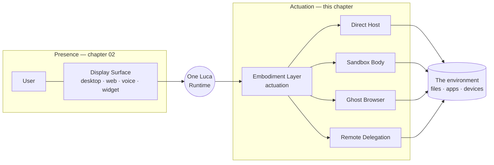
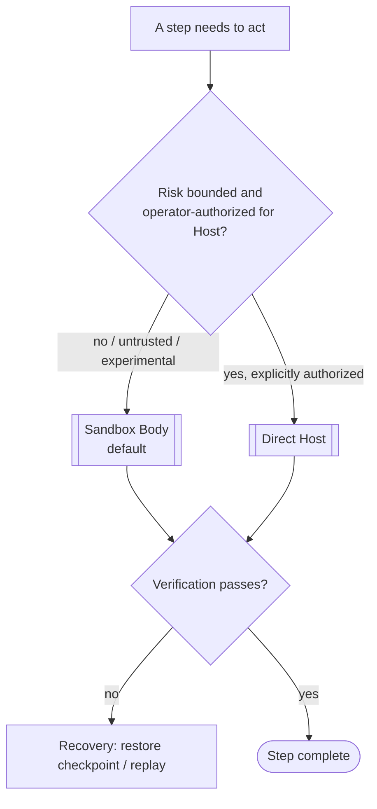

# 15 · The Embodiment Layer

> How Luca **acts on** environments — the actuation tier. This is a distinct
> subsystem from the display Surfaces of
> [Identity and Embodiment](02-identity-and-embodiment.md): that chapter is about
> how Luca is *present*; this one is about how Luca *does things*. Its central
> safety rule is that risky work defaults to a **Sandbox Body**, not the
> **Direct Host**. The generic name is the **actuation layer**; the native
> subsystem is the **Embodiment Layer** (`src/services/computerUse/`).

This chapter specifies the actuation tier: the term collision it resolves, the
four execution bodies Luca can act through, the sandbox-by-default safety rule,
how execution integrates with the [Mission Engine](12-mission-engine.md), and the
verification-first, checkpoint/replay, cursor-guided grounding that make
computer-use reliable. It is the architectural form of the Constitution's
[Embodiment Doctrine](../01-constitution/README.md) and sits directly downstream
of [Safety and Permissions](07-safety-and-permissions.md).

## Resolving the term collision: actuation, not presence

"Embodiment" means two different things across LucaOS's documents, and conflating
them hides a whole safety-critical subsystem. The
[Crosswalk](../CROSSWALK.md#term-collision-resolutions) fixes the two meanings, and
this chapter owns the second:

- In [Identity and Embodiment](02-identity-and-embodiment.md), an *embodiment* is a
  **display Surface** — desktop, web, voice, widget — a body the one Luca is
  **present through**. That chapter answers *how is Luca here?*
- In this chapter, the **Embodiment Layer** is the **actuation tier** — the set of
  execution bodies Luca **acts on the world through**. It answers *how does Luca do
  the thing?*

The two are genuinely distinct. A user meets Luca on a display Surface; Luca then
reaches through an execution body to change something — click a button, run a
command, drive a browser, delegate to another device. A Surface renders shared
state and holds nothing but view state; an execution body carries side effects.
The Foundation's first draft documented the Surfaces and omitted the actuation
tier entirely — and with it the safety rule that risky work must not run on the
live Host. This chapter restores it.

## The Embodiment Layer is not the product

Before enumerating the bodies, one framing from the
[Capability and Tool Layer](05-capability-and-tool-layer.md) carries directly into
this chapter and constrains it: **Computer-Use is one Tool among many, not the
product.** Driving a graphical computer is the most visible thing the actuation
tier can do, and precisely because it is visible it is the easiest to mistake for
Luca's identity — a screen-driving robot the user watches. The manifesto's test
forbids that: anything that turns Luca into a destination the user opens is
drifting from [Presence](../00-manifesto/03-presence-is-the-product.md). The
Embodiment Layer is a set of *verbs* Luca reaches for when a task needs them, and
Luca reaches for the narrowest safe body a task allows. Actuation is how Luca acts;
it is not what Luca is.

## The four execution bodies

Luca can act through four kinds of body, ordered here roughly from most direct
(and most consequential) to most delegated.

| Body | What it is | Typical use |
|---|---|---|
| **Direct Host** | Luca acts directly on the operator's own host — its files, apps, and OS, under strict guard controls. | Trusted work on the user's machine that the operator has authorized. |
| **Sandbox Body** | Luca acts inside an isolated VM, container, or device environment. | Risky, experimental, or untrusted work — the default for anything that could damage the Host. |
| **Ghost Browser** | Luca acts through an isolated browser runtime rather than the user's primary browser session. | Web automation and navigation, kept off the user's real session and cookies. |
| **Remote Delegation** | Luca delegates the work through [LucaLink](09-continuity-and-sync.md) to another trusted body. | Work that belongs on a different, trusted device in the mesh. |

Each body is a different answer to *where do the side effects land, and what is
exposed if the work goes wrong?* Direct Host exposes the user's live machine.
Sandbox Body exposes only a disposable environment. Ghost Browser exposes a browser
runtime but not the user's real session. Remote Delegation moves the work to a body
chosen for the job, gated by the LucaLink trust ladder. The choice of body is a
safety decision, not a convenience one.

## The safety rule: sandbox by default for risky work

The single load-bearing rule of this chapter is where risky work runs.

> **Risky experimentation, untrusted flows, and self-evolution default to a
> Sandbox Body — never the Direct Host.**

This is the Embodiment Doctrine's safety requirement, and it is not advisory. When
a step's risk cannot be bounded — an untrusted skill, an experimental action, a
[self-evolution](14-guarded-evolution.md) validation — the default execution body
is the Sandbox Body, and reaching the Direct Host for such work requires an
explicit, deliberate operator decision through the
[permission gate](07-safety-and-permissions.md), not a silent fall-through. The
[Mission Engine](12-mission-engine.md) encodes this at plan time: an untrusted
skill or browser flow is routed to the sandbox lane by default.

The rule composes with the rest of the Specification the way a good default
should: it fails safe. The conservative direction — sandbox — is what happens when
no one has made an affirmative decision to accept Host-level risk, mirroring the
safety layer's [fail-closed](07-safety-and-permissions.md#fail-closed) discipline
and the Tool executor's default-to-serialize posture. Omission lands on the safe
body.

## Mission-Engine-integrated step execution

The Embodiment Layer does not run free. Its actions are the executor role of a
[mission](12-mission-engine.md): each thing Luca does through a body is a step with
an [Atomic Operation Contract](12-mission-engine.md#the-atomic-operation-contract)
— a `goal`, an `expected_output`, a `verification`, a `rollback`, and a
`risk_level`. That integration is what turns raw computer-use into governed
computer-use.

- **Verification-first completion.** A body-executed step is not "done" when the
  action returns; it is done when its verification gate passes. Clicking a button
  is an attempt; confirming the resulting state is completion. This is the
  [Deterministic Completion Rule](12-mission-engine.md#the-deterministic-completion-rule)
  applied to actuation — the model's belief that it clicked the right thing is not
  evidence that it did.
- **Checkpoint and replay.** Long or risky trajectories checkpoint their state so a
  failure can [restore and resume](12-mission-engine.md#checkpoint-and-rollback)
  rather than restart, and so a trajectory can be replayed. Replay is what makes a
  UI-driving sequence debuggable and auditable instead of a one-shot black box.
- **`risk_level` drives the body choice.** A step's declared risk is what routes it
  to the Sandbox Body or, with explicit authorization, the Direct Host — the safety
  rule above, encoded per step rather than assumed globally.

The primitives the executor works in — cursor, keyboard, window, and screenshot
operations — are the vocabulary of GUI actuation, but they are dispatched *through*
the mission's contract and the [Tool layer's](05-capability-and-tool-layer.md)
gating, not around them. An MCP- or computer-use-provided action is not a
privileged special case; it flows through the same registry, the same permission
gate, and the same provenance recording as any other Tool.

## Cursor-guided grounding

Driving a complex visual interface reliably is hard because the screen is
ambiguous: many elements look plausible, and a model reasoning over a full
screenshot can hallucinate the wrong target. The Embodiment Layer reduces that
ambiguity with **cursor-guided grounding** — treating the user's cursor, selection,
and attention as high-value spatial context.

The principle is to convert local human intent into a mission anchor. Where the
user's cursor rests, what is selected, which control has focus — these are strong
signals about *where* the work is meant to happen, and folding them into the
step's context narrows a global-screen guess to a local, grounded one. The intended
effect is more reliable execution on complex UIs and fewer hallucinated
interactions, because the model is reasoning about the region the human is already
pointing at rather than the whole display. Grounding is context, not authority: the
cursor tells Luca *where to look*, while the [permission gate](07-safety-and-permissions.md)
still decides *whether to act* — spatial grounding never substitutes for consent.

## Honest status

The actuation tier is real but partial. The four bodies are the canonical target;
what is live today is closer to **sandbox pilots and browser-runtime scaffolding**
than a fully governed four-body executor wired above every mission.
`src/services/computerUse/` contains genuine, tested pieces — sandbox executor and
browser adapters (`ComputerUseSandboxExecutorAdapter`,
`ComputerUseSandboxBrowserAdapter`), a sandbox pilot (`computerUseSandboxPilot.ts`),
and a set of guarded browser-runtime router bridges — but these are building blocks,
and much of the mission-integrated execution they are meant to serve rides on the
[Mission Engine scaffold](12-mission-engine.md#honest-status), which is itself not
yet wired into the runtime's turn loop. Cursor-guided grounding is specified here as
a design principle with a clear expected outcome; treat it as a target for the
grounding of computer-use reasoning, not a claim that every UI interaction is
cursor-anchored today.

The contract this chapter fixes does not depend on that wiring being finished: the
term-collision resolution (actuation, not presence), the four bodies, the
sandbox-by-default rule, verification-first completion, and grounding as context-not-
authority are the canonical shape the implementation is held to. The gap between
that shape and the current pilots is [Roadmap](../06-roadmap/README.md) work, named
plainly rather than papered over — and the safety rule in particular is the piece
that must be honored first, because it is the one whose absence would let risky work
reach the live Host by default.

## See also

- [Identity and Embodiment](02-identity-and-embodiment.md) — the *other* embodiment: display Surfaces (presence), distinct from this actuation tier
- [Capability and Tool Layer](05-capability-and-tool-layer.md) — Computer-Use as one Tool among many, dispatched and gated like any other
- [Safety and Permissions](07-safety-and-permissions.md) — the gate every body-executed side effect passes; fail-closed defaults
- [The Mission Engine](12-mission-engine.md) — the executor role, the Atomic Operation Contract, verification-first completion, checkpoint/replay
- [Guarded Self-Evolution](14-guarded-evolution.md) — why evolution validates in a Sandbox Body, never the Direct Host
- [Continuity and Sync](09-continuity-and-sync.md) — the LucaLink trust ladder that gates Remote Delegation
- [Crosswalk](../CROSSWALK.md) — actuation ↔ Embodiment Layer; sandbox-body-by-default for risky work
- [The Roadmap](../06-roadmap/README.md) — where the sandbox pilots become a governed four-body executor
