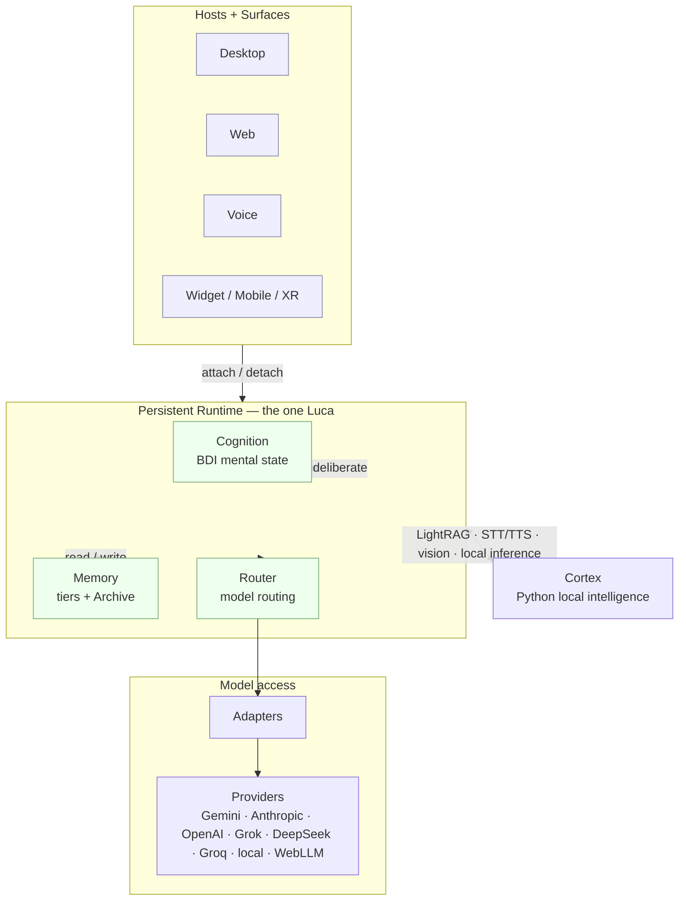

# 02 · Specification

The Specification is the _how_ of LucaOS. Where the [Manifesto](../00-manifesto/README.md)
says what LucaOS is for and the [Constitution](../01-constitution/README.md) says
what must always be true, the Specification describes the architecture that makes
those obligations concrete: the layers, the subsystems, the seams between them,
and the honest state of each today.

## What this section is

The Constitution is deliberately abstract. It says memory belongs to Luca; it does
not say which table stores it. It says the Runtime outlives every Surface; it does
not say which process binds which port. The Specification is where those
[Invariants](../01-constitution/01-the-eight-invariants.md) become buildable.

Read this section as an engineering handbook, not a product tour. Each chapter
names files, types, and boundaries. Each is honest about the gap between the
canonical target and the current implementation, and links the
[Roadmap](../06-roadmap/README.md) where that gap is scheduled to close. A chapter
that claimed a subsystem was finished when it was not would violate the same trust
the Constitution is built to protect.

## How the Specification relates to the Constitution

The Constitution states eight properties that must always hold. The Specification
makes each of them a place in the architecture you can point at, change, and test.
The relationship is direct:

| Invariant | Made concrete in |
|---|---|
| 1 — One Luca Identity | [02 · Identity and Embodiment](02-identity-and-embodiment.md) |
| 2 — Persistent Runtime | [01 · Persistent Runtime](01-persistent-runtime.md) |
| 3 — Shared Memory | [03 · Memory Architecture](03-memory-architecture.md) |
| 4 — Provider Abstraction | [04 · Provider Abstraction](04-provider-abstraction.md) |
| 5 — Cross-Surface Continuity | [06 · Surface Layer](06-surface-layer.md), [09 · Continuity and Sync](09-continuity-and-sync.md) |
| 6 — Strong Typing and Modularity | Every chapter's typed seams; the [Capability and Tool Layer](05-capability-and-tool-layer.md) in particular |
| 7 — Backward Compatibility | [10 · Data and Storage](10-data-and-storage.md) |
| 8 — Security and Explicit Permissions | [07 · Safety and Permissions](07-safety-and-permissions.md), [11 · Observability and Provenance](11-observability-and-provenance.md) |

When you implement against a chapter, keep the Invariant it serves in view. The
chapter tells you how the system is shaped; the Invariant tells you which
deviations are bugs and which are merely style.

## The layered architecture

LucaOS is layered so that the one Luca is insulated from the things that change
underneath and around it. Hosts and Surfaces change (a new device, a new modality);
Providers change (a new model, a better price); Tools change constantly. The
[Runtime](01-persistent-runtime.md) and Luca's identity in the middle do not change
when those do. Every layer boundary is a place where an Invariant is defended.

Read the diagram top to bottom as _who Luca faces_ and bottom to top as _what
Luca stands on_. Surfaces are how a user meets Luca; they attach to and detach
from the Runtime without being Luca. The Runtime is the continuous self: it holds
cognition, memory, and routing. Beneath it, Adapters translate for interchangeable
Providers. Alongside it, the [Cortex](08-cortex-and-local-intelligence.md) supplies
local intelligence and degrades gracefully when absent.

The direction of dependency matters as much as the boxes. Everything points
_inward and downward_ toward one Luca and away from vendor detail. Nothing above
the [Adapter](../GLOSSARY.md) is permitted to know which Provider answered, and
nothing in a Surface is permitted to hold identity or memory the other Surfaces
cannot see. Those two rules are [Invariant 4](../01-constitution/01-the-eight-invariants.md#invariant-4--provider-abstraction)
and [Invariant 1](../01-constitution/01-the-eight-invariants.md#invariant-1--one-luca-identity)
drawn as arrows.

> **Naming note.** This section uses generic, code-portable terms as primary
> (Runtime, Router, the permission gate, Surface) and bridges them to LucaOS's
> native subsystem names via the [Crosswalk](../CROSSWALK.md) — e.g. the permission
> gate is **Luca Guard**, mission orchestration is the **Mission Engine**, the
> Archive's editable face is the **Memory Vault**. Consult the Crosswalk when a
> term here differs from what the code or the older `docs/` call the same thing.

## The chapters

| # | Chapter | In one line |
|---|---|---|
| 00 | [System Overview](00-system-overview.md) | The whole system in one chapter: layers, deployment topology, and the path of a single request. |
| 01 | [Persistent Runtime](01-persistent-runtime.md) | The process that keeps Luca alive between Surfaces: lifecycle, the turn loop, fast-listen boot, single-instance. |
| 02 | [Identity and Embodiment](02-identity-and-embodiment.md) | One identity; Surfaces as bodies that attach and detach; what belongs to Luca versus a Surface. |
| 03 | [Memory Architecture](03-memory-architecture.md) | Memory owned by Luca: tiers, the Archive, write-time capacity, and read-time ranked selection. |
| 04 | [Provider Abstraction](04-provider-abstraction.md) | Providers as infrastructure; Adapters as the only vendor-aware code; one internal request/response shape. |
| 05 | [Capability and Tool Layer](05-capability-and-tool-layer.md) | Tools and Skills: the registry, function-calling schemas, and how capability is declared and gated. |
| 06 | [Surface Layer](06-surface-layer.md) | How Surfaces render shared state, separate view state from identity, and attach to the Runtime. |
| 07 | [Safety and Permissions](07-safety-and-permissions.md) | The permission gate, category security floors, destructive-command detection, and failing closed. |
| 08 | [Cortex and Local Intelligence](08-cortex-and-local-intelligence.md) | The Python sidecar: LightRAG, local inference, STT/TTS, vision; graceful degradation. |
| 09 | [Continuity and Sync](09-continuity-and-sync.md) | Keeping identity, memory, and in-flight work coherent across devices and restarts (Luca Link). |
| 10 | [Data and Storage](10-data-and-storage.md) | Persistence: `node:sqlite`, schema evolution, migrations, and backward compatibility. |
| 11 | [Observability and Provenance](11-observability-and-provenance.md) | Making Luca's actions auditable: provenance lineage, logging, and inspection. |
| 12 | [Mission Engine](12-mission-engine.md) | The deterministic mission discipline above the turn loop: plan → execute → verify → recover → record, and the Mission Tape. |
| 13 | [Operating Modes](13-operating-modes.md) | Experience tiers Creator / Pro / Basic: density, disclosure, and the source-authority tier that gates elevated actions. |
| 14 | [Guarded Evolution](14-guarded-evolution.md) | Self-improvement bounded to Creator/Origin workflows — sandboxed, verified, reversible; no autonomous public mutation. |
| 15 | [Embodiment Layer](15-embodiment-layer.md) | The actuation tier (distinct from display Surfaces): Direct Host / Sandbox Body / Ghost Browser / Remote Delegation, sandbox-by-default for risk. |

Start with [System Overview](00-system-overview.md); it frames every chapter that
follows. Chapters 01–03 describe the persistent core (Runtime, Identity, Memory)
and are the ones most PRs touch. Chapters 04–08 describe the layers around the core.
Chapters 09–11 describe the cross-cutting concerns — continuity, storage, and
provenance. Chapters 12–15 add the mission discipline, the operating-mode tiers,
the guarded-evolution boundary, and the actuation Embodiment Layer — subsystems
carried over from LucaOS's established doctrine during reconciliation (see the
[Reconciliation Map](../RECONCILIATION.md)).

## Reading the honesty markers

This section describes the **canonical target architecture**. Two things follow
from that, and both are load-bearing:

- Where the implementation already embodies a chapter, an [ADR](../05-adrs/README.md)
  records the decision. Several of the sharpest decisions — moving to `node:sqlite`,
  ephemeral ports plus a single-instance lock, fast-listen boot, write-time memory
  capacity, category security floors, removing a transcript-based authorization
  bypass — are real and already made.
- Where the implementation is behind the target, the chapter says so plainly and
  links the [Roadmap](../06-roadmap/README.md). For example, the perceive/deliberate
  step exists but forms beliefs by keyword today; the capability route planner
  exists but runs in advisory mode. Naming these gaps is not a weakness of the
  Specification. It is the Specification doing its job.

Do not infer that a subsystem is live because it is well-specified or well-tested.
As [CLAUDE.md](../CLAUDE.md) warns, in this codebase test coverage has at times been
inversely correlated with whether a module is wired into the runtime. Before
trusting a module, read the code and grep for its non-test importers.

## See also

- [The Constitution](../01-constitution/README.md) — the Invariants this section makes concrete
- [The Eight Invariants](../01-constitution/01-the-eight-invariants.md) — the properties every chapter defends
- [The Manifesto](../00-manifesto/README.md) — why the architecture is shaped this way
- [The Roadmap](../06-roadmap/README.md) — where the gaps between target and implementation close
- [CLAUDE.md](../CLAUDE.md) — how to ground yourself before implementing a chapter
