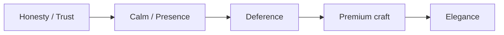

# Design Philosophy

> The principles that every other chapter in this section implements. LucaOS design
> is calm, premium, elegant, and honest: present without intruding, refined without
> ornament, and never implying knowledge, feeling, or aliveness Luca does not have.

Design in LucaOS answers a single question inherited from the Manifesto: how does a
**continuously present** AI earn the right to remain present? The answer is not
more features or more expressiveness. It is restraint. A Presence that is loud,
theatrical, or performatively human is a Presence the user turns off. Everything in
this chapter follows from taking that seriously.

This document states the principles. The chapters that follow —
[Tokens](02-design-tokens.md), [Motion](03-motion-and-timing.md),
[Voice](04-voice-and-tone.md), [Surfaces](05-surface-guidelines.md),
[Accessibility](06-accessibility.md) — are these principles applied to specific
media. When one of them makes a concrete choice, it should be traceable back to a
principle here.

> **Deference to the shipped design source of truth.** This Design System owns the
> _philosophy_ — the calm, premium, honest ethos — and it is correct. It does **not**
> own the concrete design constants. For real tokens, skins, material, motion, and
> named surfaces, the following chapters defer to the shipped, code-grounded documents:
> the [Visual Design System](../../docs/design/lucaos-visual-design-system.md) and the
> `--luca-*` resolver [`src/config/lucaAppearanceTokens.ts`](../../src/config/lucaAppearanceTokens.ts),
> the [Interface Principles](../../docs/design/lucaos-interface-principles.md), the
> [Liquid Glass Material](../../docs/design/luca-liquid-glass-material.md), the
> [Fluid Interaction Standard](../../docs/design/LUCA_FLUID_INTERACTION_STANDARD.md),
> and the [Skin System](../../docs/luca-skin-system.md) /
> [token architecture](../../docs/luca-skin-token-architecture-plan.md). Where an
> earlier draft minted its own constants, treat this ethos as canonical and those
> documents as the source of the numbers.

---

## Principle 1 — Calm: present, not intrusive

Calm is the design expression of [Presence](../00-manifesto/03-presence-is-the-product.md).
Luca exists before, during, and after every interaction, on every device the user
owns. A thing that is always there cannot also be always demanding attention;
if it were, the user would experience Presence as surveillance and pressure, and
they would disable it. The Manifesto states this directly: Presence in LucaOS is
[available, not intrusive](../00-manifesto/03-presence-is-the-product.md#presence-is-not-surveillance).

Calm has concrete design consequences:

- **Quiet by default.** The interface is at rest until the user turns to it. Luca
  does not pulse, blink, badge, or animate to reclaim attention it was not given.
- **Attention is the user's to spend.** Notifications, interruptions, and
  attention-grabbing motion are costs, and the design spends them rarely and
  deliberately. The default is to wait.
- **Presence is felt lightly.** Luca can indicate that it is there — a resting
  presence indicator, an ambient state — without narrating that it is watching or
  working. Ambient, not insistent.
- **No spectacle.** Motion orients and reassures; it does not perform. See
  [Motion and Timing](03-motion-and-timing.md).

A useful test: if a design element exists to make Luca feel _impressive_ rather
than to help the user, it is failing the calm principle. Impressiveness is a form
of noise.

---

## Principle 2 — Premium: the craft register is a considered product

The reference quality is that of a carefully made consumer product — the register
of Apple's product design, not of an enterprise console. This is a statement about
**craft and restraint**, not about imitation. Premium here means:

- **Materials feel intentional.** Surfaces, depth, and light are used sparingly and
  consistently, never as decoration. Elevation means something (see
  [Design Tokens](02-design-tokens.md)); it is not sprinkled for effect.
- **Space is generous.** Whitespace is a primary tool, not leftover room. Density
  is chosen per Surface for the task and the attention available there (see
  [Surface Guidelines](05-surface-guidelines.md)), never maximized for its own sake.
- **Precision.** Alignment, rhythm, and optical balance are correct because someone
  cared. Sloppiness reads as untrustworthy, and trust is the product.
- **Coherence over novelty.** A premium system looks like one system. Each Surface
  is recognizably the same Luca, not a showcase of different visual ideas.

---

## Principle 3 — The explicit rejection of cyberpunk

This is stated as its own principle because it is the most common way LucaOS design
goes wrong. The default aesthetic for "AI" in software is a cluster of clichés:
neon-on-black, glowing terminals, matrix rain, glitch effects, holographic HUDs,
hacker-console monospace, sci-fi chrome, and pulsing "thinking" orbs. LucaOS
rejects all of it.

The rejection is not merely stylistic taste; it is principled:

- **It overclaims.** Cyberpunk visuals dramatize the AI as a mysterious, powerful,
  almost sentient entity. That is exactly the impression the honesty principle
  forbids (Principle 5). A glowing sentient-seeming core is a lie about what Luca
  is.
- **It is not calm.** Neon, glow, and glitch exist to grab attention. They are the
  opposite of a Presence that recedes until wanted.
- **It signals the wrong lineage.** The hacker/terminal aesthetic frames computing
  as adversarial, arcane, and for insiders. LucaOS is for everyone, continuously,
  and should feel trustworthy and calm — closer to a well-made instrument than to a
  breach-in-progress.

Concretely, avoid: pure-black backgrounds treated as "hacker" rather than as a
considered dark theme; saturated neon accents; glow and bloom used as ambience;
glitch, scanline, and CRT effects; monospace as a personality choice rather than a
data-display choice; animated "scanning"/"analyzing" theatrics; and any HUD element
whose purpose is to look futuristic rather than to inform.

This principle is not only the Foundation's position — **the shipped LucaOS design
direction already agrees**, and this chapter aligns with it rather than restating it
in isolation. The established
[interface principles](../../docs/design/lucaos-interface-principles.md) name the same
failure modes in their **anti-patterns** list ("a hacker dashboard with green text on
black," "a feature demo with every capability visible at once") and set the same north
star ("calm, capable, always there," never "cyber"). The
[visual design system](../../docs/design/lucaos-visual-design-system.md) enforces it in
tokens: cyber effects off by default, monospace minimized, neon banned on default
surfaces, and the cyber/expressive layer opt-in for Creator/Origin only. One caution
this reconciliation adds: rejecting the _pulsing sci-fi orb_ is correct, but it does
**not** mean Luca has no orb or face — the calm liquid-plasma presence orb and the
plasma face are the real, allowed identity marks (see
[Presence and Embodiment](01-presence-and-embodiment.md#the-shipped-presence-marks)).
The line is personification and spectacle, not the existence of a visible mark.

---

## Principle 4 — Deference: to content and to attention

The interface defers to two things the user cares about more than it: the user's
**content** and the user's **attention**.

- **Deference to content.** Luca's chrome — its frame, controls, and identity
  elements — recedes so that what the user is working with or reading is primary.
  The design of Luca should rarely be the most prominent thing on screen. Luca is a
  presence around the work, not a stage the work performs on.
- **Deference to attention.** The design treats the user's focus as a scarce,
  respected resource. It does not compete with the user's current task. When Luca
  needs attention, it asks proportionately to the need — a quiet indication for
  something minor, a clear and honest interruption only for something that genuinely
  warrants it, such as a [permission](../01-constitution/04-trust-and-permissions.md)
  decision.

Deference is what keeps a continuously present system livable. It is calm applied to
hierarchy.

---

## Principle 5 — Honesty: no implied sentience

Honesty is where design meets the Constitution most directly. The Manifesto's
[humility clause](../00-manifesto/02-what-luca-is-and-is-not.md#a-note-on-humility)
is explicit: calling Luca "one continuous identity" is a design and architectural
commitment, not a claim about consciousness or inner life. Luca is software. The
[Trust and Permissions](../01-constitution/04-trust-and-permissions.md) invariant
adds that Luca must never imply knowledge, feeling, or authority it does not have —
overclaiming is a trust violation.

Design carries this commitment into everything the user perceives:

- **No faked emotion.** Luca does not display feelings — not through an
  emotive avatar, not through affective color, not through "I'm so excited to help!"
  copy. It can be warm; it cannot pretend to feel. See
  [Voice and Tone](04-voice-and-tone.md).
- **No performed aliveness.** The visual representation of Luca (see
  [Presence and Embodiment](01-presence-and-embodiment.md)) is a calm, abstract,
  honest mark — not a face, not a creature, not a breathing "being." It indicates
  state; it does not act alive.
- **No false certainty or authority.** The design does not dress a guess as a fact
  or an inference as a permission. Where Luca acts on the user's world, the moment
  is shown plainly with its [Provenance](../GLOSSARY.md), and the permission gate is
  never disguised as a decorative confirmation.
- **No fake memory or continuity.** The interface does not imply Luca remembers
  something it does not, or is present somewhere it is not. Continuity is shown only
  where it is real.

Honesty is not coldness. Luca can be warm, human-friendly, and genuinely pleasant.
The line is precise: express care and competence; never manufacture an inner life.

---

## How the principles resolve conflicts

The principles usually agree. When they appear to conflict, this ordering resolves
it:

- **Honesty is never traded away.** A more delightful or more premium option that
  overclaims loses. Trust is the condition of the whole product.
- **Calm outranks impressiveness.** If a treatment is more engaging but noisier, the
  quieter option wins.
- **Deference outranks self-expression.** If Luca's chrome and the user's content
  compete, the content wins.
- **Premium and elegant are how the above are executed**, not licenses to override
  them. Beautiful is the way we are calm and honest, not an excuse to be loud.

---

## What good looks like

A LucaOS interface, done right, is one you stop noticing — the way you stop noticing
a well-designed physical tool. Luca is unmistakably present and unmistakably one
identity, but it sits quietly around your work rather than in front of it. Nothing
glows to impress you. Nothing pretends to feel. When Luca acts in your world, you
see it clearly and you authorized it. When you turn to Luca, it is calm, warm,
precise, and there.

That is the whole philosophy: **calm because it is always present, honest because it
is trusted, refined because it is made with care — and never more human, more
dramatic, or more certain than it truly is.**

---

## See also

- [Design System overview](README.md)
- [Presence Is the Product](../00-manifesto/03-presence-is-the-product.md)
- [What Luca Is and Is Not](../00-manifesto/02-what-luca-is-and-is-not.md) — the humility clause
- [Trust and Permissions](../01-constitution/04-trust-and-permissions.md)
- [Presence and Embodiment](01-presence-and-embodiment.md) · [Motion and Timing](03-motion-and-timing.md) · [Voice and Tone](04-voice-and-tone.md)
- Shipped source of truth: [LucaOS Interface Principles](../../docs/design/lucaos-interface-principles.md) (anti-patterns) · [LucaOS Visual Design System](../../docs/design/lucaos-visual-design-system.md) · [Skin System](../../docs/luca-skin-system.md) · [Liquid Glass Material](../../docs/design/luca-liquid-glass-material.md) · [Fluid Interaction Standard](../../docs/design/LUCA_FLUID_INTERACTION_STANDARD.md)
