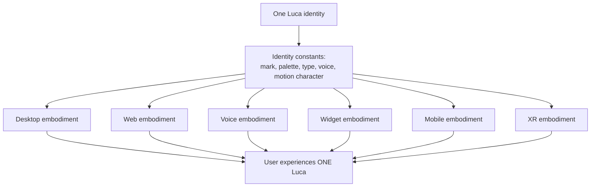

# Presence and Embodiment

> How the one Luca is represented so it reads as a single identity across every
> Surface. The Manifesto's embodiment idea, made visual: a consistent, restrained
> presence that adapts to desktop, web, voice, widget, mobile, and XR without ever
> becoming different characters.

[Invariant 1](../01-constitution/01-the-eight-invariants.md#invariant-1--one-luca-identity)
is absolute: there is exactly one Luca, and every Surface is an embodiment of that
single continuous identity. That invariant is usually discussed as a fact about
architecture — shared [Memory](../02-specification/03-memory-architecture.md),
shared [Runtime](../02-specification/01-persistent-runtime.md), shared state. This
chapter is about the same invariant as a fact about **perception**. If the
architecture guarantees one Luca but the design presents a different character on
each device, the user does not experience one identity. Continuity that is real in
the system but invisible in the experience is continuity the user never receives.

So the design job is precise: give Luca a presence that is unmistakably the same
identity everywhere, while letting each [Surface](../02-specification/06-surface-layer.md)
render that identity in the form its medium allows.

---

## Embodiment, not avatars

The Manifesto frames every device as a [Host](../GLOSSARY.md) that gives Luca a
body. That word — body — is deliberate and it is also a trap. It invites designers
to build a _character_: a face, a mascot, a creature with moods. LucaOS does not do
that, for the reason stated in the [Design Philosophy](00-design-philosophy.md): a
character overclaims. A face implies feelings; a creature implies aliveness; both
violate the [honesty commitment](../01-constitution/04-trust-and-permissions.md).

Embodiment in LucaOS means something quieter. Luca's presence is an **abstract,
calm mark and a consistent behavior**, not a personified being. Think of it as the
identity of an instrument — recognizable, coherent, and honest about being an
object — rather than the face of a companion. The presence indicates state
(present, attending, listening, acting) without performing an inner life.

---

## The identity constants

What makes Luca read as one identity is a small set of constants that hold across
every Surface. These are the load-bearing elements of continuity; they change
slowly and deliberately, never per-Surface for convenience.

| Constant | What it is | Why it must be shared |
|---|---|---|
| **The mark** | Luca's abstract visual signature — a simple, restrained form used as presence indicator and identity anchor | It is the fastest signal that this is the same Luca |
| **Palette** | The calm, restrained color system (see [Design Tokens](02-design-tokens.md)) | Color is recognized pre-consciously; a shifted palette reads as a different app |
| **Typography** | The type family and scale | Type carries the premium, calm register everywhere text appears |
| **Voice** | How Luca speaks — its verbal identity (see [Voice and Tone](04-voice-and-tone.md)) | On voice-only Surfaces this _is_ the identity; it must match the words on screen |
| **Motion character** | The easing and pacing signature (see [Motion and Timing](03-motion-and-timing.md)) | How Luca moves is as recognizable as how it looks |
| **Presence behavior** | How Luca indicates present / attending / listening / acting | Consistent behavior is continuity the user can feel across devices |

A Surface may vary **density, layout, input modality, and fidelity**. It may not
vary the identity constants. That division — constants fixed, presentation adapted
— is the whole discipline of this chapter.

---

## The presence indicator

Across graphical Surfaces, Luca's presence is shown by a single restrained
indicator built from the mark. It has a small number of honest states, and it never
performs beyond them.

- **Present (at rest).** Luca is there and available. The default. The indicator is
  quiet — a calm, static or near-static mark. It does not pulse for attention;
  Presence is felt lightly (see [Design Philosophy](00-design-philosophy.md),
  Principle 1).
- **Attending.** Luca is actively considering the user's input. A gentle, settled
  motion — never a frantic spinner, never a "thinking" spectacle. It communicates
  "working," not "look how hard I am working."
- **Listening (voice).** On Surfaces that accept speech, a calm state that honestly
  reflects that audio is being captured. Because listening touches privacy, this
  state is unambiguous and never hidden — the user always knows when Luca is
  listening.
- **Acting.** Luca is taking an action in the user's world. This state is legible
  and paired with [Provenance](../GLOSSARY.md); when the action is gated, the
  [permission](../01-constitution/04-trust-and-permissions.md) moment is distinct
  and honest, never disguised as ambient decoration.

What the presence indicator is **not**: a mood ring, an emotive orb, a face, or a
loading show. It reflects operational state truthfully and calmly. It never implies
Luca feels anything about that state.

---

## One identity, many Surfaces

Each Surface renders the same identity in the form its medium allows. The detail
lives in [Surface Guidelines](05-surface-guidelines.md); here is how embodiment
specifically adapts while staying one Luca.

### Desktop and web

The fullest visual embodiment: the mark, the full palette, the type scale, and the
full presence-state vocabulary. Luca sits as calm chrome around the user's content,
deferring to it (Principle 4). Desktop and web should feel like the same Luca at
different densities, not two products.

### Voice

Here the visual constants recede and the **voice becomes the identity**. There is no
mark to look at, so continuity is carried entirely by how Luca sounds and what it
says — its verbal identity from [Voice and Tone](04-voice-and-tone.md), and, where a
screen is present (a voice HUD on a phone or car display), a minimal calm visual
that matches. The voice-HUD is deliberately spare: a small honest indication of
listening/attending/speaking, never a pulsing sci-fi orb. The same personality that
writes Luca's text speaks Luca's audio; a user must not meet a warmer or colder Luca
by switching to voice.

### Widget

The most compressed embodiment: a small, glanceable surface. The mark and a single
honest state may be all that fits. The discipline is to compress without mutating —
the widget is a small window onto the one Luca, not a lite sibling with its own feel.
It shows only what is honestly current and defers the rest to a fuller Surface.

### Mobile

Touch-first, one-handed, interruption-prone. Embodiment adapts to larger touch
targets and a denser attention economy, but the mark, palette, type, and presence
behavior are the same identity the user knows from the desktop. Switching devices
mid-task should feel like continuing, not re-meeting.

### XR

The most speculative Surface, and the one where the honesty commitment is most
tested. Spatial computing invites a literal embodied "being" standing in the room —
exactly the personified character LucaOS refuses. In XR, Luca is present spatially
but remains an **honest, abstract presence**, not an anthropomorphic avatar
performing life. It occupies space calmly, respects the user's environment and
attention, and indicates state with the same restrained vocabulary used everywhere
else. XR support is a forward-looking target; see the
[Roadmap](../06-roadmap/README.md) for where the current build stands.

---

## Voice-HUD and avatar considerations, kept honest and calm

Two temptations recur wherever Luca gets a richer body — a voice HUD or any avatar
treatment. Both are governed by the same rules:

- **Indicate, do not emote.** The visual may show that Luca is listening,
  attending, or speaking. It may not show that Luca is happy, sad, curious, or
  eager. Operational truth, not feeling.
- **Recede when idle.** A voice HUD or spatial presence returns to a calm resting
  state promptly. It does not idle-animate to stay interesting.
- **Never fake attention or listening.** The listening state must correspond to
  Luca actually capturing audio. A presence that _looks_ like it is listening when
  it is not, or hides that it is, is a trust violation — this is honesty and
  privacy at once.
- **Match the words.** Whatever the HUD shows must agree with what Luca says and
  does. Divergence between the visible presence and the actual behavior fractures
  the single identity.

---

## Failure modes to catch

- **Per-Surface characters.** A playful mobile Luca and a serious desktop Luca are
  two Lucas. The identity constants must hold.
- **Personification creep.** A mark that gains eyes, a "breathing" idle animation, an
  emotive color that implies mood — each is a step toward the character LucaOS
  refuses.
- **Cyberpunk presence.** A glowing orb, a scanning HUD, neon "AI energy." This is
  the [rejected aesthetic](00-design-philosophy.md) and it also overclaims.
- **Continuity theater.** Showing a "synced across your devices" flourish that
  implies more continuity than the system actually delivers. Show continuity only
  where it is [real](../02-specification/09-continuity-and-sync.md); where it is a
  target, do not imply it is present.
- **Divergent voice.** A different tone in the voice embodiment than in text. One
  identity means one personality across modalities and across underlying
  [models](../02-specification/04-provider-abstraction.md).

---

## See also

- [The One Identity Principle](../00-manifesto/04-the-one-identity-principle.md)
- [Invariant 1 — One Luca Identity](../01-constitution/01-the-eight-invariants.md#invariant-1--one-luca-identity)
- [Design Philosophy](00-design-philosophy.md) — the honesty and calm principles this chapter applies
- [Voice and Tone](04-voice-and-tone.md) — the verbal half of the identity
- [Surface Guidelines](05-surface-guidelines.md) — per-Surface adaptation in detail
- [Identity and Embodiment (Specification)](../02-specification/02-identity-and-embodiment.md)
