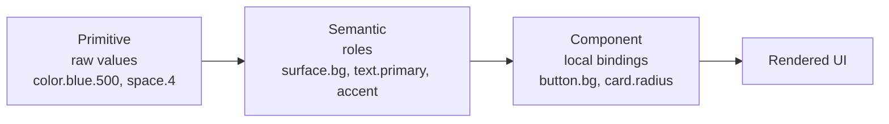

# Design Tokens

> The token architecture that makes one calm visual language enforceable in code.
> Three layers — primitive, semantic, component — with an illustrative restrained
> palette, type scale, spacing, radius, elevation, and motion. Every value shown
> here is **illustrative**: it demonstrates structure and character, not measured
> brand constants.

Tokens are how the [Design Philosophy](00-design-philosophy.md) becomes something a
build can check. A principle like "calm, restrained color" is a sentence until it is
a finite set of named values that every Surface consumes and nothing is allowed to
bypass. Because there is exactly one Luca, there is exactly one token set, and every
[Surface](../02-specification/06-surface-layer.md) — desktop, web, mobile, widget,
and the visual parts of voice and XR — renders from it. Shared tokens are
[cross-surface continuity](../01-constitution/01-the-eight-invariants.md#invariant-5--cross-surface-continuity)
expressed in design: the same identity because, literally, the same values.

> **Illustrative-values notice.** The hex codes, pixel sizes, and millisecond
> counts below are a coherent _example_ palette and scale chosen to show the
> system's character and layering. They are not the measured LucaOS brand values.
> The canonical values live in the token package and the design source of truth.
> Do not treat any constant here as the brand's exact number.

---

## Why three layers

A flat set of tokens (`blue-500`, `gray-100`) tells you what a value _is_ but not
what it is _for_. That gap is where inconsistency and theming pain live. LucaOS uses
the now-standard three-layer model so that meaning, not raw value, is what
components consume.



- **Primitive tokens** are the raw palette and scales: every color ramp, every step
  on the spacing and type scales. They have no opinion about usage. They are the
  vocabulary.
- **Semantic tokens** assign meaning: `color.surface.background`,
  `color.text.primary`, `color.accent`. They map roles to primitives and are where
  light/dark and accessibility decisions are made. **Components consume semantic
  tokens, not primitives.**
- **Component tokens** bind a component's local decisions to semantic tokens:
  `button.primary.background = color.accent`. They exist so a component can be
  adjusted or themed without touching global meaning.

The rule that keeps the system coherent: **each layer references only the layer
above it.** A component never hardcodes a hex value or reaches past semantics to a
primitive. Break that rule and dark mode, theming, and accessibility fixes stop
being possible in one place.

---

## Color

The palette is calm and restrained by mandate (see
[Design Philosophy](00-design-philosophy.md)). That means a small number of neutral
steps carrying most of the interface, a single restrained accent used sparingly, and
the explicit avoidance of saturated neon (the [rejected cyberpunk aesthetic](00-design-philosophy.md#principle-3--the-explicit-rejection-of-cyberpunk)).
Color recedes; it does not shout.

### Primitive ramps (illustrative)

```css
/* PRIMITIVE — illustrative example values, not brand constants */
:root {
  /* Neutral ramp — the workhorse of a calm interface */
  --color-neutral-0:   #ffffff;
  --color-neutral-50:  #f7f8fa;
  --color-neutral-100: #eef0f3;
  --color-neutral-200: #dfe3e8;
  --color-neutral-400: #a7afba;
  --color-neutral-600: #5c646f;
  --color-neutral-800: #2b3038;
  --color-neutral-900: #1a1d22;
  --color-neutral-1000:#0e1013;

  /* Accent — one restrained, low-neon hue, used sparingly */
  --color-accent-400: #6f9bd1;
  --color-accent-500: #4f7fbf;
  --color-accent-600: #3f68a0;

  /* Functional — muted, never alarmist */
  --color-positive-500: #4c9a76;
  --color-caution-500:  #b8863f;
  --color-critical-500: #b4564d;
}
```

Note the character: the accent is a muted blue, not an electric cyan; the functional
colors are dampened, not vivid. A calm system earns emphasis by scarcity — one
restrained accent, mostly neutrals.

### Semantic mapping and theming

Semantic tokens are where light and dark themes diverge. Components read these names
and never learn which theme is active — the same reason nothing above the
[Adapter](../GLOSSARY.md) learns which Provider answered.

```css
/* SEMANTIC — light theme (illustrative) */
:root, [data-theme="light"] {
  --surface-background: var(--color-neutral-0);
  --surface-raised:     var(--color-neutral-50);
  --surface-sunken:     var(--color-neutral-100);
  --text-primary:       var(--color-neutral-900);
  --text-secondary:     var(--color-neutral-600);
  --text-on-accent:     var(--color-neutral-0);
  --border-subtle:      var(--color-neutral-200);
  --accent:             var(--color-accent-500);
}

/* SEMANTIC — dark theme (illustrative).
   A considered dark theme, NOT a "hacker" pure-black terminal. */
[data-theme="dark"] {
  --surface-background: var(--color-neutral-900);
  --surface-raised:     var(--color-neutral-800);
  --surface-sunken:     var(--color-neutral-1000);
  --text-primary:       var(--color-neutral-50);
  --text-secondary:     var(--color-neutral-400);
  --text-on-accent:     var(--color-neutral-0);
  --border-subtle:      var(--color-neutral-800);
  --accent:             var(--color-accent-400);
}
```

Two ethos points are encoded here. First, the dark theme uses a deep neutral, not
`#000000` treated as "hacker black" — dark mode is a considered premium surface, not
a terminal. Second, the accent lightens slightly in dark mode so contrast stays
correct against the darker background.

### Contrast is a token-level obligation

Accessibility is not a later pass (see [Accessibility](06-accessibility.md)); it is
a constraint on the semantic layer. Any `text.*` on any `surface.*` it is permitted
to pair with must meet the contrast floors — a normal-text target of at least WCAG
AA 4.5:1, and 3:1 for large text and meaningful non-text UI. Because pairings are
defined semantically, contrast can be validated once at the token layer rather than
audited component by component. A semantic pairing that fails contrast is a broken
token, not a cosmetic nit.

---

## Typography

Type carries the premium, calm register everywhere words appear, and it is one of
the identity constants from [Presence and Embodiment](01-presence-and-embodiment.md).
The scale is modest and purposeful — a small number of steps, generous line height
for reading, restrained weight contrast.

```ts
// PRIMITIVE type tokens — illustrative (TypeScript)
export const type = {
  family: {
    // A humanist sans for calm, legible text; NOT monospace-as-personality.
    sans: '"Inter", system-ui, -apple-system, "Segoe UI", sans-serif',
    // Monospace is reserved for genuine code/data, never for "AI" flavor.
    mono: '"SF Mono", "JetBrains Mono", ui-monospace, monospace',
  },
  // Modular scale (~1.2 ratio), illustrative sizes in rem
  size: {
    xs: '0.75rem', sm: '0.875rem', base: '1rem',
    lg: '1.125rem', xl: '1.375rem', '2xl': '1.75rem', '3xl': '2.25rem',
  },
  weight: { regular: 400, medium: 500, semibold: 600 },
  leading: { tight: 1.2, normal: 1.5, relaxed: 1.65 },
} as const;
```

Semantic type roles (`text.body`, `text.heading`, `text.caption`, `text.code`) bind
these primitives to usage, and — importantly for [Accessibility](06-accessibility.md) —
sizes are expressed in `rem` so they scale with the user's chosen base size rather
than being pinned in pixels. Monospace is a data role, never a personality choice;
using it to make Luca feel "technical" is the rejected aesthetic sneaking back in.

---

## Spacing, radius, and layout rhythm

A calm, premium interface is mostly space, applied on a consistent rhythm. A single
base unit generates the spacing scale so that every gap in the system is a multiple
of one number, producing optical order.

```css
/* PRIMITIVE spacing — 4px base, illustrative */
:root {
  --space-0: 0;      --space-1: 0.25rem; --space-2: 0.5rem;
  --space-3: 0.75rem;--space-4: 1rem;    --space-6: 1.5rem;
  --space-8: 2rem;   --space-12: 3rem;   --space-16: 4rem;

  /* Radius — soft, premium, never sharp-edged nor pill-everything */
  --radius-sm: 6px; --radius-md: 10px; --radius-lg: 16px; --radius-full: 999px;
}
```

Radius carries a surprising amount of the premium register: consistently soft, never
razor-sharp (which reads as utilitarian) and never uniformly pill-shaped (which reads
as toylike). Density — how tightly this rhythm is applied — varies per Surface and is
governed in [Surface Guidelines](05-surface-guidelines.md); the _scale_ does not vary,
only how much of it a given Surface uses.

---

## Elevation and depth

Elevation is used sparingly and meaningfully — it signals that something is layered
above the plane, not that it wants to look impressive. Shadows are soft and low, in
keeping with calm restraint; there is no glow, no bloom, no neon rim.

```css
/* SEMANTIC elevation — soft, restrained, illustrative */
:root {
  --elevation-0: none;
  --elevation-1: 0 1px 2px rgba(14,16,19,0.06), 0 1px 1px rgba(14,16,19,0.04);
  --elevation-2: 0 4px 12px rgba(14,16,19,0.08);
  --elevation-3: 0 12px 32px rgba(14,16,19,0.12);
}
```

In dark themes, elevation is often better expressed as a lighter surface step than
as a heavier shadow; the semantic layer is where that decision is made, so components
simply ask for `elevation-2` and get the theme-correct treatment. Glow as ambience is
prohibited — it is both noisy (not calm) and part of the rejected aesthetic.

---

## Motion tokens

Motion has its own chapter ([Motion and Timing](03-motion-and-timing.md)); here are
the tokens it standardizes so that "calm motion" is a value, not a vibe. The
signature is short durations and settling easing — nothing that bounces or
overshoots for spectacle.

```ts
// MOTION tokens — illustrative (TypeScript)
export const motion = {
  duration: {
    instant: '80ms', fast: '140ms', base: '220ms', slow: '320ms',
  },
  easing: {
    // Decelerate: enters that settle rather than snap or bounce
    standard: 'cubic-bezier(0.2, 0, 0, 1)',
    // Gentle both ends, for state changes
    gentle:   'cubic-bezier(0.4, 0, 0.2, 1)',
  },
  // Honors the user's reduce-motion preference (see Accessibility)
  reduced: { duration: '0ms', easing: 'linear' },
} as const;
```

The `reduced` set is not an afterthought token; it is how the
[reduce-motion commitment](06-accessibility.md) is honored structurally rather than
per-animation.

---

## Consuming tokens: the rules

- **Components read semantic (or their own component) tokens — never primitives, never
  literals.** A hardcoded `#4f7fbf` or `16px` in a component is a bug: it cannot be
  themed, cannot be contrast-checked centrally, and drifts from the one language.
- **Theming and contrast decisions live at the semantic layer.** That is the single
  place light/dark and accessibility are resolved.
- **The token package is versioned and evolves additively** in keeping with
  [Invariant 7](../01-constitution/01-the-eight-invariants.md#invariant-7--backward-compatibility-where-practical);
  renaming or removing a semantic token is a migration, not a silent edit, because
  Surfaces across a rollout may consume different versions.
- **One token set, all Surfaces.** Platform-native Surfaces (mobile, XR) may map the
  tokens onto native primitives, but the values originate in the one set. Divergence
  is how one Luca becomes several.

---

## See also

- [Design Philosophy](00-design-philosophy.md) — the calm, restrained palette mandate and the rejected aesthetic
- [Motion and Timing](03-motion-and-timing.md) — how the motion tokens are used
- [Accessibility](06-accessibility.md) — contrast, scalable type, reduce-motion as token obligations
- [Surface Guidelines](05-surface-guidelines.md) — per-Surface density from a shared scale
- [Invariant 5 — Cross-Surface Continuity](../01-constitution/01-the-eight-invariants.md#invariant-5--cross-surface-continuity)
