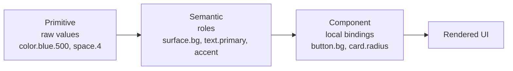

# Design Tokens

> The token architecture that makes one calm visual language enforceable in code.
> Three layers — primitive, semantic, component — with an illustrative restrained
> palette, type scale, spacing, radius, elevation, and motion. Every value shown
> here is **illustrative**: it demonstrates structure and character, not measured
> brand constants.

Tokens are how the [Design Philosophy](00-design-philosophy.md) becomes something a
build can check. A principle like "calm, restrained color" is a sentence until it is
a finite set of named values that every Surface consumes and nothing is allowed to
bypass. Because there is exactly one Luca, there is exactly one token set, and every
[Surface](../02-specification/06-surface-layer.md) — desktop, web, mobile, widget,
and the visual parts of voice and XR — renders from it. Shared tokens are
[cross-surface continuity](../01-constitution/01-the-eight-invariants.md#invariant-5--cross-surface-continuity)
expressed in design: the same identity because, literally, the same values.

> **Illustrative-values notice.** The hex codes below are a coherent _example_
> palette chosen to show the system's character and layering. They are not the
> measured LucaOS brand values. Do not treat any hex constant here as the brand's
> exact number.
>
> **The canonical names and values live in the shipped system, and this chapter
> defers to it.** The real semantic tokens are the `--luca-*` variables resolved by
> [`src/config/lucaAppearanceTokens.ts`](../../src/config/lucaAppearanceTokens.ts),
> operationalized in
> [`docs/design/lucaos-visual-design-system.md`](../../docs/design/lucaos-visual-design-system.md).
> Where earlier drafts of this chapter minted parallel names
> (`--surface-background`, `--color-neutral-500`, `positive`/`caution`/`critical`),
> those names **do not exist in code**; use the real `--luca-*` names shown below.
> The token _pixel_ scales (radius, spacing) and _millisecond_ durations below are
> the real values from that system, not inventions.

---

## Why three layers

A flat set of tokens (`blue-500`, `gray-100`) tells you what a value _is_ but not
what it is _for_. That gap is where inconsistency and theming pain live. LucaOS uses
the now-standard three-layer model so that meaning, not raw value, is what
components consume.



- **Primitive tokens** are the raw palette and scales: every color ramp, every step
  on the spacing and type scales. They have no opinion about usage. They are the
  vocabulary.
- **Semantic tokens** assign meaning: `color.surface.background`,
  `color.text.primary`, `color.accent`. They map roles to primitives and are where
  light/dark and accessibility decisions are made. **Components consume semantic
  tokens, not primitives.**
- **Component tokens** bind a component's local decisions to semantic tokens:
  `button.primary.background = color.accent`. They exist so a component can be
  adjusted or themed without touching global meaning.

The rule that keeps the system coherent: **each layer references only the layer
above it.** A component never hardcodes a hex value or reaches past semantics to a
primitive. Break that rule and dark mode, theming, and accessibility fixes stop
being possible in one place.

---

## The skin system: the top-level identity layer

The three layers above describe how a single visual environment is built. The shipped
LucaOS also has a layer _above_ the primitives: the **skin system**, which selects
_which_ environment Luca inhabits. A skin is not a color swap; it is a full visual
operating environment — background language, material behavior, accent discipline,
typography mood, motion personality, and boot identity — chosen once and felt
system-wide. This is the layer that makes LucaOS read as an installable OS rather than
an app with a dark mode. (Full spec:
[`docs/luca-skin-system.md`](../../docs/luca-skin-system.md); token architecture:
[`docs/luca-skin-token-architecture-plan.md`](../../docs/luca-skin-token-architecture-plan.md).)

The four launch skins:

| Skin | Character | Material |
|---|---|---|
| **Pearl** | Light, airy, premium-minimal; the recommended default light identity | Light glass |
| **Carbon** | Professional charcoal/graphite dark; power-user default — never cyberpunk | Graphite glass |
| **Flow** | Signature liquid/morph identity; slow, soft, background-level motion | Liquid glass |
| **Canvas** | Warm cream/editorial; reading- and writing-forward | Paper / matte |

Skins are expressed as their own token layer — the `--luca-skin-*` variables
(`--luca-skin-bg-base`, `--luca-skin-accent-primary`, `--luca-skin-glass-blur`,
`--luca-skin-motion-speed`, and so on). These sit **above** the material system and
**feed** the `--luca-*` semantic tokens through a bridge; components keep consuming the
semantic roles, not raw skin variables. Crucially, **safety and status colours stay
outside skin control** — a skin can change how Luca feels, never whether the user can
see that voice is live, that an action needs approval, or how to stop generation.

### The three-axis theme model

Within any skin, appearance is modeled as **three independent axes** (already resolved
by [`src/config/lucaAppearanceTokens.ts`](../../src/config/lucaAppearanceTokens.ts)),
never fused into one list:

- **Appearance mode** — `light` | `dark` | `system`.
- **Product theme** — `luca-silver` | `luca-graphite` | `luca-frost` | `luca-cream`
  (only these four `"normal"` themes are user-facing).
- **Accent** — `neutral` | `blue` | `violet` | `green` | `amber` | `custom`, a
  highlight for focus/active/primary states, never a large background wash.

The default is Luca Silver / neutral / system. Status colours are independent of the
accent axis. This axis model — and the skin layer above it — is the concrete form of
[cross-surface continuity](../01-constitution/01-the-eight-invariants.md#invariant-5--cross-surface-continuity):
one identity because, literally, one resolver feeding one set of `--luca-*` values.

---

## Color

The palette is calm and restrained by mandate (see
[Design Philosophy](00-design-philosophy.md)). That means a small number of neutral
steps carrying most of the interface, a single restrained accent used sparingly, and
the explicit avoidance of saturated neon (the [rejected cyberpunk aesthetic](00-design-philosophy.md#principle-3--the-explicit-rejection-of-cyberpunk)).
Color recedes; it does not shout.

### Primitive ramps (illustrative)

```css
/* PRIMITIVE — illustrative example values, not brand constants */
:root {
  /* Neutral ramp — the workhorse of a calm interface */
  --color-neutral-0:   #ffffff;
  --color-neutral-50:  #f7f8fa;
  --color-neutral-100: #eef0f3;
  --color-neutral-200: #dfe3e8;
  --color-neutral-400: #a7afba;
  --color-neutral-600: #5c646f;
  --color-neutral-800: #2b3038;
  --color-neutral-900: #1a1d22;
  --color-neutral-1000:#0e1013;

  /* Accent — one restrained, low-neon hue, used sparingly */
  --color-accent-400: #6f9bd1;
  --color-accent-500: #4f7fbf;
  --color-accent-600: #3f68a0;

  /* Functional — muted, never alarmist */
  --color-status-success-500: #4c9a76;
  --color-status-warning-500: #b8863f;
  --color-status-danger-500:  #b4564d;
  --color-status-info-500:    #4f7fbf;
}
```

Note the character: the accent is a muted blue, not an electric cyan; the functional
colors are dampened, not vivid. A calm system earns emphasis by scarcity — one
restrained accent, mostly neutrals. The primitive names above are illustrative raw
values; **the layer components actually consume is the real `--luca-*` semantic set**,
shown next.

### Semantic mapping and theming

Semantic tokens are where light and dark themes diverge. Components read these names
and never learn which theme is active — the same reason nothing above the
[Adapter](../GLOSSARY.md) learns which Provider answered. **These are the real,
shipped `--luca-*` names**, resolved by
[`src/config/lucaAppearanceTokens.ts`](../../src/config/lucaAppearanceTokens.ts); the
values are illustrative but the names are canonical.

```css
/* SEMANTIC — real --luca-* names, light theme (illustrative values) */
:root, [data-theme="light"] {
  --luca-background-base:     var(--color-neutral-0);
  --luca-background-elevated: var(--color-neutral-50);
  --luca-surface-glass:       var(--color-neutral-50);   /* + --luca-blur-level */
  --luca-surface-solid:       var(--color-neutral-100);
  --luca-text-primary:        var(--color-neutral-900);
  --luca-text-secondary:      var(--color-neutral-600);
  --luca-border-subtle:       var(--color-neutral-200);
  --luca-border-strong:       var(--color-neutral-400);
  --luca-accent-primary:      var(--color-accent-500);
  --luca-accent-soft:         var(--color-accent-400);
  /* Status — independent of accent; includes info */
  --luca-success:             var(--color-status-success-500);
  --luca-warning:             var(--color-status-warning-500);
  --luca-danger:              var(--color-status-danger-500);
  --luca-info:                var(--color-status-info-500);
}

/* SEMANTIC — dark theme (illustrative values).
   A considered dark theme, NOT a "hacker" pure-black terminal. */
[data-theme="dark"] {
  --luca-background-base:     var(--color-neutral-900);
  --luca-background-elevated: var(--color-neutral-800);
  --luca-surface-glass:       var(--color-neutral-800);
  --luca-surface-solid:       var(--color-neutral-1000);
  --luca-text-primary:        var(--color-neutral-50);
  --luca-text-secondary:      var(--color-neutral-400);
  --luca-border-subtle:       var(--color-neutral-800);
  --luca-accent-primary:      var(--color-accent-400);
}
```

Two ethos points are encoded here. First, the dark theme uses a deep neutral, not
`#000000` treated as "hacker black" — dark mode is a considered premium surface, not
a terminal. Second, the accent lightens slightly in dark mode so contrast stays
correct against the darker background. A third, structural point: the four status
tokens (`--luca-success` / `-warning` / `-danger` / `-info`) are a **fixed semantic
set independent of both accent and skin**, so danger always reads as danger. Earlier
drafts used `positive` / `caution` / `critical` and omitted `info`; the real set is
the four `--luca-*` names above.

### Contrast is a token-level obligation

Accessibility is not a later pass (see [Accessibility](06-accessibility.md)); it is
a constraint on the semantic layer. Any `text.*` on any `surface.*` it is permitted
to pair with must meet the contrast floors — a normal-text target of at least WCAG
AA 4.5:1, and 3:1 for large text and meaningful non-text UI. Because pairings are
defined semantically, contrast can be validated once at the token layer rather than
audited component by component. A semantic pairing that fails contrast is a broken
token, not a cosmetic nit.

---

## Typography

Type carries the premium, calm register everywhere words appear, and it is one of
the identity constants from [Presence and Embodiment](01-presence-and-embodiment.md).
The scale is modest and purposeful — a small number of steps, generous line height
for reading, restrained weight contrast.

```ts
// PRIMITIVE type tokens — illustrative (TypeScript)
export const type = {
  family: {
    // A humanist sans for calm, legible text; NOT monospace-as-personality.
    sans: '"Inter", system-ui, -apple-system, "Segoe UI", sans-serif',
    // Monospace is reserved for genuine code/data, never for "AI" flavor.
    mono: '"SF Mono", "JetBrains Mono", ui-monospace, monospace',
  },
  // Modular scale (~1.2 ratio), illustrative sizes in rem
  size: {
    xs: '0.75rem', sm: '0.875rem', base: '1rem',
    lg: '1.125rem', xl: '1.375rem', '2xl': '1.75rem', '3xl': '2.25rem',
  },
  weight: { regular: 400, medium: 500, semibold: 600 },
  leading: { tight: 1.2, normal: 1.5, relaxed: 1.65 },
} as const;
```

Semantic type roles (`text.body`, `text.heading`, `text.caption`, `text.code`) bind
these primitives to usage, and — importantly for [Accessibility](06-accessibility.md) —
sizes are expressed in `rem` so they scale with the user's chosen base size rather
than being pinned in pixels. Monospace is a data role, never a personality choice;
using it to make Luca feel "technical" is the rejected aesthetic sneaking back in.

---

## Spacing, radius, and layout rhythm

A calm, premium interface is mostly space, applied on a consistent rhythm. A single
base unit generates the spacing scale so that every gap in the system is a multiple
of one number, producing optical order.

```css
/* PRIMITIVE spacing — 4px base, illustrative */
:root {
  --space-0: 0;      --space-1: 0.25rem; --space-2: 0.5rem;
  --space-3: 0.75rem;--space-4: 1rem;    --space-6: 1.5rem;
  --space-8: 2rem;   --space-12: 3rem;   --space-16: 4rem;

  /* Radius — soft, premium, never sharp-edged nor pill-everything.
     Real scale: sm 6 · md 10 · lg 14 · pill 9999 (four steps). */
  --radius-sm: 6px; --radius-md: 10px; --radius-lg: 14px; --radius-pill: 9999px;
}
```

Radius carries a surprising amount of the premium register: consistently soft, never
razor-sharp (which reads as utilitarian) and never uniformly pill-shaped (which reads
as toylike). The shipped scale is four steps — `radius-sm` 6 (inputs/chips),
`radius-md` 10 (buttons/rows), `radius-lg` **14** (cards/panels/modals), `radius-pill`
for pills and avatars. (An earlier draft used `radius-lg: 16`; the real value is 14.)
Density — how tightly this rhythm is applied — varies per Surface and is governed in
[Surface Guidelines](05-surface-guidelines.md); the _scale_ does not vary, only how
much of it a given Surface uses.

---

## Elevation, depth, and the liquid-glass material

Elevation is used sparingly and meaningfully — it signals that something is layered
above the plane, not that it wants to look impressive. Shadows are soft and low, in
keeping with calm restraint. The shipped system carries this as two shadow tokens plus
a shared focus ring:

```css
/* SEMANTIC elevation — real --luca-* names, illustrative values */
:root {
  --luca-shadow-soft: 0 4px 12px rgba(14,16,19,0.08);  /* resting cards/panels/modals */
  --luca-shadow-glow: 0 0 0 6px rgba(79,127,191,0.18); /* OPTIONAL emphasis only */
  /* focus ring: 0 0 0 2px var(--luca-accent-primary) — one shared ring */
}
```

`--luca-shadow-soft` is the resting elevation for cards, panels, and modals. In dark
themes, elevation is often better expressed as a lighter surface step than a heavier
shadow; the semantic layer is where that decision is made.

### Glow and rim are governed, not banned

Earlier drafts of this chapter said "no glow, no rim." That overshoots the real
system, and this chapter corrects it. LucaOS ships a governed
**[liquid-glass material](../../docs/design/luca-liquid-glass-material.md)**, and it
**permits disciplined rims, specular highlights, and a moving glint** — these are
skin-owned optical tokens (light skins use accent/graphite edge definition so white
surfaces keep depth; dark skins keep bright specular and a neutral black edge). The
correct rule is not "never," it is **reserved and disciplined**:

- **Rim / specular / glint** are allowed as part of the material's optical layer, kept
  restrained and skin-owned; the glass layer is `aria-hidden`, carries no status or
  safety meaning, and never receives pointer events.
- **Glow** (`--luca-shadow-glow`) is **reserved for presence and focus surfaces** —
  the presence orb, a focused composer, an active/focus state — never used as ambient
  decoration on ordinary cards. It is optional emphasis, not resting elevation.
- **Under reduced motion the glint freezes; under reduced transparency the glass
  collapses to a solid surface.** The effect is disciplined by accessibility, not by a
  blanket prohibition.

What remains banned is the _rejected aesthetic_: neon glow-as-ambience, bloom, and
glowing "AI energy" on default surfaces. The distinction — governed optical finish
versus decorative glow — is the same one Presence draws between the calm plasma orb
and the pulsing sci-fi orb.

---

## Motion tokens

Motion has its own chapter ([Motion and Timing](03-motion-and-timing.md)); here are
the tokens it standardizes so that "calm motion" is a value, not a vibe. The
signature is short durations and settling easing — nothing that bounces or
overshoots for spectacle.

```ts
// MOTION tokens — real durations from the shipped system (TypeScript)
export const motion = {
  duration: {
    micro: '120ms', standard: '200ms', panel: '280ms',
  },
  easing: {
    // Decelerate: enters that settle rather than snap or bounce
    standard: 'cubic-bezier(0.2, 0, 0, 1)',
    // Gentle both ends, for state changes
    gentle:   'cubic-bezier(0.4, 0, 0.2, 1)',
  },
  // Honors the user's reduce-motion preference (see Accessibility)
  reduced: { duration: '0ms', easing: 'linear' },
} as const;
```

The three durations — **micro 120ms, standard 200ms, panel 280ms** — are the real
values from [`docs/design/lucaos-visual-design-system.md`](../../docs/design/lucaos-visual-design-system.md),
not a second invented set. [Motion and Timing](03-motion-and-timing.md) uses them.

The `reduced` set is not an afterthought token; it is how the
[reduce-motion commitment](06-accessibility.md) is honored structurally rather than
per-animation.

---

## Consuming tokens: the rules

- **Components read the semantic `--luca-*` tokens (or their own component tokens) —
  never primitives, never literals.** A hardcoded `#4f7fbf`, a raw neon Tailwind class
  (`text-green-400`, `bg-white/10`), or a `14px` in a component is a bug: it cannot be
  themed or skinned, cannot be contrast-checked centrally, and drifts from the one
  language.
- **Theming and contrast decisions live at the semantic layer.** That is the single
  place light/dark and accessibility are resolved.
- **The token package is versioned and evolves additively** in keeping with
  [Invariant 7](../01-constitution/01-the-eight-invariants.md#invariant-7--backward-compatibility-where-practical);
  renaming or removing a semantic token is a migration, not a silent edit, because
  Surfaces across a rollout may consume different versions.
- **One token set, all Surfaces.** Platform-native Surfaces (mobile, XR) may map the
  tokens onto native primitives, but the values originate in the one set. Divergence
  is how one Luca becomes several.

---

## See also

- [Design Philosophy](00-design-philosophy.md) — the calm, restrained palette mandate and the rejected aesthetic
- [Motion and Timing](03-motion-and-timing.md) — how the motion tokens are used
- [Accessibility](06-accessibility.md) — contrast, scalable type, reduce-motion as token obligations
- [Surface Guidelines](05-surface-guidelines.md) — per-Surface density from a shared scale
- [Invariant 5 — Cross-Surface Continuity](../01-constitution/01-the-eight-invariants.md#invariant-5--cross-surface-continuity)
- Shipped source of truth: [`src/config/lucaAppearanceTokens.ts`](../../src/config/lucaAppearanceTokens.ts) (the real `--luca-*` resolver) · [LucaOS Visual Design System](../../docs/design/lucaos-visual-design-system.md) · [Skin System](../../docs/luca-skin-system.md) · [Skin Token Architecture](../../docs/luca-skin-token-architecture-plan.md) · [Liquid Glass Material](../../docs/design/luca-liquid-glass-material.md)
