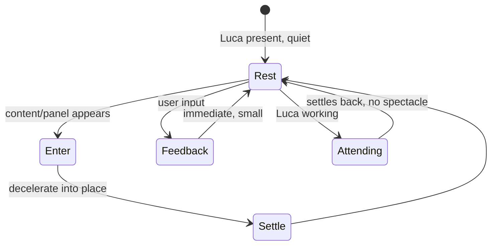

# Motion and Timing

> Calm motion: movement that carries continuity and orientation, never spectacle.
> This chapter gives the purpose of motion in LucaOS, the duration and easing
> guidance that makes it settle rather than perform, and the reduce-motion
> commitment that is non-negotiable.

Motion is where the [Design Philosophy](00-design-philosophy.md) is easiest to
betray. Animation is the most tempting way to make software feel "alive" and
"impressive" — and both of those are exactly what LucaOS design refuses. A bouncing,
glowing, constantly-animating interface overclaims (it performs aliveness Luca does
not have) and it is not calm (it demands attention it was not given). So motion in
LucaOS is held to a strict purpose: it exists to preserve
[continuity](../01-constitution/01-the-eight-invariants.md#invariant-5--cross-surface-continuity)
and to orient the user, and for nothing else.

---

## The purpose of motion

Every animation must justify itself by one of a short list of purposes. If it does
not serve one of these, it should not move.

- **Continuity.** Motion connects one state to the next so the user perceives a
  single continuous thing changing, not a jump-cut between two unrelated screens.
  This is the design-level echo of Presence: the same Luca, continuous through time,
  so its interface should change continuously too.
- **Orientation.** Motion tells the user where something came from and where it went
  — a panel that slides from the edge it lives on, a detail that expands from the row
  that spawned it. It answers "what just happened and where am I now?"
- **Feedback.** Motion confirms that an input was received — a control that responds
  the instant it is touched. Feedback motion is small, fast, and immediate.
- **Directing attention — rarely, and honestly.** Motion may draw the eye to
  something that genuinely warrants it, most often a [permission](../01-constitution/04-trust-and-permissions.md)
  decision or a state the user must know about. This is spent sparingly; overuse
  turns the interface into the attention-grabbing surveillance-feeling thing calm
  exists to prevent.

Notably absent: **delight for its own sake, decoration, and impressiveness.** A
flourish that exists to be admired is noise. The measure is the one from the
philosophy: does this help the user, or does it perform?



---

## Motion that settles, not bounces

The character of LucaOS motion is **settling**. Things arrive and come to rest, the
way a well-damped physical object does. They do not bounce, overshoot, spring, or
wobble. Bounce and spring are playful and attention-grabbing; they read as toylike
and they perform energy the interface should not have.

Concretely:

- **Entrances decelerate into place.** An element enters moving and slows to a stop —
  a decelerating (ease-out) curve. It does not snap in, and it does not overshoot and
  settle back.
- **Exits are quiet and quick.** Something leaving should not demand a farewell
  animation; it fades or slides out promptly on a gentle curve.
- **No overshoot, no bounce, no elastic.** The easing curves in the
  [token set](02-design-tokens.md#motion-tokens) are deliberately monotonic — they
  approach the target and stop. Springy `cubic-bezier` curves that overshoot are not
  part of the language.
- **Transforms and opacity, not layout thrash.** Motion animates `transform` and
  `opacity` for smoothness and to avoid janky reflow — a craft detail, but craft is
  the premium register.

---

## Duration and easing guidance

Calm motion is **short**. Long animations make the user wait and call attention to
themselves; the goal is motion the user feels but does not have to sit through. The
durations below are illustrative (the canonical values live in the
[token package](02-design-tokens.md#motion-tokens)) and express the intended
character.

| Purpose | Illustrative duration | Easing | Notes |
|---|---|---|---|
| Feedback (press, toggle) | `80–140ms` | decelerate | Must feel instant; the user should not perceive lag |
| Standard transition (panel, dialog, view) | `220ms` | decelerate (`0.2, 0, 0, 1`) | The default; enters settle into place |
| Larger surface change | `320ms` | gentle both-ends | Slower because more is moving; still brisk |
| Presence "attending" | slow, low-amplitude, looping | gentle | Calm and subtle — communicates working, never anxiety |

Guidance:

- **Bigger movements get slightly more time, small ones stay fast.** A full view
  transition can take a touch longer than a button's feedback, but nothing approaches
  the half-second-plus range that reads as sluggish.
- **Enter slightly slower than you exit.** Arrivals deserve a moment to be
  understood; departures should get out of the way.
- **Stagger sparingly.** A short stagger can aid orientation in a list; a long
  cascade is spectacle. Keep it subtle.

---

## Motion and Presence

Motion is one of the identity constants from
[Presence and Embodiment](01-presence-and-embodiment.md): how Luca moves is as
recognizable as how it looks, and it must be the same across every Surface. The
presence indicator's "attending" state is the clearest example. It is tempting to
render "Luca is thinking" as a dramatic pulsing, scanning, or swirling animation —
the cyberpunk "AI at work" trope. LucaOS rejects that. The attending state is a
calm, low-amplitude, honest motion: enough that the user knows Luca is working, never
so much that it performs effort or implies an inner life straining to help.

The same restraint governs transitions between Surfaces and continuity cues. When
Luca carries work from one device to another, motion may gently signal the continuity
— but only where the continuity is [real](../02-specification/09-continuity-and-sync.md),
never as a flourish that implies more than the system delivers. Motion, like
everything else, stays honest.

---

## The reduce-motion commitment

**Respecting the user's reduce-motion preference is not optional and not a
degraded mode.** Some users experience motion as distracting, nauseating, or
genuinely harmful (vestibular disorders). Honoring their preference is both an
[accessibility](06-accessibility.md) obligation and a direct expression of the calm
and deference principles: motion is a cost, and a user who has said "less motion" has
told us the cost is high for them.

The commitment is concrete:

- When the platform signals reduced motion (e.g. `prefers-reduced-motion: reduce`),
  non-essential motion is removed, not merely shortened.
- Transitions become instantaneous or cross-fade; movement-based animation is
  replaced by an opacity change or nothing.
- **No information is lost.** Anything motion communicated (orientation, state,
  feedback) is still communicated by a non-motion means — position, a state label, an
  immediate change. Motion is never the _only_ carrier of meaning.
- This is handled structurally through the `reduced` motion tokens
  ([Design Tokens](02-design-tokens.md#motion-tokens)), so honoring the preference is
  a property of the system rather than something each animation must remember.

```css
/* Illustrative: reduce-motion honored at the system level */
@media (prefers-reduced-motion: reduce) {
  * {
    animation-duration: 0.001ms !important;
    animation-iteration-count: 1 !important;
    transition-duration: 0.001ms !important;
  }
}
```

That blanket rule is a floor, not a substitute for designing each meaningful
transition to degrade gracefully; essential feedback should remain perceptible by
non-motion means.

---

## What to avoid

- **Spectacle.** Hero animations, elaborate loaders, celebratory confetti,
  attention-seeking idle motion. All noise.
- **Cyberpunk motion.** Scanning sweeps, glitch transitions, matrix effects, pulsing
  "energy," swirling orbs. The [rejected aesthetic](00-design-philosophy.md#principle-3--the-explicit-rejection-of-cyberpunk)
  in motion form, and it overclaims.
- **Bounce, spring, elastic overshoot.** Toylike; not the settling character.
- **Long durations.** Anything the user has to wait out is a tax on attention.
- **Motion as the only signal.** Fails reduce-motion users and is fragile. Always
  pair motion with a durable, static cue.
- **Idle animation to stay "alive."** A presence that animates when nothing is
  happening is performing aliveness — the honesty violation, restated in motion.

---

## See also

- [Design Philosophy](00-design-philosophy.md) — calm and the no-spectacle mandate
- [Design Tokens](02-design-tokens.md#motion-tokens) — the duration and easing tokens
- [Presence and Embodiment](01-presence-and-embodiment.md) — motion as an identity constant
- [Accessibility](06-accessibility.md) — the reduce-motion commitment in full
