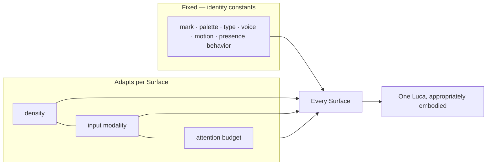

# Surface Guidelines

> Per-Surface design guidance under one identity. How desktop, web, voice, widget,
> mobile, and XR each adapt presentation — density, input modality, attention budget
> — while remaining unmistakably the same calm, honest Luca.

A [Surface](../GLOSSARY.md) is the interaction modality through which a user meets
Luca on a [Host](../GLOSSARY.md). The central tension of this chapter is the one the
whole Design System exists to resolve: each Surface is genuinely different — a watch
widget and an XR room have almost nothing physically in common — yet all of them must
be experienced as the **one Luca** ([Invariant 1](../01-constitution/01-the-eight-invariants.md#invariant-1--one-luca-identity)).
The resolution is the division established in [Presence and Embodiment](01-presence-and-embodiment.md):
**identity constants are fixed; presentation adapts.** This chapter is the per-Surface
statement of what may adapt and what may not.

---

## What adapts, and what never does

Three variables legitimately differ across Surfaces:

- **Density** — how much information and control is present, drawn from the shared
  spacing and type scales ([Design Tokens](02-design-tokens.md)). A desktop panel is
  dense; a widget is sparse. The scale is shared; the amount used varies.
- **Input modality** — pointer, touch, voice, gaze/gesture. This reshapes target
  sizes, interaction patterns, and how [permission](../01-constitution/04-trust-and-permissions.md)
  is granted, but not the identity.
- **Attention budget** — how much of the user's focus the Surface can assume. A
  desktop user is settled and attentive; a mobile or voice user is often divided,
  moving, or hands-busy. Calm means spending less attention where less is available.

Four things never adapt — the identity constants: **the mark, the palette, the
typography, the voice, the motion character, and the presence behavior.** A Surface
that changes any of these is building a second Luca.

---

## Desktop

**Character.** The fullest, most capable Surface. The user is typically seated,
focused, and multi-tasking across windows; the attention budget is high but the
screen is shared with the user's real work.

**Guidance.**
- **Defer to content (Principle 4).** On the desktop especially, Luca is calm chrome
  _around_ the user's work, not the centerpiece. The interface should not dominate the
  screen; it sits at the edge of attention until turned to.
- **Density is higher, but still generous.** More information and control can be
  present than on any other Surface, but the premium register means space is still
  the primary tool. Dense is not cramped.
- **Pointer-precise.** Fine targets, hover states, keyboard shortcuts, and
  full keyboard navigability (see [Accessibility](06-accessibility.md)).
- **Permission moments are clear and inline.** When Luca needs to act on the user's
  world, the [gate](../01-constitution/04-trust-and-permissions.md) is a distinct,
  honest moment — never a decorative confirmation the user clicks through by reflex.

---

## Web

**Character.** Closely related to desktop, but reached through a browser and often
across a wider range of devices and window sizes. The user may be less "installed"
into the experience.

**Guidance.**
- **Same Luca as desktop, responsive.** Web and desktop should feel like one Luca at
  different container sizes, not two products. Layout reflows; identity does not.
- **Responsive density.** Density scales down gracefully as the viewport narrows,
  approaching mobile patterns at small sizes — but from the same token scale.
- **Honest about continuity.** Web sessions may have different persistence guarantees
  than an installed [Runtime](../02-specification/01-persistent-runtime.md). Show
  continuity where it is [real](../02-specification/09-continuity-and-sync.md); do not
  imply the web Surface holds state it does not. This is honesty applied to a Surface
  boundary.

---

## Voice

**Character.** No screen, or a secondary one. The user is often hands-busy, moving,
or driving. The attention budget is real but non-visual, and latency and clarity
matter more than anywhere else. Here the **voice is the entire embodiment**.

**Guidance.**
- **The [verbal identity](04-voice-and-tone.md) carries everything.** Same Luca,
  same personality — spoken. Slightly more conversational and more concise than
  written replies, because listening has less bandwidth than reading, but never a
  different character.
- **Listening state is unambiguous and honest.** Because voice touches privacy, the
  user must always know when Luca is capturing audio — through an honest audio or
  visual cue. A presence that hides or fakes listening is a trust violation.
- **Minimal, calm voice-HUD when a screen exists.** On a phone or car display, the
  visual is spare: a small honest indication of listening / attending / speaking,
  built from the mark. Never a pulsing sci-fi orb — the
  [rejected aesthetic](00-design-philosophy.md#principle-3--the-explicit-rejection-of-cyberpunk).
- **Design for interruption and eyes-off.** Answers are structured to be understood
  by ear, front-loaded, and interruptible. Captions and transcripts make spoken
  output accessible (see [Accessibility](06-accessibility.md)).

---

## Widget

**Character.** The most compressed Surface — a small, glanceable pane on a home
screen, lock screen, watch face, or desktop corner. Attention is a glance; density
must be minimal.

**Guidance.**
- **Compress without mutating.** The widget is a small window onto the one Luca, not
  a "lite" variant with its own look. The mark, palette, and type are the same,
  simply less of them.
- **Show only what is honestly current.** A widget states the most relevant true
  thing — a pending item, a status, a next step — and defers the rest to a fuller
  Surface. It does not imply more than it shows.
- **One clear action, at most.** Respect the glance: a single obvious next step, or
  none. No dense controls, no scrolling economies of a full panel.
- **Quiet.** A widget is present, not attention-grabbing. It does not animate to be
  noticed (calm; [reduce-motion](03-motion-and-timing.md) still applies).

---

## Mobile

**Character.** Touch-first, usually one-handed, frequently interrupted, often
outdoors or on the move. High personal attachment to the device, but a fragmented
attention budget.

**Guidance.**
- **Touch ergonomics.** Larger targets, thumb-reachable primary actions, generous
  spacing from the shared scale. Gestures follow platform conventions rather than
  bespoke inventions.
- **Lower assumed attention than desktop.** Shorter flows, clearer single next steps,
  resilience to being backgrounded mid-task. Continuity matters most here: picking the
  phone up should _continue_ what the desktop was doing, not restart it — the visible
  proof of [cross-surface continuity](../01-constitution/01-the-eight-invariants.md#invariant-5--cross-surface-continuity).
- **Same identity, adapted density.** The mark, palette, type, voice, and presence
  behavior are exactly the desktop's. A person who knows desktop Luca meets the same
  Luca on the phone.
- **Permission on touch.** Gated actions use platform-honest confirmation patterns;
  the gate remains a real decision, never a reflex tap.

---

## XR

**Character.** Spatial, immersive, gaze- and gesture-driven, and the Surface where
the honesty commitment is most tested. XR is a forward-looking target; see the
[Roadmap](../06-roadmap/README.md) for where the current build stands. It is
specified here so the language is ready and consistent when the Surface arrives.

**Guidance.**
- **Present spatially, not personified.** XR strongly invites a literal embodied
  "being" in the room — the personified character LucaOS refuses
  ([Presence and Embodiment](01-presence-and-embodiment.md)). Luca occupies space as
  an honest, abstract, calm presence, not an anthropomorphic avatar performing life.
- **Respect the user's environment and attention.** Luca does not colonize the field
  of view or clutter the space. It is present at the edge of attention and comes
  forward when turned to — spatial calm.
- **Comfort and reduce-motion are safety, not polish.** In XR, motion can cause real
  discomfort; the [reduce-motion commitment](03-motion-and-timing.md) is even more
  load-bearing. Movement is minimal, settled, and easily dialed down.
- **Same constants, spatial form.** Palette, type, voice, and the presence vocabulary
  carry over; only the medium is new.

---

## Cross-Surface continuity in practice

The Surfaces are not islands. A user moves between them mid-task, and the experience
must be _continuing_, not _restarting_ — the design-visible form of
[Invariant 5](../01-constitution/01-the-eight-invariants.md#invariant-5--cross-surface-continuity).

- **Continue, don't re-introduce.** Moving from desktop to mobile mid-task shows the
  same work in progress, not a fresh greeting. The "before" of
  [Presence](../00-manifesto/03-presence-is-the-product.md) spans Surfaces.
- **Adapt the presentation, preserve the state.** The mobile view of a task is denser
  or sparser than the desktop's, but it is the _same task and the same Luca_, drawn
  from shared state — never a re-entry point with its own copy.
- **Never imply continuity that isn't there.** Where a Surface genuinely cannot hold
  or sync state, the design says so honestly rather than faking a seamless handoff.
  Honesty outranks the pleasing illusion.

---

## Quick reference

| Surface | Density | Primary input | Attention budget | Embodiment emphasis |
|---|---|---|---|---|
| Desktop | High (generous) | Pointer + keyboard | High, settled | Full visual chrome, deferring to content |
| Web | Responsive | Pointer / touch | Medium–high | Same as desktop, responsive; honest about persistence |
| Voice | Minimal / none | Speech | Non-visual, often divided | Voice is the identity; honest listening state |
| Widget | Minimal | Glance / tap | A glance | Compressed mark + one true thing |
| Mobile | Medium | Touch | Fragmented | Same identity, touch ergonomics, continuity |
| XR | Spatial, sparse | Gaze / gesture | Immersive | Abstract spatial presence, never personified |

---

## See also

- [Presence and Embodiment](01-presence-and-embodiment.md) — the identity constants that hold across all Surfaces
- [Design Tokens](02-design-tokens.md) — the shared scales density draws from
- [Voice and Tone](04-voice-and-tone.md) — the voice that carries the voice Surface
- [Accessibility](06-accessibility.md) — per-Surface access obligations
- [Surface Layer (Specification)](../02-specification/06-surface-layer.md) · [Continuity and Sync](../02-specification/09-continuity-and-sync.md)
