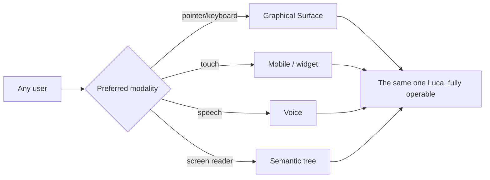

# Accessibility

> Accessibility as a trust and Presence commitment, not a mode. If Luca is
> continuously present for the user, it must be present for _every_ user — through
> contrast, scalable type, reduced motion, keyboard and screen-reader support, and
> spoken access. This is a floor the whole Design System stands on, never a setting
> some users toggle into.

Most design systems treat accessibility as a compliance chapter — a checklist bolted
on near shipping. LucaOS treats it as constitutional, for a reason that follows
directly from the [Manifesto](../00-manifesto/03-presence-is-the-product.md).
**Presence is the product**, and a Presence that only some people can perceive is a
broken product for everyone it excludes. A continuously present AI that a blind user
cannot hear, a low-vision user cannot read, or a motor-impaired user cannot operate
is not "less accessible" — for that user it is simply _not present_. Accessibility is
how Presence is kept for everyone.

It is also a **trust** commitment. [Trust and Permissions](../01-constitution/04-trust-and-permissions.md)
makes transparency and least-surprise foundational: the user must be able to see what
Luca did and to act on it. A user who cannot perceive a [permission](../01-constitution/04-trust-and-permissions.md)
prompt cannot meaningfully consent, and consent that cannot be perceived is not
consent. So accessibility is not adjacent to the two threads of this Design System
(calm-as-Presence, honest-as-Trust) — it is both threads made universal.

---

## The stance: a floor, not a mode

The word "mode" is the failure. Accessibility is not an alternate build, a
high-contrast skin, or a screen-reader "version" maintained beside the real one. It
is a property of the one design that all users receive. Concretely:

- There is **one Luca** and **one interface**, and it is accessible. There is no
  lesser accessible fork to fall behind.
- Accessibility requirements are **token-level and system-level** wherever possible,
  so they hold structurally rather than depending on each screen remembering them
  (the same philosophy as [category security floors](../01-constitution/01-the-eight-invariants.md#invariant-8--security-and-explicit-permissions):
  make correctness the default, so omission fails safe).
- An inaccessible component is a **defect**, reviewed like any other broken behavior,
  not a nice-to-have deferred to a future sprint.

Where the current implementation is behind this bar, the honesty clause applies: name
the gap and link the [Roadmap](../06-roadmap/README.md); do not paper over it.

---

## Contrast

Color is chosen for calm restraint, and it must also be _legible_. Contrast is
enforced at the semantic [token](02-design-tokens.md#color) layer, so any permitted
text-on-surface pairing is validated once rather than audited component by component.

- **Targets.** Normal text meets at least WCAG **AA 4.5:1**; large text and
  meaningful non-text UI (icons, controls, focus indicators, state colors) meet at
  least **3:1**. AAA (7:1) is preferred for body text where the calm palette allows.
- **Both themes.** Light and dark are both held to the floors. The dark theme is a
  considered surface (a deep neutral, not "hacker black"; see
  [Design Tokens](02-design-tokens.md)), and the accent lightens in dark so contrast
  holds against the darker background.
- **Never color alone.** Meaning is never carried by hue by itself — state,
  selection, error, and success are always paired with text, shape, icon, or
  position, so color-blind users and low-contrast conditions lose nothing. This is
  the same principle as "motion is never the only signal."
- **A failing pairing is a broken token**, fixed at the semantic layer, not a cosmetic
  nit to defer.

---

## Scalable type

Text must scale to the user's needs without breaking.

- **Relative units.** Type sizes are expressed in `rem` (see
  [Design Tokens](02-design-tokens.md#typography)) so they respond to the user's
  chosen base size and platform text-size settings, rather than being pinned in
  pixels.
- **Reflow, don't clip.** Layouts accommodate significantly enlarged text — up to at
  least 200% — by reflowing, not truncating, overlapping, or hiding content. Nothing
  essential is lost when a user needs bigger text.
- **Readable defaults.** Line length, line height, and spacing follow the calm,
  generous typographic rhythm, which is also the most readable one. Accessibility and
  the premium register agree here.

---

## Reduced motion

The [reduce-motion commitment](03-motion-and-timing.md) is restated here because it is
an accessibility obligation, not only a calm one. For users with vestibular
disorders, motion can cause real physical discomfort; in XR it can be genuinely
unsafe.

- When the platform signals reduced motion (`prefers-reduced-motion: reduce`),
  non-essential motion is **removed, not merely shortened**, via the `reduced`
  [motion tokens](02-design-tokens.md#motion-tokens) — handled at the system level so
  it holds everywhere.
- **No information is lost.** Anything motion conveyed — orientation, state change,
  feedback — remains conveyed by a static means (position, label, immediate change).
- In XR, minimized and dampenable motion is treated as **comfort and safety**, not
  polish.

---

## Keyboard and pointer-independent operation

Everything a user can do with a pointer, they can do without one.

- **Full keyboard operability.** Every interactive element is reachable and operable
  by keyboard, in a logical order, with no traps. Complex widgets follow established
  keyboard interaction patterns.
- **Visible focus.** A clear, high-contrast focus indicator (meeting the 3:1 non-text
  floor) is always present; it is never removed for aesthetics. On the calm palette,
  a visible focus ring is part of the design, not an intrusion on it.
- **Shortcuts that don't trap.** Keyboard shortcuts (rich on desktop) are
  discoverable and do not conflict with assistive technology.
- **Alternatives to gestures.** On touch and XR Surfaces, any gesture-only action has
  a non-gesture equivalent, so users who cannot perform a gesture are not locked out.

---

## Screen readers and semantics

Luca's interface must be intelligible to assistive technology, which means it is
built from real semantics, not visual approximations.

- **Semantic structure.** Native semantic elements and roles, correct heading order,
  labeled controls, and grouped regions — so a screen-reader user perceives the same
  structure a sighted user sees.
- **Names, roles, states.** Every control exposes an accessible name, its role, and
  its current state (pressed, expanded, selected, busy). The **presence indicator**
  from [Presence and Embodiment](01-presence-and-embodiment.md) is included: its
  honest states — present, attending, listening, acting — are exposed as text, so a
  screen-reader user knows exactly what Luca is doing. Honesty applies to the
  accessibility tree as much as to the pixels.
- **Live updates announced proportionately.** Content that changes (a streaming
  reply, a status change) is announced through live regions at a level matched to its
  importance — calm applies here too: not everything interrupts.
- **Permission moments are unmissable to AT.** A [gate](../01-constitution/04-trust-and-permissions.md)
  is announced clearly and requires a real, perceivable decision. Consent that a
  screen-reader user cannot perceive is not consent.

---

## Voice as access, and captions for spoken output

Luca's multimodality is an accessibility asset when it works in both directions.

- **Voice as an input alternative.** For users who cannot use a keyboard, pointer, or
  touch, the [voice Surface](05-surface-guidelines.md) is a genuine path to operating
  Luca — an access route, not only a convenience. Its design (clear listening state,
  interruptibility, honest confirmation) matters for accessibility, not just for
  hands-busy contexts.
- **Captions and transcripts for everything spoken.** Any spoken output has a
  synchronized text equivalent — captions in the moment and a transcript after — so
  Deaf and hard-of-hearing users lose nothing, and so spoken content is reviewable.
  Spoken-only information is never the sole carrier of meaning, mirroring the
  color-alone and motion-alone rules.
- **Modality is a choice, never a requirement.** A user can operate Luca by the
  modality that works for them; no essential capability is locked to a single sense.

---

## Accessibility in review

Because accessibility is a floor, it is checked like any other correctness property:

- Contrast is validated at the semantic token layer, in both themes.
- Type scales to at least 200% without loss; layouts reflow.
- Reduced motion is honored system-wide with no information lost.
- Everything is keyboard-operable with visible focus and no traps.
- The accessibility tree exposes accurate names, roles, states — including Luca's
  honest presence states.
- Spoken output has synchronized captions and a transcript.
- Permission and provenance moments are perceivable through every modality.

A change that regresses any of these is regressing the product, because it is
regressing Presence and Trust for the users it affects.

---

## See also

- [Design Philosophy](00-design-philosophy.md) — calm and honesty, of which accessibility is the universal form
- [Design Tokens](02-design-tokens.md) — contrast, scalable type, and reduced-motion as token obligations
- [Motion and Timing](03-motion-and-timing.md) — the reduce-motion commitment
- [Surface Guidelines](05-surface-guidelines.md) — per-Surface access paths
- [Trust and Permissions](../01-constitution/04-trust-and-permissions.md) — why perceivable consent is constitutional
- [Presence Is the Product](../00-manifesto/03-presence-is-the-product.md) — why an unreachable Presence is no Presence
