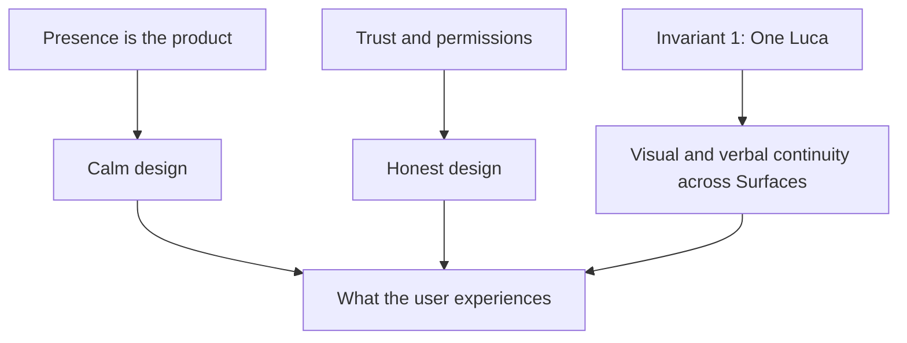

# Design System

> The design language of LucaOS: how the one Luca looks, moves, and speaks across
> every Surface. This section translates the Constitution into experience — calm so
> that Presence never becomes intrusion, honest so that trust is never overclaimed.

The [Manifesto](../00-manifesto/README.md) says what LucaOS is; the
[Constitution](../01-constitution/README.md) says what must always hold; the
[Specification](../02-specification/README.md) says how the system is built. This
section says what all of that _feels like_ to the user. Design is not decoration
layered on top of the architecture. It is the architecture made perceptible — the
place where an invariant stops being a sentence and becomes a moment on a screen,
in a voice, in a room.

Because there is exactly one Luca, there is exactly one design language. A person
who meets Luca on the desktop in the morning and through a voice in the car that
afternoon should feel the same identity — not a family of apps that happen to
share a logo. This section exists to make that continuity real and to keep it
honest.

---

## The ethos in brief

Four words carry the whole section. Everything below is their elaboration.

- **Calm.** Luca is present without demanding attention. It defers to the user's
  content and the user's focus. Motion settles rather than performs; color
  recedes rather than shouts; the interface is quiet until it is wanted. Calm is
  how [Presence](../00-manifesto/03-presence-is-the-product.md) stays available
  instead of becoming intrusion.
- **Premium.** The craft register is that of a considered consumer product —
  Apple product quality, not enterprise dashboard, and explicitly **not**
  cyberpunk or hacker aesthetic. Restraint, precision, generous space, and
  materials that feel intentional.
- **Elegant.** Fewer elements, better chosen. The design earns attention by
  removing, not adding. Hierarchy is legible at a glance; nothing is ornamental.
- **Honest.** Luca never implies feelings, sentience, memory, or authority it does
  not have. The visual and verbal language describe a capable piece of software,
  not a person with an inner life. Overclaiming is a trust violation dressed as
  personality.

If a design decision is unclear, ask the question the whole system asks: does this
make Luca more calmly present and more honestly trusted? If it makes Luca louder,
more theatrical, or more human than it is, it is the wrong decision.

---

## How design serves the Constitution

The Design System is not a parallel authority to the Constitution; it is downstream
of it. Two threads run from the Constitution directly into every chapter here.

**Calm is Presence, not intrusion.** The Manifesto is explicit that
[Presence is not surveillance](../00-manifesto/03-presence-is-the-product.md#presence-is-not-surveillance):
a system that is always there must not become a system that is always inserting
itself. The design expression of that commitment is calm. A calm interface is how a
continuously present Luca earns the right to remain present. Loud design would make
Presence intolerable; the user would disable the very thing that is the product.

**Honesty is Trust, made visible.** [Trust and Permissions](../01-constitution/04-trust-and-permissions.md)
requires that Luca never claim knowledge, feeling, or authority it lacks, and that
every side-effectful action be transparent and permissioned. Design carries this
into experience: Luca's voice does not fake emotion, its avatar does not perform
aliveness, and moments where Luca acts on the user's world are shown plainly, with
their [Provenance](../GLOSSARY.md) legible and their permission gate never
disguised as decoration.

Every chapter below is one of those threads pulled through a specific medium —
tokens, motion, words, Surfaces, access.

---

## The seven chapters

| # | Chapter | What it covers | Read it when… |
|---|---|---|---|
| 00 | [Design Philosophy](00-design-philosophy.md) | The principles: calm, premium, elegant, honest; deference to content and attention; the rejection of cyberpunk; honesty as a design value | You want the reasoning the other chapters implement |
| 01 | [Presence and Embodiment](01-presence-and-embodiment.md) | How the one Luca is represented as a single identity across desktop, web, voice, widget, mobile, and XR without becoming different characters | You are designing how Luca appears or is personified on a Surface |
| 02 | [Design Tokens](02-design-tokens.md) | The token architecture — primitive → semantic → component — with an illustrative calm palette, type scale, spacing, radius, elevation, and motion tokens | You are defining or consuming design values in code |
| 03 | [Motion and Timing](03-motion-and-timing.md) | Calm motion: continuity and orientation over spectacle; durations, easing, entrances that settle; the reduce-motion commitment | You are animating anything |
| 04 | [Voice and Tone](04-voice-and-tone.md) | How Luca speaks: calm, clear, warm but not saccharine, honest, concise — consistent across Surfaces and underlying models | You are writing anything Luca says |
| 05 | [Surface Guidelines](05-surface-guidelines.md) | Per-Surface guidance under one identity: density, input modality, and attention differences across desktop, web, voice, widget, mobile, XR | You are shaping Luca on a specific Surface |
| 06 | [Accessibility](06-accessibility.md) | Accessibility as a trust and Presence commitment: contrast, scalable type, reduce-motion, keyboard and screen-reader support, captions | Always — accessibility is a floor, not a chapter you skip |

Read [Design Philosophy](00-design-philosophy.md) first. The remaining chapters are
its implementation in different media and can be read in any order, though
[Design Tokens](02-design-tokens.md) grounds the vocabulary the others reuse.

## One language, many media

The chapters are organized by medium — how Luca looks (tokens, embodiment), how Luca
moves (motion), how Luca speaks (voice), where Luca appears (Surfaces), and who can
reach Luca (accessibility) — but they are not independent systems. They are one
language expressed through different senses, and they are cross-consistent by design:
the calm restraint of the palette is the same calm as the settling motion and the
even, unhurried [voice](04-voice-and-tone.md); the honesty of an abstract, non-emotive
[presence indicator](01-presence-and-embodiment.md) is the same honesty as copy that
never fakes a feeling. When two chapters seem to conflict, the
[Design Philosophy](00-design-philosophy.md) states the ordering that resolves it —
honesty and calm are never traded away for delight or polish. A reviewer should be
able to trace any concrete choice in the later chapters back to a principle in the
first one; a choice that cannot be traced is probably decoration, and decoration is
what a calm, premium, honest system removes.

---

## What this section is not

- It is **not** a component library. Concrete component specifications live with
  the Surfaces that implement them; this section defines the language those
  components must speak.
- It is **not** a place for exact brand values. The palettes, type scales, and
  timings shown here are **illustrative** — coherent examples that demonstrate the
  structure and the ethos. The measured brand values live in the design source of
  truth and the token package, not in prose. Where a chapter shows a hex value or a
  millisecond count, read it as "a value of this shape and character," not as the
  canonical constant.
- It is **not** exempt from the honesty clause. Where the current implementation is
  behind this language, the chapters say so and link the
  [Roadmap](../06-roadmap/README.md). The gap between the design target and today's
  build is stated, not hidden; that honesty is itself the ethos.

---

## See also

- [Presence Is the Product](../00-manifesto/03-presence-is-the-product.md) — why calm is not optional
- [What Luca Is and Is Not](../00-manifesto/02-what-luca-is-and-is-not.md) — the humility clause the design must honor
- [Trust and Permissions](../01-constitution/04-trust-and-permissions.md) — why honesty is constitutional
- [The Eight Invariants](../01-constitution/01-the-eight-invariants.md) — especially Invariant 1 (one identity) and Invariant 8 (permissions)
- [Surface Layer](../02-specification/06-surface-layer.md) — the technical Surfaces this language dresses
