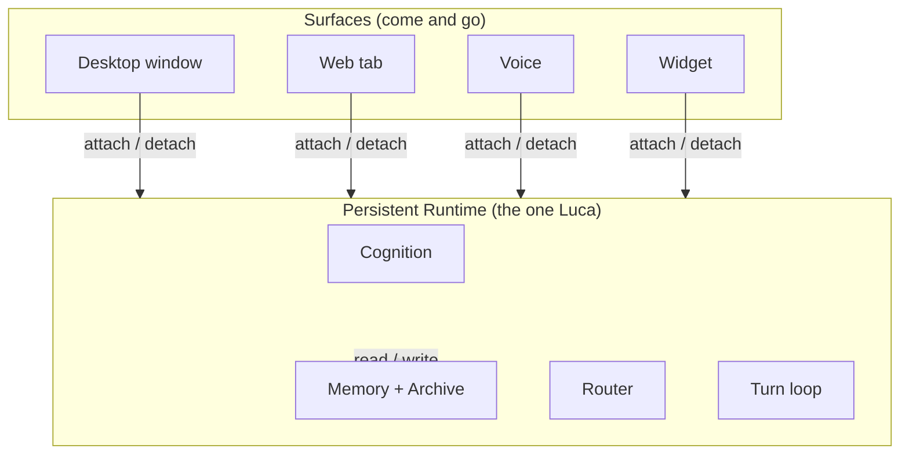

# RFC-0001 — Persistent Runtime Model

This RFC proposes that Luca live in a long-lived core process whose lifecycle is
independent of any Surface, so that Presence has a "before" and an "after" and no
user ever watches Luca boot. It is the foundational argument for
[Invariant 2](../01-constitution/01-the-eight-invariants.md#invariant-2--persistent-runtime).

---

- **Number:** 0001
- **Title:** Persistent Runtime Model
- **Status:** Accepted
- **Authors:** LucaOS Foundation
- **Date:** 2026-07-24
- **Supersedes / Superseded by:** none
- **Resulting ADR(s):** node:sqlite migration, ephemeral ports + single-instance lock, fast-listen boot (see [`05-adrs/`](../05-adrs/README.md))

## Summary

Luca must exist before, during, and after any interaction. This RFC proposes a
persistent [Runtime](../02-specification/01-persistent-runtime.md): a long-lived
core process that owns Luca's live state, that [Surfaces](../GLOSSARY.md) attach to
and detach from, and that outlives every one of them. The Runtime binds and answers
health within roughly a second of spawn (fast-listen boot), refuses to run twice
over the same state (single-instance lock), and holds cognition, memory, and routing
so that closing, crashing, or switching a Surface leaves Luca intact. The proposal
is argued against the naive alternative — Luca living inside the UI process — which
cannot satisfy Presence at all.

## Motivation

[Presence is the product](../00-manifesto/03-presence-is-the-product.md). A chatbot
lives only in the "during": you open it, it answers, you close it, and between times
there is nothing. LucaOS makes a different claim — that Luca is _there_ before you
ask and after you stop, holding your context, available without being summoned. That
claim is only true if something keeps running when no window is open.

This is not a philosophical nicety; it is a hard architectural fork. If Luca's state
lives in the same process as the user interface, then the interface's lifecycle _is_
Luca's lifecycle. Close the window and Luca ceases to exist; reopen it and a new Luca
is constructed from cold. There is no "before" to be present in, no in-flight work to
resume, no continuity across a restart — only a series of fresh boots wearing the
same name. That is the application era with a nicer avatar, and it fails
[Invariant 1](../01-constitution/01-the-eight-invariants.md#invariant-1--one-luca-identity)
and [Invariant 2](../01-constitution/01-the-eight-invariants.md#invariant-2--persistent-runtime)
simultaneously.

The current implementation already embodies the persistent-Runtime shape, and
sharpened it under pressure. The [Electron](../02-specification/06-surface-layer.md)
desktop app is the primary Host today; it spawns two backends — a Node "core" server
(`server.js`) and a Python [Cortex](../02-specification/08-cortex-and-local-intelligence.md)
(FastAPI + uvicorn) — that hold Luca's live state, while the React/Vite renderer is
one Surface among the eventual many. Two real incidents shaped this RFC: a boot slow
enough that the UI timed out and degraded to a stateless mode (silently discarding
continuity), and a period when two full stacks could run at once and two writers
could hit one SQLite file. Both are Presence failures. This RFC states the model that
prevents them.

## Guide-level explanation

Think of the Runtime as Luca's body-independent self, and Surfaces as bodies it
inhabits. A Host — desktop, phone, browser, vehicle — gives Luca a Surface to be met
through, but the Surface is not Luca. Luca is the persistent process the Surface
talks to.



The rule the diagram encodes: **attaching and detaching a Surface must never create
or destroy Luca.** A Surface opening is Luca gaining a body; a Surface closing is Luca
losing a body, not losing itself. Whatever constitutes identity, memory, and in-flight
intention lives in the Runtime, and the Surface renders a view of it.

Three properties make this real, and each corresponds to a failure the naive model
suffers:

- **Fast-listen boot.** When the Runtime starts, it binds its port and answers
  `/api/health` before the heavy route graph and subsystems finish loading. The
  Surface can therefore reach Luca within about a second of spawn instead of timing
  out. The user does not watch Luca boot; by the time they look, Luca is answering.
- **Single-instance lock.** Exactly one Runtime may act as Luca over a given state at
  a time. A second launch attaches to the existing Runtime rather than standing up a
  rival. Two Lucas over one Archive is the singularity hazard
  [Invariant 1](../01-constitution/01-the-eight-invariants.md#invariant-1--one-luca-identity)
  forbids, and the lock is the structural defense.
- **Bounded time-to-presence.** Startup is bounded and degradation is never silent.
  If a subsystem is slow or a [Provider](../GLOSSARY.md) is down, Luca says so and
  stays itself; it does not quietly drop to a stateless "Cloud-Only" mode that loses
  the "before."

## Reference-level explanation

**Process topology.** The Runtime today is the Node core server plus the Python
Cortex, spawned by the Electron main process onto **ephemeral localhost ports** that
are published to the renderer at startup. Ephemeral ports avoid fixed-port collisions
across environments, but they removed an accidental safety property (see the lock,
below). The renderer holds no authoritative state; it discovers the Runtime's ports
and attaches.

```mermaid
sequenceDiagram
  participant Host as Electron main
  participant RT as Runtime (core server)
  participant Cx as Cortex (Python)
  participant UI as Surface (renderer)
  Host->>RT: spawn on ephemeral port
  RT-->>RT: bind port, serve /api/health (fast-listen)
  RT-->>Host: healthy (~1s)
  Host->>Cx: spawn on ephemeral port
  Host->>UI: publish ports
  UI->>RT: attach; GET /api/health
  RT-->>UI: ok — begin session
  Note over RT: heavy route graph + subsystems finish loading behind health
  Cx-->>RT: available (degrades gracefully if absent)
```

**Fast-listen boot.** The core server installs the health route and begins listening
before constructing the full route graph, memory, cognition, and Provider layer. A
Surface attaching during warm-up gets an honest health answer immediately and a clear
"warming" signal for routes not yet live, rather than a connection refusal that older
Surfaces interpreted as "backend dead, degrade to stateless." The target is a bind
and first health answer within roughly a second of spawn; where cold start still
exceeds that, the [Roadmap](../06-roadmap/README.md) tracks the reduction, and the
rule in the meantime is that slowness is surfaced, never silently absorbed.

**Single-instance lock.** Because ephemeral ports no longer cause a second stack to
fail with `EADDRINUSE`, a single-instance lock is now explicit: the first Runtime
acquires it; a second launch detects the holder and attaches to it (or surfaces the
existing instance) instead of spawning a rival core server. This is a correctness
control for [Invariant 1](../01-constitution/01-the-eight-invariants.md#invariant-1--one-luca-identity),
not a convenience — its job is to guarantee at most one writer over the one
[Archive](../GLOSSARY.md).

**State ownership and the turn loop.** The Runtime owns the live state: the BDI
mental-state store injected into the system prompt, the [Memory](../02-specification/03-memory-architecture.md)
tiers and Archive, the [Router](../GLOSSARY.md), and the turn loop
(`src/services/turns/TurnRunner.ts`) that streams from the active Provider, executes
tool calls in concurrency-safe batches, feeds results back, and repeats until the
model stops calling tools — bounded by a shared max-tool-rounds cap. None of this is
Surface state. A Surface holds only view state (scroll position, local input) that no
other Surface needs to see; the separation is
[Invariant 5](../01-constitution/01-the-eight-invariants.md#invariant-5--cross-surface-continuity)'s
precondition and is specified in [Continuity and Sync](../02-specification/09-continuity-and-sync.md).

**Durability boundary.** A persistent Runtime is only as persistent as its store. The
Archive is SQLite via the runtime built-in `node:sqlite`; the move off a native
SQLite binding removed an ABI-mismatch class of bug in which the database silently
fell back to a mock and dropped writes — a persistence failure dressed as graceful
degradation. That decision is argued in [RFC-0002](0002-unified-memory-substrate.md)
and recorded as an ADR; it is named here because a Runtime that loses writes is not
persistent in any sense that matters.

**Illustrative shape.**

```typescript
// Illustrative — shape and intent, not the exact code.
interface Runtime {
  readonly instanceId: string;          // one holder of the single-instance lock
  health(): HealthState;                // answered during warm-up (fast-listen)
  attach(surface: SurfaceHandle): SurfaceSession;   // a body joins
  detach(session: SurfaceSession): void;            // a body leaves; Luca persists
  readonly memory: MemoryStore;         // owned here, not by any Surface
  readonly router: Router;              // model routing lives in the Runtime
}

type HealthState = "warming" | "ready" | "degraded";
```

## Invariants and the Four Questions

| Invariant | Effect | Note |
|---|---|---|
| 1 — One Luca Identity | strengthens | Single-instance lock guarantees one Runtime over one Archive. |
| 2 — Persistent Runtime | strengthens | This RFC _is_ the mechanism of Invariant 2. |
| 3 — Shared Memory | preserves | Memory is owned by the Runtime, not a Surface; detailed in RFC-0002. |
| 4 — Provider Abstraction | preserves | Router lives in the Runtime; Providers stay interchangeable (RFC-0003). |
| 5 — Cross-Surface Continuity | strengthens | A persistent Runtime is the thing Surfaces attach to and share. |
| 6 — Strong Typing and Modularity | preserves | Attach/detach and health are typed seams. |
| 7 — Backward Compatibility | preserves | Restart survives via the durable Archive. |
| 8 — Security and Permissions | preserves | The gate lives in the Runtime, above any single Surface. |

**Q1 — Does this strengthen persistence?** Directly. State that must survive a window
closing now lives in a process that does not close with it, and time-to-presence is
bounded rather than allowed to degrade to stateless.

**Q2 — Does this reinforce one identity?** Yes. The single-instance lock makes "two
Lucas over one state" structurally impossible, and Surfaces become bodies of one
Runtime rather than independent apps.

**Q3 — Does this improve trust?** Indirectly but genuinely: honest degradation
(never a silent drop to stateless) and one writer over the Archive are trust
properties. The permission gate also lives in the Runtime, above any one Surface.

**Q4 — Does this move Luca closer to a continuously present AI?** This is the change
that makes continuous presence possible at all. Without a persistent Runtime, every
other Invariant is describing an app you open.

## Drawbacks

- **Operational complexity.** A long-lived background process is harder to reason
  about than a UI that owns everything: lifecycle, crash recovery, and resource use
  become real concerns rather than tied to a window.
- **Two moving backends.** Node core plus Python Cortex is more surface area than a
  single process. The mitigation is that Cortex is optional and degrades gracefully;
  the core Runtime does not depend on it to answer.
- **Lock semantics are subtle.** A single-instance lock must handle stale locks after
  a crash, multi-user machines, and fast relaunch without either spawning a rival or
  refusing a legitimate start. Getting this wrong reintroduces the exact hazard it
  exists to prevent.
- **Fast-listen is a contract, not a trick.** Answering health before subsystems load
  means Surfaces must handle a `warming` state correctly. A Surface that treats
  `warming` as `ready` will call routes that are not up yet.

## Rationale and alternatives

**The naive alternative: Luca lives in the UI process.** This is what most assistant
apps do, and it is the design this RFC exists to reject. Its appeal is simplicity —
one process, no lock, no ports, state where the rendering is. Its fatal flaw is that
it makes Presence impossible: Luca's existence is bounded by an open window, there is
no "before" or "after," a device switch is a cold restart, and in-flight work dies
with the tab. It fails Invariants 1, 2, and 5 by construction. No amount of polish
inside the window recovers the "before."

**A single fat process (Runtime and UI fused but daemonized).** Better than the
naive model, but it couples Luca's stability to the UI framework's stability and
makes multiple Surfaces awkward — the second Surface is a client of a process that
was built to be a window. Separating the Runtime from every Surface is cleaner and is
what makes many bodies for one Luca natural.

**A cloud-only Runtime (Luca lives on a server, Surfaces are thin clients).** Viable
and part of the eventual multi-device story, but as the _sole_ model it makes Luca
unavailable offline and routes all local capability through the network. LucaOS wants
a local persistent Runtime that _can_ sync (see
[RFC-0004](0004-cross-surface-continuity-protocol.md)), not a Runtime that only
exists in a data center. Presence should not require connectivity.

**Fixed ports instead of ephemeral + lock.** Fixed ports gave an accidental
single-instance guard (the second stack failed to bind) but collided across
environments and multiple installs. Ephemeral ports plus an _explicit_ lock keep the
collision-freedom and make the singularity guarantee intentional and legible rather
than a side effect of a port number.

## Prior art

- **Long-lived local daemons with thin front-ends** — the model of a background
  service that UIs attach to (system daemons, language servers speaking to many
  editor clients) is well established. The Runtime is that pattern applied to an AI
  identity: one service, many bodies.
- **Single-instance application locks** are a standard desktop pattern; the novelty
  here is the _reason_ — not to avoid a duplicate window but to protect the
  singularity of Luca and the single-writer invariant on the Archive.
- **Fast-listen / readiness-versus-liveness split** mirrors the health-check
  discipline of well-behaved network services: answer liveness immediately, signal
  readiness separately. Applying it to Luca's boot is what converts a slow start from
  a continuity failure into a brief, honest "warming."

## Unresolved questions

- **Runtime placement across Hosts.** When Luca runs on several of a user's devices,
  which Host holds the authoritative Runtime, and how does that authority move? This
  RFC establishes the per-Host persistent Runtime; cross-device authority is
  [RFC-0004](0004-cross-surface-continuity-protocol.md)'s problem.
- **Cortex lifecycle coupling.** How tightly should the Node Runtime supervise the
  Python Cortex — restart it, or merely degrade without it? Current behavior degrades;
  whether the Runtime should actively manage Cortex's lifecycle is open.
- **Headless Runtime.** Should the Runtime run with no Surface attached at all (a true
  background presence attending to what matters)? The model permits it; the policy for
  what Luca may do unattended is deferred to the safety layer.

## Future possibilities

- A Runtime that runs headless and performs permitted background work, making
  Presence-before tangible rather than latent.
- OS-level integration so the Runtime starts with the Host and is always available,
  the way a persistent AI ultimately should be.
- Runtime handoff between Hosts as the foundation of true multi-device Continuity,
  built on the attach/detach model this RFC establishes.

## See also

- [Invariant 2 — Persistent Runtime](../01-constitution/01-the-eight-invariants.md#invariant-2--persistent-runtime)
- [Persistence Is the Product](../00-manifesto/03-presence-is-the-product.md)
- [Specification · Persistent Runtime](../02-specification/01-persistent-runtime.md)
- [RFC-0002 — Unified Memory Substrate](0002-unified-memory-substrate.md)
- [RFC-0004 — Cross-Surface Continuity Protocol](0004-cross-surface-continuity-protocol.md)
