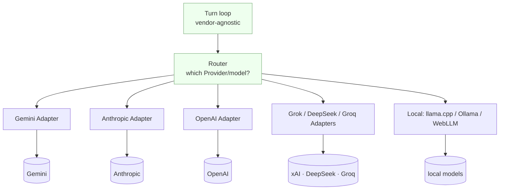
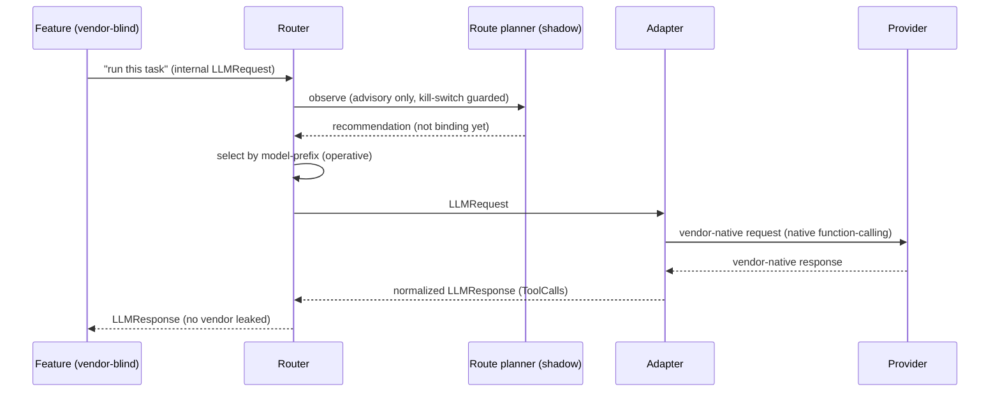

# RFC-0003 — Provider Abstraction Layer

This RFC proposes that every model Provider be reached through an Adapter that
normalizes its native format to one internal representation, behind a Router, with no
vendor branching anywhere above the Adapter. It is the foundational argument for
[Invariant 4](../01-constitution/01-the-eight-invariants.md#invariant-4--provider-abstraction).

---

- **Number:** 0003
- **Title:** Provider Abstraction Layer
- **Status:** Accepted
- **Authors:** LucaOS Foundation
- **Date:** 2026-07-24
- **Supersedes / Superseded by:** none
- **Resulting ADR(s):** prefix-based model routing with a shadow-mode route planner (see [`05-adrs/`](../05-adrs/README.md))

## Summary

Luca's continuity must be independent of which model performs a task. This RFC
proposes the [provider abstraction](../02-specification/04-provider-abstraction.md):
an [Adapter](../GLOSSARY.md) per [Provider](../GLOSSARY.md) that translates the
vendor's native request/response and tool-call format into one internal
`ToolCall`/`LLMResponse` shape; a [Router](../GLOSSARY.md) that decides which Provider
and model answer a given task; and a hard rule that **nothing above the Adapter may
branch on vendor.** Adapters exist for Gemini (default, "Luca Prime"), Anthropic,
OpenAI, Grok, DeepSeek, Groq, local llama.cpp via [Cortex](../02-specification/08-cortex-and-local-intelligence.md),
Ollama, and in-browser WebLLM, all using native function-calling rather than text
parsing. It is argued against the alternative that is fastest to ship — coding
directly to one vendor's SDK — which ties Luca's identity to a vendor and violates the
invariant by construction.

## Motivation

Providers are [infrastructure](../00-manifesto/02-what-luca-is-and-is-not.md):
interchangeable, and invisible to everything above the provider layer. This is not a
portability nicety; it is what makes "one continuous Luca" true across models. If any
feature's behavior depended on which vendor answered — because it parsed that vendor's
tool-call JSON, relied on that vendor's streaming quirks, or sourced persona from that
vendor's own memory feature — then switching models would change Luca. And a Luca that
changes when the model changes was never one continuous thing; it was a thin wrapper
whose identity was the vendor's all along.

The pressure is practical as well as philosophical. Models change constantly — a new
release, a better price, a lower latency, a privacy requirement that forces a task
local. Luca must be able to move a task from Gemini to Anthropic to a local GGUF model
without any feature noticing. The current implementation already does this: real
Adapters normalize each vendor's native function-calling format into one internal
shape, and the operative Router keys on model-name prefix (`claude*` → Anthropic,
`gpt*` → OpenAI, and so on) to pick a Provider. A richer capability/cost/latency route
_planner_ exists (`src/model-router/`) but runs in advisory/shadow mode behind a kill
switch — an honest gap this RFC names rather than papers over.

The failure this prevents is concrete and common: a feature that reaches for one
vendor's SDK because it is right there, parses that vendor's `tool_use` blocks
directly, and now silently cannot run on any other model. Each such shortcut is a
small vendor-lock that, multiplied, means Luca can never actually switch models — the
invariant dies by a thousand `if (provider === "anthropic")`.

## Guide-level explanation

Everything above the provider layer speaks one language. Adapters are the only
translators, and the Router is the only chooser.



Two rules define the layer:

- **The Adapter is the only vendor-aware code.** Above it, the turn loop, the tool
  layer, memory, cognition, and every feature see one internal request shape going
  down and one internal `LLMResponse` (with normalized `ToolCall`s) coming back. They
  never learn which Provider answered.
- **The Router is the only chooser.** Which model handles a task — by capability,
  cost, latency, privacy, availability — is decided in one place. Feature code does
  not pick models; it asks Luca to think, and the Router decides who thinks.

The payoff: to add a Provider, you write one Adapter. Nothing above changes. To move
every task to a cheaper model, you change the Router. Nothing above changes. To run a
task locally for privacy, the Router picks a local Adapter and, again, nothing above
notices. That invariance is Luca's continuity across models, made mechanical.

## Reference-level explanation

**The internal representation.** The layer defines one request shape and one response
shape. Native function-calling is used everywhere — the Adapter emits the vendor's own
tool-call mechanism and parses the vendor's own tool-call output, never a text-parsed
approximation — and normalizes both directions to the internal `ToolCall` /
`LLMResponse`.

```typescript
// Illustrative — the internal representation, not the exact code.
interface LLMRequest {
  messages: InternalMessage[];
  tools: ToolSchema[];          // one internal schema; Adapter maps to vendor format
  stream: boolean;
}

interface ToolCall {            // normalized across every Provider
  id: string;
  name: string;
  args: Record<string, unknown>;
}

interface LLMResponse {
  text?: string;
  toolCalls: ToolCall[];        // Anthropic tool_use, OpenAI function calls,
  finishReason: FinishReason;   //   Gemini functionCalls → all become this
}

interface ProviderAdapter {
  readonly id: string;
  complete(req: LLMRequest): Promise<LLMResponse>;
  stream(req: LLMRequest): AsyncIterable<LLMChunk>; // normalized streaming
}
```

The [turn loop](../02-specification/01-persistent-runtime.md)
(`src/services/turns/TurnRunner.ts`) consumes only these types. It streams from the
active Provider, executes any `ToolCall`s in concurrency-safe batches, feeds results
back, and repeats until the model stops calling tools — bounded by a shared
max-tool-rounds cap. Because it speaks only the internal shape, the same loop drives
Gemini, a local GGUF model, and everything between without a vendor branch. There is a
streaming and a non-streaming variant; both share the cap and both are Provider-blind.

**The Router.** The operative Router keys on model-name prefix to select a Provider
(`claude*` → Anthropic, `gpt*` → OpenAI, `gemini*` → Gemini, etc.). This is
deliberately simple and correct: it lives in one place, and it keeps routing out of
feature code. Above it sits the aspirational piece — a capability/cost/latency route
_planner_ in `src/model-router/` that would choose by task shape rather than name. It
exists but runs in **advisory/shadow mode behind a kill switch**: it can observe and
recommend without taking control. This is exactly the honesty the
[Specification](../02-specification/README.md) demands — do not infer a subsystem is
live because it is well-built; the planner is not yet the decider, and the
[Roadmap](../06-roadmap/README.md) tracks its promotion.



**MCP and local Providers.** LucaOS is a functional MCP client (stdio + SSE
transports); tools reached over MCP and models reached locally (llama.cpp via Cortex,
Ollama, in-browser WebLLM) sit behind the same seam. A local model is just another
Adapter; the Router can choose it for privacy or offline operation, and nothing above
distinguishes a local answer from a cloud one except where policy deliberately does.

**Where the boundary is enforced.** The rule "no vendor branch above the Adapter" is
enforceable by grep: `if (provider === …)`, a direct import of a vendor SDK, or code
that parses a vendor's tool-call JSON anywhere outside `src/providers` (the Adapter
layer) is a violation to be moved down. The typed internal representation is what makes
the rule checkable rather than aspirational — [Invariant 6](../01-constitution/01-the-eight-invariants.md#invariant-6--strong-typing-and-modularity)
in service of [Invariant 4](../01-constitution/01-the-eight-invariants.md#invariant-4--provider-abstraction).

## Invariants and the Four Questions

| Invariant | Effect | Note |
|---|---|---|
| 1 — One Luca Identity | strengthens | Identity no longer depends on which model answered. |
| 2 — Persistent Runtime | preserves | Router lives in the Runtime; Providers stay swappable underneath. |
| 3 — Shared Memory | preserves | Memory is Luca's, never sourced from a provider's memory feature. |
| 4 — Provider Abstraction | strengthens | This RFC _is_ the mechanism of Invariant 4. |
| 5 — Cross-Surface Continuity | preserves | The same internal shape flows regardless of Surface or model. |
| 6 — Strong Typing and Modularity | strengthens | One typed internal representation at the seam. |
| 7 — Backward Compatibility | preserves | New Providers are additive; the internal shape is versioned. |
| 8 — Security and Permissions | preserves | Tool-calls are gated after normalization, uniformly across Providers. |

**Q1 — Does this strengthen persistence?** Neutral-to-positive: it does not add
ephemerality, and it lets a task move to a local Provider so Luca stays available when
a cloud Provider is down — an availability property Presence depends on.

**Q2 — Does this reinforce one identity?** Yes, directly. This is the invariant that
keeps Luca the same across model switches; without it, changing the model changes Luca.

**Q3 — Does this improve trust?** Yes. Normalizing every Provider's tool-calls into one
shape means the permission gate and [Provenance](../GLOSSARY.md) apply uniformly,
rather than each vendor's format getting its own ad hoc handling.

**Q4 — Does this move Luca closer to a continuously present AI?** Yes. A presence that
persists "regardless of which underlying model performs a task" is only possible if the
system above the model never learns which model it was.

## Drawbacks

- **Least-common-denominator risk.** A single internal representation can obscure a
  Provider's genuinely useful vendor-specific capability. The mitigation is to lift
  capabilities into the internal shape deliberately (as first-class, vendor-neutral
  features) rather than to leak the vendor format upward.
- **Adapter maintenance.** Each Provider's format drifts; every Adapter is ongoing work
  to keep normalized. This cost is real but bounded and localized — it lives in one
  layer instead of smeared across features.
- **Normalization can hide meaningful differences.** Streaming semantics, token
  accounting, and tool-call edge cases differ across vendors; forcing them into one
  shape risks papering over a difference that mattered. Adapters must normalize
  faithfully, not merely superficially.
- **Two routers is a transitional hazard.** An operative prefix Router plus a
  shadow-mode planner is honest but must not drift into two deciders. The kill switch
  and shadow-only status keep the planner advisory until it is promoted deliberately.

## Rationale and alternatives

**Coding to a single vendor SDK (the thing to reject).** The fastest path is to import
one vendor's SDK, use its message and tool-call types throughout, and ship. It is
seductive because it removes a layer and lets features use vendor conveniences
directly. It is disqualifying for LucaOS: it makes Luca's behavior depend on the vendor,
so switching models changes Luca, and it scatters `if (provider === …)` and direct
tool-call parsing through feature code until switching becomes impossible. It fails
[Invariant 4](../01-constitution/01-the-eight-invariants.md#invariant-4--provider-abstraction)
the moment the second Provider is needed, and by then the cost to unwind it is the
whole feature surface. The abstraction is cheaper than the eventual extraction.

**A thin pass-through wrapper (abstraction in name only).** A wrapper that forwards
vendor types without truly normalizing them leaks the vendor upward and gives the
illusion of abstraction while violating the invariant. If feature code can still see a
vendor's tool-call shape, the boundary is decorative. The internal representation must
be genuinely vendor-neutral.

**Text-parsed tool calls instead of native function-calling.** Some systems prompt the
model to emit tool calls as text and parse them. It is fragile, model-specific, and
ironically _more_ vendor-coupled (each model needs its own prompt and parser). Using
each Provider's native function-calling and normalizing the result is both more robust
and more genuinely portable.

**Router-per-feature (let each feature choose its model).** Distributing routing into
features seems flexible but reintroduces vendor awareness above the Adapter and makes
cost/latency/privacy policy impossible to reason about globally. Centralizing routing
in one Router — with the planner as its future brain — keeps the policy legible and the
features blind.

## Prior art

- **Hardware abstraction layers and device drivers** are the archetype: the OS speaks
  one interface; a driver per device translates. Adapters are drivers for models, and
  the Router is the scheduler that chooses among them.
- **The database-driver / ORM pattern** — one query interface over many engines — is
  the same move applied to model inference, and carries the same caution (leaky
  abstractions that expose the engine defeat the point).
- **Cross-provider LLM gateways** in the broader ecosystem validate the shape; the
  distinctive LucaOS position is that the abstraction is _constitutional_, not a
  convenience — no vendor branch above the Adapter is an Invariant, not a style
  preference.
- **The shadow-mode planner** follows the well-worn practice of running a new
  decision-maker in observe-only mode behind a kill switch before it takes control —
  prior art for shipping the ambition honestly rather than pretending it is live.

## Unresolved questions

- **Planner promotion.** What evidence promotes the capability/cost/latency planner
  from shadow mode to the operative Router, and what is the rollback if its choices
  regress?
- **Capability negotiation.** How should the internal representation expose a
  Provider's genuinely differentiating capability (e.g. a modality one model has and
  another lacks) without leaking vendor detail — a typed capability descriptor, or
  graceful feature degradation?
- **Cross-Provider tool-call fidelity.** Where vendors differ in tool-call semantics
  (parallel calls, streaming partial arguments), what is the canonical internal
  behavior the Adapters must all present?
- **Cost and privacy policy.** Where do cost ceilings and "this task must stay local"
  rules live — in the Router, in policy the Router consults, or in the safety layer?

## Future possibilities

- Promoting the route planner so routing is by task shape, not model name — the
  invariant unchanged, the intelligence behind it deeper.
- Automatic failover and load-balancing across Providers, turning Provider outages into
  invisible reroutes and reinforcing availability.
- Privacy-aware routing that keeps sensitive tasks on local Adapters by policy.
- A capability descriptor so the Router can match task requirements to Provider
  strengths without any feature learning which Provider was chosen.

## See also

- [Invariant 4 — Provider Abstraction](../01-constitution/01-the-eight-invariants.md#invariant-4--provider-abstraction)
- [What Luca Is and Is Not](../00-manifesto/02-what-luca-is-and-is-not.md) (Providers as infrastructure)
- [Specification · Provider Abstraction](../02-specification/04-provider-abstraction.md)
- [Specification · Cortex and Local Intelligence](../02-specification/08-cortex-and-local-intelligence.md)
- [RFC-0001 — Persistent Runtime Model](0001-persistent-runtime-model.md) (the Router lives in the Runtime)
