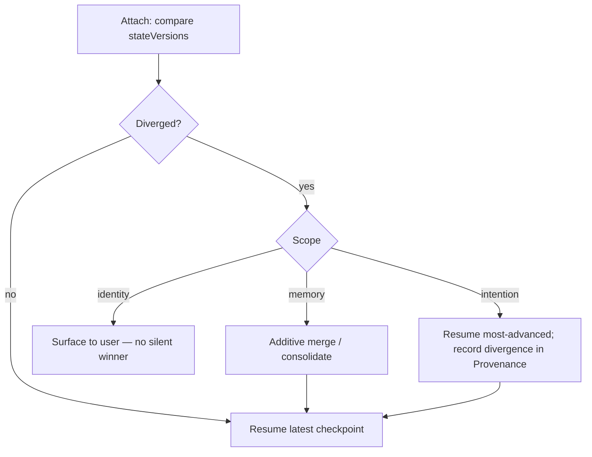

# RFC-0004 — Cross-Surface Continuity Protocol

This RFC proposes a versioned state-sync protocol with checkpoint/resume and explicit
conflict handling, so that moving between Surfaces or devices mid-task continues Luca's
work rather than restarting it. It is the foundational argument for
[Invariant 5](../01-constitution/01-the-eight-invariants.md#invariant-5--cross-surface-continuity)
and, through versioning, [Invariant 7](../01-constitution/01-the-eight-invariants.md#invariant-7--backward-compatibility-where-practical).

---

- **Number:** 0004
- **Title:** Cross-Surface Continuity Protocol
- **Status:** Accepted
- **Authors:** LucaOS Foundation
- **Date:** 2026-07-24
- **Supersedes / Superseded by:** none
- **Resulting ADR(s):** node:sqlite-backed checkpoint store; Luca Link cross-device sync (see [`05-adrs/`](../05-adrs/README.md))

## Summary

Every [Surface](../GLOSSARY.md) is a body of the one Luca, and switching bodies must
_continue_ rather than restart. This RFC proposes a
[Continuity](../02-specification/09-continuity-and-sync.md) protocol: **versioned**
state-sync messages that propagate shared-state changes across attached Surfaces;
**checkpoints** of in-flight work that a newly attached Surface or device can
**resume**; and explicit **conflict handling** for the case where two Surfaces changed
shared state while apart. Runtime continuity/checkpoint services and a cross-device
sync ("Luca Link") already exist, backed by a `node:sqlite` checkpoint store. The
protocol is argued against the alternative of no protocol — each Surface as an
independent app with its own source of truth — which makes a device switch a cold
restart and lets Surfaces silently diverge.

## Motivation

One identity across devices
([Invariant 1](../01-constitution/01-the-eight-invariants.md#invariant-1--one-luca-identity))
is only _experienced_ if the state actually flows. You start a task at your desk,
walk to your car, and Luca should already be mid-thought — not asking you to
re-explain. That is [Presence across devices](../00-manifesto/03-presence-is-the-product.md),
and it is real only when there is a protocol carrying identity, memory, and in-flight
work from one body to another.

Without such a protocol, three failures are inevitable, and each is a fracture of the
one Luca:

1. **Restart instead of resume.** A device switch begins a fresh context. Everything
   before it is gone, and the "before" that Presence promised evaporates. The user
   experiences two assistants that share a login, not one Luca.
2. **Silent divergence.** Two Surfaces both change shared state — one edits a
   preference, the other acts on the old one — and neither can see the other's change.
   There is now no single truth about what Luca knows or is doing.
3. **Upgrade breakage.** A newer Surface and an older Surface exchange state during a
   rollout and cannot interpret each other, or a persisted checkpoint from before an
   update cannot be resumed after it. Continuity across _versions_ is part of
   Continuity, and an unversioned protocol cannot provide it
   ([Invariant 7](../01-constitution/01-the-eight-invariants.md#invariant-7--backward-compatibility-where-practical)).

The [persistent Runtime](0001-persistent-runtime-model.md) gives Luca a continuous
self on one Host, and the [unified Memory](0002-unified-memory-substrate.md) gives that
self one durable store. This RFC is what carries both across the seam between Surfaces
and between Hosts.

## Guide-level explanation

Separate two kinds of state cleanly, then move only the shared kind.

- **Surface-local view state** — scroll position, a half-typed input, which panel is
  open — belongs to a Surface and no other Surface needs it.
- **Shared state** — identity, [Memory](../02-specification/03-memory-architecture.md),
  and in-flight intention (the task Luca is mid-way through) — belongs to Luca and must
  be visible wherever Luca is embodied.

The protocol propagates shared-state changes as **versioned messages** and captures
in-flight work as **checkpoints** that any body can **resume**.

```mermaid
sequenceDiagram
  participant D as Desktop Surface
  participant RT as Runtime (Host A)
  participant Link as Luca Link (sync)
  participant RT2 as Runtime (Host B)
  participant M as Mobile Surface
  D->>RT: user starts a task
  RT->>RT: checkpoint(v=3) in node:sqlite store
  RT->>Link: sync state-change (versioned)
  Note over D,M: user leaves the desk, picks up the phone
  M->>RT2: attach
  RT2->>Link: request latest state
  Link-->>RT2: checkpoint(v=3) + change log
  RT2->>RT2: resume from checkpoint
  RT2-->>M: Luca continues mid-task (no restart)
```

The user's experience is the point: the phone shows Luca already in the middle of the
task the desktop started. Nothing was re-explained; nothing was lost. When two bodies
_did_ change shared state while apart, the protocol does not silently pick a winner —
it detects the conflict by version and resolves it by an explicit, honest rule (below),
because a continuity system that quietly discards one side's change has not preserved
continuity, it has hidden a loss.

## Reference-level explanation

**Versioned messages.** Every shared-state change and every checkpoint carries a
schema version and a monotonic state version. The schema version lets a newer and older
Surface interoperate during a rollout (or refuse safely and fall back to Runtime-
mediated sync); the state version orders changes and is how conflicts are detected. All
protocol messages are **typed** — no stringly-typed bags across the Surface seam
([Invariant 6](../01-constitution/01-the-eight-invariants.md#invariant-6--strong-typing-and-modularity)).

```typescript
// Illustrative — protocol shapes, not the exact code.
interface StateChange {
  schemaVersion: number;      // for cross-version interop during rollout
  stateVersion: number;       // monotonic; orders changes, detects conflicts
  scope: "identity" | "memory" | "intention";
  patch: JsonPatch;           // additive/explicit; never an in-place shape change
  provenance: ChangeProvenance;   // which Surface/Host, on whose authority
}

interface Checkpoint {
  schemaVersion: number;
  stateVersion: number;
  taskId: string;
  resumable: ResumableState;   // enough to continue the turn loop, not restart it
}
```

**Checkpoint / resume.** In-flight work is checkpointed to a `node:sqlite`-backed
store — the same durable, ABI-safe substrate the rest of the Runtime relies on (see
[RFC-0002](0002-unified-memory-substrate.md)). A checkpoint captures enough to resume
the [turn loop](../02-specification/01-persistent-runtime.md) where it paused: the
task, its intention, and the point reached — not a transcript to replay from zero. A
Surface or Host that attaches requests the latest checkpoint plus the change log since
its last known state version and resumes.

**Conflict handling.** When two Surfaces changed the same scope while apart, their
state versions diverge and the protocol detects it rather than blindly applying the
later write. Resolution is explicit and scope-appropriate:

- **Memory** conflicts prefer additive merge — two remembered facts can usually
  coexist — deferring to the [Memory](0002-unified-memory-substrate.md) substrate's
  consolidation when they genuinely contradict.
- **Identity / preference** conflicts, where a merge would be a guess, surface to the
  user rather than silently choosing; least surprise
  ([Trust and Permissions](../01-constitution/04-trust-and-permissions.md)) outranks
  convenience.
- **Intention / in-flight task** conflicts resume the most advanced checkpoint and
  record the divergence in [Provenance](../GLOSSARY.md), never discarding the losing
  branch without a trace.



**Backward compatibility.** Persisted checkpoints and protocol messages evolve
**additively**; a shape that must change gets an explicit, tested migration, never an
in-place rewrite. A mid-rollout mix of Surface versions must stay coherent — that is
the whole reason the schema version rides on every message. This is
[Invariant 7](../01-constitution/01-the-eight-invariants.md#invariant-7--backward-compatibility-where-practical)
expressed as a wire rule.

**Honesty about the gap.** Continuity/checkpoint services and Luca Link exist and are
backed by the `node:sqlite` checkpoint store; same-Host attach/detach and resume are
the most mature path. Cross-_device_ sync and the full conflict-resolution matrix are
further along the [Roadmap](../06-roadmap/README.md) than same-Host continuity, and
this RFC specifies the target the existing services are growing into rather than
claiming the whole matrix is shipped. Naming that boundary is the Specification doing
its job.

## Invariants and the Four Questions

| Invariant | Effect | Note |
|---|---|---|
| 1 — One Luca Identity | strengthens | Shared state flows, so the one Luca is experienced, not just asserted. |
| 2 — Persistent Runtime | strengthens | Checkpoints make in-flight work durable across attach/detach. |
| 3 — Shared Memory | strengthens | Memory changes propagate; every Surface reads one Memory. |
| 4 — Provider Abstraction | preserves | Continuity is Provider-blind; resume works across model switches. |
| 5 — Cross-Surface Continuity | strengthens | This RFC _is_ the mechanism of Invariant 5. |
| 6 — Strong Typing and Modularity | strengthens | Typed, versioned protocol messages across the Surface seam. |
| 7 — Backward Compatibility | strengthens | Versioned messages and migrated checkpoints; rollout-coherent. |
| 8 — Security and Permissions | preserves | Every state change carries provenance; conflicts never silently overwrite. |

**Q1 — Does this strengthen persistence?** Yes. In-flight work survives a Surface or
device switch as a resumable checkpoint instead of being lost, and it survives upgrades
via versioned, migrated state.

**Q2 — Does this reinforce one identity?** Yes, essentially. Continuity is singularity
made observable — the same Luca actually present across bodies, not merely claimed to be.

**Q3 — Does this improve trust?** Yes. Explicit conflict handling that never silently
discards a change, plus provenance on every state change, is least-surprise made
mechanical.

**Q4 — Does this move Luca closer to a continuously present AI?** Yes. Presence across
devices is exactly the promise this protocol keeps; without it, each device is a
separate app.

## Drawbacks

- **Distributed-systems complexity.** State sync with conflict resolution is genuinely
  hard: ordering, partial connectivity, and partition recovery are all now in scope.
  This is the price of real multi-device Presence, but it is a real price.
- **Conflict resolution can still surprise.** Even explicit rules can produce an
  outcome a user did not expect. Surfacing identity conflicts to the user mitigates the
  worst cases but cannot eliminate all surprise.
- **Versioning discipline is forever.** Every future change to shared-state shapes must
  respect the version contract and ship a migration. The discipline never ends; a single
  in-place shape change breaks mid-rollout coherence.
- **Checkpoint size and frequency are a tuning problem.** Checkpoint too rarely and a
  resume loses recent work; too often and the store and sync channel pay for it.

## Rationale and alternatives

**No protocol — each Surface an independent app (the thing to reject).** The default
non-design is that each Surface keeps its own source of truth and syncs, at best,
through a shared login. It is simplest and it is exactly what LucaOS refuses: a device
switch becomes a cold restart, Surfaces diverge with no way to reconcile, and the "one
Luca across devices" claim becomes marketing. It fails
[Invariant 5](../01-constitution/01-the-eight-invariants.md#invariant-5--cross-surface-continuity)
by construction. Every other alternative is a way of _having_ a protocol; this is the
absence of one, and it is the baseline the RFC exists to beat.

**Last-write-wins everywhere.** The simplest conflict rule: newest change wins. Cheap,
and quietly lossy — it discards the other Surface's change with no trace, which is a
continuity failure disguised as a resolution. Scope-appropriate handling (merge where
safe, surface where ambiguous, record where discarded) costs more and is the only rule
consistent with least surprise.

**A CRDT-for-everything substrate.** Conflict-free replicated data types make merges
automatic and are attractive for the memory scope. But forcing all shared state —
including intention and identity, where a "merge" can be nonsensical — into CRDT
semantics trades one hard problem for another and can produce merges no user asked for.
The protocol uses additive merge where it fits (memory) and explicit resolution where
it does not (identity, intention), rather than a single mechanism stretched past its
domain.

**Unversioned messages.** Dropping the schema version simplifies the wire format and
guarantees a broken rollout: a newer and older Surface cannot safely interoperate, and
a pre-upgrade checkpoint cannot be resumed post-upgrade. Versioning is not optional
overhead; it is what makes Continuity survive its own evolution.

## Prior art

- **Distributed version control** (branch, diverge, merge, and — crucially — surface
  the conflict rather than hide it) is the closest model for the intention scope; the
  protocol borrows its refusal to silently pick a winner.
- **Operational transformation and CRDTs** from collaborative editing inform the
  additive-merge path for memory, and their limits inform the decision _not_ to use
  them for identity and intention.
- **Session-handoff patterns** (a call or a document handed between devices mid-use)
  are the user-experience prior art: the point is that the second device is already in
  the middle, not starting over.
- **Versioned wire protocols** with additive evolution and explicit migrations are
  standard practice for rolling deployments; applying that rigor to Luca's shared state
  is what makes cross-version Continuity real.

## Unresolved questions

- **Runtime authority across Hosts.** When several Hosts each run a persistent Runtime,
  which holds authoritative shared state, and how does authority move? This is the open
  thread [RFC-0001](0001-persistent-runtime-model.md) deferred to here.
- **Offline divergence bounds.** How long may two Hosts operate disconnected before
  reconciliation becomes untrustworthy, and what does the protocol do at that boundary?
- **Conflict UX.** What is the calm, non-intrusive way to surface an identity conflict
  to the user — a question the [Design System](../03-design-system/00-design-philosophy.md)
  must answer alongside this protocol?
- **Checkpoint policy.** What triggers a checkpoint (turn boundary, tool boundary,
  time), and how is resumable state kept small enough to sync cheaply yet complete
  enough to resume faithfully?

## Future possibilities

- Seamless multi-device handoff as a first-class, everyday experience — pick up any
  Host and Luca is already mid-thought.
- Predictive pre-sync that positions the likely-next Host's state before the user
  switches, shrinking time-to-presence on the new body toward zero.
- Collaborative Presence, where more than one Surface is active at once over the same
  live state without divergence.
- Continuity as the substrate for future embodiments (vehicle, headset, robot), each a
  new body attaching to the same protocol.

## See also

- [Invariant 5 — Cross-Surface Continuity](../01-constitution/01-the-eight-invariants.md#invariant-5--cross-surface-continuity)
- [Invariant 7 — Backward Compatibility](../01-constitution/01-the-eight-invariants.md#invariant-7--backward-compatibility-where-practical)
- [Specification · Continuity and Sync](../02-specification/09-continuity-and-sync.md)
- [Specification · Surface Layer](../02-specification/06-surface-layer.md)
- [RFC-0001 — Persistent Runtime Model](0001-persistent-runtime-model.md)
- [RFC-0002 — Unified Memory Substrate](0002-unified-memory-substrate.md)
