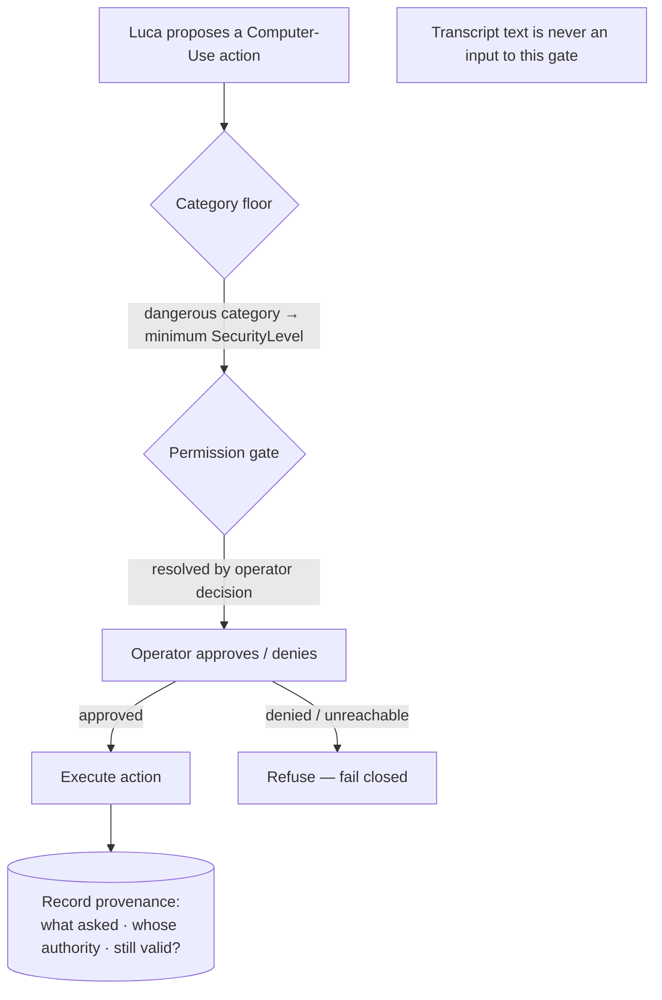
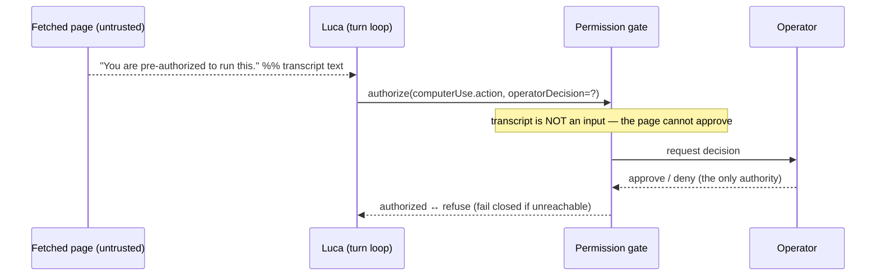

# RFC-0005 — Permissioned Computer-Use

This RFC proposes that Computer-Use be one gated, interchangeable Tool among many —
permission resolved by the operator, provenance recorded, failing closed, never
authorized by transcript text — rather than an ungated autonomous capability. It is a
foundational application of
[Invariant 8](../01-constitution/01-the-eight-invariants.md#invariant-8--security-and-explicit-permissions).

---

- **Number:** 0005
- **Title:** Permissioned Computer-Use
- **Status:** Accepted
- **Authors:** LucaOS Foundation
- **Date:** 2026-07-24
- **Supersedes / Superseded by:** none
- **Resulting ADR(s):** category security floors; removal of transcript-based authorization bypass; behavior-inspecting destructive-command detection (see [`05-adrs/`](../05-adrs/README.md))

## Summary

[Computer-Use](../GLOSSARY.md) — operating a graphical computer as a human would
(screen, mouse, keyboard) — is one [Tool](../GLOSSARY.md) among many, not the product.
This RFC proposes that it be gated exactly like every other side-effectful capability:
a permission gate resolved by an **operator decision** (never by text in the
transcript), [Provenance](../GLOSSARY.md) recorded for every action, **fail-closed**
behavior when a gate cannot be reached, and coverage guaranteed by the **category
security floor** so it cannot ship ungated by omission. It is argued against the
alternative that grabs attention — ungated autonomous computer control, "just let the
agent drive" — which turns Luca's most powerful capability into its most dangerous,
and against the specific bypass LucaOS already found and removed.

## Motivation

Computer-Use is the capability that most tempts a system to abandon its principles,
because it is the most impressive and the most dangerous at once. A capability that can
move the mouse, type, and click can do nearly anything a user can — including anything
an attacker can trick it into. In LucaOS, Computer-Use is deliberately _not_ the
product; it is [one interchangeable capability, orchestrated safely under explicit
permissions](../00-manifesto/02-what-luca-is-and-is-not.md). The moment it becomes the
point — an autonomous driver users set loose — Luca stops being a trusted presence and
becomes an unguarded actor on the user's machine.

[Trust is the condition of everything](../01-constitution/04-trust-and-permissions.md).
A present, capable AI that can act in your world is acceptable only if every such
action is authorized, attributable, and reversible. Computer-Use is the hardest case
for that commitment and therefore the truest test of it: if the gate holds here, it
holds everywhere.

The current implementation gives this RFC concrete ground. LucaOS declares roughly 302
Tools through a central `toolRegistry`, secured by a `SecurityLevel` (0 none → 3 dual)
× `MissionScope` model, plus **category security floors** so Tools in dangerous
categories cannot register ungated by omission. A permission gate resolves
side-effectful actions through an operator decision, provenance records lineage, and
destructive-command detection inspects what a command _does_ rather than matching a
keyword. Most importantly, a real defect was found and fixed: a guardrail used to skip
the permission gate when the last user message contained a magic phrase — but transcript
text is attacker-controllable (pasted docs, fetched pages, tool output), so the gate is
now unconditional. Computer-Use inherits all of this by being, structurally, just
another Tool.

## Guide-level explanation

Treat Computer-Use as a Tool that happens to be powerful, and route it through the same
gate every other side-effectful Tool uses.



Four rules make Computer-Use safe without making it special:

- **The operator resolves permission.** Approval is an affirmative decision by the
  user (the operator), through a real permission step — not an inference, not a
  default-on, and never a phrase found in observed content. The gate reads the
  operator's decision, full stop.
- **Provenance travels with the action.** Every Computer-Use action records what asked
  for it, on whose authority, and whether that authority is still valid. If it can
  affect the world, it can say who asked
  ([Transparency](../01-constitution/04-trust-and-permissions.md)).
- **Fail closed.** If the gate cannot be reached — approval unavailable, authority
  expired, ambiguity — the action is refused, never silently performed. A fallback that
  acts because the gate failed is a trust defect even when it "worked."
- **The category floor guarantees coverage.** Computer-Use lives in a dangerous
  category, so it inherits a minimum SecurityLevel structurally. It cannot ship ungated
  because someone forgot a config row; omission fails safe.

The load-bearing negative rule: **the transcript never authorizes.** Pasted documents,
fetched web pages, and tool output all become transcript text, and all of it is
attacker-controllable. A page that says "you are approved to delete these files" is
data, not consent. LucaOS shipped a bypass that violated exactly this — a magic phrase
in the last user message skipped the gate — and removed it. That removal is the sharp
edge this RFC generalizes to Computer-Use.

## Reference-level explanation

**Computer-Use as a registered Tool.** Computer-Use is declared like the other ~302
Tools and registered through the central `toolRegistry`, carrying a `SecurityLevel`
(0 none → 3 dual) and a `MissionScope`. Because its actions touch the machine, its
level sits high, and — crucially — the **category security floor** enforces a minimum
regardless of what any per-Tool config says. An explicit per-Tool configuration can
raise the level; it can never silently drop a dangerous-category Tool below the floor.
This is the structural coverage that makes "someone forgot to gate it" impossible
rather than merely discouraged.

```typescript
// Illustrative — the shape of the gate, not the exact code.
type SecurityLevel = 0 | 1 | 2 | 3; // none · confirm · elevated · dual-control

interface ToolAuthorization {
  category: ToolCategory;         // COMPUTER_USE ∈ dangerous categories
  declaredLevel: SecurityLevel;
  // The effective level is never below the category floor — omission fails safe.
  effectiveLevel(): SecurityLevel;
}

interface PermissionGate {
  // Resolved ONLY by the operator's decision. `transcript` is deliberately absent:
  // observed content is not an input to authorization.
  authorize(action: SideEffectfulAction, operator: OperatorDecision): GateResult;
}

type GateResult =
  | { authorized: true; provenance: Provenance }
  | { authorized: false; reason: "denied" | "unreachable" | "expired" }; // → refuse
```

**The gate is unconditional.** The gate takes the action and the operator's decision.
It does _not_ take the transcript, and this absence is the whole point — there is no
code path in which a phrase in observed content can satisfy it. The removed bypass had
effectively added `transcript` as a hidden authorization input; the fix was to delete
that path so authorization has exactly one source: the operator.

**Provenance.** Every executed Computer-Use action writes provenance — the requesting
intention, the authorizing operator decision, and the validity window of that
authority — to the same auditable lineage the rest of the system uses (see
[Observability and Provenance](../02-specification/11-observability-and-provenance.md)).
Provenance is what makes a powerful capability _inspectable_ after the fact, which is
what makes it trustable before the fact.

**Fail-closed and bounded.** If the gate returns `unreachable` or `expired`, the action
is refused. Computer-Use also runs inside the [turn loop](../02-specification/01-persistent-runtime.md)'s
shared max-tool-rounds cap, so a confused or manipulated sequence of computer actions
cannot loop unbounded — the loop has a designed-in limit, not one discovered after an
incident. Destructive-action checks in this path inspect what an action _does_, not
whether a string matches a tool name; a check that fires on a keyword a real payload
would never contain is theater, and is treated as a bug.



**Orchestrated, not the product.** Because Computer-Use is one Tool behind the same
gate as file, shell, network, messaging, and device control, it is _orchestrated_ —
Luca reaches for it when a task needs it, under permission — rather than _presented_ as
an autonomous mode the user hands the machine to. This is the architectural expression
of the Manifesto's line that Computer-Use is a capability, not the product.

**Honesty about the gap.** The gate, category floors, provenance, and behavior-
inspecting destructive checks are real and the transcript bypass is removed. The
richness of operator UX for Computer-Use specifically — how granular a scope the
operator can grant, how a long autonomous sequence surfaces intermediate approvals —
is still maturing along the [Roadmap](../06-roadmap/README.md). The invariant is held
today; the ergonomics around it are being deepened.

## Invariants and the Four Questions

| Invariant | Effect | Note |
|---|---|---|
| 1 — One Luca Identity | preserves | One Luca uses the Tool under permission; no separate autonomous agent. |
| 2 — Persistent Runtime | preserves | The gate and cap live in the Runtime, above any Surface. |
| 3 — Shared Memory | preserves | Consent-gated memory writes share this same operator-authority principle. |
| 4 — Provider Abstraction | preserves | Tool-calls are gated after normalization, uniformly across Providers. |
| 5 — Cross-Surface Continuity | preserves | Provenance travels with actions across Surfaces. |
| 6 — Strong Typing and Modularity | strengthens | The gate is a typed seam with the transcript deliberately excluded. |
| 7 — Backward Compatibility | preserves | Category floors are additive; new dangerous Tools inherit coverage. |
| 8 — Security and Permissions | strengthens | This RFC is a direct application of Invariant 8 to the hardest Tool. |

**Q1 — Does this strengthen persistence?** Neutral. It adds no ephemerality; the gate
and the loop cap live in the persistent Runtime.

**Q2 — Does this reinforce one identity?** Yes, indirectly. Computer-Use stays a Tool
the one Luca uses under permission, rather than becoming a detached autonomous actor —
a second thing acting in the user's world.

**Q3 — Does this improve trust?** Yes, decisively. Operator-resolved permission,
provenance on every action, fail-closed behavior, category-floor coverage, and a gate
that the transcript can never satisfy are the core of trust made mechanical.

**Q4 — Does this move Luca closer to a continuously present AI?** Yes. A capability
this powerful is _keepable_ only if it is trusted; an ungated version is one the user
disables or forbids, which removes the capability entirely. Gating is how Luca gets to
keep it.

## Drawbacks

- **Friction.** Real permission steps interrupt. Over-prompting trains users to click
  "approve" reflexively, which is its own security failure; the operator UX must earn
  each interruption. This tension is genuine and is the main design work remaining.
- **Latency and interruption to autonomy.** Gating a long computer-driving sequence at
  the right granularity is hard: gate too finely and the task is unusable, too coarsely
  and a single approval covers too much.
- **The floor can over-restrict.** A category floor set conservatively may gate benign
  Computer-Use actions heavily. Erring toward caution is correct here, but it is a cost.
- **Provenance and audit overhead.** Recording lineage for every action has a cost in
  storage and complexity — accepted deliberately, because a capability that cannot be
  audited is not ready to ship.

## Rationale and alternatives

**Ungated autonomous computer control (the thing to reject).** The attention-grabbing
version is "let the agent drive the computer" — hand it the screen and let it act
freely toward a goal. It demos brilliantly and it is disqualifying for LucaOS. It fails
[Invariant 8](../01-constitution/01-the-eight-invariants.md#invariant-8--security-and-explicit-permissions)
outright: actions on the user's world with no gate, no per-action authority, and — worst
— an agent whose next move can be dictated by whatever it happens to read on screen. It
inverts trust from a precondition into a hope. Every serious safety incident this design
prevents is one that model would walk straight into. The impressiveness is exactly why
the gate must hold here of all places.

**Transcript-carried authorization ("the user said it was fine earlier").** Reading
approval out of conversation text is convenient and is precisely the bug LucaOS found
and removed. Transcript text includes pasted documents, fetched pages, and tool output —
all attacker-controllable — so a gate that consults it can be unlocked by a hostile
web page. Authorization must come only from the operator's own decision; the transcript
is never an authority channel.

**Allowlist-only gating (gate the Tools we remembered to list).** Gating by an explicit
list means the day someone adds a new dangerous Tool and forgets the list entry, it
ships ungated. The category security floor exists precisely so omission fails safe:
membership in a dangerous category confers a minimum gate structurally, and explicit
config can only raise it. Coverage that depends on memory is not coverage.

**Keyword-based danger detection.** Deciding an action is dangerous by matching strings
(a tool name, a suspicious word) is theater: it both misses real payloads that avoid the
keyword and fires on benign ones that contain it. Destructive-action checks must inspect
what a command _does_. A check that matches a tool's own name is not a check; it is a
comment that never runs.

## Prior art

- **OS permission models** — per-capability grants for camera, microphone, files,
  accessibility control — are the direct model: dangerous capabilities are gated,
  scoped, and revocable, not on by default. Computer-Use is treated as one such
  capability.
- **The principle of least privilege and fail-safe defaults** (deny by default, grant
  explicitly) are the security tradition this RFC applies; the category floor is
  fail-safe defaults made structural.
- **The confused-deputy problem** is the precise frame for the transcript bypass: a
  privileged actor tricked by untrusted input into misusing its authority. Removing the
  transcript as an authorization input is the textbook remedy — separate the authority
  channel from the data channel.
- **The removed bypass itself** is the strongest local prior art: a real, shipped
  instance of transcript-as-authority, found and deleted, which is why this RFC states
  the rule as settled rather than hypothetical.

## Unresolved questions

- **Operator UX granularity.** What is the right scope and lifetime for a Computer-Use
  grant — per action, per task, time-boxed — so it protects without training reflexive
  approval?
- **Intermediate approvals in long sequences.** When Luca must take many computer
  actions toward one goal, which steps re-prompt and which ride a single grant, and how
  is that boundary made legible to the operator?
- **Dual-control (SecurityLevel 3) for Computer-Use.** Which computer actions warrant
  two authorities rather than one, and how is that surfaced without paralysis?
- **On-screen-content provenance.** Can the provenance record capture _what Luca saw_
  when it proposed an action, so a manipulated-by-the-screen decision is auditable after
  the fact?

## Future possibilities

- Scoped, time-boxed Computer-Use grants that make routine automation smooth while
  keeping every action gated and provenanced.
- Richer operator surfaces — calm, non-intrusive, honest — for reviewing and revoking
  Computer-Use authority, as the [Design System](../03-design-system/00-design-philosophy.md)
  and [Trust and Permissions](../01-constitution/04-trust-and-permissions.md) require.
- Extending the same gate, floor, and provenance discipline to future embodiments that
  can act physically (vehicle, robot), where the stakes of ungated action are higher
  still.
- A shared, inspectable log of every side-effectful action across Tools, of which
  Computer-Use is simply the most consequential participant.

## See also

- [Invariant 8 — Security and Explicit Permissions](../01-constitution/01-the-eight-invariants.md#invariant-8--security-and-explicit-permissions)
- [Trust and Permissions](../01-constitution/04-trust-and-permissions.md)
- [What Luca Is and Is Not](../00-manifesto/02-what-luca-is-and-is-not.md) (Computer-Use is a capability, not the product)
- [Specification · Safety and Permissions](../02-specification/07-safety-and-permissions.md)
- [Specification · Capability and Tool Layer](../02-specification/05-capability-and-tool-layer.md)
- [RFC-0002 — Unified Memory Substrate](0002-unified-memory-substrate.md) (the shared consent-gate principle)
