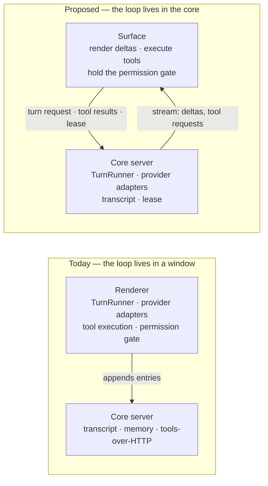
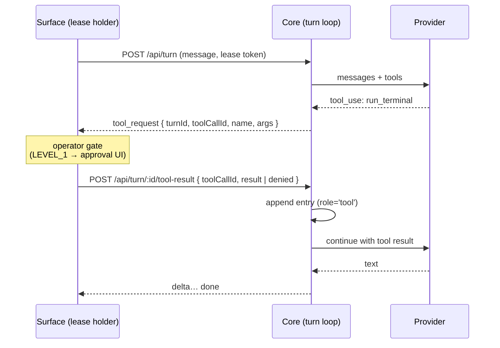

# RFC-0006 — Core-Resident Turn Loop and Session Lease

This RFC proposes moving the turn loop out of the renderer and into the core server,
so that a turn is something Luca is doing rather than something a window is doing, and
admitting turns through a per-session **lease** so two attached Surfaces cannot become
two loops — while an answer already in flight can be picked up on whichever Surface the
operator turns to. It is the implementation argument for
[Invariant 2](../01-constitution/01-the-eight-invariants.md#invariant-2--persistent-runtime)
and the missing half of
[Invariant 5](../01-constitution/01-the-eight-invariants.md#invariant-5--cross-surface-continuity):
[RFC-0004](0004-cross-surface-continuity-protocol.md) gave Surfaces a way to share
state, but the loop that produces that state still lives inside one of them.

---

- **Number:** 0006
- **Title:** Core-Resident Turn Loop and Session Lease
- **Status:** Review <!-- Draft → Review → Accepted / Rejected / Superseded -->
- **Authors:** LucaOS Foundation
- **Date:** 2026-08-18
- **Supersedes / Superseded by:** none
- **Resulting ADR(s):** pending

## Summary

The **turn loop** — call the provider, receive tool calls, execute them, append the
results, call again until the model stops asking — runs today inside the Vite
renderer, in `src/services/turns/TurnRunner.ts`, entered only from
`src/services/lucaService.ts`. Close the window mid-turn and the turn does not
finish, resume, or fail: it evaporates. This RFC proposes relocating that loop to the
core server, reducing every Surface to a client of one loop, and gating turn
admission on a **server-held session lease** so that two attached Surfaces cannot
interleave turns into the same session. Tool execution and the operator's permission
gate **stay at the Surface** — deliberately, because a gate is a human decision and a
headless core cannot host one — but become an *addressed request* from the core to
the lease-holding Surface, which fails closed when no Surface answers. The change is
proposed in four stages, the first of which (the lease alone) is independently
valuable and small.

## Motivation

Four concrete failure modes, each verified against the current implementation.

**1. A turn is owned by a window, so closing the window destroys it.**
`TurnRunner.runStreamTurn` is a renderer module reached through
`lucaService.sendMessageStream`. There is no other entry point. If the renderer goes
away between the provider's tool-call response and the tool result being appended, the
turn is neither completed nor rolled back — the provider call is abandoned, a
half-executed side effect may already have landed, and nothing records that a turn was
in flight. [Invariant 2](../01-constitution/01-the-eight-invariants.md#invariant-2--persistent-runtime)
says Luca exists before, during, and after any interaction. Today the *conversation*
does (ADR-0015 made the transcript durable); the *turn* does not.

**2. Two Surfaces, two loops, one transcript.** ADR-0015 made the transcript
server-side and append-only, with server-assigned `seq` and a
`UNIQUE(session_id, client_id)` idempotency key. That prevents a lost write and a
double write. It does not prevent two Surfaces each running their own loop against the
same session and interleaving their turns: `client_id` dedupes a *retry*, not a
*rival*. The result is a legal, contiguous, correctly-ordered transcript of two
conversations braided together — which is
[Invariant 1](../01-constitution/01-the-eight-invariants.md#invariant-1--one-luca-identity)
failing in the most expensive way, silently and durably.

**3. The lock we already have is the wrong lock.** `resourceLockManager`
(`src/services/agent/LucaResourceLock.ts`) holds `private locks: Map<string, ResourceLock>`
— an in-process map. Two renderers hold two maps and neither can see the other. It is
correct for what it was built for (serializing one agent's file writes) and structurally
incapable of coordinating Surfaces.

**4. There is no headless path to the real loop.** Because the loop is renderer-resident,
nothing without a DOM can run one: no scheduled turn, no turn begun by voice on a phone
and finished on the desktop, no server-side agent run that uses Luca's actual reasoning
loop. This is why `AgentService.executeStep` (`src/services/agent/AgentService.ts`) is
still `// Phase 5: Simulate execution` followed by `await this.sleep(1000)` — the
autonomous loop cannot call the turn loop, so it pretends. A related orphan: the
renderer's `pollForHumanInput` in `src/hooks/app/useToolOrchestrator.ts` fetches
`/api/human-input/poll`, which is **not among the route groups `server.js` registers**;
the call fails into a `catch` that only warns. Something already wanted a channel for
the core to ask a human a question, and there was nowhere to put it.

**If we do nothing:** the durable transcript records a conversation that only ever
happens while a window is open, and each capability that follows — a session-scoped
programmatic executor, subagents that outlive their parent, proactive turns — gets
built in the renderer against per-window state and then rebuilt when the loop moves.
The cost of the move rises with every feature added above it.

## Guide-level explanation

Today the renderer is the whole agent and the core is its filing cabinet. The proposal
inverts that: the core is the agent, and a Surface is a place where Luca is visible and
where the operator can say yes.



Three things a contributor should be able to restate after this section.

**The Surface stops being the agent and starts being a body.** A Surface sends "here is
what the operator said," renders what streams back, runs the tools it is asked to run,
and holds the lease while it does. It no longer decides *when* to call a provider, *which*
provider, or *whether* the model is done. Those are Luca's decisions and they move to
where Luca lives.

**The permission gate does not move, and that is the point.** Today the
[Invariant 8](../01-constitution/01-the-eight-invariants.md#invariant-8--security-and-explicit-permissions)
gate is a Promise resolved by React state: `useToolOrchestrator` calls
`setApprovalRequest({ …, resolve })` and awaits the operator's answer. That gate is a
*human decision*, and a headless core has no human in it. What changes is that the gate
becomes **addressed** — the core asks the Surface holding the lease, names what it wants
to do and why, waits, and **refuses the action** if no Surface answers or the answer is
no. An unreachable operator must never mean an unsupervised action.



**One loop, and the answer follows the operator.** Before a Surface may start a turn it
acquires the session's lease, which is short-lived and renewed while a turn runs, so a
Surface that crashes does not lock Luca out for good. What the lease prevents is a second
*loop*, not a second *body*: while the loop still lives in a window, a second Surface's
send is refused with the identity of the current holder — not silently queued and not
silently interleaved — but once the loop is in the core that Surface attaches to the turn
already in flight and can steer it. Luca is always available, so the surface an answer
arrives on is wherever the operator is; an answer begun on the desktop continues on the
phone.

## Reference-level explanation

### What is already portable, and what is not

The loop itself is in better shape than its location suggests. Counting references to
`window.`, `document.`, `localStorage`, and `navigator.`:

| Module | Lines | Browser-only references |
|---|---|---|
| `src/services/turns/TurnRunner.ts` | 441 | **0** |
| `src/services/harnessService.ts` | — | 0 |
| `src/services/thoughtStreamService.ts` | — | 0 |
| `src/services/cognitiveDeliberator.ts` | — | 0 |
| `src/services/streamingToolExecutor.ts` | — | 0 |
| `src/services/creditService.ts` | — | 2 |
| `src/services/lucaService.ts` | 1,612 | 1 (`new Image()` in `verifyIdentity`) |

So the blocker is **not** the DOM. It is the **build boundary**. The core is plain-JS
ESM and reaches into `src/` only for JavaScript — `cortex/server/services/sessionEntryStore.js`
imports `../../../src/services/db.js` — while the provider layer under
`src/services/llm/` is **5,598 lines of TypeScript** that nothing compiles for a
plain-Node consumer (`tsconfig.json` has `include: ["src/**/*"]`; Vite compiles it for
the renderer only). Moving the loop therefore requires making the provider layer
consumable by the core, which is the substance of Stage 2 below and the largest single
cost in this RFC.

### Credentials are already solved

The obvious objection — "the core has no API keys" — does not hold. The core has a real
vault at `cortex/server/services/secureVault.js` (AES via `crypto.createCipheriv`,
exported as a singleton), and `cortex/server/services/tradingDebateService.js` already
resolves keys from it with `setting:brain:${provider}ApiKey`, falling back to
environment variables. That is character-for-character the namespace the renderer
writes in `src/services/settingsService.ts`. No key migration, no key on the wire, no
new secret store.

That same file is also an existing **Invariant 4 gap in the core**: it imports
`@google/genai`, `openai`, and `@anthropic-ai/sdk` directly, with no adapter beneath it,
which is exactly what
[RFC-0003](0003-provider-abstraction-layer.md) forbids above the provider layer. Stage 2
resolves that gap rather than widening it — the core gets the real adapter layer, and
vendor SDKs stop being a thing feature code imports.

### The lease

Stored beside the transcript, in the store ADR-0015 introduced, as an additive table —
no `ALTER TABLE`, which this repo has no mechanism for:

```sql
CREATE TABLE IF NOT EXISTS session_leases (
  session_id   TEXT PRIMARY KEY,
  holder_id    TEXT    NOT NULL,   -- opaque per-Surface instance id
  surface      TEXT    NOT NULL,   -- provenance (RFC-0004, Invariant 8)
  token        TEXT    NOT NULL,   -- returned to the holder; required to send
  acquired_at  INTEGER NOT NULL,
  renewed_at   INTEGER NOT NULL,
  expires_at   INTEGER NOT NULL
);
```

| Route | Semantics |
|---|---|
| `POST /api/session/:id/lease` | Acquire, or renew if the caller already holds it. Grants when no live lease exists (`expires_at` in the past counts as none). Refuses with `{ holder: { surface, renewedAt } }` otherwise. |
| `DELETE /api/session/:id/lease` | Release. Idempotent. |

Semantics that matter:

- **Binding, not advisory.** `POST /api/turn` without a valid, unexpired token is
  refused. An advisory lease is a comment.
- **TTL with renewal, not a permanent claim.** The holder renews while a turn runs. A
  Surface that dies stops renewing and the lease lapses, so a crash costs one TTL, not
  the session.
- **A refusal names the holder.** "Luca is answering on Desktop" is a usable message;
  "locked" is not.
- **The lease admits a *loop*, not a *speaker*.** Once the core is the only writer,
  interleaving is impossible by construction, so the lease's real job is to stop a second
  *renderer* from starting a second loop — not to stop the operator from speaking from
  somewhere else. That distinction is settled under
  [Unresolved questions](#unresolved-questions): a second Surface belonging to the same
  operator is meant to **continue** a running turn rather than be refused it, so the
  `409` it receives today is scaffolding for exactly as long as the loop lives in a
  window.

### The turn endpoint and its transport

`server.js` has **no** WebSocket or SSE transport today, so one must be chosen. The
recommendation is **`POST` with a streamed response body** (`fetch` +
`ReadableStream`), for a reason specific to this codebase: `app.use('/api', authMiddleware)`
protects every route, and `src/config/api.ts` injects `X-LUCA-TOKEN` by monkey-patching
`window.fetch`. `EventSource` cannot set request headers, so SSE would force the auth
token into a query string — a token in a URL, logged by anything that logs URLs. A
streamed `POST` carries the turn request, inherits the existing auth for free, and needs
no new dependency.

| Route | Purpose |
|---|---|
| `POST /api/turn` | Start a turn (lease token required). Response body streams typed events: `delta`, `thought`, `tool_request`, `summary`, `done`, `error`. |
| `GET /api/turn/:turnId/stream` | Attach to a turn already in flight and receive the same typed events from the point of attachment. Any Surface authenticated to the session may attach — this is what lets an answer begun on the desktop continue on a phone. |
| `POST /api/turn/:turnId/message` | Interject into a running turn: the operator adds to it or redirects it mid-answer. Appended to the transcript as a `user` entry and given to the loop at its next provider call. **Never** an answer to a pending `tool_request` — gate decisions arrive only on the `tool-result` route, so no transcript text can approve anything. |
| `POST /api/turn/:turnId/tool-result` | The Surface returns a tool result, or an explicit denial, keyed by `toolCallId` and carrying its own idempotency key. |
| `POST /api/turn/:turnId/abort` | Operator cancellation, replacing today's in-process `abortSignal` parameter. |

Failure handling, stated as rules:

- **No Surface answers a `tool_request` within 120 s → the tool is not run**, the turn
  records `no_operator_answered` — legibly distinct from `operator_denied` — and the loop
  continues or ends with an explicit error. The deadline is wall-clock from the first ask
  and does not restart when a Surface attaches mid-turn; a dropped stream or a lapsed
  lease fails closed at once rather than waiting out the clock. Fail closed
  ([Safety and Permissions](../02-specification/07-safety-and-permissions.md)).
- **The stream drops mid-turn → the turn keeps running in the core.** The transcript is
  the record; a reattaching Surface reads it and resumes watching. This is the whole
  point of the move, and it is also the first thing that must be tested.
- **A `tool_request` is never self-authorizing.** It originates in provider output,
  which is transcript-adjacent and therefore attacker-influenceable. The core's request
  is a *proposal*; only the operator's gate at the Surface is authority. Nothing in the
  transcript may raise a tool's security level or pre-approve it.

### What stays at the Surface

`src/hooks/app/useToolOrchestrator.ts` is the reason tool execution does not move in
this RFC. Its `executeTool` is a `useCallback` inside a hook taking roughly forty props,
most of them React setters (`setShowStockTerminal`, `setVisualData`, `setOsintProfile`,
…), and its `ToolExecutionContext` hands those setters to tools as capabilities. It also
reaches `window.electron.ipcRenderer` to drive the Smart Screen. Those are genuinely UI
concerns; relocating them to a headless process would mean inventing a remote UI protocol
as a side effect of moving the loop. So tools keep running where their effects are, and
the core reaches them by request.

### Staged path

Each stage is separately reviewable and leaves the tree working. Stages 1–3 run the old
and new loops side by side behind a single flag — a flag, not a fork.

| Stage | Delivers | Verified by |
|---|---|---|
| **1 — Lease only** ✅ *built, awaiting the two-Surface run* | `session_leases` + two routes; the renderer acquires on turn start, renews, releases on end. The loop does not move. | Two Surfaces attached: the second's send is refused and names the holder. A killed holder's lease lapses within one TTL. |
| **2 — Provider layer in the core** ✅ *built; routing proven live, the vendor round trip still unproven — see below* | A shared wire layer both processes import, plus a real adapter layer in the core; `tradingDebateService.js` moves onto the adapters and drops its direct SDK imports. | Existing adapter tests pass unchanged; the core completes a non-streaming provider call, and no code above the adapter names a vendor's SDK **or speaks its wire by hand**. The second clause was added in Change 3, after the first proved insufficient — see below. |
| **3 — Core loop, Surface as client** | `POST /api/turn`, the attach and interject routes, and the tool-callback channel; `TurnRunner` runs in the core; `lucaService.sendMessageStream` keeps its signature and becomes a client. | A turn survives closing and reopening the window. An answer begun on one Surface is attached to and continued from a second. A LEVEL_1 tool with no Surface attached is refused, not run. |
| **4 — Retire the renderer loop** | The flag and the renderer-resident loop are removed; `AgentService` can call the real loop. | One loop in the tree; `executeStep` no longer simulates. |

Stage 1 is worth doing even if the project later rejects stages 2–4: the two-Surfaces
hazard is live today, and the lease is roughly one table and two routes.

**Stage 1 is built** ahead of this RFC's acceptance, on that reasoning — it needs no
amendment, it breaks nothing, and it removes a live corruption path. What landed:
`session_leases` in [`sessionEntryStore.js`](../../cortex/server/services/sessionEntryStore.js)
(`acquireLease` / `releaseLease` / `getLease`, 45 s TTL, injectable clock),
`POST`/`DELETE /api/session/:id/lease` in
[`session.routes.js`](../../cortex/server/api/routes/session.routes.js), and
[`sessionLease.ts`](../../src/services/session/sessionLease.ts) wired into both paths of
[`TurnRunner.ts`](../../src/services/turns/TurnRunner.ts) — acquired before anything in
the turn mutates state, released in the `finally`. Two rules are load-bearing and are
asserted by tests: the lease is **turn-scoped**, so two idle Surfaces hold nothing and a
device handoff still works; and **`409` is the only refusal**, so a missing, hung, or
degraded core lets the turn run rather than silencing Luca. Covered by 11 store tests and
26 client tests. The end-to-end two-Surface run in the table above is still outstanding.

**Stage 2 is partly built, and its shape changed.** The estimate above — "a build output
the core can import" for 5,598 lines of TypeScript — turned out to be the wrong cut. The
core does not need the renderer's adapter *classes*; it needs the *wire formats* they
encode. So the work split into shared, SDK-free wire modules under `src/shared/llm/`
(plain `.js` with hand-written `.d.ts`, importable from both processes with no build
step) and a small adapter layer of the core's own under
[`cortex/server/services/llm/`](../../cortex/server/services/llm/). No build output, no
packaging change. [ADR-0017](../05-adrs/0017-shared-provider-wire.md) records that
decision and what it costs.

What landed: **Change 1** — the OpenAI-compatible family (six providers) behind
`llmGateway`, sharing `openaiWire.js` with the renderer's `OpenAIAdapter`. **Change 2** —
`anthropicWire.js` and `geminiWire.js`, the core's Gemini and Anthropic adapters, and
`tradingDebateService.js` reduced to one `llmGateway.completeText` call, with ~190 lines
of duplicated mapping removed from the renderer's two adapters. **Change 3** — `chat()`
on all three core adapters and on `llmGateway`, vision routed through it, `cortex/agent/`
deleted, and the boundary test taught to catch a wire that imports nothing.

**The criterion is now met, and it had to be rewritten to be worth meeting.** Change 3
was scoped as "move `cortex/agent/lifeLoop.js` behind the adapter" — the one file left
importing `@google/genai` above the provider layer. Two things were found instead.

`lifeLoop.js` was **dead code**: `git log -S "agent/lifeLoop" --all` returns only Change
2's own commit message, so no commit in this repo's history has ever contained an import
of it. The whole `cortex/agent/` directory had no importers, and its `goalManager.js` was
a stale parallel copy of the live goal services in `cortex/server/services/`. Porting it
would have satisfied the grep, changed no runtime behavior, and left a second goal
implementation for a later agent to mistake for the real one. It was deleted.

The live breach was somewhere the criterion **could not see**. Invariant 4 forbids
depending on a vendor's "SDK *or wire format*"; the criterion said *SDK imported*. So
`visionManager.js` and `vision.routes.js` — both reachable through `/api/vision`, mounted
at tier 1 in `server.js` — hand-rolled Gemini's REST wire with `fetch`, hardcoded
`generativelanguage.googleapis.com`, `contents`/`parts`/`inline_data`, and
`candidates[0].content.parts[0].text`, and were invisible to an import check because they
imported nothing. They survived Changes 1 and 2 that way. They also could not reach any
other model: `if (config.provider === "gemini")` with no router and no settings, so Luca's
eyes were Gemini's whatever the brain was set to. Vision is now a routed
`llmGateway.chat` call, its model ids come from configuration, and four latent defects
went with the hand-rolled HTTP — the key left the URL query string, `resp.ok` is checked
(so the ui-tars → fallback path fires for the first time since it was written), the
Secure Vault is consulted instead of a module-load `process.env` read, and `/status` no
longer reports readiness it never verified.

The lesson is the durable part: **an import-only boundary check cannot find a breach that
imports nothing.** `vendorSdkBoundary.test.ts` now also asserts that no vendor model
endpoint appears anywhere under `cortex/`, walking the directory from disk so a new file
is covered the moment it lands. Google Workspace's `www.googleapis.com/auth/*` scopes are
distinguished explicitly rather than matched loosely, because a permanently red test gets
deleted instead of fixed.

**The live run proved the routing and could not reach the vendor.** A core was started on
a spare port and probed twice with an identical request, one environment variable apart.
With vision's action model left at its default, both `/api/vision/status` and a
`POST /api/vision/analyze` named `gemini-2.0-flash` in their `fix:` guidance, and the
gateway logged `'gemini-2.0-flash' is not routable: Gemini API key not found in settings
or environment`. With `LUCA_VISION_ACTION_FALLBACK_MODEL=claude-3-5-sonnet-20240620`, the
same request produced `Anthropic API key not found in settings` — a different adapter's
credential path, not a relabelled string. That distinction is the whole proof: renaming a
model id would have kept saying Gemini. Choosing what Luca sees through is now a
configuration value.

Three other behaviors held under the probe. A missing credential returns HTTP 503
`NO_VISION_SERVICE_AVAILABLE` with its guidance, not a 200 carrying an empty prediction.
A tokenless `POST` is refused 401. And ui-tars is still tried first, the routed call
firing only after `[UI-TARS] Python service not available`. Health reported `database:
{ok: true, degraded: false, mock: false}` — no silent in-memory fallback. One thing did
not hold and predates this change: `authMiddleware` matches public routes with
`req.path.endsWith(p)`, so `/api/vision/status` inherits `/api/status`'s exemption and
returns the configured model id to an unauthenticated caller. A model name is not a
credential, but the match is loose enough that every future `/api/<x>/status` inherits it.

What the run could not touch: **no provider credential exists on this machine** — no
`.env`, no vendor key in the environment, and no entries in the file vault under
`.luca/security`. So each path that needs a real key remains test-only coverage: the PNG
media type through `resolveImagePayload` into each vendor's request shape, the vault
read's *present* branch, the adapter's response parse, and the ui-tars fallback firing on
a vendor 4xx rather than on an unreachable service. The criterion's first clause — *the
core completes a non-streaming provider call* — is **unproven against a real vendor** and
must not be read as proven; nothing in Stage 2 has yet exchanged bytes with one. One key
and one screen-analysis action closes it.

Two surfaces are named rather than claimed closed. `cortex/python/cortex.py` branches on
vendor in Python with its own credential lookups and a hardcoded `api.x.ai` endpoint — a
second provider layer in another language, which the `.js` walker cannot reach. And the
renderer has its own outstanding wire surface (`src/services/llmService.ts`,
`src/services/visionManager.ts`, and ~45 files importing Google's types for tool
declarations). Neither is in Stage 2's scope; both are real, and Stage 3 will meet the
first of them when the turn loop moves.

## Invariants and the Four Questions

| Invariant | Effect | Note |
|---|---|---|
| 1 — One Luca Identity | **strengthens** | One loop for the whole system; the lease makes "two Surfaces, two conversations" structurally impossible rather than merely unlikely. |
| 2 — Persistent Runtime | **strengthens** | This is the invariant's remaining gap: a turn becomes something the persistent core is doing, not something a window is doing. |
| 3 — Shared Memory | preserves | The transcript store and its append-only rule (ADR-0015) are unchanged; the number of writers drops from *n* Surfaces to one core. |
| 4 — Provider Abstraction | **stresses, then strengthens** | Interim state is honest: the core today imports vendor SDKs directly in `tradingDebateService.js`. Stage 2 puts the adapter layer in the core and removes that import — but until Stage 2 lands, the core is a place where the invariant is broken, and this RFC's acceptance should be read as a commitment to fix it, not permission to add more. **Update, Change 3:** that import is gone, and the breach that outlasted it was worse than the one this row names — vision spoke Gemini's REST wire by hand, so it depended on a vendor while importing nothing. The core's `.js` now holds three SDK imports, one per adapter, and no vendor endpoint. `cortex/python/` and the renderer remain open, and are named as such in Stage 2 above. |
| 5 — Cross-Surface Continuity | **strengthens** | RFC-0004 let Surfaces share state; this gives them one producer of it. A handoff mid-turn becomes possible for the first time. |
| 6 — Strong Typing and Modularity | preserves | The wire events (`delta`, `tool_request`, `tool-result`) are a new typed seam and get explicit types, no `any`. Risk to watch: `lucaService.ts` at 1,612 lines is already near god-module territory and must shrink, not grow, as it becomes a client. |
| 7 — Backward Compatibility | preserves | `session_leases` is a new table, not a migration. `sendMessageStream`/`sendMessage` keep their signatures, so the three call sites are untouched. |
| 8 — Security and Permissions | **stresses** | The honest cost. The gate goes from an in-process closure to a network round-trip, adding failure modes that did not exist: an unanswered request, a dropped stream mid-approval, a Surface that answers for a turn it does not hold. Mitigations are structural, not hopeful — binding lease, gate answered only by the lease holder, hard timeout, fail closed, and no authority anywhere in the transcript. This is the section reviewers should press hardest. |

**Q1 — Does this strengthen persistence?** Yes, and it closes the specific gap ADR-0015
left: the conversation is already durable, but the act of conversing is not. A turn
gains a lifetime independent of any window.

**Q2 — Does this reinforce one identity?** Yes, twice. One loop replaces one-per-window,
and the lease turns "two Surfaces must not both drive Luca" from an unwritten assumption
into an enforced precondition.

**Q3 — Does this improve trust?** Mixed, honestly. It improves accountability: every
tool request is addressed, provenanced, and refusable, and a refused tool is recorded
rather than lost. It also introduces a network hop into the permission path, which is a
new way to fail. The RFC's position is that a gate which fails closed on an unreachable
operator is more trustworthy than a gate that cannot be reached from where the work
happens — but that claim is only true if the fail-closed behaviour is tested first, not
last.

**Q4 — Does this move Luca closer to a continuously present AI?** Yes — this is the
prerequisite for presence. An AI that can only think while a window is open is not
continuously present; it is an application. Scheduled turns, proactive turns, and
cross-device handoff all require a loop with a home.

## Drawbacks

- **Every turn now crosses localhost.** Streaming deltas become network frames.
  Perceived latency to first token is the metric to watch; the fast-listen boot work
  (ADR-0006) shows the core can answer quickly, but a per-token hop is a different
  profile from a per-request one.
- **The permission gate becomes a distributed handshake.** Named above as an Invariant 8
  stress; repeated here because it is the single largest real cost. A gate you can fail
  to deliver is worse than one you cannot, unless the failure is designed.
- **Stage 2 is expensive and unglamorous.** Making 5,598 lines of TypeScript consumable
  by a plain-Node process means a new build output and a packaging change, with no
  user-visible benefit on the day it lands.
- **Two loops coexist for the duration of stages 1–3.** Behind one flag, but still: two
  code paths that must not drift, in a repo where the type-check baseline is already not
  clean.
- **The web build needs a core it does not ship.** `npm run build:web` produces a Surface
  with no core process, so it depends on a hosted one — settled below — and a hosted core
  has no body. Until the operator links a desktop, the web Surface can converse and
  cannot act: every host-owned tool is refused, out loud. That is a real product
  limitation rather than a bug, and it must never be softened into a silent second loop,
  which would re-fracture the identity this RFC exists to protect.
- **Opportunity cost.** Stage 2 is weeks of work that ships no feature. The argument for
  paying it now is that the alternative is building the next three features on
  per-window state and paying it later with interest.

## Rationale and alternatives

**Move tool execution to the core as well.** Rejected, for now. `useToolOrchestrator`'s
context is roughly forty React setters handed to tools as capabilities, and its gate
needs an operator. Moving it would require inventing a remote-UI protocol as a
side effect of moving the loop, doubling the size of the change and coupling two
decisions that can be made separately. Tools run where their effects are.

**WebSocket instead of a streamed `POST`.** Rejected. It adds a dependency and a second
authentication path, and its bidirectionality buys nothing here: the streamed response
carries core→Surface events and a small `POST` carries the result back, which is the
whole conversation. Revisit if the event volume ever justifies a persistent socket.

**SSE / `EventSource`.** Rejected on a specific, verified ground: `EventSource` cannot
set headers, and this codebase authenticates `/api` with an `X-LUCA-TOKEN` header
injected into `fetch`. SSE would put the token in a query string.

**Host the loop in the Electron main process.** Rejected. It leaves every non-Electron
Surface without a loop, and main is not the durable substrate —
[RFC-0001](0001-persistent-runtime-model.md) makes the core the persistent runtime, and
splitting that role would create a second answer to "where does Luca live."

**Use `resourceLockManager` for the lease.** Rejected: it is an in-process `Map`
(`src/services/agent/LucaResourceLock.ts`). Two renderers hold two of them.

**An advisory lease** — surface a warning, allow the send. Rejected. The failure it
guards against is a silently braided transcript; a lease that can be ignored does not
prevent it, and the resulting corruption is durable. Note what this is *not*: the settled
decision that a second Surface **continues** a turn rather than being refused it is not
this alternative. Continuing means joining the one loop the lease admitted; an advisory
lease means starting a second one. The first is the goal, the second is the corruption.

**Do nothing.** Rejected, but its cost is worth stating plainly rather than dismissing:
it is genuinely cheaper this quarter. The reason to move is that the next several
planned capabilities — a session-scoped programmatic executor, subagents that outlive
their parent, proactive turns — each need a loop with a home, and each would otherwise
be built against per-window state and rebuilt afterward.

## Prior art

**Host/kernel splits in contemporary agent runtimes.** The pattern of a loop that runs
outside the UI and calls back to the UI's process for capabilities it does not own is
well-trodden; a recent example surveyed for this proposal drives its loop in a
supervised worker and returns to the host for host-owned side effects. The shape is
worth taking; the trust model explicitly is not — that project's own documentation
describes its workers as being for lifecycle and failure containment, **not** as a
security sandbox, and runs them with full user permissions. In LucaOS the callback is a
**gate**, not merely a transport. The same survey suggested taking the per-session lease
and the idempotency journal while leaving the elaborate wire protocol (generation
cursors, snapshot chunking) alone; this RFC follows that split.

**LSP and DAP.** The closest well-specified analogue to the inverted responsibility this
RFC proposes. The server does the analysis and drives; the editor renders and owns the
user. Requests needing a human (`window/showMessageRequest`) are *server-initiated and
addressed to a client* — precisely the shape of `tool_request` here — and both protocols
learned early that such requests need timeouts and a defined behaviour when the client
never answers.

**Prior LucaOS decisions.** [RFC-0001](0001-persistent-runtime-model.md) established the
core as the persistent runtime, which is the ground this RFC stands on.
[RFC-0004](0004-cross-surface-continuity-protocol.md) drew the line between a checkpoint
("enough to resume the turn loop… not a transcript to replay from zero") and a
transcript; this RFC finally gives that checkpoint a process to be resumed *in*.
[RFC-0003](0003-provider-abstraction-layer.md) is what Stage 2 must satisfy in the core.
ADR-0015 is the substrate the lease sits beside, and ADR-0006 (fast-listen boot) is why
a core round-trip on the first turn is affordable.

## Unresolved questions

**Settled before acceptance** (2026-08-20, by the founder):

- **A second Surface does not take over — it continues.** Luca is always available, so
  which Surface is speaking is a property of where the operator is, not a right one
  window holds against another: if Luca is answering on the desktop and the operator
  picks up a phone, the answer continues there. "Steal, or read-only?" was the wrong
  question — neither, because there is nothing to steal once a single loop produces the
  turn. What follows is design rather than product: from Stage 3 a running turn is
  **attachable and steerable** by any Surface authenticated to the session (the two
  routes in the table above), and the `409` a second Surface receives today is
  scaffolding for Stages 1–2, when two renderers really would run two loops. It shrinks
  to nothing when the loop moves, and Stage 4 deletes it.
- **A `tool_request` expires 120 seconds after it is asked**, and the transcript
  distinguishes the two refusals: `no_operator_answered` when the deadline passed with
  nobody answering, `operator_denied` when a human said no. The deadline is wall-clock
  from the first ask and does not restart when the request is re-addressed to a Surface
  that attaches mid-turn; a dropped stream or a lapsed lease fails closed at once rather
  than waiting out the clock. The cost is accepted knowingly: an operator who stepped
  away loses the turn, which is the safe direction to lose it.
- **`build:web` gets a hosted core, and stays honestly limited until a desktop is
  linked.** The web Surface never runs its own loop; it attaches to a hosted core over
  the network. But a hosted core has no body — no filesystem, no screen, no terminal, no
  local devices — so it can converse and it cannot act. Host-owned tools are refused
  until the operator links a desktop Surface, and that refusal is visible rather than
  silent. This is the gate's own rule applied to deployment: a tool runs where its
  effects are, and no Surface to host it means the action does not happen. The hosted
  core's packaging, auth and transport are a separate RFC; nothing in Stages 1–4 waits
  on it.

**Expected to settle during implementation:**

- Whether the tool-result `POST` needs its own idempotency key. It almost certainly
  does, mirroring the transcript's `client_id`; the shape can be decided in Stage 3.
- Where abort lives once the loop is remote — a route, or a control event on the
  existing stream.
- Whether `AgentService` consumes the core loop in Stage 4 or in a follow-up. It should,
  since that is what would let `executeStep` stop simulating, but it is a separate
  reviewable change.
- Whether `lucaService`'s 1,612 lines are split as part of Stage 3 or immediately after.
  It must not grow.

## Future possibilities

A loop with a home is the precondition for several things currently blocked:

- **A session-scoped programmatic executor** whose variables survive across tool calls
  and compaction. "Session-scoped" is only coherent once the session's loop has a home;
  in a renderer it means "until the window closes."
- **Subagents that outlive their parent turn**, with results returned by explicit
  message rather than by blocking a caller — impossible while the parent is a window.
- **Proactive and scheduled turns.** A core that can run a turn can run one at 7am
  without anyone opening anything, which is what a
  [persistent runtime](../02-specification/01-persistent-runtime.md) is for.
- **Mid-turn cross-device handoff** — RFC-0004's protocol proper, which needs exactly
  one producer of turn state to hand over.
- **Real evidence-gated completion.** Once `AgentService` can call the loop, quality
  gates can validate work that actually happened.

## See also

- [Invariant 2 — Persistent Runtime](../01-constitution/01-the-eight-invariants.md#invariant-2--persistent-runtime)
- [Invariant 5 — Cross-Surface Continuity](../01-constitution/01-the-eight-invariants.md#invariant-5--cross-surface-continuity)
- [Invariant 8 — Security and Permissions](../01-constitution/01-the-eight-invariants.md#invariant-8--security-and-explicit-permissions)
- [The Four Questions](../01-constitution/02-the-four-questions.md)
- [Safety and Permissions](../02-specification/07-safety-and-permissions.md) — the gate this RFC moves across a process boundary
- [Continuity and Sync](../02-specification/09-continuity-and-sync.md)
- [Data and Storage](../02-specification/10-data-and-storage.md)
- [RFC-0001 — Persistent Runtime Model](0001-persistent-runtime-model.md)
- [RFC-0003 — Provider Abstraction Layer](0003-provider-abstraction-layer.md)
- [RFC-0004 — Cross-Surface Continuity Protocol](0004-cross-surface-continuity-protocol.md)
- [RFC-0005 — Permissioned Computer-Use](0005-permissioned-computer-use.md)
- [ADR-0015 — The session transcript is server-side and append-only](../05-adrs/0015-server-side-session-transcript.md)
