# 04 · RFCs

This section holds the **Requests for Comments**: proposals for substantial changes
to LucaOS, reviewed _before_ they are implemented. An RFC is where a load-bearing
idea is argued in the open, weighed against alternatives, and tested against the
[Constitution](../01-constitution/README.md) — while it is still cheap to change.

## What an RFC is

An RFC is a written proposal for a change large enough that the project should
think before it builds. It states a problem, proposes a design, names the
[Invariants](../01-constitution/01-the-eight-invariants.md) the design touches,
answers the [Four Questions](../01-constitution/02-the-four-questions.md), and is
honest about drawbacks and alternatives. It is a document you can disagree with on
paper, which is far less expensive than disagreeing with a merged system.

An RFC is not a design doc filed after the fact, and it is not a task ticket. It is
a decision the project makes deliberately, in prose, with its reasoning preserved.
The five accepted RFCs in this directory established architecture the rest of
LucaOS now depends on; they are kept partly as record and partly as worked examples
of what a good proposal looks like.

## When you must write one

Open an RFC when a change is **substantial or load-bearing**. Concretely, you must
write one when any of the following is true:

- **The change breaks, weakens, or reinterprets an
  [Invariant](../01-constitution/01-the-eight-invariants.md).** An Invariant is not
  a trade-off to make inside a pull request. If you cannot satisfy one, you do not
  have license to break it — you have a reason to write an RFC (and possibly an
  [Amendment](../01-constitution/03-governance-and-amendments.md)).
- **The change introduces or reshapes a subsystem boundary** — a new layer, a new
  cross-Surface protocol, a new persisted shape, a new class of Tool.
- **The change is hard or expensive to reverse** — a data migration, a wire-format
  change, anything that, once shipped, other code will build on.
- **The change alters the trust surface** — a new side-effectful capability, a
  change to how permission or [Provenance](../GLOSSARY.md) works, a new authority.

Most pull requests need none of this. A bug fix, a refactor behind a stable type, a
new Tool that fits an existing category and gate — these answer the
[Four Questions](../01-constitution/02-the-four-questions.md) in the PR itself and
merge. The test is not size in lines; it is whether the change commits the project
to something it would be costly to walk back. When unsure, write a short RFC: the
cost of a rejected draft is a few hours; the cost of an un-discussed architectural
mistake is measured in the migrations it takes to undo.

## The lifecycle

An RFC moves through a small set of explicit states. The status line at the top of
every RFC names its current state, so a reader always knows whether they are
looking at a proposal, a decision, or a headstone.

```mermaid
stateDiagram-v2
  [*] --> Draft
  Draft --> Review: opened for comment
  Review --> Draft: revised after feedback
  Review --> Accepted: consensus + Invariants satisfied
  Review --> Rejected: declined, with reasons recorded
  Accepted --> Superseded: replaced by a later RFC
  Rejected --> [*]
  Superseded --> [*]
  Accepted --> [*]: implemented; decision recorded in an ADR
```

- **Draft.** The author is still writing. The proposal is incomplete or unreviewed.
  A Draft carries no authority and commits the project to nothing.
- **Review.** The RFC is open for comment. Reviewers walk the
  [Eight Invariants](../01-constitution/01-the-eight-invariants.md) against it,
  press on the drawbacks, and weigh the alternatives. The author revises; an RFC may
  cycle between Review and Draft several times before it settles.
- **Accepted.** The project has decided to proceed. The design is sound, the
  Invariants are satisfied (or a clean Amendment path is named), and the drawbacks
  are understood and acceptable. Acceptance authorizes implementation — it does not
  itself change any code.
- **Rejected.** The project has decided not to proceed. The RFC stays in the
  directory with its rejection rationale intact, so the next person who has the same
  idea can read why it was declined rather than rediscover it.
- **Superseded.** An accepted RFC that a later RFC replaces. The old RFC is marked
  `Superseded by RFC-XXXX` and kept; history is additive here, never rewritten.

An RFC is edited freely while it is a Draft. Once it reaches **Accepted**, its
argument is treated as settled record: to change the decision you write a new RFC
that supersedes it, exactly as an [ADR](../05-adrs/README.md) is superseded rather
than edited. This keeps the reasoning of the project legible over time.

## Numbering

RFCs are numbered sequentially with a four-digit prefix and a short kebab-case slug:
`0001-persistent-runtime-model.md`. Numbers are assigned in order and never reused;
a Rejected RFC keeps its number. `0000-template.md` is reserved for the
[template](0000-template.md). To start an RFC, copy the template to the next free
number, fill it in, and open it as a Draft.

## RFCs and ADRs — proposal versus record

An RFC and an [ADR](../05-adrs/README.md) are two halves of one discipline, and the
distinction is worth holding precisely:

| | RFC | ADR |
|---|---|---|
| **Tense** | Future — _we propose to…_ | Past — _we decided to…_ |
| **Timing** | Before implementation | At or after the decision |
| **Question** | _Should we do this?_ | _Why is it this way?_ |
| **Scope** | The full argument: alternatives, drawbacks, prior art | The decision, its context, and its consequences |
| **After acceptance** | Superseded, not edited | Superseded, not edited |

**An RFC proposes; an ADR records.** A substantial change often begins as an RFC —
the argument in full, weighing options — and, once implemented, is distilled into
an ADR that captures the decision and its consequences for the engineer who later
asks "why is it built this way?" The RFC preserves the deliberation; the ADR
preserves the conclusion. Not every ADR needs a preceding RFC (some decisions are
small enough to record directly), and not every RFC produces exactly one ADR (a
large RFC may yield several). But when a load-bearing RFC is accepted and built, it
should point to the ADR(s) that record its outcome, and those ADRs should point
back. The five accepted RFCs below each seeded one or more decisions now recorded in
[`05-adrs/`](../05-adrs/README.md).

## Index

| # | RFC | Status | Touches | Summary |
|---|---|---|---|---|
| [0001](0001-persistent-runtime-model.md) | Persistent Runtime Model | Accepted | Inv. 2 | A long-lived core process that Surfaces attach to and detach from, with fast-listen boot, a single-instance lock, and bounded time-to-presence. |
| [0002](0002-unified-memory-substrate.md) | Unified Memory Substrate | Accepted | Inv. 3 | One Luca-owned Memory: tiers, a `node:sqlite` + FTS5 + graph Archive, write-time capacity, budgeted ranked injection, consent-gated agent writes. |
| [0003](0003-provider-abstraction-layer.md) | Provider Abstraction Layer | Accepted | Inv. 4 | Adapters that normalize each vendor's native tool-call format to one internal representation, behind a Router — no vendor branching above the Adapter. |
| [0004](0004-cross-surface-continuity-protocol.md) | Cross-Surface Continuity Protocol | Accepted | Inv. 5, 7 | Versioned state-sync messages with checkpoint/resume and explicit conflict handling, so switching Surface or device continues rather than restarts. |
| [0005](0005-permissioned-computer-use.md) | Permissioned Computer-Use | Accepted | Inv. 8 | Computer-Use as one gated, interchangeable Tool: operator-resolved permission, provenance, fail-closed, never authorized by transcript text. |

Use [`0000-template.md`](0000-template.md) to write the next one.

## See also

- [The RFC template](0000-template.md)
- [The Eight Invariants](../01-constitution/01-the-eight-invariants.md)
- [The Four Questions](../01-constitution/02-the-four-questions.md)
- [Governance and Amendments](../01-constitution/03-governance-and-amendments.md)
- [ADRs](../05-adrs/README.md) — where accepted RFCs become recorded decisions
- [STYLE-GUIDE.md](../STYLE-GUIDE.md) — how these documents are written
