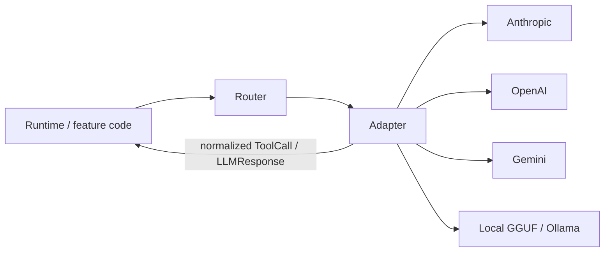

# ADR-0003: Provider abstraction over vendor lock-in

## Status

Accepted

## Context

Luca must remain one continuous identity regardless of which model performs a
task ([ADR-0001](0001-one-identity-not-per-session-agents.md)). That is only
possible if the rest of the system never learns which vendor it is talking to. The
moment feature code, prompts, or memory depend on a specific model vendor,
switching models changes Luca — which means Luca was never one thing to begin
with.

The pull toward vendor coupling is strong because vendors differ in ways that leak
upward if unmanaged:

- **Tool-call formats differ.** Anthropic emits `tool_use` blocks, OpenAI emits
  function-call objects, Google GenAI emits `functionCall` parts, a local model may
  emit JSON to be parsed. Code that reads one of these shapes directly is coupled
  to that vendor.
- **Streaming and error semantics differ.** Token deltas, stop reasons, rate-limit
  behavior, and partial-message handling vary. A feature that depends on one
  vendor's streaming quirk breaks on another.
- **Persona and "memory" features differ.** Some vendors offer their own system
  persona or memory. Letting any of these become Luca's identity ties Luca to that
  vendor.

If these differences are handled ad hoc — a branch here, a direct parse there —
the system accumulates `if (provider === "anthropic")` conditionals scattered
through feature code. Each is a small coupling; together they make the model
non-swappable and the identity vendor-shaped. This is the failure Invariant 4
forbids.

The current implementation already embodies the chosen structure: real
[Adapters](../GLOSSARY.md) exist for Gemini (the default, "Luca Prime"),
Anthropic, OpenAI, Grok, DeepSeek, and Groq, plus local inference (llama.cpp via
the [Cortex](../02-specification/08-cortex-and-local-intelligence.md), and Ollama)
and in-browser WebLLM. Each normalizes the vendor's native function-calling format
into one internal representation, using native function-calling rather than text
parsing. This ADR records the principle those Adapters implement.

## Decision

**All model access flows through a provider abstraction layer of Adapters and a
[Router](../GLOSSARY.md). No code above that layer depends on a specific vendor's
SDK or wire format, and no code above it branches on vendor.**

The structure this commits to:

- **Adapters are the only code that knows a vendor's format.** Each Adapter
  translates the vendor's native request/response and tool-call shape into one
  internal representation (a normalized `ToolCall` / `LLMResponse`). Vendor
  streaming quirks, stop reasons, and error shapes are absorbed here and never leak
  upward.
- **Routing lives in the Router, not in feature code.** Which Provider and model
  performs a given task — by capability, cost, latency, privacy, and availability
  — is decided in one place. The operative router keys on model-name prefix
  (`claude*` → Anthropic, `gpt*` → OpenAI, and so on); a richer capability/cost/
  latency route _planner_ exists in `src/model-router/` and runs in advisory/shadow
  mode behind a kill switch, with the [Roadmap](../06-roadmap/README.md) tracking
  its promotion.
- **Nothing above the Adapter branches on vendor.** `if (provider === "…")`
  outside the provider layer is a violation; the fix is always to push the
  distinction down into an Adapter.
- **Identity and persona live above the Provider layer.** A vendor's own persona
  or memory feature is never Luca's identity
  ([ADR-0002](0002-memory-belongs-to-luca.md)).

## Consequences

### Positive

- **Models are interchangeable infrastructure.** LucaOS can add, remove, or reroute
  Providers without touching feature code, and Luca's behavior stays continuous
  across the change.
- **One place to reason about model choice.** Cost, latency, privacy, and
  availability trade-offs live in the Router, where they can be evolved (and shadow-
  tested) without rippling through the system.
- **The seam is machine-checkable.** "Does any file outside the provider layer
  import a vendor SDK or branch on vendor?" is a greppable invariant, which agents
  and reviewers can enforce mechanically.

### Negative

- **Every new Provider costs an Adapter.** Supporting a vendor means writing and
  maintaining a translation to the internal representation, including its tool-call
  format, streaming, and error semantics — not merely dropping in its SDK.
- **The internal representation must be a real superset.** The normalized
  `ToolCall` / `LLMResponse` shape has to express what every supported vendor can
  do. A genuinely novel capability from one vendor may require extending the
  internal type (additively, per Invariant 7) rather than being used directly.
- **Some vendor-specific optimizations are forgone.** A trick that only one
  Provider supports cannot be reached by branching in feature code; it must be
  modeled generally or pushed into the Adapter, which is more work and occasionally
  leaves performance on the table.
- **Indirection has a cost.** Routing every call through Router and Adapter adds a
  layer to trace and debug compared with calling a vendor SDK directly. The
  discipline is worth it, but it is not free.

## Alternatives considered

- **Direct SDK calls with vendor branches.** Call each vendor's SDK where needed
  and branch on provider. Rejected: it scatters coupling, makes models non-swappable,
  and ties Luca's behavior to whichever model answered — the exact failure
  Invariant 4 names.
- **Single-vendor commitment.** Pick one Provider and build on it deeply. Rejected:
  it forfeits routing by cost/latency/privacy, forfeits local and offline inference,
  and makes Luca's continuity hostage to one vendor's availability, pricing, and
  policy.
- **Text-parsing tool calls instead of native function-calling.** Normalize by
  parsing model text output rather than using each vendor's structured tool-call
  API. Rejected: it is brittle and lossy; native function-calling per vendor,
  normalized in the Adapter, is more robust and is what the implementation uses.
- **A thin pass-through with no normalization.** A common entry point that still
  hands vendor-shaped objects to callers. Rejected: it moves the import but not the
  coupling — callers still branch on vendor shapes. Normalization to one internal
  representation is the load-bearing part.

## Related

- [Invariant 4 — Provider Abstraction](../01-constitution/01-the-eight-invariants.md#invariant-4--provider-abstraction)
- [Provider Abstraction](../02-specification/04-provider-abstraction.md)
- [What Luca Is and Is Not](../00-manifesto/02-what-luca-is-and-is-not.md) (models as infrastructure)
- [ADR-0001: One identity, not per-session agents](0001-one-identity-not-per-session-agents.md)
- [ADR-0002: Memory belongs to Luca](0002-memory-belongs-to-luca.md)
