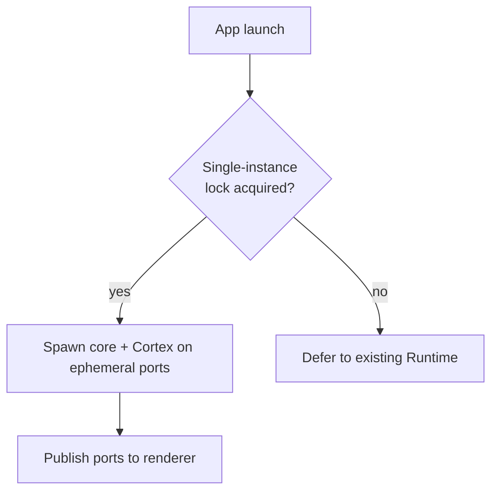

# ADR-0005: Ephemeral ports and a single-instance lock

## Status

Accepted

## Context

The [Runtime](../02-specification/01-persistent-runtime.md) today is an Electron
app that spawns two backends on localhost: a Node "core" server (`server.js`) and
a Python "[Cortex](../02-specification/08-cortex-and-local-intelligence.md)"
(FastAPI + uvicorn). The renderer talks to them over HTTP, so it must know their
ports.

Originally these were **fixed ports**. Fixed ports have a well-known problem: they
collide. If the chosen port is already taken — by a previous LucaOS process that
did not exit cleanly, by another instance, or by an unrelated program — the server
fails to bind with `EADDRINUSE` and the stack does not come up. That is a real
operational nuisance, and the obvious fix is to let the OS assign an **ephemeral
port** (bind to port 0, read back the actual port) and publish the chosen ports to
the renderer at startup.

But that fix removed something load-bearing that no one had designed on purpose.
The `EADDRINUSE` failure on a fixed port was, accidentally, a **mutual-exclusion
guard**: a second full stack could not start because it could not grab the port the
first one held. Ephemeral ports remove that collision, so two complete LucaOS
stacks can now run side by side — each with its own core server and Cortex, each
believing it is Luca.

Two live stacks is not a scaling win; it is a **singularity hazard**. Both write
the same single-file SQLite [Archive](../GLOSSARY.md)
([ADR-0004](0004-node-sqlite-over-better-sqlite3.md)). Two writers over one Memory
store is exactly what [Invariant 1](../01-constitution/01-the-eight-invariants.md#invariant-1--one-luca-identity)
forbids — "two Runtime processes both acting as Luca over the same state" — and
what [ADR-0001](0001-one-identity-not-per-session-agents.md) rules out at the
architectural level. The convenient fix for a port collision had quietly opened a
path to a second Luca.

## Decision

**Allocate ephemeral ports for the core server and Cortex and publish them to the
renderer, and add an explicit single-instance lock** so that at most one LucaOS
Runtime is live at a time.

- **Ephemeral ports.** Each backend binds to an OS-assigned port; the Runtime
  reads back the actual port and publishes both to the renderer. Port collisions on
  a hard-coded number cease to be a failure mode.
- **Single-instance lock.** A process-level lock, acquired at Runtime startup,
  guarantees a single live stack. A second launch attaches to (or defers to) the
  existing instance rather than spawning a competing core server, Cortex, and
  Archive writer. The mutual exclusion that fixed ports provided by accident is now
  provided **on purpose**, independent of how ports are assigned.

The lock is the actual guarantee of one identity; ephemeral ports are the
usability fix. Separating them means neither depends on the other's side effect.

## Consequences

### Positive

- **No more fixed-port collisions.** A stale process, a leftover bind, or an
  unrelated program holding a hard-coded port no longer prevents startup.
- **Singularity is enforced deliberately.** Exactly one Runtime writes the one
  Archive, satisfying Invariant 1 by explicit design rather than by an accidental
  `EADDRINUSE`. The guarantee no longer depends on a coincidence of port choice.
- **Robust to topology changes.** Because the lock is independent of ports, future
  changes to how backends are addressed (different transports, sockets, containers)
  cannot silently re-open the two-Luca path the way ephemeral ports did.

### Negative

- **Port discovery is now dynamic.** The renderer can no longer assume a known
  port; it must receive the published ports at startup, and anything that talks to
  the backends must go through that discovery. Hard-coded-port debugging shortcuts
  no longer work.
- **The lock introduces its own failure and edge cases.** A stale lock from a
  process that died uncleanly must be detected and reclaimed, or a legitimate
  relaunch is blocked. The lock's own robustness becomes a thing to get right.
- **Intentional multi-instance is now disallowed.** A user or developer who wanted
  two independent LucaOS stacks on one machine cannot have them by default; that is
  the correct default under Invariant 1, but it is a constraint, and any genuine
  need for isolated instances requires a deliberate, separate design rather than
  "just launch it twice."
- **Second-launch behavior must be defined and good.** Deferring to the existing
  instance (e.g. focusing it, or attaching a new [Surface](../GLOSSARY.md)) has to
  be implemented thoughtfully so a second launch feels like reaching the one Luca,
  not like a silent no-op.

## Alternatives considered

- **Keep fixed ports.** Rely on the `EADDRINUSE` collision as the guard. Rejected:
  it makes mutual exclusion an accident of an unrelated implementation detail,
  breaks on ordinary port conflicts, and produces a confusing failure rather than a
  clean single-instance behavior. Depending on a side effect for a safety property
  is fragile.
- **Ephemeral ports with no lock.** Take the usability win and accept that two
  stacks can run. Rejected outright: it permits two writers over one Archive — a
  direct singularity violation and a data-integrity hazard. This is the path the
  decision explicitly closes.
- **Per-instance separate Archives.** Let each stack have its own database so
  concurrent instances do not collide. Rejected: separate Archives means separate
  memories means more than one Luca — the fragmentation the whole system forbids.
  One identity requires one Archive, which in turn requires one writer.
- **Port file / advisory coordination only.** Write the chosen ports to a file and
  hope processes coordinate. Rejected as insufficient: it aids discovery but is not
  a mutual-exclusion guarantee; two processes can still both start. An explicit lock
  is the guarantee.

## Related

- [Invariant 1 — One Luca Identity](../01-constitution/01-the-eight-invariants.md#invariant-1--one-luca-identity)
- [Invariant 2 — Persistent Runtime](../01-constitution/01-the-eight-invariants.md#invariant-2--persistent-runtime)
- [Persistent Runtime](../02-specification/01-persistent-runtime.md)
- [The One Identity Principle](../00-manifesto/04-the-one-identity-principle.md) (multi-instance runtimes)
- [ADR-0001: One identity, not per-session agents](0001-one-identity-not-per-session-agents.md)
- [ADR-0004: `node:sqlite` over `better-sqlite3`](0004-node-sqlite-over-better-sqlite3.md)
- [ADR-0006: Fast-listen boot](0006-fast-listen-boot.md)
