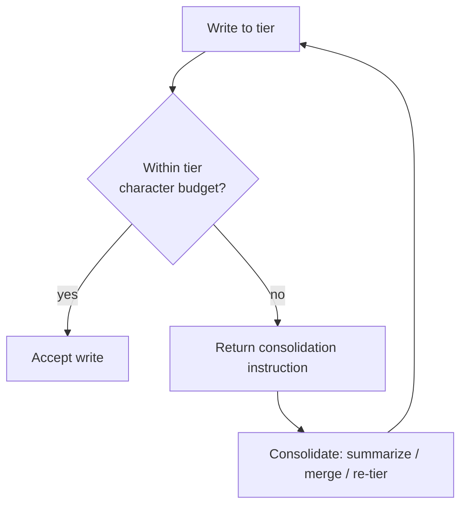

# ADR-0007: Write-time memory capacity

## Status

Accepted

## Context

[Memory belongs to Luca](0002-memory-belongs-to-luca.md) and is subdivided into
tiers with distinct retention rules — identity, durable, and transient. Each tier
has a different purpose and a different appropriate size: identity is small and
stable, durable accumulates the user's world, transient is working scratch. As
Luca runs, all three take writes continuously.

Any accumulating store faces the same question: what happens when it gets large?
A common answer is to **truncate at read time** — let the [Archive](../GLOSSARY.md)
grow without bound and simply select a subset when building context. That read-side
selection is necessary and LucaOS does it
([ADR-0010](0010-budgeted-ranked-memory-injection.md)), but if it is the _only_
capacity control, the underlying tiers grow without limit. Unbounded tier growth
has real costs: storage bloat, slower search and ranking, and — most importantly —
a loss of the _distinction_ between tiers. A "durable" tier that has swallowed
everything ever written is no longer a curated durable memory; it is an
undifferentiated pile that read-time ranking must then compensate for on every
turn.

Read-time truncation also hides a policy question that ought to be answered at the
moment of writing: when a tier is conceptually full, what should happen to the new
information? Silently letting it pile in defers the question forever. Silently
dropping it would be a correctness failure of the kind Invariant 3 forbids. The
right moment to decide is the write, when the system still has the new content in
hand and can act on it deliberately.

## Decision

**Enforce per-tier capacity at the write.** Each tier (identity, durable,
transient) has a character budget. When a write would exceed its tier's budget, the
write path does not silently truncate or silently accept unbounded growth; it
**returns a consolidation instruction** — a signal that the tier is full and its
contents must be consolidated (summarized, merged, or promoted/demoted between
tiers) before more is accepted.

- **Budgets are per tier**, reflecting each tier's role: a small stable identity
  budget, a larger durable budget, a bounded transient budget.
- **Full means consolidate, not drop and not overflow.** The consolidation
  instruction is the mechanism by which a full tier stays coherent: information is
  compressed or re-tiered rather than lost or allowed to sprawl.
- **This is in addition to, not instead of, read-time selection.** Write-time
  capacity keeps each tier meaningful and bounded; read-time budgeted ranking
  ([ADR-0010](0010-budgeted-ranked-memory-injection.md)) then selects from those
  coherent tiers for a given turn. The two controls operate at different moments and
  solve different problems.

## Consequences

### Positive

- **Bounded, coherent tiers.** Each tier stays within a size that matches its
  purpose, so "durable memory" remains a curated thing rather than an ever-growing
  dump. This strengthens
  [Invariant 3](../01-constitution/01-the-eight-invariants.md#invariant-3--shared-memory),
  which explicitly requires writes "bounded at write time."
- **The capacity decision happens where it can be acted on.** At write time the
  system has the new content and can consolidate deliberately, rather than
  discovering bloat later and reacting to it during a latency-sensitive read.
- **Downstream costs stay bounded.** Search, ranking, and storage do not degrade as
  a function of total history, because the tiers they operate over do not grow
  without limit.

### Negative

- **Consolidation must exist and be good.** A capacity limit that returns "please
  consolidate" is only as good as the consolidation it triggers. Summarizing or
  re-tiering memory without losing what mattered is a genuinely hard problem, and
  this decision makes the system depend on solving it. Where consolidation is still
  maturing, the [Roadmap](../06-roadmap/README.md) tracks it.
- **Consolidation is lossy by nature.** Compressing a full tier necessarily
  discards detail. A poor consolidation can drop something the user later needed.
  The budgets and the consolidation policy must be tuned to make that loss
  acceptable, and that tuning is ongoing.
- **Write paths are more complex.** A write can now return "not accepted as-is,
  consolidate first," so callers must handle that outcome rather than assuming every
  write simply lands. This is more logic than an append-only store requires.
- **Budgets are a tuning surface.** Per-tier character budgets are parameters that
  must be chosen and revisited; set too low, useful memory churns through
  consolidation too aggressively; too high, the tiers lose their distinct sizes.

## Alternatives considered

- **Read-time truncation only.** Let tiers grow unbounded and select a subset when
  building context. Rejected as the sole control: it lets the Archive and each tier
  sprawl, erodes the meaning of the tiers, and pushes all the burden onto read-time
  ranking. It is retained as the _complementary_ read-side control
  ([ADR-0010](0010-budgeted-ranked-memory-injection.md)), not as a substitute for
  write-time capacity.
- **Hard drop on overflow.** When a tier is full, silently discard the newest (or
  oldest) writes. Rejected: silently dropping memory the user expects to be kept is
  precisely the correctness failure Invariant 3 forbids. The consolidation
  instruction preserves information by compressing rather than discarding it.
- **Unbounded growth with periodic background compaction.** Never block a write;
  run a background job to shrink tiers occasionally. Rejected as the primary
  mechanism: it lets tiers exceed their budgets between compactions, makes capacity
  a matter of timing rather than guarantee, and separates the compaction decision
  from the write that has the relevant content in hand. Background maintenance may
  complement the write-time gate but cannot replace it.
- **A single global budget instead of per-tier.** One budget for all of Memory.
  Rejected: it ignores that tiers have different roles and sizes; a global budget
  would let transient churn crowd out identity, or force identity to compete with
  durable accumulation. Per-tier budgets keep each tier's purpose intact.

## Related

- [Invariant 3 — Shared Memory](../01-constitution/01-the-eight-invariants.md#invariant-3--shared-memory)
- [Memory Architecture](../02-specification/03-memory-architecture.md)
- [ADR-0002: Memory belongs to Luca](0002-memory-belongs-to-luca.md)
- [ADR-0010: Budgeted, ranked memory injection](0010-budgeted-ranked-memory-injection.md)
