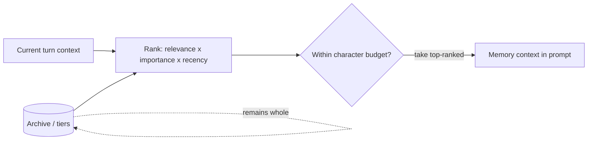

# ADR-0010: Budgeted, ranked memory injection

## Status

Accepted

## Context

Each turn, Luca builds a system prompt for the active
[Provider](../02-specification/04-provider-abstraction.md). Part of that prompt is
memory context — what Luca knows that is relevant to the moment. The question this
ADR settles is _how much_ of the [Archive](../GLOSSARY.md) goes into that context,
and _which_ of it.

The naive answer is "all of it": dump the whole memory store into the prompt so the
model has everything. That is viable only when the Archive is small. Because
[memory belongs to Luca](0002-memory-belongs-to-luca.md) and accumulates across the
user's entire history, the Archive grows without bound over time. If the injected
context is the whole Archive, then:

- **Prompt size grows with history.** Every turn's context gets larger as the user
  accumulates memory, so cost and latency degrade as a function of how long the user
  has used Luca — the most loyal users get the slowest, most expensive Luca.
- **Provider context windows are exceeded.** Beyond some point the whole Archive
  simply does not fit, and something must be cut anyway — so unbounded injection
  merely defers the selection problem to a hard failure.
- **Signal is diluted.** A model handed everything must find the relevant few facts
  amid the irrelevant many; more context is not more useful context.

This is the failure [Invariant 3](../01-constitution/01-the-eight-invariants.md#invariant-3--shared-memory)
forbids: "Dumping the entire memory store into a model's context unranked and
unbounded," with the failure mode "context that grows without bound as the Archive
grows." The [Constitution](../01-constitution/00-preamble.md) and
[CLAUDE.md](../CLAUDE.md) both require the opposite: what is injected is "a budgeted,
ranked selection of memory, never the entire archive."

Note the relationship to [ADR-0007](0007-write-time-memory-capacity.md): that
decision bounds each memory _tier_ at write time so the tiers stay coherent. This
decision bounds what is drawn _from_ those tiers into a given turn's context. Both
are required; neither substitutes for the other.

## Decision

**Inject a budgeted, relevance/importance/recency-ranked _selection_ of memory into
the prompt, never the whole Archive.**

- **A character budget caps the injection.** Memory context is allotted a bounded
  size, independent of how large the Archive has grown. The budget is the hard
  ceiling; selection fills it.
- **Selection is ranked by relevance, importance, and recency.** Candidate memories
  are scored — relevance to the current context (via FTS5 keyword recall and
  brute-force vector cosine over the Archive), intrinsic importance, and recency —
  and the highest-ranked are included until the budget is spent. What the moment
  calls for, what matters, and what is fresh are preferred over the rest.
- **The Archive stays whole; only the _view_ is bounded.** Nothing is deleted to
  make the injection fit. The full Archive remains the source of truth; the prompt
  receives a selection of it, recomputed per turn as relevance shifts.

## Consequences

### Positive

- **Prompt size is decoupled from Archive size.** Context cost and latency stay
  bounded no matter how much history the user accumulates, so Luca does not get
  slower or costlier the longer it is used. This satisfies Invariant 3's demand for
  a bounded, ranked selection.
- **Higher signal.** The model receives the memories most relevant, important, and
  recent for the turn, rather than everything — which tends to improve, not just
  cheapen, the response.
- **Provider-independent.** Because the budget is enforced above the
  [Adapter](../GLOSSARY.md) layer, the selection works the same across Providers
  regardless of each one's context-window size, consistent with
  [ADR-0003](0003-provider-abstraction-over-vendor-lockin.md).

### Negative

- **Ranking can omit something that mattered.** Any selection can leave out a memory
  that would have helped, if the ranking mis-scores its relevance or importance. A
  budgeted view is, by construction, an incomplete view; the quality of the outcome
  now depends on the quality of the ranking.
- **The ranking is a real system to build and tune.** Relevance, importance, and
  recency must be scored and combined, and the weighting is a tuning surface with no
  single correct setting. The current recall uses FTS5 keyword and brute-force
  vector cosine; scaling and refining retrieval as the Archive grows is tracked on
  the [Roadmap](../06-roadmap/README.md).
- **Per-turn ranking has a cost.** Scoring candidates each turn adds work on the
  request path compared with pasting a fixed blob. That cost must itself stay
  bounded as the Archive grows, which places demands on the retrieval implementation
  (indexing, approximate search) over time.
- **Budget tuning is ongoing.** Too small a budget starves the model of context; too
  large reintroduces the cost and dilution problems. The character budget is a
  parameter to hold under review, not a set-and-forget constant.

## Alternatives considered

- **Inject the whole Archive.** Simple and complete while small. Rejected: it grows
  unbounded with history, breaks Provider context limits, dilutes signal, and is the
  exact anti-pattern Invariant 3 names. It does not scale past a small Archive.
- **Fixed-size most-recent window.** Always include the last _N_ memories by recency
  alone. Rejected: recency is only one axis; a highly relevant or important older
  memory would be dropped in favor of recent trivia. Recency is kept as _one_ input
  to ranking, not the whole rule.
- **Pure semantic similarity, no budget.** Retrieve everything above a similarity
  threshold. Rejected: the number of matches — and thus the injected size — still
  varies with Archive size and query, so the context is not actually bounded, and
  importance and recency are ignored. A hard character budget plus multi-factor
  ranking is what makes the injection both bounded and well-chosen.
- **Read-time selection only, no write-time capacity.** Rely on this selection alone
  and let tiers grow unbounded underneath. Rejected: it lets the Archive tiers sprawl
  and pushes all coherence onto read-time ranking; write-time capacity
  ([ADR-0007](0007-write-time-memory-capacity.md)) is the necessary complement so
  ranking selects from coherent tiers.

## Related

- [Invariant 3 — Shared Memory](../01-constitution/01-the-eight-invariants.md#invariant-3--shared-memory)
- [Memory Architecture](../02-specification/03-memory-architecture.md)
- [ADR-0002: Memory belongs to Luca](0002-memory-belongs-to-luca.md)
- [ADR-0007: Write-time memory capacity](0007-write-time-memory-capacity.md)
- [ADR-0003: Provider abstraction over vendor lock-in](0003-provider-abstraction-over-vendor-lockin.md)
