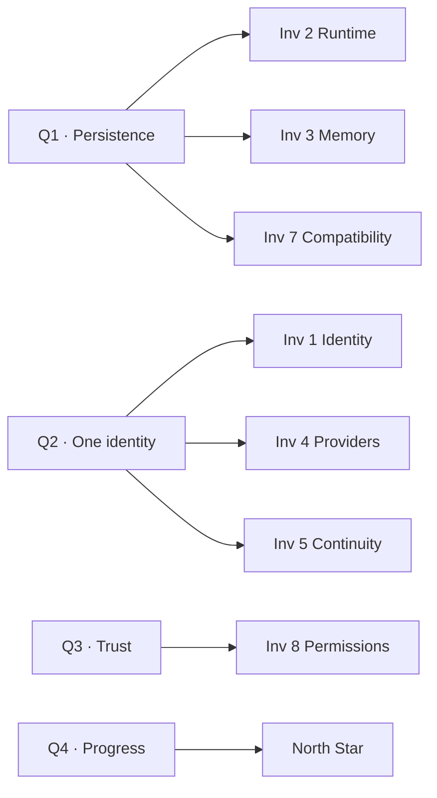

# The Phasing Model

How phases work in LucaOS: what defines a phase, what state it enters from, how
its exit is verified, and why a phase always hardens as it extends rather than
trading trust for reach. Read this before the individual phase documents; it is
the grammar they are written in.

## Why phases at all

LucaOS is not built feature by feature. It is built by moving a small number of
deep properties — presence, singularity, continuity, trust — closer to the
[North Star](../00-manifesto/05-north-star.md), one honest step at a time. A phase
is a coherent band of that movement: a set of changes that, taken together, leave
one or more [Invariants](../01-constitution/01-the-eight-invariants.md) demonstrably
stronger than before, and none weaker.

This is the same discipline [CLAUDE.md](../CLAUDE.md#9-when-the-vision-and-the-code-disagree)
asks of a single PR — name the gap, move one honest step toward the invariant,
leave the code and docs more truthful than you found them — scaled up to a band of
work. A phase is many aligned PRs, each of which could answer the
[Four Questions](../01-constitution/02-the-four-questions.md) with a straight face.

## What a phase is made of

Every phase document in this section is written to the same shape. When you read
one, you are reading these four parts.

### 1. The Invariant(s) it advances

A phase names which of the [Eight Invariants](../01-constitution/01-the-eight-invariants.md)
it primarily strengthens. This is the phase's reason to exist. Phase 1 advances
the persistence and memory invariants (2 and 3) and the trust invariant (8);
Phase 2 advances continuity and backward compatibility (5 and 7); Phase 3 advances
one identity, continuity, and security (1, 5, 8) as they extend to new
[Hosts](../GLOSSARY.md). A phase that could not name the Invariant it advances is
not a phase — it is a backlog.

### 2. The entry state

A phase begins from a named, verifiable state: the exit state of the phase before
it. This is what makes the ordering real rather than decorative. You do not begin
Phase 2 (cross-device Continuity) until Phase 1's presence holds, because there is
nothing worth carrying to a second device until presence on the first is felt.
Each phase document opens by stating precisely what must already be true.

### 3. The exit criteria

A phase ends when a set of **verifiable, qualitative conditions** hold — not when a
date arrives and not when a metric hits a fabricated threshold. The criteria are
written so an engineer, a designer, or a reviewer can walk up to a running system
and check them by observation. For example:

- *"Close every window and Luca is still running; reopening continues rather than
  restarts."* — checkable by doing it.
- *"With the default Provider unreachable, Luca remains present and says so, and no
  memory is lost."* — checkable by pulling the Provider.
- *"A task begun on one Host is resumed on another without re-briefing."* —
  checkable by moving between Hosts mid-task.

Exit criteria are phrased as **observable behavior of the one Luca**, never as
counts of shipped features. This is deliberate; see
[Milestones and Metrics](05-milestones-and-metrics.md) on why vanity metrics are
excluded.

### 4. How progress is judged

Within a phase, progress is judged continuously by the
[Four Questions](../01-constitution/02-the-four-questions.md). Each is mapped to the
Invariants it compresses:

A phase is judged to be advancing when the honest answers across its work trend
toward "yes" on the questions the phase claims, and stay at "yes or neutral" on the
rest. A phase that improved one axis while quietly answering "no" on another has
not advanced; it has traded — and this model does not permit that trade.

## The load-bearing rule: capability never costs Presence, identity, or trust

The single most important thing about the phasing model is the ordering rule it
enforces. **A later phase adds reach or capability only if that addition arrives
already consistent with every Invariant an earlier phase established.** Phases
harden as they extend.

This is not a stylistic preference. It follows directly from
[Presence Is the Product](../00-manifesto/03-presence-is-the-product.md) and the
[One Identity Principle](../00-manifesto/04-the-one-identity-principle.md):

- If Phase 3 reached a new Host by spinning up a Host-local assistant with its own
  memory, it would add a capability (a new Surface) at the cost of
  [Invariant 1](../01-constitution/01-the-eight-invariants.md#invariant-1--one-luca-identity).
  That is a second Luca. The phasing model forbids it: a new Host is admitted only
  as a Surface of the one Luca.
- If a phase reached a new Provider or a new Tool without a gate, it would add
  capability at the cost of
  [Invariant 8](../01-constitution/01-the-eight-invariants.md#invariant-8--security-and-explicit-permissions).
  The phasing model forbids it: capability lands already gated, provenanced, and
  revocable, protected by the [category floors](../02-specification/07-safety-and-permissions.md)
  so that omission fails safe.
- If a phase reached across devices by letting one Surface hold state the others
  could not see, it would add reach at the cost of
  [Invariant 5](../01-constitution/01-the-eight-invariants.md#invariant-5--cross-surface-continuity).
  The phasing model forbids it: shared state stays shared.

Read this way, each phase is not just wider than the last — it is **stronger**. The
foundation the earlier phase laid is a precondition the later phase must preserve,
so the Invariants accumulate rather than erode. A capability that cannot be added
without weakening presence, singularity, or trust is not deferred to a later phase;
it is redesigned until it can, or it does not ship. This is the phase-scale form of
the Four Questions' rule that a "no" touching an Invariant is a hard stop, not a
trade to be weighed.

## What a phase is not

- **Not a release train.** A phase is a state of the system, not a version tag.
  Several releases may occur within a phase; a phase ends when its exit criteria
  hold, whichever release that is.
- **Not a feature bucket.** Features are how a phase's criteria get met, not what a
  phase *is*. Two phases could ship similar-looking features and still be different
  phases because they advance different Invariants.
- **Not reversible by default.** Once a phase's exit criteria hold, they become
  standing conditions. A later phase that regressed them would be failing the same
  Four Questions the earlier phase passed. Regression is a bug, escalated like any
  Invariant violation — through an [RFC](../04-rfcs/README.md), not a quiet commit.

## Reading the phase documents

With this model in hand, each phase document reads as: *here is the Invariant we
are advancing, here is the state we start from, here is the observable behavior
that tells us we are done, and here is how the Four Questions judge us on the way.*
Start with [Phase 0 · Foundation](01-phase-0-foundation.md), whose exit state is
the entry state of everything that follows.

## See also

- [The Eight Invariants](../01-constitution/01-the-eight-invariants.md) — what each phase advances
- [The Four Questions](../01-constitution/02-the-four-questions.md) — how a phase's progress is judged
- [Milestones and Metrics](05-milestones-and-metrics.md) — how exit criteria are made verifiable and honest
- [Phase 0 · Foundation](01-phase-0-foundation.md) — the first phase, and the entry state for the rest
