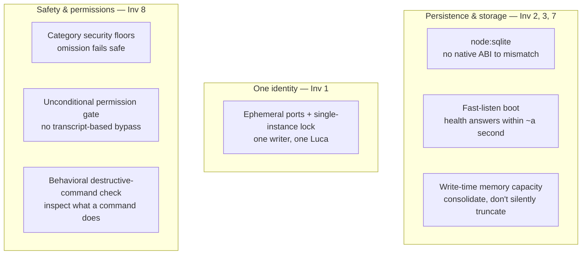

# Phase 0 · Foundation

Phase 0 is the phase in which the core of LucaOS exists and holds: a persistent
[Runtime](../02-specification/01-persistent-runtime.md), a unified
[Memory](../02-specification/03-memory-architecture.md) substrate, a
[Provider abstraction](../02-specification/04-provider-abstraction.md), a
[safety and permission](../02-specification/07-safety-and-permissions.md) baseline,
and durable [storage](../02-specification/10-data-and-storage.md). Much of it
already exists or is being hardened. Its exit criterion is singular and demanding:
the [Eight Invariants](../01-constitution/01-the-eight-invariants.md) hold on the
primary Host.

## Advances

Phase 0 is the only phase that advances all eight
[Invariants](../01-constitution/01-the-eight-invariants.md) at once, because it is
the phase that first makes each of them true somewhere. Every later phase extends
an Invariant Phase 0 established; none of them could begin if Phase 0 had not made
the core hold on one Host first.

## Entry state

Phase 0 enters from a working but uneven system: an Electron desktop application —
the primary [Host](../GLOSSARY.md) today — that spawns a Node core server and a
Python [Cortex](../02-specification/08-cortex-and-local-intelligence.md) on
localhost, with a React/Vite renderer, real Provider
[Adapters](../GLOSSARY.md), a SQLite-backed Memory, a
[tool registry](../02-specification/05-capability-and-tool-layer.md), and a
permission model. The parts are present. What Phase 0 does is make them *hold* —
turn a system that mostly works into one whose failure modes have been found and
closed, so that the Invariants are true under stress and not merely on the happy
path.

## The work of Phase 0: hardening the core

Phase 0 is best understood not as building the core from nothing but as
**hardening** it: taking each subsystem that already exists and closing the class
of bug that would let an Invariant silently fail. Several of the sharpest of these
decisions are already made and recorded as [ADRs](../05-adrs/README.md). They are
the concrete substance of Phase 0.

### Durable storage without an ABI to mismatch

LucaOS replaced `better-sqlite3` with the runtime's built-in
[`node:sqlite`](../02-specification/10-data-and-storage.md). The native module had
been built for Electron's ABI while a server ran under system Node; the DB would
silently fall back to a mock store and drop writes — a correctness bug wearing the
costume of graceful degradation, and a direct violation of
[Invariant 3](../01-constitution/01-the-eight-invariants.md#invariant-3--shared-memory).
`node:sqlite` has no native binary, no `electron-rebuild`, and no ABI to mismatch.
This is Phase 0 hardening of persistence: memory the user expects to survive a
restart actually does.

### One writer, one Luca

The core server and Cortex are allocated **ephemeral ports** and publish them to
the renderer. Removing the fixed ports also removed an accidental `EADDRINUSE`
guard that had prevented a second full stack from starting — so two Runtimes could
run and two writers could hit one SQLite file. Two processes both acting as Luca
over one store is a singularity hazard, forbidden by
[Invariant 1](../01-constitution/01-the-eight-invariants.md#invariant-1--one-luca-identity).
Phase 0 closes it with a **single-instance lock**: at most one Runtime owns the
store.

### Presence that binds fast, not a boot the user watches

The Runtime serves `/api/health` before its heavy route graph loads, so the port
binds and health answers within about a second of spawn. Without this
**fast-listen boot**, a slow start let the UI time out and degrade to a stateless
mode — silently losing continuity, which
[Presence Is the Product](../00-manifesto/03-presence-is-the-product.md) names as
damaging the product even when every later response is good. Bounded
time-to-presence is a Phase 0 property that Phase 1 then deepens.

### Memory bounded where it is written

Per-tier character budgets are enforced at the **write** (identity, durable,
transient), returning a consolidation instruction when a tier is full rather than
only truncating at read time. Context injected into a model is a **budgeted, ranked
selection** of the Archive, not the whole of it. Together these keep Memory healthy
as it grows, satisfying [Invariant 3](../01-constitution/01-the-eight-invariants.md#invariant-3--shared-memory)
under accumulation rather than only on day one.

### Capability that fails safe

The [tool layer](../02-specification/05-capability-and-tool-layer.md) applies a
`SecurityLevel` × `MissionScope` model, and adds **category security floors**: a
Tool in a dangerous category (hacking, crypto, messaging) that is unlisted receives
a minimum security level, so forgetting a config row fails safe instead of shipping
an ungated capability. Explicit per-tool configuration still wins. This is
[Invariant 8](../01-constitution/01-the-eight-invariants.md#invariant-8--security-and-explicit-permissions)
made resistant to omission.

### A gate that content cannot open

A guardrail once skipped the permission gate when the last user message contained a
magic phrase. Transcript text is attacker-controllable — pasted documents, fetched
pages, and tool output all land there — so that was a hole. The gate is now
**unconditional**: consent lives in the operator's decision, never in observed
content. Alongside it, destructive-command detection inspects **what a command
does**, not whether its string matches a keyword or a tool's own name. Both are
Phase 0 trust hardening, and both are exactly the failure modes
[Invariant 8](../01-constitution/01-the-eight-invariants.md#invariant-8--security-and-explicit-permissions)
enumerates.

## What Phase 0 does not yet claim

Phase 0 is honest about the edges of the core, and the honesty is the point.

- **The primary Host is one Host.** Phase 0 makes the Invariants hold on the
  desktop. It does not yet make them hold *across* devices — that is
  [Phase 2](03-phase-2-continuity.md). Continuity and checkpoint services exist and
  a cross-device sync ("Luca Link") is present, but "a user moves between Hosts
  mid-task and continues" is not a Phase 0 exit criterion.
- **Cognition forms beliefs by keyword.** The perceive/deliberate step exists and is
  injected into the system prompt, but current belief-formation is keyword-based,
  not probabilistic. Phase 0 requires it to be present and wired, not that it be
  the richer target.
- **The capability route planner runs in shadow.** A capability/cost/latency route
  planner exists in `src/model-router/` but runs in advisory mode behind a kill
  switch; the operative router keys on model-name prefix. Phase 0 requires
  [Provider abstraction](../02-specification/04-provider-abstraction.md) to hold —
  nothing above the Adapter branches on vendor — not that the advisory planner be
  promoted.

Naming these is not a weakness. It is the Roadmap doing its job: the
[Specification](../02-specification/README.md) points here for each gap, and here is
where the phase that closes it is named.

## Exit criteria

Phase 0 is complete when, on the primary (desktop) Host, all eight
[Invariants](../01-constitution/01-the-eight-invariants.md) hold under observation —
not on the happy path only, but under the stresses that used to break them:

| # | Invariant | Verifiable condition on the primary Host |
|---|---|---|
| 1 | One identity | At most one Runtime owns the store; no second writer can start. |
| 2 | Persistent Runtime | Health binds within about a second of spawn; no boot path degrades to a stateless mode. |
| 3 | Shared Memory | Writes persist to `node:sqlite` with no silent mock fallback; a full tier forces consolidation, not silent loss. |
| 4 | Provider abstraction | No code above the Adapter branches on vendor; switching the answering model does not change Luca. |
| 5 | Cross-surface continuity | The Surfaces on the primary Host render one shared state; view state is separated from identity/memory. |
| 6 | Strong typing | Subsystem seams are typed; the normalized `ToolCall`/`LLMResponse` shape holds across Adapters. |
| 7 | Backward compatibility | The persisted schema evolves additively with explicit migrations; an upgrade preserves Memory. |
| 8 | Security & permissions | The gate is unconditional; category floors cover dangerous Tools; checks inspect behavior, not keywords. |

When these hold together and stay held, Phase 0 is done and
[Phase 1 · Presence](02-phase-1-presence.md) may begin — because there is now a
solid, singular, trusted core worth making *felt*.

## How the Four Questions judge Phase 0

- **Q1 (persistence):** strongly yes — durable storage without an ABI to mismatch,
  fast-listen boot, write-time capacity.
- **Q2 (one identity):** yes — the single-instance lock closes the two-writer
  hazard; Provider abstraction keeps identity above the model.
- **Q3 (trust):** strongly yes — unconditional gate, category floors, behavioral
  destructive-command checks.
- **Q4 (progress):** yes — a core that holds is the precondition for every step
  toward a continuously present AI.

## See also

- [The Phasing Model](00-phasing-model.md) — how this phase's exit becomes the next phase's entry
- [Persistent Runtime](../02-specification/01-persistent-runtime.md) · [Memory Architecture](../02-specification/03-memory-architecture.md) · [Data and Storage](../02-specification/10-data-and-storage.md)
- [Provider Abstraction](../02-specification/04-provider-abstraction.md) · [Safety and Permissions](../02-specification/07-safety-and-permissions.md)
- [The ADRs](../05-adrs/README.md) — the decisions recorded here as Phase 0 hardening
- [Phase 1 · Presence](02-phase-1-presence.md) — what Phase 0's exit state enables
