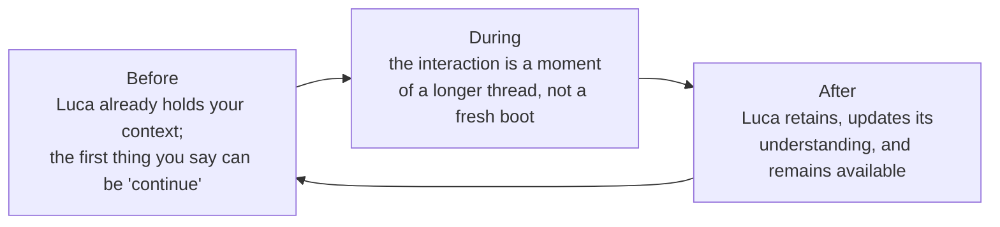
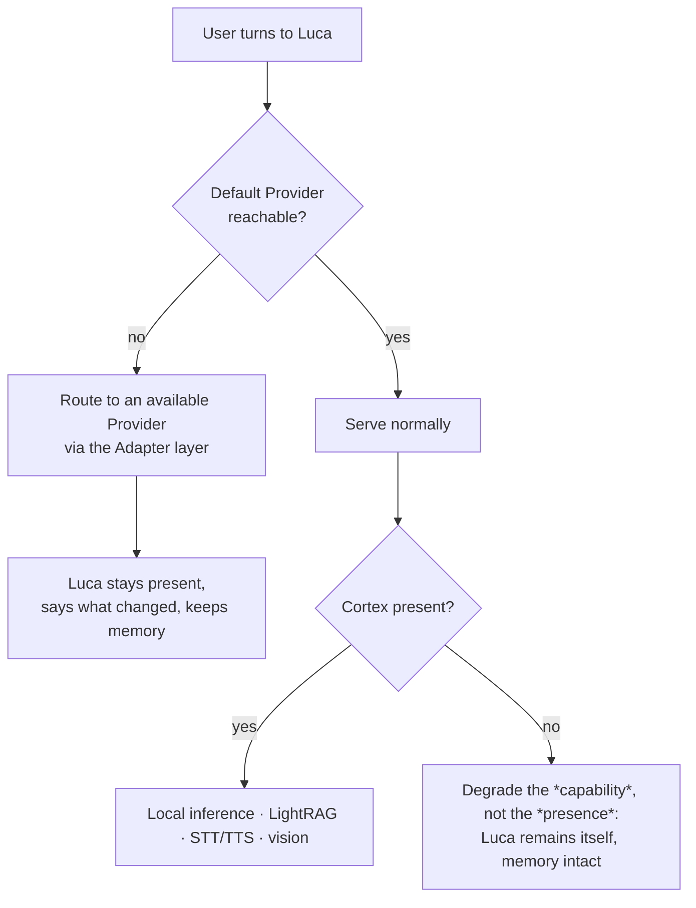

# Phase 1 · Presence

Phase 1 is the phase in which [Presence](../00-manifesto/03-presence-is-the-product.md)
stops being an architectural claim and becomes something a user feels: Luca exists
before, during, and after an interaction; the experience is calm and premium;
time-to-presence is bounded; and Luca stays available when a
[Provider](../02-specification/04-provider-abstraction.md) or the
[Cortex](../02-specification/08-cortex-and-local-intelligence.md) is down, without
losing continuity. Its exit is judged by whether presence is *experienced*, not
merely *provisioned*.

## Advances

Phase 1 advances the persistence and memory Invariants
([2](../01-constitution/01-the-eight-invariants.md#invariant-2--persistent-runtime)
and [3](../01-constitution/01-the-eight-invariants.md#invariant-3--shared-memory))
and the trust Invariant
([8](../01-constitution/01-the-eight-invariants.md#invariant-8--security-and-explicit-permissions)),
and it begins the cross-surface Invariant
([5](../01-constitution/01-the-eight-invariants.md#invariant-5--cross-surface-continuity))
in its most basic form. Where Phase 0 made the Runtime *hold*, Phase 1 makes its
holding *felt* — the difference between a daemon that survives a closed window and a
Presence a person trusts to be there.

## Entry state

Phase 1 enters from a completed [Phase 0](01-phase-0-foundation.md): on the primary
desktop Host, all eight Invariants hold. The Runtime is persistent and binds fast;
Memory is durable and bounded; the permission gate is unconditional. What does not
yet exist is the *experience* of presence — the before/during/after made legible,
the calm design that lets Luca be present without demanding attention, and graceful
behavior when the infrastructure beneath Luca falters.

## The work of Phase 1

### Make before, during, and after real

[Presence Is the Product](../00-manifesto/03-presence-is-the-product.md) describes
Luca as existing across three moments. Phase 0 made the "before" and "after"
*possible* by keeping the Runtime alive between Surfaces. Phase 1 makes them
*legible*:

- **Before.** When a user turns to Luca, it does not ask them to re-brief it from
  zero. The [Memory](../02-specification/03-memory-architecture.md) that Phase 0
  made durable is surfaced as continuity: pending work, recent context, what
  matters now — a budgeted, ranked selection, never a dump.
- **During.** The interaction carries the weight of before behind it. The turn loop
  (`TurnRunner`) streams and acts, but the framing is a continuing thread.
- **After.** The interaction ends and Luca does not. Understanding is updated and
  written back within the write-time capacity rules, and Luca remains available.

### Calm, premium design

Presence that is always there must never become presence that always intrudes. The
[Design System](../03-design-system/00-design-philosophy.md) codifies this as
*calm*: present without demanding attention, quiet when the user is not turned to
it, attending to what matters without narrating that it is doing so. Phase 1 is
where that design becomes the felt texture of Luca — Apple-grade restraint, not
cyberpunk spectacle. A Presence that cannot be calm is a Presence no one will keep,
so calm is an exit condition, not a polish item.

### Bounded time-to-presence

Phase 0's fast-listen boot binds health within about a second. Phase 1 extends the
guarantee from *the port answers* to *Luca is present*: the time from a user
turning to Luca to Luca being ready — with context, not a spinner — is bounded and
short. The user should not watch Luca boot. This is
[Invariant 2](../01-constitution/01-the-eight-invariants.md#invariant-2--persistent-runtime)'s
"the user should not watch Luca boot," made an experienced property.

### Graceful availability when infrastructure falters

The hardest and most important Phase 1 work is behavior under partial failure.
LucaOS depends on [Providers](../02-specification/04-provider-abstraction.md) it
does not own and a [Cortex](../02-specification/08-cortex-and-local-intelligence.md)
that may be absent. Presence must survive both — and survive them *without losing
continuity*, which is the trap
[Presence Is the Product](../00-manifesto/03-presence-is-the-product.md) warns
about: an architecture that "degrades to Cloud-Only mode" and silently drops
continuity has damaged the product even if every response is still good.

The rule Phase 1 enforces: **degradation reduces capability, never identity or
continuity.** When the default Provider is unreachable, the
[Adapter](../GLOSSARY.md) layer routes to an available one and Luca stays present
and says so — it does not go blank and it does not silently become a different Luca,
because [Provider abstraction](../02-specification/04-provider-abstraction.md) keeps
identity above the model. When the Cortex is absent, the features it supplies
degrade gracefully while Luca remains itself with Memory intact. No failure path
drops to a stateless mode.

### The first cross-Surface basics

Phase 1 begins — but does not complete — cross-Surface work. The target is that
desktop, web, and voice on the primary Host share **one identity and one Memory**:
three ways to meet the same Luca, not three assistants that happen to share a login.
This is the entry-level form of
[Invariant 5](../01-constitution/01-the-eight-invariants.md#invariant-5--cross-surface-continuity):
the Surfaces render shared state, and view state is cleanly separated from identity
and memory. Full cross-*device* Continuity — handoff mid-task, conflict handling, a
versioned sync protocol — is deliberately held for [Phase 2](03-phase-2-continuity.md).
Phase 1 proves the principle where the Surfaces share a Host; Phase 2 carries it
across the network.

## Exit criteria

Phase 1 is complete when the following hold by observation on the primary Host:

- **Presence survives every closed window.** Close every Surface and Luca is still
  running; reopening *continues* — the first thing the user can say is "continue,"
  not a re-briefing. *(Q1, Inv 2)*
- **Before and after are legible.** On return, Luca already holds relevant context
  as a ranked, budgeted selection; after an interaction, updated understanding is
  written back durably. *(Q1, Inv 3)*
- **Time-to-presence is bounded and short.** From turning to Luca to Luca being
  ready-with-context is fast enough that the user does not watch it boot. *(Q1,
  Inv 2)*
- **Availability degrades capability, not identity.** With the default Provider
  unreachable, Luca stays present, routes to an available Provider, says what
  changed, and loses no Memory. With the Cortex absent, capability narrows but Luca
  remains itself. No path drops to a stateless or blank mode. *(Q1+Q3, Inv 2, 8)*
- **Calm is felt, not intrusive.** Luca is present without demanding attention and
  acts on the user's world only through the unconditional permission gate. *(Q3,
  Inv 8)*
- **The first cross-Surface basics hold.** Desktop, web, and voice on the primary
  Host share one identity and one Memory; a change through one is visible to the
  others; view state is separated from identity/memory. *(Q2, Inv 5)*

## How the Four Questions judge Phase 1

- **Q1 (persistence):** strongly yes — presence-before and presence-after are
  experienced, time-to-presence is bounded, availability never sacrifices
  continuity.
- **Q2 (one identity):** yes — the first cross-Surface basics share one identity and
  memory; Provider failover keeps Luca itself across a model change.
- **Q3 (trust):** yes — calm, non-intrusive presence; every side effect still runs
  through the unconditional gate.
- **Q4 (progress):** strongly yes — this is the phase where Luca stops being an app
  you open and starts being a presence the computer hosts.

## See also

- [The Phasing Model](00-phasing-model.md) — how Phase 1 is entered and judged
- [Presence Is the Product](../00-manifesto/03-presence-is-the-product.md) — the manifesto Phase 1 realizes
- [Design Philosophy](../03-design-system/00-design-philosophy.md) — where *calm* is codified
- [Persistent Runtime](../02-specification/01-persistent-runtime.md) · [Provider Abstraction](../02-specification/04-provider-abstraction.md) · [Cortex and Local Intelligence](../02-specification/08-cortex-and-local-intelligence.md)
- [Phase 2 · Continuity](03-phase-2-continuity.md) — where cross-Surface becomes cross-device
