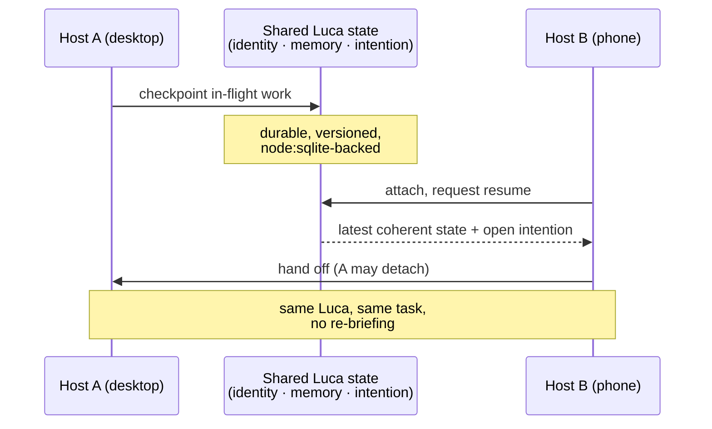

# Phase 2 · Continuity

Phase 2 is the phase in which one Luca becomes present across *devices*, not just
across Surfaces on one device: a sync protocol, checkpoint and resume, device
handoff, conflict handling, and a versioned protocol that lets a newer and older
[Host](../GLOSSARY.md) interoperate. Its exit is a single, demanding, observable
behavior — a user moves between Hosts mid-task and continues seamlessly.

## Advances

Phase 2 advances cross-surface Continuity
([Invariant 5](../01-constitution/01-the-eight-invariants.md#invariant-5--cross-surface-continuity))
and backward compatibility
([Invariant 7](../01-constitution/01-the-eight-invariants.md#invariant-7--backward-compatibility-where-practical)).
[Invariant 5](../01-constitution/01-the-eight-invariants.md#invariant-5--cross-surface-continuity)
calls Continuity "singularity made observable": one identity across devices
([Invariant 1](../01-constitution/01-the-eight-invariants.md#invariant-1--one-luca-identity))
is only *experienced* if the state actually flows. Phase 2 is where the state
flows across the network.

## Entry state

Phase 2 enters from a completed [Phase 1](02-phase-1-presence.md): on the primary
Host, presence is felt, availability degrades capability rather than identity, and
the first cross-Surface basics hold — desktop, web, and voice share one identity
and one Memory *on that Host*. What does not yet exist is Continuity across the
*network*: moving from your desk to your phone to your car and finding the same
in-flight work, not a fresh context. LucaOS already has runtime
continuity/checkpoint services and a cross-device sync ("Luca Link") with a
`node:sqlite`-backed checkpoint store — Phase 2 hardens these into a protocol that
holds under the hard cases: latency, concurrent edits, and version skew.

## The work of Phase 2

### The sync protocol

Phase 2 defines the protocol by which two Hosts, each an embodiment of the one
Luca, stay coherent. The unit that flows is **shared identity, memory, and
in-flight intention** — never Surface-local view state, which
[The One Identity Principle](../00-manifesto/04-the-one-identity-principle.md) is
explicit stays on the body. The protocol messages are **typed and versioned**
([Invariant 6](../01-constitution/01-the-eight-invariants.md#invariant-6--strong-typing-and-modularity)),
because a protocol whose shape lives only in the code that happens to read it is
exactly the failure mode
[Invariant 6](../01-constitution/01-the-eight-invariants.md#invariant-6--strong-typing-and-modularity)
forbids.

### Checkpoint and resume

The turn loop and Luca's in-flight intention are checkpointed durably, so that
work in progress on one Host can be resumed on another. This extends Phase 0's
checkpoint store from "survive a restart on one Host" to "survive a *move* to
another Host." A resume is a *continuation* of the same intention, not a re-start
of a similar one.

### Device handoff

Handoff is the visible payoff: a user begins a task on one Host and picks it up on
another with no re-briefing and no manual "sync." A device switch that started a
fresh context would be the precise failure mode
[Invariant 5](../01-constitution/01-the-eight-invariants.md#invariant-5--cross-surface-continuity)
names. Phase 2 makes handoff the default, not a feature the user must invoke.

### Conflict handling

Two Hosts may act on shared state near-simultaneously. Phase 2 handles this
honestly: shared state has a defined resolution model so that concurrent edits
converge to one coherent Luca rather than two diverging ones. The hazard to avoid
is the one [CLAUDE.md](../CLAUDE.md#1-the-one-thing-you-must-never-forget) and
[Invariant 1](../01-constitution/01-the-eight-invariants.md#invariant-1--one-luca-identity)
warn about — two embodiments quietly becoming two Lucas because each wrote only
locally. Conflict handling is what keeps singularity intact when the network is
slow or partitioned: divergence is detected and reconciled, never silently
preserved as a second self.

### Versioned protocol and additive evolution

Hosts update at different times. During a rollout, a newer Host and an older Host
must interoperate, which means the sync protocol and every persisted shape it
carries must evolve **additively**, with explicit, tested migrations when a shape
must change
([Invariant 7](../01-constitution/01-the-eight-invariants.md#invariant-7--backward-compatibility-where-practical)).
"Where practical" is a real qualifier: a documented, migrated breaking change is
permitted; a silent one that drops a user's accumulated Memory on upgrade, or makes
a mid-rollout mix of Hosts incoherent, is not. Presence across time includes
presence across *versions*.

## The concurrent-writer discipline, restated for devices

Phase 0 closed the two-writer hazard *on one Host* with a single-instance lock.
Phase 2 faces the same hazard's harder form: many Hosts, legitimately live at once,
all embodying the one Luca. The answer is not "only one Host may run" — that would
defeat the point — but a protocol in which many embodiments read and write **one
logical Luca** through defined checkpoint, handoff, and conflict rules, so that
concurrency never fractures identity. This is the distributed generalization of
[Invariant 1](../01-constitution/01-the-eight-invariants.md#invariant-1--one-luca-identity),
and getting it right is the core intellectual work of the phase.

## Exit criteria

Phase 2 is complete when the following hold by observation, across at least two
distinct Hosts:

- **Mid-task handoff continues, not restarts.** A user begins a task on one Host
  and resumes it on another with no re-briefing and no manual sync; the in-flight
  intention is the same one, continued. *(Q1+Q2, Inv 5)*
- **State flows both ways.** A change made through one Host is visible on the other
  without a re-login or manual refresh; neither Host holds shared state the other
  can never see. *(Q2, Inv 5)*
- **Concurrency converges to one Luca.** Near-simultaneous edits on two Hosts
  reconcile to a single coherent state; no path leaves two diverging Lucas. *(Q2,
  Inv 1, 5)*
- **The protocol is versioned and additive.** A newer and older Host interoperate
  during a rollout; persisted shapes evolve additively with explicit migrations; an
  upgrade preserves Memory and in-flight work. *(Q1, Inv 7)*
- **Continuity does not weaken trust.** Actions taken on one Host and continued on
  another carry their [Provenance](../GLOSSARY.md) across the handoff; the
  permission gate still governs side effects on whichever Host performs them. *(Q3,
  Inv 8)*

## How the Four Questions judge Phase 2

- **Q1 (persistence):** strongly yes — in-flight work survives a move between Hosts,
  and survives upgrades through additive, migrated evolution.
- **Q2 (one identity):** strongly yes — this is the phase where one identity across
  devices becomes observable, with concurrency converging to a single Luca.
- **Q3 (trust):** yes — provenance and the permission gate follow the work across
  Hosts.
- **Q4 (progress):** strongly yes — Luca becomes present across the devices a person
  already owns, which is the North Star's "enables computers," plural.

## See also

- [The Phasing Model](00-phasing-model.md) — how Phase 2 is entered and judged
- [Continuity and Sync](../02-specification/09-continuity-and-sync.md) — the architecture Phase 2 hardens
- [Data and Storage](../02-specification/10-data-and-storage.md) — additive evolution and migrations
- [The One Identity Principle](../00-manifesto/04-the-one-identity-principle.md) — the singularity Phase 2 defends across devices
- [Phase 3 · Embodiment](04-phase-3-embodiment.md) — carrying the same Luca to new kinds of Host
