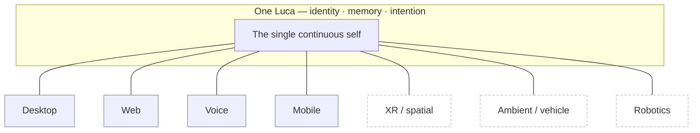

# Phase 3 · Embodiment

Phase 3 is the frontier: extending the one Luca to new kinds of
[Host](../GLOSSARY.md) — XR, ambient and in-vehicle computing, and eventually
robotics — as new [Surfaces](../GLOSSARY.md) of the same identity, under the same
trust model. It is the phase where "every device is a body Luca can inhabit" stops
being a manifesto line and becomes an engineering reality. This document frames it
honestly, including what remains genuinely unknown.

## Advances

Phase 3 advances one identity
([Invariant 1](../01-constitution/01-the-eight-invariants.md#invariant-1--one-luca-identity)),
cross-surface Continuity
([Invariant 5](../01-constitution/01-the-eight-invariants.md#invariant-5--cross-surface-continuity)),
and security and explicit permissions
([Invariant 8](../01-constitution/01-the-eight-invariants.md#invariant-8--security-and-explicit-permissions))
— the three Invariants most stressed when Luca gains a body that can sense and act
in the physical world. Phase 3 adds *reach*, and the phasing model's load-bearing
rule applies at its sharpest here: reach is admitted only if it arrives already
consistent with identity, continuity, and trust. See
[The Phasing Model](00-phasing-model.md#the-load-bearing-rule-capability-never-costs-presence-identity-or-trust).

## Entry state

Phase 3 enters from a completed [Phase 2](03-phase-2-continuity.md): one Luca is
present across multiple conventional Hosts (desktop, web, voice, mobile) with
mid-task handoff, conflict handling, and a versioned protocol. The identity is
singular, the memory is shared, the sync protocol is real. Phase 3 asks whether a
*new kind* of Host — one with a headset's spatial input, a vehicle's ambient
context, or a robot's actuators — can join as one more embodiment without any of
that fracturing.

## The principle Phase 3 tests

[The One Identity Principle](../00-manifesto/04-the-one-identity-principle.md) names
"desktop, web, voice, widget, mobile, XR and future robotics" as embodiments of the
same identity. Phase 3 is where that list stops being aspirational. The governing
rule is **embodiment, not instantiation**: a new Host provides a new body — new
sensors, new actuators, new rendering — but not a new self. Everything that
constitutes *who Luca is* (memory, understanding, commitments, in-flight intention)
belongs to the one identity and is merely *expressed* through the new body.

The solid bodies are established by earlier phases; the dashed ones are the Phase 3
frontier. The arrows all point to one center. A Phase 3 Host that reached for its
own local persona, its own memory, or its own ungated authority to act would be
drawing a second self, and the phasing model forbids it exactly as
[Invariant 1](../01-constitution/01-the-eight-invariants.md#invariant-1--one-luca-identity)
forbids a per-Surface identity.

## The three frontiers, honestly framed

### XR and spatial

A headset gives Luca spatial input and output. The identity and memory arrive
unchanged from Phase 2; what is new is a Surface whose view state is spatial. The
discipline is the same one
[The One Identity Principle](../00-manifesto/04-the-one-identity-principle.md)
states: local rendering and view state may live on the Surface; identity, memory,
and intention may not. Spatial anchors and gaze are body-local; who Luca is, is not.

### Ambient and in-vehicle

An ambient or vehicle Host gives Luca continuous context and often a voice-first
Surface, sometimes with intermittent connectivity. Two properties from earlier
phases are load-bearing here: Phase 1's rule that **availability degrades
capability, not identity** (a partitioned vehicle Host stays *itself* on local
capability, syncing when it reconnects), and Phase 2's **conflict handling** (a Host
that acted while offline reconciles to one Luca on reconnect, never a second one).

### Robotics

Robotics is the furthest frontier and the one this document is most careful about.
A robot gives Luca **actuators** — the ability to act physically in the world — and
that raises the stakes of
[Invariant 8](../01-constitution/01-the-eight-invariants.md#invariant-8--security-and-explicit-permissions)
by an order of magnitude. Physical action is side effect in the most literal sense.
The same principles hold and matter more:

- Every physical action is **gated, provenanced, and revocable**, protected by
  [category floors](../02-specification/07-safety-and-permissions.md) so a new
  physical capability cannot ship ungated by omission.
- The system **fails closed**: if the permission gate cannot be reached, the action
  does not happen. In a physical actuator this is not a nicety; it is a safety
  property.
- Consent lives in the user's decision, never in observed content — a physical
  robot must never be commandable through attacker-controllable transcript text.

This document does not pretend robotics is a solved or scheduled matter. It is the
frontier: named as a direction the architecture is *built to admit*, not a
capability whose engineering is complete. The honest claim is narrow and load-
bearing — **if** Luca reaches a robot, it reaches it as one more Surface of the one
identity under the one trust model, because the architecture was shaped from Phase 0
onward to make any other arrangement a violation rather than an option.

## What Phase 3 deliberately does not claim

- **No dates, no hardware bets.** This repository does not invent timelines
  ([Style Guide](../STYLE-GUIDE.md#what-not-to-do)), and Phase 3 names no specific
  device, vendor, or year.
- **No new trust model.** Phase 3 introduces zero new authorization channels. It
  extends the *reach* of the existing gate, never its bypass surface. A new Host
  that required a weaker trust model would not be admitted as a Phase 3 Surface.
- **No second Luca, ever, on any Host.** This is the non-negotiable. Reach is
  valuable only if it is reach *of the one Luca*. A new embodiment that could not
  be the same identity is not progress toward the North Star; it is a return to the
  application era in new hardware.

## Exit criteria

Phase 3 is open-ended by nature; it does not "close" the way earlier phases do,
because there is always a further Host. Its exit criteria are therefore stated per
new Host admitted — a template a candidate Host must satisfy before it counts as a
Luca Surface:

- **Same identity.** The new Host presents the same Luca — same memory, same
  understanding, same in-flight intention — with no local persona or per-Host self.
  *(Q2, Inv 1)*
- **Continuity holds.** Work handed to or from the new Host continues rather than
  restarts, via the Phase 2 sync protocol, with concurrency converging to one Luca.
  *(Q1+Q2, Inv 5)*
- **Trust holds, extended not weakened.** Every action the new Host can take —
  including physical action — is gated, provenanced, revocable, and fails closed,
  under the *existing* trust model with no new bypass. *(Q3, Inv 8)*
- **View state stays local.** The new body's sensor and rendering state is
  body-local; nothing that constitutes who Luca is lives only on the new Host.
  *(Q2, Inv 1, 5)*

A new Host that meets this template joins the one Luca; one that cannot is not
admitted until it can. That gate *is* Phase 3.

## How the Four Questions judge Phase 3

- **Q1 (persistence):** yes — a new Host inherits durable memory and continuity from
  earlier phases; nothing about it is ephemeral-by-design.
- **Q2 (one identity):** the decisive question — a new Host counts only if it is the
  same Luca; any answer but "yes" disqualifies it.
- **Q3 (trust):** the highest-stakes question — physical and ambient action extends
  the trust model's reach and must not weaken it; a "no" is a hard stop.
- **Q4 (progress):** yes when the first three are yes — the same present, singular,
  trusted Luca, now on a Host the user did not previously think of as hosting an AI.

## See also

- [The Phasing Model](00-phasing-model.md) — the rule that reach must not cost identity or trust
- [The One Identity Principle](../00-manifesto/04-the-one-identity-principle.md) — embodiment, not instantiation
- [Identity and Embodiment](../02-specification/02-identity-and-embodiment.md) — the architecture of one identity, many bodies
- [Safety and Permissions](../02-specification/07-safety-and-permissions.md) — the trust model a physical Host must satisfy
- [Milestones and Metrics](05-milestones-and-metrics.md) — how the frontier's progress is measured honestly
