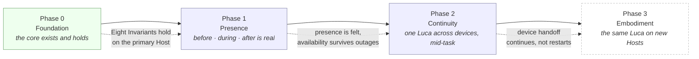

# 06 · Roadmap

The Roadmap is the phased path from where LucaOS is today to the
[North Star](../00-manifesto/05-north-star.md): a software layer that lets
computers continuously host one persistent, singular, trusted AI. This section
says what each phase is for, what must be true before it is considered done, and
why the phases are ordered as they are.

## What this section is

The [Manifesto](../00-manifesto/README.md) says why LucaOS exists. The
[Constitution](../01-constitution/README.md) says what must always be true. The
[Specification](../02-specification/README.md) says how the system is built. The
Roadmap says **in what order** the system becomes real, and how you can tell one
step is finished before the next begins.

It is deliberately not a calendar. This repository does not invent dates, and it
does not invent metrics (see the [Style Guide](../STYLE-GUIDE.md#what-not-to-do)).
A phase is described by its **entry state**, the **Invariants it advances**, and
its **exit criteria** — verifiable, qualitative conditions tied to the
[Eight Invariants](../01-constitution/01-the-eight-invariants.md) and the
[Four Questions](../01-constitution/02-the-four-questions.md). A phase ends when
those conditions hold, not when a quarter closes.

## The phasing philosophy

Every phase moves Luca toward being **more continuously present, more singular,
and more trusted** — never toward being more of an application you open. That is
the whole test of a phase, and it is the [North Star](../00-manifesto/05-north-star.md)
restated as a plan. A phase that added surface area without advancing that
sentence would be a pile of features beside the star, not a step toward it.

Three commitments shape the ordering:

- **Presence is built before it is extended.** There is no value in reaching a new
  [Host](../GLOSSARY.md) if the [Presence](../00-manifesto/03-presence-is-the-product.md)
  it carries there is thin. So the early phases deepen presence on the primary
  Host; the later phases carry that same presence outward. Breadth follows depth.
- **Capability is never added at the cost of Presence, identity, or trust.** A
  phase hardens as it extends. Each new capability arrives already gated,
  provenanced, and folded into the one identity — never bolted on to be secured
  later. See [The Phasing Model](00-phasing-model.md) for why this ordering is not
  optional.
- **Honesty about the gap is part of the plan.** Where the implementation is behind
  the target, the Specification says so and links here; the Roadmap is where those
  gaps are scheduled to close. Naming a gap is not an admission of weakness — it is
  the trust the Constitution requires, expressed as a plan.

## The phases at a glance

The phases are cumulative, not sequential-and-discarded. Phase 1 does not replace
Phase 0; it stands on it. Each phase's exit criteria remain true through every
later phase — you do not "finish" the persistent Runtime and then let it regress
while building Continuity. The [Milestones and Metrics](05-milestones-and-metrics.md)
document explains how a phase's criteria become standing invariants once met.

## The phase documents

| Phase | Document | Advances Invariants | The one-line test of "done" |
|---|---|---|---|
| — | [The Phasing Model](00-phasing-model.md) | all | How a phase is defined, entered, and judged. |
| 0 | [Phase 0 · Foundation](01-phase-0-foundation.md) | 1–8 | The Eight Invariants hold on the primary (desktop) Host. |
| 1 | [Phase 1 · Presence](02-phase-1-presence.md) | 2, 3, 8 | Closing every window leaves Luca alive; returning continues. |
| 2 | [Phase 2 · Continuity](03-phase-2-continuity.md) | 5, 7 | A user moves between Hosts mid-task and continues seamlessly. |
| 3 | [Phase 3 · Embodiment](04-phase-3-embodiment.md) | 1, 5, 8 | A new Host is a new Surface of the same Luca, under the same trust model. |
| — | [Milestones and Metrics](05-milestones-and-metrics.md) | all | How progress is measured honestly, without vanity numbers. |

Read [The Phasing Model](00-phasing-model.md) first; it frames how to read every
phase document that follows. Then read the phases in order — each entry state is
the prior phase's exit state.

## How a phase is judged

Progress is judged by the [Four Questions](../01-constitution/02-the-four-questions.md),
not by feature counts. A phase advances when the honest answer to each question is
"yes" or "neutral" across the phase's work — persistence strengthened, one identity
reinforced, trust improved, and Luca measurably closer to a continuously present
AI. A phase that advanced capability while answering "no" to any of the four would
not be done, however much shipped. The
[Milestones and Metrics](05-milestones-and-metrics.md) document turns this into
verifiable signals and cautions explicitly against vanity metrics.

## See also

- [The North Star](../00-manifesto/05-north-star.md) — the sentence every phase serves
- [The Four Questions](../01-constitution/02-the-four-questions.md) — how a phase's progress is judged
- [The Eight Invariants](../01-constitution/01-the-eight-invariants.md) — the properties each phase advances or preserves
- [The Specification](../02-specification/README.md) — the architecture the phases build
- [The ADRs](../05-adrs/README.md) — the decisions that make Phase 0 real
