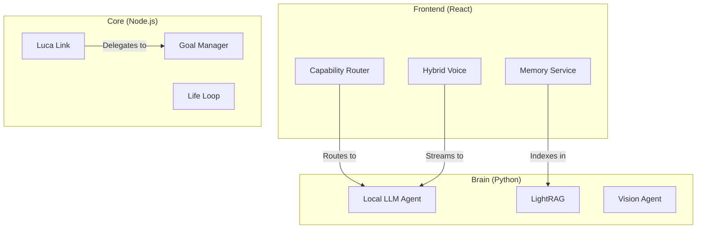

# L.U.C.A (Large Universal Control Agent) Architecture Overview

## Hybrid Model Integration: The "One OS" Strategy

Luca OS implements a sophisticated hybrid AI architecture that intelligently alternates between high-performance cloud models and privacy-first local models.

---

### 🧠 1. Brain & Reasoning (LLM)
- **Orchestrator**: `llmService.ts` (Frontend) & `Cortex` (Python Backend).
- **Routing Logic**: `CapabilityRouter.ts` manages provider selection with sub-second health checks.
- **Cloud Models**: Gemini 2.5 (Pro/Flash), OpenAI (GPT-4o/o1), Anthropic.
- **Local Models**: Ollama (Llama 3, Mistral) and GGUF models via `llama-cpp-python`.
- **Hardware Awareness**: `ModelManagerService.ts` selects models based on device VRAM and compute architecture (Apple Silicon vs. Intel).

### 🎙️ 2. Voice (STT & TTS)
- **Pipeline**: `hybridVoiceService.ts` orchestrates the flow from microphone to speaker.
- **STT local**: `local_stt.py` implements `faster-whisper` and `sherpa-onnx` (Moonshine, SenseVoice).
- **STT Cloud**: Deepgram (Nova-2), OpenAI (Whisper), Gemini (Native Multimodal).
- **TTS Local**: Piper, Kokoro (82M), Pocket TTS.
- **Preprocessing**: `RNNoise` (Neural Noise Suppression) and `MicVAD` for voice activity detection.

### 👁️ 3. Vision & Guard Systems
- **Orchestrator**: `visionAnalyzerService.ts`.
- **Cloud Analytics**: Gemini-1.5-Flash for multi-modal screen analysis.
- **Local Analytics**: `live_vision_agent.py` supports local VLMs like `SmolVLM` or `UI-TARS`.
- **Guards**: Specialized subsystems for Focus (Screen Monitoring), Developer (Code Errors), and Security (Alerts).

### 💾 4. Memory (Dual-Mind RAG)
- **Orchestrator**: `memoryService.ts`.
- **Storage Tier 1 (Ephemeral)**: LocalStorage & SQLite for raw event logs.
- **Storage Tier 2 (Semantic)**: Vector DB using `model2vec` (Local) or Gemini (Cloud) embeddings.
- **Storage Tier 3 (Graph)**: `LightRAG` (Python) builds an offline knowledge graph of your life events.
- **Sync**: `lucaLinkManager` ensures memory persistence across desktop and mobile devices.

### 🛠️ 5. Tool Orchestration
- **Registry**: `toolRegistry.ts` manages ~250 tools with tiered security levels (0-3).
- **Mission Scopes**: Tools are grouped into scopes (FINANCE, SOCIAL, SYSTEM) requiring biometric confirmation for elevation.
- **One OS Delegation**: A tool called on mobile can be seamlessly delegated to a logged-in desktop via Luca Link (e.g., executing terminal commands).
- **Meta-Tools**: `invokeAnyTool` and `listAvailableTools` allow agents to dynamically load capabilities on-demand.

---

## High-Level System Diagram

## Technology Stack Summary
- **UI**: React 18, Framer Motion, Three.js.
- **Core**: Node.js, Express, Socket.io, SQLite.
- **Brain**: FastAPI, llama-cpp-python, faster-whisper.
- **Cross-Platform**: Electron (Desktop), Capacitor (Mobile).
