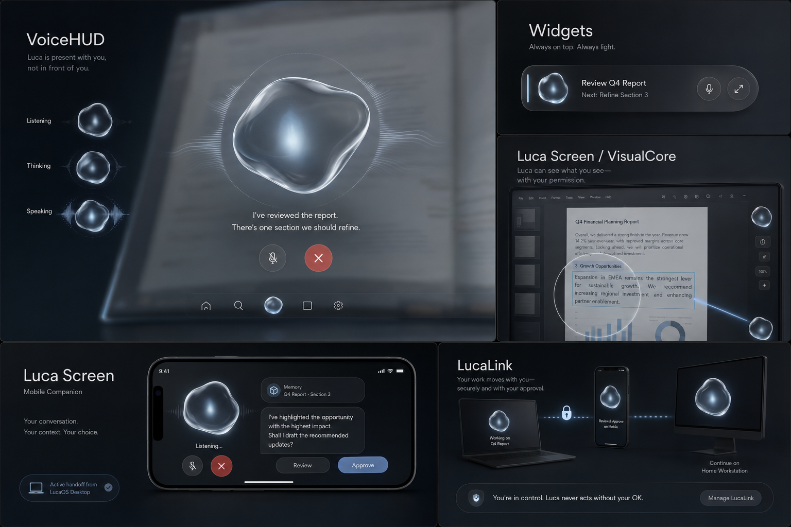

# Luca Living Orb — Canonical Design Reference

This document defines the visual source of truth for the Living Orb. The supplied product mockup is the design target; renderer output, prose claims, and historical baselines do not override it.

## 1. Master artifact

- **Repository path:** `packages/luca-orb-design/references/luca-living-orb-master.png`
- **Source SHA-256:** `4841901ECD4222760D8E532671DA493066A82CE2CCEE4AC0CA35054AF0CA074A`
- **Review method:** side-by-side comparison, opacity overlay, split wipe, pass isolation, and evidence-backed sign-off in Material Lab V2.
- **Status:** canonical reference installed; V2 renderer match is not yet certified.
- **Current geometry candidate:** [`design-spec/CanonicalVolume.v2.md`](./design-spec/CanonicalVolume.v2.md)
- **Current optical candidate:** [`design-spec/OpticalMaterial.v2.md`](./design-spec/OpticalMaterial.v2.md)

## 2. Non-negotiable visual read

### Form

- A broad, asymmetrical suspended volume—not a circle with procedural edge noise.
- A stable family silhouette across hero, compact, and micro scales.
- Soft gravitational weight with a rounded lower lobe; no pointed droplet caricature.
- Motion deforms the authored form without replacing its identity.

### Material

- Thick, luminous glass perimeter with optical depth.
- Smoky translucent body with visible absorption and internal layering.
- Off-centre pearlescent inner lobe suspended inside the outer volume.
- Refraction of the actual scene behind the orb, not a synthetic radial distortion.
- Restrained silver-blue colour; brightness comes from light transport, not neon bloom.

### Lighting

- Product-photography lighting with a cool upper rim, soft internal caustic, and controlled falloff.
- Highlights follow the volume and remain asymmetrical.
- Aura and waveform are separate from the body material and never hide its silhouette.

### Behaviour

- Idle is calm and nearly still.
- Listening adds attentive perimeter energy.
- Thinking gathers energy inward.
- Speaking expands the waveform and material response while preserving the same being.

## 3. Scale tiers

| Tier | Intended use | Required representation |
| --- | --- | --- |
| Hero | VoiceHUD and full presence | Full authored geometry, thickness, scene refraction, volume and studio lighting |
| Compact | Widgets and mobile surfaces | Reduced geometry and lighting, preserved silhouette and inner lobe |
| Micro | Navigation and status marks | Baked or simplified representation tuned for legibility, not a downscaled hero shader |

## 4. Certification rule

No implementation may be labelled **Golden Master**, **certified**, **locked**, or **VoiceHUD-ready** until it has captured visual evidence against this artifact at every target tier and passed human design review. Parameter-envelope checks are useful engineering tests, but are not visual certification.

## 5. Identity mandate

All Living Orb surfaces—VoiceHUD, widgets, Luca Screen, mobile, and LucaLink—must read as one premium presence. Other embodiments may share Luca's behavioural identity, but they must not silently replace this Living Orb reference.
